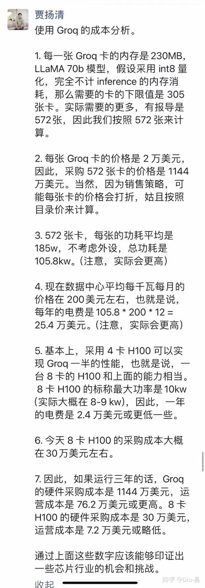

# Groq公司推出的全球最快的大模型推理服务达到每秒输出500个token，如何看待这一技术？

> **类型**: 回答
> **作者**: Dio-晶
> **赞同**: 0
> **评论**: 72
> **时间**: 1708423710
> **原文**: [https://www.zhihu.com/question/645010090/answer/3402750007](https://www.zhihu.com/question/645010090/answer/3402750007)

---

凑热闹。

贾同学有意无意忽视了空间计算最大的优势点，token/$。

至于空间计算到底怎么样，嗯，以前写的帖子回头看还不错呢。

[Dio-晶：关于Spatial Computing](https://zhuanlan.zhihu.com/p/463833198?utm_psn=1743335463325310977)

从评论来看……绝大多数人并没有搞懂这是什么东西，以及如何评价。

中国体系结构的复兴，任重道远。

---

*由知乎爬虫生成于 2026-02-01 15:39:00*
