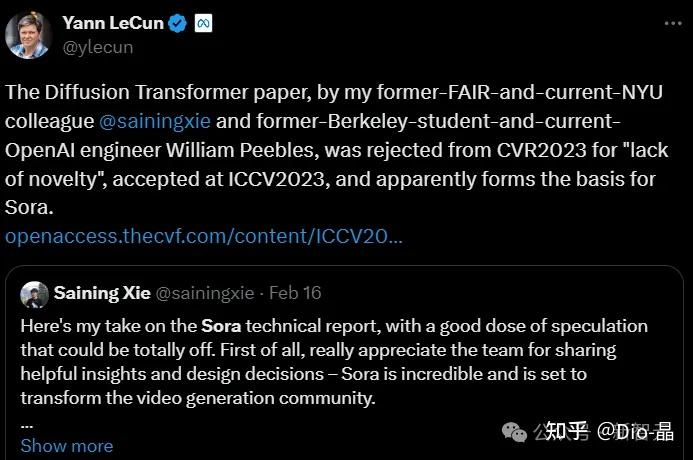
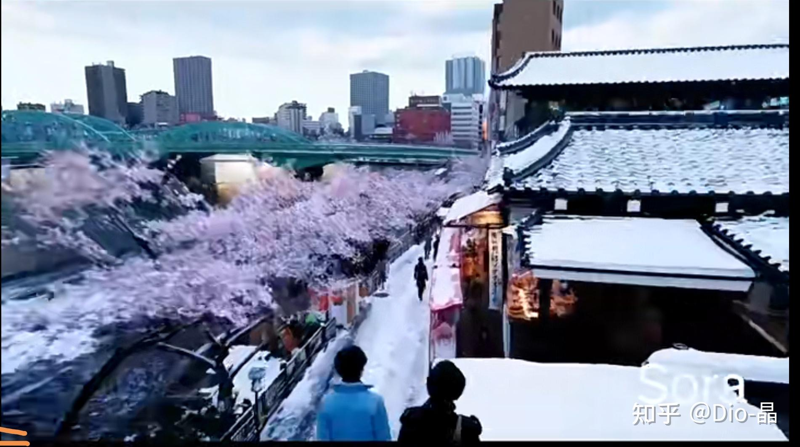

# 如何看待OpenAI发布的文生视频模型Sora？

> **类型**: 回答
> **作者**: Dio-晶
> **赞同**: 0
> **评论**: 111
> **时间**: 1708259861
> **原文**: [https://www.zhihu.com/question/644473449/answer/3400321986](https://www.zhihu.com/question/644473449/answer/3400321986)

---

各种对Sora的赞美之词溢于言表。但我对Sora的观点是中立偏保守 ：）

毫无疑问Sora是AI的又一次类GPT时刻，人类有85%的信息来自于视觉，文本和语言都可能需要人脑补一些东西，但所见即所得是绝大多数人信仰的观念。但现在所有可见的都可以是被制造的了，有那么一瞬间，你甚至可以怀疑你抬头看到的宇宙星空，是不是某个无上意志创造给你看的 ：）

但是，Sora并不那么纯粹，很明显Sora的发布带着浓重的商业色彩，是Sam Altman的7万亿剧本中间的一个小剧场，就差一句话“我，Altman，打钱”。

我不是说Altman有问题，如果AI真的是一个规模效应的东西，只要足够大（足够多的算力设施）就能涌现出奇迹，那么Altman是对的，即使他不那么纯粹。

但是，回到Sora，就不是一个纯粹技术发布了，它必然会掩盖一些东西，就像它发布的视频中，有意地发了几个存在破绽的视频，这是一种宣传的手法，蓄意的瑕不掩瑜但可掩瑕，我也会，是让你放下戒心打钱的 ：）

个人观点：Sora很棒，但没那么好，还有些问题。

当然，这些问题都是我猜的 ：） 至少我脸皮厚敢猜而不只捧不是 ：）

———————————————————————————————

Sora的基本原理发出来了，这也藏不住。

Diffusion Transformer的机理有很多介绍了，还是很让人耳目一新。哇，我们都明白Token的向量化是NLP的关键，但是图像用Patch的方式向量化，然后也通过向量的各种距离计算，得到下一个时隙最大概率Patch向量，想一想还真是Reasonable的路径。

但是，Transformer是一个巨大的概率机，如果说NLP中蕴含的Knowledge是有概率分布的，毕竟大家说话总不能太绝对不是，但物理世界，微观层面确实有人说上帝丢骰子，在宏观层面物理是具有绝对性的，就像1+1不存在99.99999%是2这种概率分布。

概率不是物理，所以，Sora不是世界模型，没有逼近AGI，也没有理解到物理定律，只能说他学到了大多数物理定律的一个概率分布。

**所以Sora的“understand and simulate the physical world”，不能说假，但不真实。**

上图这个视频，存在非常明显的穿模效应，而看完所有的视频，你会发现都在有意地减少物理碰撞，包括那两艘船，运动，但相互之间各自安好。  
 Sora有基于当前状态的下一步物理预测，但是不能产生符合物理的衍生变化。  
   
 ——————————————————————————————

再不负责任的进一步猜测的话，Sora是先生成了图，像素化的图。

然后为每个像素点在RBG之外还标注了一个深度信息，然后预测每个像素点在Timestamp上的概率分布，即产生下一帧。

我做过自动驾驶，所以特别好奇其他有没有同学有类似的感觉，**Sora所有大场景的生成，都有种激光雷达点云成像的感觉，上面那张图也是，像点云，而且有光流金字塔的特征。**

有个技术和Sora挺像，[http://www.bimant.com/blog/3d-gaussian-splatting/](https://link.zhihu.com/?target=http%3A//www.bimant.com/blog/3d-gaussian-splatting/)，高斯泼溅。

抛开那些我搞不懂的细节化人脸是怎么扩散出来的不谈，Sora发布的大场景有特别多视角旋转和远近变化。

就像LOD点云 ：）

当然，这里存在一个分支，如果把每一帧图看做一个Vector（多个Patch是连成一句话的）：A、下一帧图是上一帧图的像素偏移，即没有重新Diffusion，而只是对上一帧修图；B、下一帧图是基于新的Vector重新Diffusion的。

如果答案是A，那么我上面的猜测都是对的，就是个点云，逐帧算偏移；

如果答案是B，我的猜测就是错的，但我有点不相信B，因为Sora的一致性做得太好，重新Diffusion不应该能做到，特别是遮挡再出现的物体，要保持多次Diffusion之后还一样，非常难。

————————————————————————

很多人都应该有一个疑问，Sora有没有调用图形引擎？

应该是调用了。

它放出来的主Video，这个妹纸的周边，地上的水，有明显的镜面反射特征，阴影是可以用NN猜出来的，但是光的镜面反射，是一个物理特征，而前一节推导Sora是没有学到物理的。

所以镜像应该是调用了Ray Tracing，但是前一节又猜测Sora只有点云信息，没有Triangle，没有Texture，咋做光追？

盲猜一个，点云是可以用NN反推Triangle的，我记得国内就有一家startup公司做，叫生数科技，硅谷肯定也有。只是这样反推的Triangle非常粗糙，只能产生粗模，但没问题，粗模带上Object和Texture，就可以做出相对粗糙的镜反射了。Sora是可以吃图吃视频的，我猜测UE在Sora执行后调用了一波，然后sora把光场信息吃进去再做了二次加工？

**所以我猜Sora调用了UE引擎** **：）**

其实图像引擎有非常多现成的素材可用，包括波浪、石材，也许不需要用Transformer生成。

————————————————————————

**Sora如前的猜测，如果是基于图做的点云，那么它就没有mesh triangle（精模）。**

没有Mesh Triangle重要吗？ 重要！

必须有Mesh Triangle，整个场景才是Human Control的，你才能控制其变化，主导二次优化，这才是利用AI加速原有的工作的路径。否则你只能反复地Prompt，祈祷Sora能输出一个符合意愿的Video，嗯，那你是AI的奴隶，而不是AI的主人。

而且反复Prompt尝试，成本也会变得很高，我们可以计算Sora放出来的每个视频的成本，却无法统计它获得的每一个视频之前试错的代价，嗯，也许你得到一个不错的video之前有99个失败的，totally 100x，那才是真实的成本，所以短期sora无法试用。

而无论是游戏还是电影，如果没有Mesh Triangle，做不到Human Control，是无法进行替代的。

广告视频用Sora倒是可以 ：） 时间长度也合适。但视频制作感觉不是广告的关键瓶颈啊。

想一想，可能还有个机会是交互型游戏（电影），让用户在每一个片段都有选择下一段剧情的选项，然后二次生成后续的剧本 ：）

但这些，商业闭环吗？

如果能闭环，还需要再加七万亿吗？

如果再要七万亿，那是否已经说明当前还不足以闭环？

---

*由知乎爬虫生成于 2026-02-01 15:39:00*
