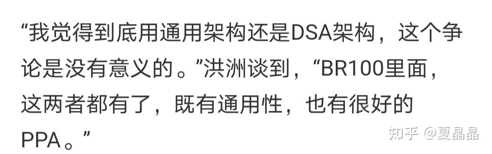
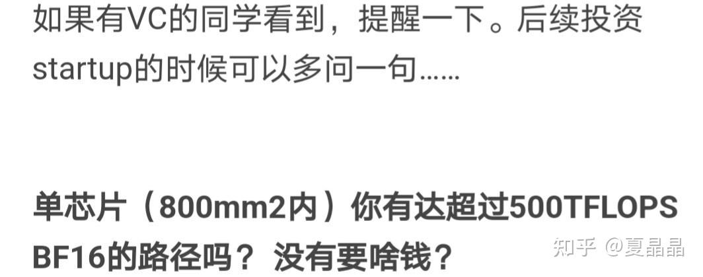
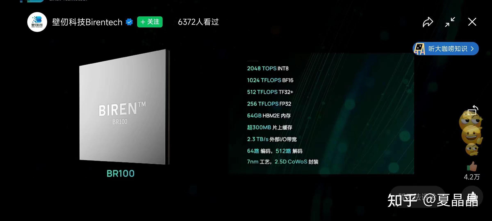
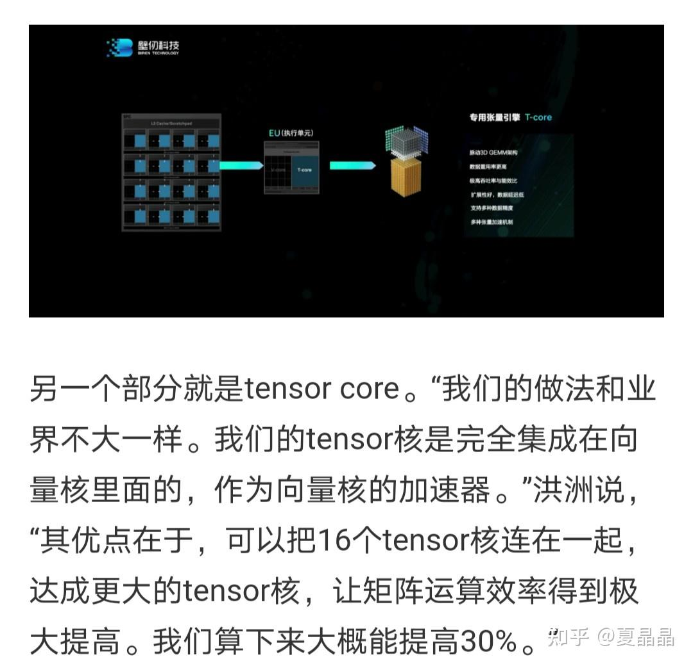

# 如何评价壁仞科技发布的最大算力GPGPU BR100？

> **类型**: 回答
> **作者**: Dio-晶
> **赞同**: 0
> **评论**: 104
> **时间**: 1660468166
> **原文**: [https://www.zhihu.com/question/547728200/answer/2626248094](https://www.zhihu.com/question/547728200/answer/2626248094)

---

周末洗脚写两句，不知道是不是已经错过了潮头……

翻了一下知乎已有的回答，偏负面。其实我对这事蛮不解的，在微信的群里也是负面，真正讨论其架构特征和竞争力的并不多，满满都是从各种奇怪角度的质疑。

**这就是中国做自研芯片的环境吗？**

很多从业者啊，做着高科技行业，上心的并不是技术，反而对纱窗后那些事特别来劲。

---

**壁仞这颗芯片其实很厉害。**

如果他没有虚假宣传，芯片没有致命bug，量产和可靠性也都没大问题的话。

同行看门道，如果就性能指标看的话，我已经听见有人讲什么信仰崩塌的话了……

不啰嗦，讲一下关注度比较高的几个关键点……及其trick。

---

我并没有壁仞内部的信息，逻辑推理的起点也都是壁仞发布的信息以及他为这个发布会发的很多新闻稿（可惜它忘了给知乎充值），大多数新闻稿千篇一律，但我还是推荐下面这一篇……我也从这篇作为信息起点展开讲吧

[详解壁仞刚刚发布的GPU：单芯片PFLOPS算力是怎样炼成的？-电子工程专辑](https://link.zhihu.com/?target=https%3A//www.eet-china.com/news/202208100913.html)

*ps：我筛选优秀新闻稿的方法是查询“洪洲说”这个关键词的数量。其实，人家一个发布会，每一句话都是反复斟酌，需要恰当表达其重点的。原汁原味记录才是正确的姿势，很多新闻稿没搞懂其意思，瞎总结归纳，反而丢了真实。*

---

这是一句很重要的话。呵呵，如果你对某些深埋于过去的故事有所了解话，这句话表达了mike洪相当的执念：是的，我苦苦修炼了三年的时间，我回来证明自己了。

顺带一说的是GPGPU这事，很少人逮着BR100不支持graphic就不能叫GPU喷……

人家NVIDIA的GPGPU H100也没法打游戏啊。

其实mike讲的通用架构主要是指GPGPU架构。graphic PU作为最初的GPU是GPGPU的起点，**但当我们在讲GPGPU的时候，其实是指从graphic发展而来的具有通用性的SIMT并行计算架构。**

也就是说BR100是一个基于SIMT的GPGPU架构下针对AI的domain specific定制版本。SIMT具有非常好的生态延展性，如果壁仞愿意，SIMT架构也能通过再增加domain的定制补充graphic和HPC的能力，但这只是暂时不是壁仞的商业目标。而当前基于SIMT的AI domain specific在能效上并不比AI专用DSA差，这也是Mike想要表达的意思。

---

关于算力，BR100最大的爆点是单芯片1000TFLOPs，以及这是在550W功耗约束下的算力。

这就是很厉害的，你找几个行内人问问，基本上已经是AI startup公司劝退级别的，即使是nvidia也必须不可能无视的力量。

如何获得这个力量，我在去年写一个帖子的时候心里就有了答案（没有讲出来）。

[讲个恐怖故事](https://zhuanlan.zhihu.com/p/404666570)

帖子的末尾我给了一个指标，其实考虑到国内能力指标放水了，应该是**7nm下～500mm2 &～300W达成500Tflops。**两颗die合封就是1P，壁仞达成了。

我的答案，很简单，AI这个方向最容易超车的就是精度（还有个公司叫寒武纪，他想用定点替代浮点做AI的训练，非常激进）。

**全盘放弃FP16，梭哈BF16，部分BF16无法收敛的网络用低一档性能的FP32。**

所以你认真再看看壁仞的发布指标，最高1000Tflops算力是BF16，没有FP16，朝上依次低一档是TF32和FP32（巨大的trick）

AI是一个新业务，算法在不断演进。到底什么样的精度是最佳的？并无定论。

nvidia只是梭哈FP16，所以放弃了FP32，你要是把FP16当做AI的真理，那就是中了NV的道了。

很多人会说，BF16不行的，很多网络都不收敛。但事实是，也有很多网络用FP16也不收敛的，只是比例有差别而已。与其梭哈FP16和NV死磕，还真不如直接赌BF16，然后通过增大FP32做第三层城墙兜底（TF32是第二层，mike努力推销得看多少人买单）。

为什么梭哈BF16能超越NVIDIA？

**也很简单，BF16的数据格式，尾数是7bit，而FP16的数据格式，尾数是10bit。浮点乘法运算中只有尾数是需要做乘法的，而乘法器的面积和数据长度的平方成正比。即梭哈BF16可以得到相比FP16的整个浮点计算单元大约1/3的面积和功耗节省（功耗最重要）。**

这也是为什么BR100的FP32矩阵算力这么大的原因，要补BF16的部分场景精度不够的窟窿，而NV并不打算补。这个FP32是AI专用算力，并不是通用算力。壁仞是通用架构，专用算力。不要搞浑水再黑好吗？

[对壁仞科技BR100的FP32性能的商榷](https://zhuanlan.zhihu.com/p/553502423)

所有，你知道了超越NVIDIA的方法了吗？ 并不是说壁仞有多少天才，NV有多少傻瓜，都是人，都能做到。

---

嗯，然后就很多人说，光堆算力算什么好汉，纸老虎一个（说这个的其实大多是友商，再友好一点的会说你MAC利用率不行吧……）。

我也不知道怎么解释。你说要上台打架，一个深蹲120KG的人和一个30KG的人，谁强？ 当然，电影里都是以弱胜强的多，要不然就是反派死于话多。但港真，打拳是要靠腿发力的，现实社会前者如果没什么大毛病的话还是更强。

再说mike肯定不是傻子架构师，你看到的，什么HBM带宽不足啊什么的，人家也都看到的。

什么blink、NOC、L2计算加速什么的，在我看都是基操（那什么L2共享私有双模，纯粹是NOC带宽做不高的副作用），我讲一个很有意思的点（如上）。我并不知道壁仞具体实现细节，有可能和我要说的结构相似吧，但如果不是，那当我多讲了一个秘密，你还多一条超越的路径。

tensor做太大会影响利用率，太小会影响能效（数据需要更多搬运）。 成年人能不能做到既要、又要呢？ 能！

[扫个小盲](https://zhuanlan.zhihu.com/p/405571339)

我把这个秘密藏在了我曾经这篇帖子里。

**用外积mac array，外积最大的好处就是可以很简单地平铺，用4 or 16个arry拼接成1个更大尺寸的（中间打一拍流水成脉动）array，在需要能效的时候跑更大的GEMM尺寸，此时大尺度GEMM还能增加数据reuse，提升数据复用度，减少外存带宽诉求和功耗的目的。**

我盲猜壁仞的550W就是在16 tensor mac array拼接的模式下跑的。

---

说了这么多好，那壁仞有什么问题吗？

我只能看到新闻稿，不知道内部情况，但即使是新闻稿，问题是有的，一个巨大的潜在的风险。

**无缝运行，无缝，(●°u°●) 」**

我只是个搬运工……

即使发布会上很隐晦，但说白了我们都知道，他想兼容CUDA甚至于CUDA之下SIMT的很多编程接口。

**CUDA不是一个开源生态，天底下没有免费的蛋糕。**随便一搜你就能找到NV在其中埋下的大量专利壁垒。

NV什么时候开始提起诉讼？还是说中美这个情况下，如果NV真告，反而变成了一个壁仞的免费大广告？ 这些事，谁说的清呢。

*美帝最高市值IC公司告中国一个startup，想一想都美如画……*

不过，如果要进信创市场，里面有大量nvidia的专利和控制点，行吗？

---

*由知乎爬虫生成于 2026-02-01 15:39:00*
