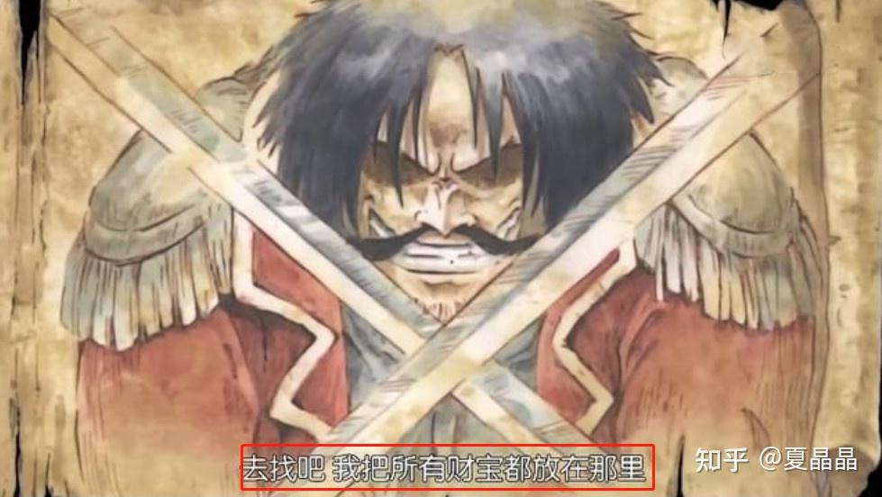
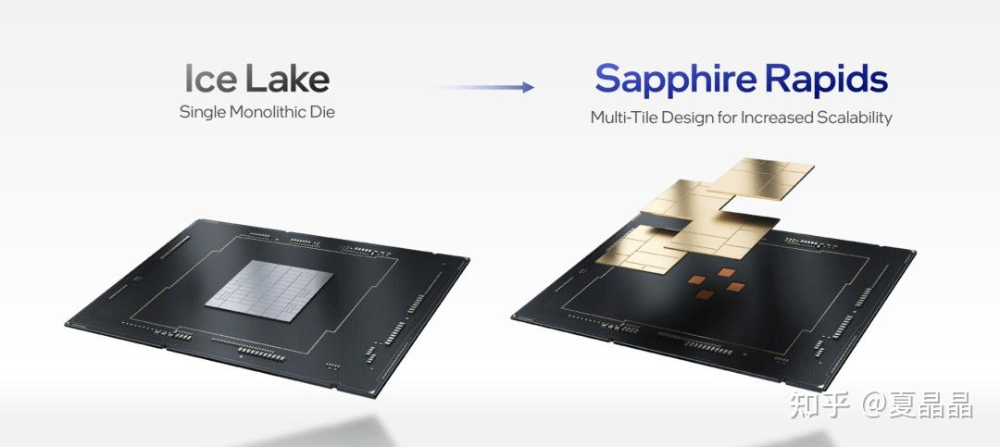
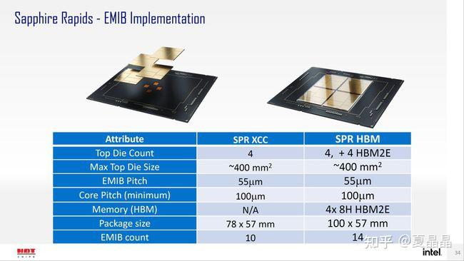
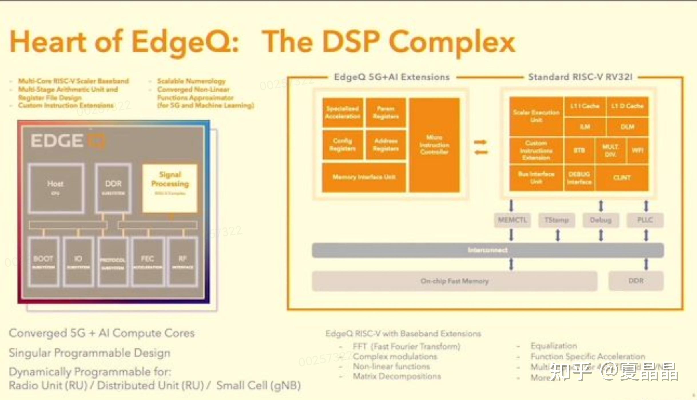

# Hot Chips 33 (2021) 有哪些看点？

> **类型**: 回答
> **作者**: Dio-晶
> **赞同**: 0
> **评论**: 18
> **时间**: 1630055531
> **原文**: [https://www.zhihu.com/question/460182689/answer/2087506808](https://www.zhihu.com/question/460182689/answer/2087506808)

---

总的来讲，这两年的计算机体系结构又来到一种百花齐放、百家争鸣的时代。

如果你真算算牙膏的成色，很明显，摩尔定律是在加速而不是停滞。

there's plenty of room at the top and the bottom。

这是黄金的十年，大航海时代……

所以(\*￣m￣)

很多的理解和解读，不方便分享呢……

只能随便聊两句玄乎乎的故事。

算了，先讲个笑话。

**intel做了一个ZEN1**…………哈哈哈哈，不知道当年intel黑AMD的网文有没有删干净。

再讲个sapphire rapids数学题，苦恼了好久没做出来。

四个完全对称的die，通过EMIB bridge互联起来，为啥是10个emib？为什么不是4\*N？ 多的2个在哪儿(⊙o⊙)？

百思不得其姐。

嗯，黑一黑intel向来是喜闻乐见的。

但实际上，intel的架构师是非常厉害的，虽然他做了一个ZEN1，也不要把他当傻瓜，他知道他做了ZEN1，他也知道我们会黑他做了ZEN1，**他知道我们会认为他做了ZEN1并且会黑他的情况下坚持做了ZEN1。进一步想想就很有趣了。**

再看intel的ponte vecchio，41个die合封，工程复杂度上简直是疯狂马戏团。我几乎遇到所有人的评价都是“看他能不能量产吧”。

**如果我是intel的架构师，我为什么要做这么复杂？**

这个问题在我心中也逐渐有了一些答案。

intel的工艺遇到一些问题，但从他们的视角来看，这些问题将来是全业界不可避免的。

这些问题的答案是：**如果process device能够做进一步的细分（或者是必须细分），可以获得超过封装复杂度的收益。**

**copmute tile是几乎纯core device的logic cell，没有IO device，大概率PLL都没有。**

**rambo tile是几乎纯core device的SRAM cell，没有IO device，甚至于logic都极简。**

**IO DEVICE和供电、时钟都放到了base tile。**

这代表什么…………佛曰不可说。

~~~~~

抛开intel，还有一个并不引人注意的芯片让我特别感慨。

这是一颗ORAN的SOC，站在我菊的角度，我肯定不能支持ORAN的路线。

但是我曾经想象，如果我某天失业了，该做点啥，嗯，这是一个权重很高的方向。

CPU做主控，DSP做基带，再加一点加速器，是靠谱的。 DSP本身不易于开放编程也不易获得，所以用RISC-V扩展自定义DSP指令（需要挖几个懂无线业务的同学）。

**ARM+RISC-V，完美。**

~~~~~

最后说一个吧，这次hotchips，也可以起一个别名：**hotAIchips**…………

可见AI领域的百花齐放和繁荣昌盛。

但是很可惜，有人故意砸场子。

Tesla故意在hotAIchip开会前举办 Tesla AI day……并且发布了DOJO，嚣张得很明显，而且你毫无办法。

---

*由知乎爬虫生成于 2026-02-01 15:39:00*
