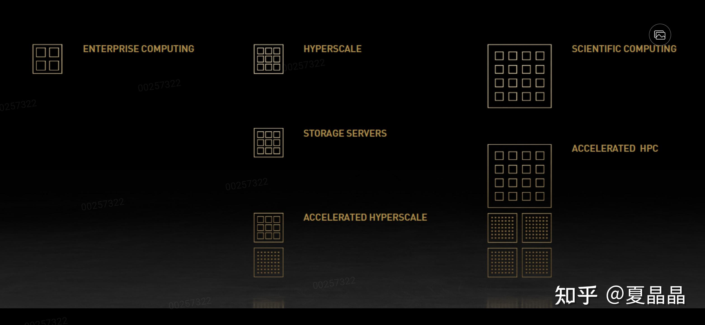
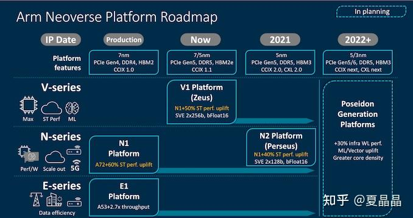
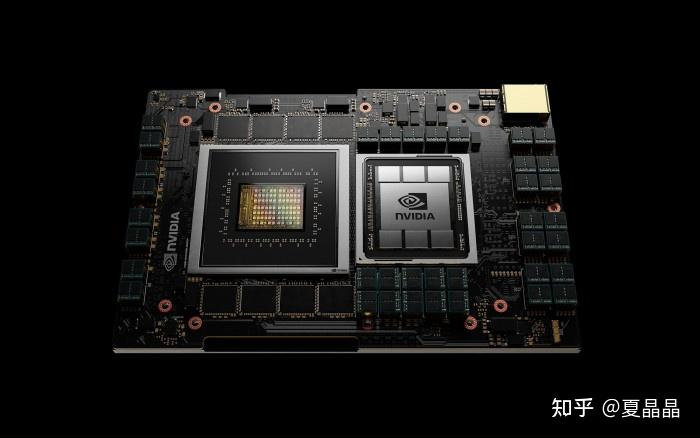
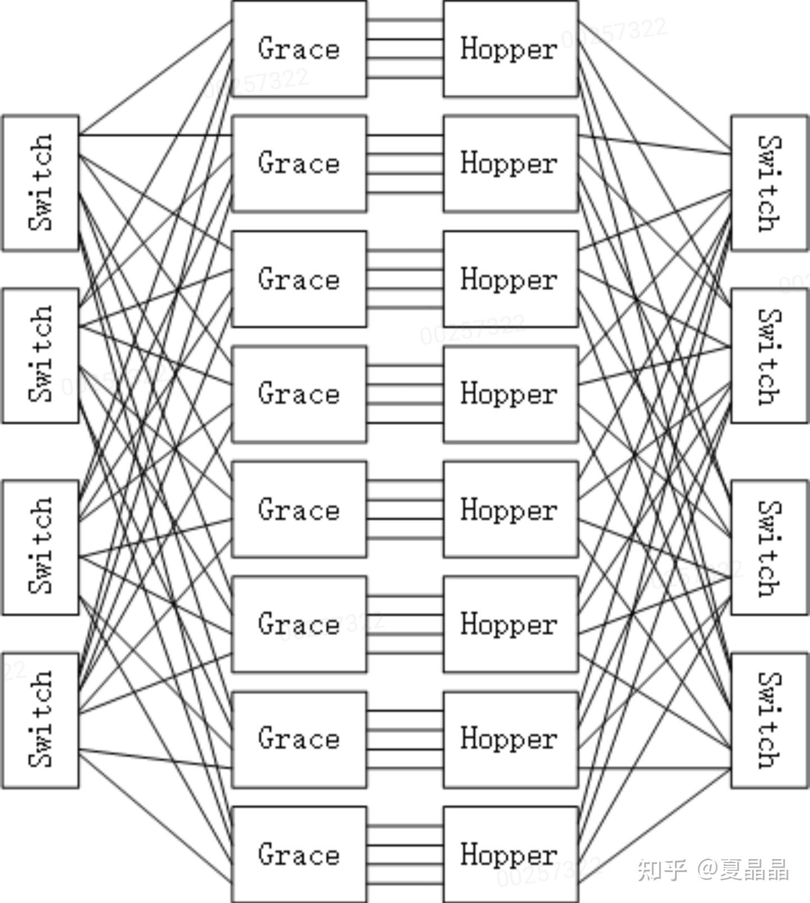

# 如何评价英伟达于 GTC 2021 大会发布的基于 ARM 架构的 Grace CPU？

> **类型**: 回答
> **作者**: Dio-晶
> **赞同**: 0
> **评论**: 24
> **时间**: 1618415594
> **原文**: [https://www.zhihu.com/question/454345689/answer/1835647099](https://www.zhihu.com/question/454345689/answer/1835647099)

---

憋、憋、憋不住了。

本来不想说啥，但是今天看见很多答题家一本正经地胡说八道，实在有点受不了了。

我觉得很多人根本没有看老黄的keynote演讲，也许就看了些中文的新闻稿就开始发挥……

老黄的每年的演讲要认真看的，君不见他都学会渲染自己了，明年可能会加瘦脸效果。

好，认真的，老黄语速很快，而很多信息隐藏在几个关键词里，一不注意就遗漏了，得开字幕……

………………………………

第一点，grace不是高性能CPU，我看见知乎居然有人拿去和APPLE的M1 core做比较，也是服了。

下面这张图，老黄表达得很清晰(轻微笑场了)。最左上的是高性能server CPU，单核强，核少，它所以画了四个大方块表达。至于AI需要的CPU需要次强的CPU，中下的9个小方块的。要更多核，更强的memory和更强的IO能力，这是设计理念，grace也是如此做的。当然，老黄暗示这种需求和HPC(最右)是一致的，这主要是他要卖20E FLOPS AI HPC，忽悠客户呢。实际上我们打开INTEL的HPC version CPU型号，并不是如此。

OK，grace是为AI而生，并不是高性能。它用的CPU core型号是公版neoverse N2，ARM还没发布，可能NVIDIA已经拿到了beta版本。N series在ARM的CPU属于中核，讲究能效，如下所示，V系列才是大核，而APPLE的M1，更在V series之上，超大核。

so，grace是一个76 cores N2多核处理器(为什么是76 cores? 哈哈请认真看图啦，虽然芯片是示意图，但nvidia在示意的意上，往往都很准确)。specint2017是300分，这个分数真心不算高，grace的理念应该是性能还行，能效优异，把散热的空间更多让给hopper。单说300分的性能，这两年新出的ARM Server CPU都会超过它，当然我菊没法投片加工了，我只能云装逼一下，唉，随意吧。

……………………

第二点，grace用了LPDDR，这在第一眼看到的时候，让人非常不解，以至于直接给出了结论，这GRACE架构师傻逼吧，8颗LPDDR，即使按明年的容量算，也就8\*16GB=128GB，这要做推荐网络根本不可行，embedded table装不下。但如果认真听完老黄的全部逻辑，make sence。

首先，CPU用DDR也是可以做到500GB带宽的，但这需要12 channel DDR DIMM(5200\*12\*8)。但DRAM的世界是一个等价交换的世界。见我曾经一个帖子。

<https://zhuanlan.zhihu.com/p/360468817>

LPDDR相比DDR，虽然容量少了，但是在同样500GB带宽条件下，封装尺寸、成本、单板集成度会大幅提升。只需要解决容量问题，那么LPDDR就是赚的。

怎么解决？ 老黄的野路子是集成8个grace CPU，并互联成unified memory。此时8\*128=1TB。虽然说也不是很大，但已经等价于用X86的2S结构，512GB per socket的1TB容量了，且GPU对延迟不敏感，只要能解决互联问题， 真的完美。

………………

第三点，互联。

很多人其实对下图的2000GB MEM-to-GPU带宽很不解，如果用左图的互联拓扑，卧槽，这grace得多少lane的nvlink才够用啊。要知道，从示意图来看，参考GPU尺寸是55mm\*55mm，grace芯片尺寸大约是60mm\*60mm，pitch应该是0.6~0.7mm，去掉8路LPDDR剩下的pin不够的。

这是因为，这个图的拓扑结构依旧是逻辑示意图。

老黄讲了，最终DGX是8个grace CPU +8个hopper GPU，上图的4+4最多是一个half DGX版本。

而grace和hopper，我们再看看下图的单板示意，1+1单板，两者之间的互联在板上解决了，然后grace向左，hopper向右和上，各自出4路/7路 nvlink。

所以，最终的互联是我画的下面这个样子。hopper侧(右侧)的lane和switch应该更多些，我懒得画了。

……………………

其实还有一些次要信息，不写了不写了。夜已深，夫人亦睡了，不可辜负王者新赛季上分的宝贵时光。

---

*由知乎爬虫生成于 2026-02-01 15:39:00*
