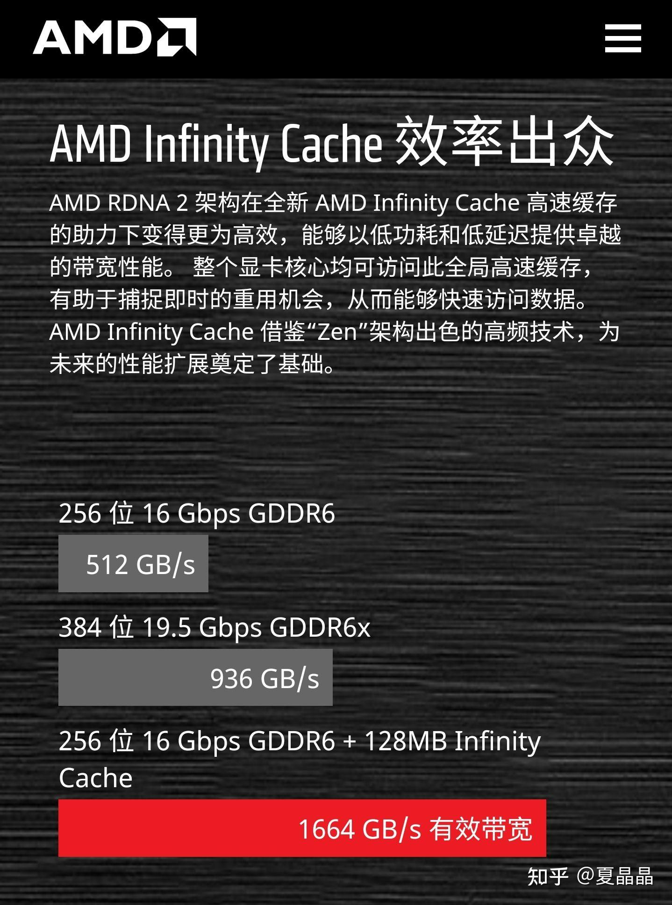

# NVIDIA为什么在游戏卡上死活不用HBM2显存？

> **类型**: 回答
> **作者**: Dio-晶
> **赞同**: 0
> **评论**: 36
> **时间**: 1616896963
> **原文**: [https://www.zhihu.com/question/422438453/answer/1803789146](https://www.zhihu.com/question/422438453/answer/1803789146)

---

如果简单来讲，是HBM太贵。

如果进一步讲，NVIDIA占据了GDDR技术的顶峰，拥有无法被人超越的代差，它不需要用HBM就能吊打竞争对手甚至逼对手被迫上HBM。

作为兼职做鸡（GPU）的架构师，我跟你港。游戏GPU是一个成本非常敏感的产品。用户能够接受的高端GPU价格长期以来就是在$599～$799之间，大家都攒过鸡，折算一下RMB，大致就是这样了。

不看尾货，最新GEN的HBM版本大约都需要$20/GB，放8GB就$160了。

nvidia为什么不需要上HBM呢？因为NVIDIA是GDDR协议几乎实际的掌控者，每一代GDDR出来，Nvidia都会来个GDDR-X，这个-X，实际上是下一代GDDR的beta特性，即其他人用GDDR6的时候，Nvidia有GDDR6-X定制（并且独享供货），而这玩意儿实际上是GDDR7-beta。

要啥自行车。

真正难受的是AMD（当然还有在下），没有-X的情况下，咋竞争呢？

AMD在上一代Radeon显卡上带了HBM，这卡的成本我算过（网上也有其他人的算法，差不多），卖一块这样的GPU，AMD会亏损～$50，苏妈妈真良心……

新一代RDNA，AMD不想再亏下去了，他们用片上cache来弥补内存带宽的不足…………内存不行，cache来补。

行不行，见仁见智吧，得看分辨率和vertex数量。

---

*由知乎爬虫生成于 2026-02-01 15:39:00*
