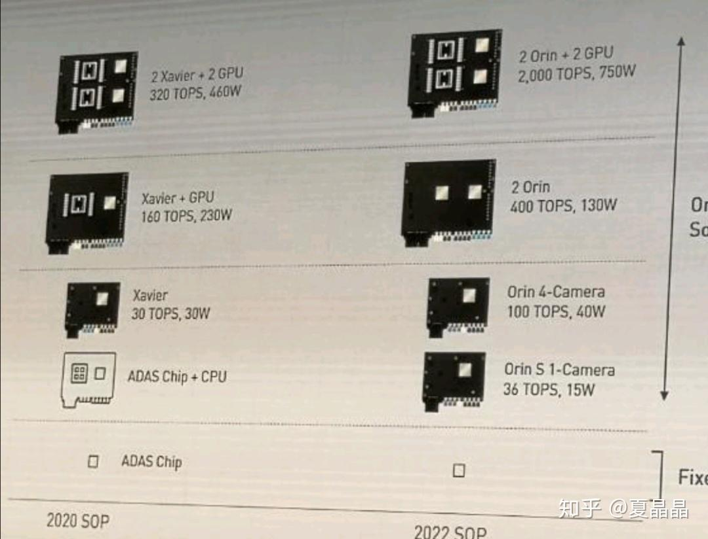
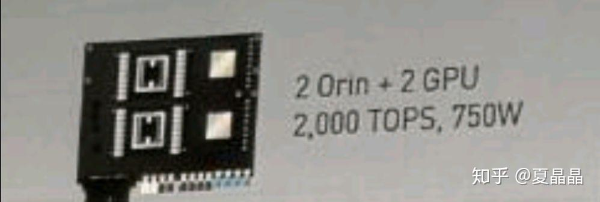

# NVIDIA CEO 黄仁勋在 GTC CHINA 2019 上发表的主题演讲有什么值得关注的信息？

> **类型**: 回答
> **作者**: Dio-晶
> **赞同**: 0
> **评论**: 24
> **时间**: 1576681492
> **原文**: [https://www.zhihu.com/question/361590823/answer/941316378](https://www.zhihu.com/question/361590823/answer/941316378)

---

有一个神秘的数字非常值得关注。

让很多人颤抖！！

上面这图有秘密。

左上角这两个GPU大家都知道，是T4。

那右上角这两个GPU是什么？

V100？不是，对不上。T4也不是。

（2000-400）/2 = 800TOPS

（750-130）/2 = 310W

800TOPS INT8折算400T FP16或BF16

这是一颗inference性能和阿里含光相近，如果支持训练的话，是Volta V100性能3.3倍的GPU。

这就是传说中的ampere A100么⊙ω⊙ ？

AI产业玩家很多，近期的AI芯片的军备竞赛，打法都是直接降维打击的方式打，cerebras也是、含光也是。想表达的就是一个意思，“你可以退出了”。

劝退级别的GPU。

---

*由知乎爬虫生成于 2026-02-01 15:39:00*
