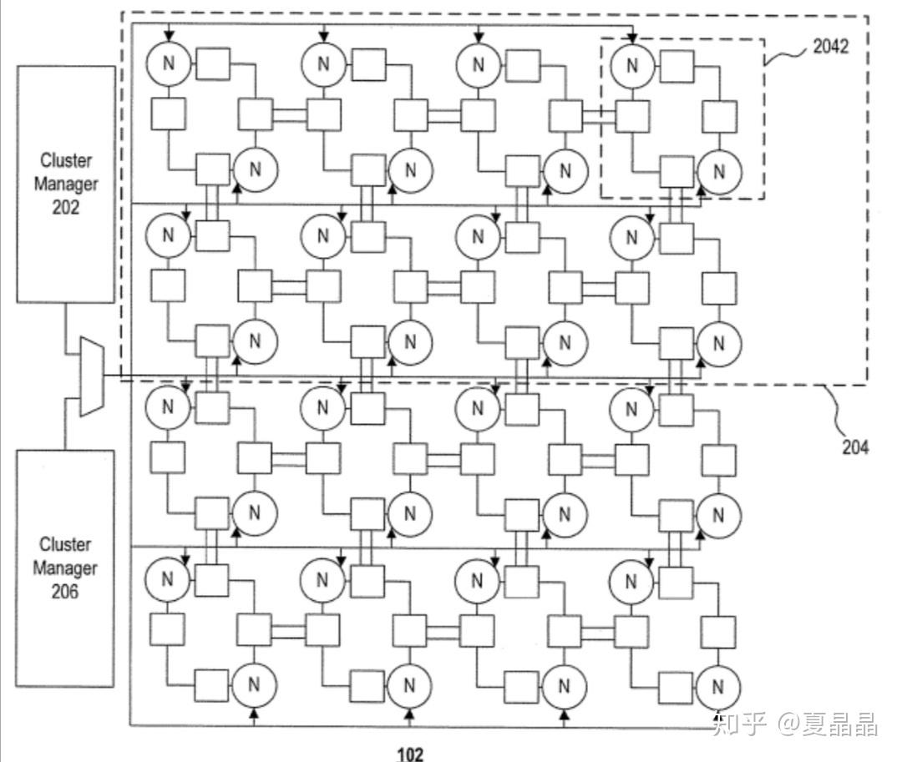
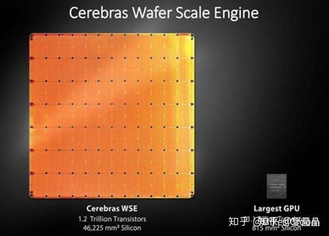

# 如何看待阿里平头哥发布的全球最高性能 AI 芯片「含光 800」？这款芯片核心技术是什么呢？

> **类型**: 回答
> **作者**: Dio-晶
> **赞同**: 0
> **评论**: 29
> **时间**: 1569564744
> **原文**: [https://www.zhihu.com/question/347692093/answer/837443816](https://www.zhihu.com/question/347692093/answer/837443816)

---

按照resnet50需要的算力反推，这颗芯片的算力是800TOPS，其实我觉得它没必要遮遮掩掩的。

问核心技术，都拿发布的数据图答个啥？还一堆专业。我的推测，是下面这个。

摘自阿里的专利：

[https://patents.google.com/patent/US20190197389A1/en?q=neural+processor&assignee=alibaba](https://link.zhihu.com/?target=https%3A//patents.google.com/patent/US20190197389A1/en%3Fq%3Dneural%2Bprocessor%26assignee%3Dalibaba)

感兴趣的同学可自行查阅，不涉密。

这个架构的本质是可编程的MAC阵列，核心竞争力是片上互联及编译器技术，这个阵列相当于GOOGLE TPU脉动阵列的升级版，用专利所示的互联技术动态地将多个小型脉动阵列自由串联或并联在一起，连接的方式是基于DL计算的graph做的，跨layer的数据直接在tile之间灵活传递。无需DDR且高效。这种ISA都没有的架构当然可以堆积极大的算力来。

这种可编程MAC阵列很早就有人研究，但没有ISA，终不能灵活适配计算的变化，不过DL当前很多计算流程模式已经固化了，所以这真是是很好的选择。只能讲：

阿里这颗芯片和架构有一个缺点，如果我有一个模型很大，单颗芯片放不下，怎么办？

多片互联的技术阿里还是骚逊一筹。

不过这可以弯道超车噢，如果阿里把cerebras买下来，就真爆炸了。

---

*由知乎爬虫生成于 2026-02-01 15:39:00*
