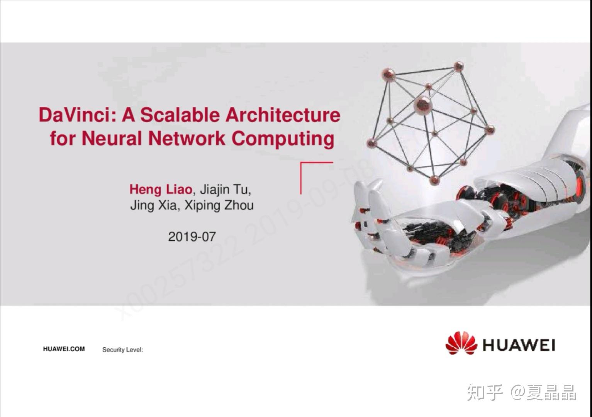
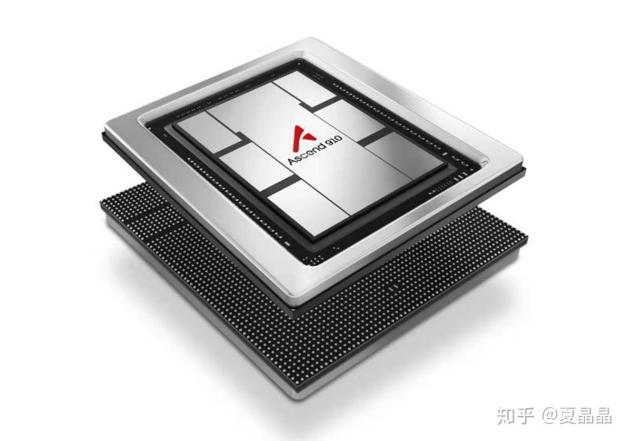
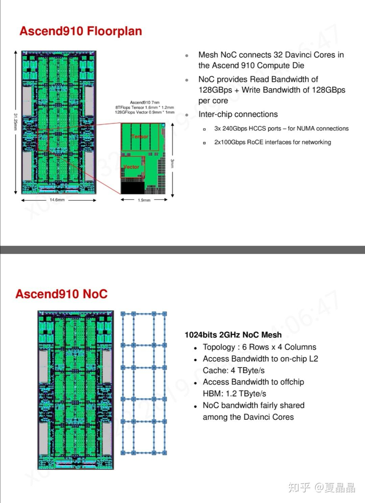
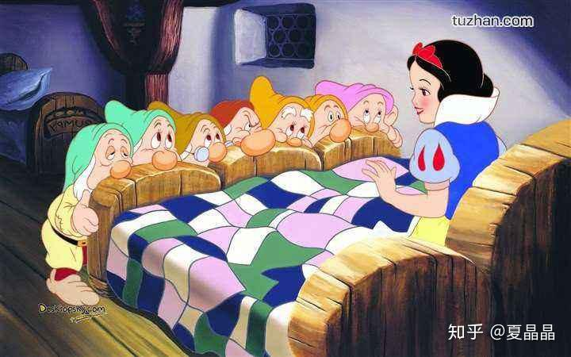

# HotChips 31（2019） 有哪些看点？

> **类型**: 回答
> **作者**: Dio-晶
> **赞同**: 0
> **评论**: 31
> **时间**: 1567925599
> **原文**: [https://www.zhihu.com/question/341619282/answer/817209157](https://www.zhihu.com/question/341619282/answer/817209157)

---

HC31可以说是近几年HC大会的巅峰了，摩尔定律末期的群星闪耀，任何一个故事都是那么精彩。搞不懂为啥知乎对此如此沉寂？

国家也在持续加大集成电路发展。

人呢(=ﾟДﾟ=)？

我倒是能写的内容很多，AMD、cerebras、TSMC，真要写一天都写不完，也没空写。

不过，华为达芬奇也参与了HC大会，作为作者之一………… ┐(‘～`；)┌ 聊聊这个？

这胶片几乎是泄密的纬度展现了我国最顶尖级别的东西（说是国之重器真不为过），不知道为啥没啥人气………相当 π\_π 伤心

特别是昇腾910，刚发布的。

4TB的mesh，这是所有CORE可获得的真实带宽而不是交换带宽，相比NVIDIA最顶尖的VOLTA V100也就2.6TB。还有片间240G的HCCS接口，就算中必输也罢，没人和NVLINK对比一下差距么？

算了-\_-|| 继续讲下去真的泄密了，讲点不涉密的逸闻吧。

不知道多少人注意到下面的两个单词，nimbus和vitruvian，这是啥？

这个是code name，在项目被正式发布之前，芯片开发团队都是以code name描述项目的。典型的intel的skylake、icelake，AMD的rome、naples均是。ARM也是，有时候有人问我A77、A76等CPU的事，我往往没法快速回答，因为我接触的都是ares、zeus、enyo的code name，当Axx的数字发布的时候，这个CORE对我已经是过去式了，我需要推算一遍A的编号，映射出code name，然后回忆过去……

我司也有code name，这是开发过程很必要的一环，朗朗上口的名称可以增加凝聚力，明确导向，在真实工作中，项目的总的宏定义和配置文件也需要统一的前缀保持准确清晰，对项目开发质量是有巨大帮助的。不过我司某些code name映射关系和业界稍有不同，这类code name是die的名字。

我作为架构师定义了我司大型芯片2.5D封装的lego架构，传统意义上讲芯片设计的IP，是指一份可复用的RTL设计，而在lego架构定义中，一颗独立的die也是IP。 只要定义好DIE的结构和接口，不同的DIE可以IP方式integration。

当然，我定义这个接口长期被领导批评缺乏前瞻。切，╮（╯＿╰）╭ 要能回头看，我也知道要是在1909年的维也纳碰到希特勒卖画一定要多买一点啊。

目前lego的die codename包括vitruvian（维特鲁威）、nimbus（灵光）、totem（图腾）、infinite（无限）、unicorn（独角兽），除了我都无法理解的unicorn命名，其他的名字都是我命名的(❁´ω`❁)，值得装逼一把！！

命名vitruvian当然是源于达芬奇架构，以及芯片架构以JJ为中心的绝对对称(你把上面的die shot的HBM去掉看看像不像JJ？)，但单词太长要发三个音，写代码的namespace也太长，还担心很多人不接受，结果项目群大家都很忙，征求意见时没人鸟我 (´;︵;`)，那好吧，既成事实。

上面这五颗DIE，在一定的架构和工程的约束下，可以比较灵活地进行两两拼接，组合成一颗独立形态的SOC芯片。当然某些组合可能缺乏组合的意义，但这种思路发散性就很大了。假设，以后IC公司对外不卖IP，卖DIE，会怎样？

已经发布AI芯片昇腾9xx = vitruvian + nimbus，CPU鲲鹏9xx = totem + nimbus，其他die组合的芯片还没发布或者主要用于华为内部，外部就不知情了。

下一个die正在规划，我打算命名为snow-white，哇哈哈哈(ಡωಡ)hiahiahia，不知道能否搞成既成事实。

---

*由知乎爬虫生成于 2026-02-01 15:39:00*
