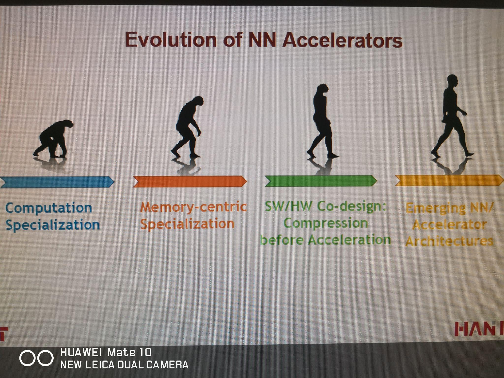
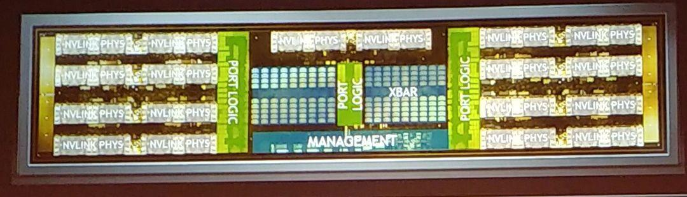
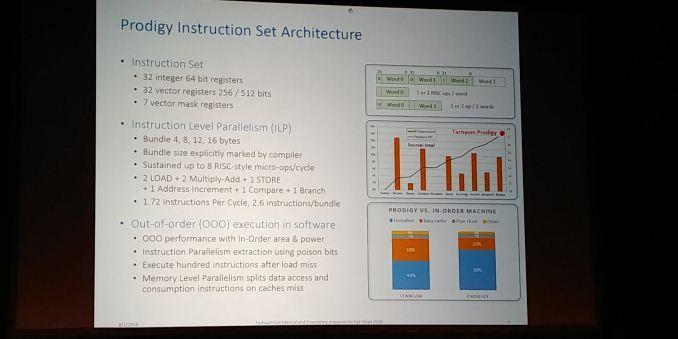
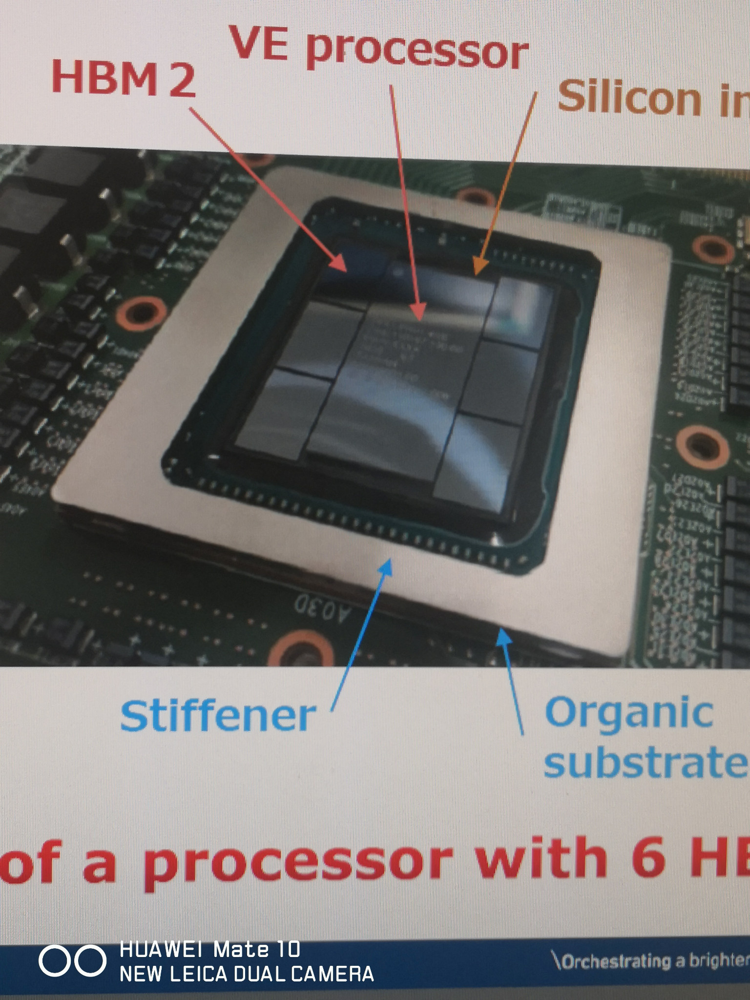
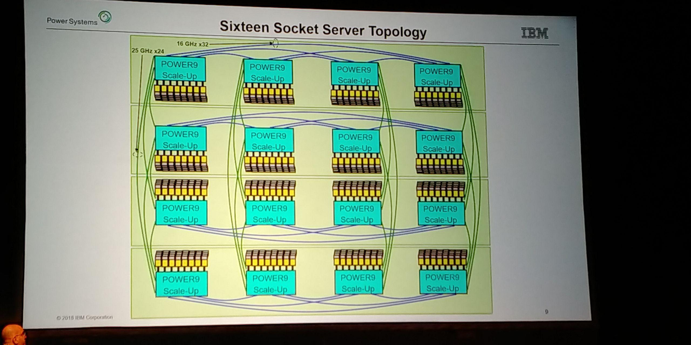

# HotChips 30 有哪些看点？

> **类型**: 回答
> **作者**: Dio-晶
> **赞同**: 0
> **评论**: 11
> **时间**: 1535265311
> **原文**: [https://www.zhihu.com/question/291565794/answer/478403334](https://www.zhihu.com/question/291565794/answer/478403334)

---

没有参会，会后拿PPT包看了一遍。

周末在家，闲着也是闲着。不如边看TI8边写一写（话说LGD比赛还用看? 醒来又是一场胜利…………领先2W也能被翻，水人冲基地? 这打得是个激霸）。

写这个其实也不是为了装逼，把观点和理解写出来，一个是有助于他人参考，二个是看看能不能勾引一下，看看有没有别人更多的思路和信息出来。所以欢迎拍砖，喷子删不回。

纯粹就会议材料聊一下，不敢涉及我厂任意信息。

今年hotchip，微信上看，大V唐杉写了一份总结，此外anandtech也有一篇很详细的发言速记，有一些PPT没有写的特别信息。

[https://www.anandtech.com/show/13250/anandtech-at-hot-chips-30-our-2018-show-coverage](https://link.zhihu.com/?target=https%3A//www.anandtech.com/show/13250/anandtech-at-hot-chips-30-our-2018-show-coverage)

回到我个人角度，对于工业界，我认为hotchip相比hpca、ISSCC是更高优先级的会议。因为这个会议的很单纯，就是工业圈秀肌肉。

“我来，我见，我征服”。

“我卧推150KG，你服不服?”，“服服服”

“我深蹲180KG，你气不气?”，“技不如人甘拜下风”

就这种感觉。

不过这种氛围逐渐在被腐坏。愈来愈多公司更喜欢私藏精华搞自家发布会，像NV，而一些推销概念吹牛逼的人逐渐在上台，八字没一撇的东西，不说样机，一张CHIP图都没有，裹着一堆张扬的参数的PPT就开始吹。某X公司也是，SHOW一下最新2.5D或者3D封装呀，更大规模FPGA啊? 卖IP卖工具出门左转去DAC。 HOTCHIPs，hot的chips啊。

秦始皇南巡，项籍曰：彼可取而代也。这句话谁都会说，为啥就出名了? 因为他真干了。

废话讲完

第一个看点无疑是风口上的AI

没办法 ┐（─\_\_─）┌

我做CPU的也不想这样啊

最开始的两篇tutorial都非常不错，韩松的和cerebras的，刚开始看没注意是tutorial还奇怪怎么有人来讲课? 这两篇作为对AI的观点是非常劲道的，比后两天没实物的AI宣讲议题（除了NV）更深刻。

韩松把AI的演进分成的四个阶段是蛮不错的，真的值得顺着他的思路好好想想前进的道路。在拼完计算密度和存储带宽密度之后（实际上还没拼完，工业界还有货，明年可见）。pruning和compression是非常重要的方向，这个事不知道业界其他人怎么看，韩松倾向于HW和SW的合作，但真的搞下来很难，一个问题是这两者之间很多时候是客户和供应商之间的鸿沟。网络是客户辛苦训练的，密级还很高，凭什么相信供应商的pruning优化? 还有一个问题是可重复性和可回溯的问题，一旦出错，很难找到其过程中的根因，根啊。所以做cache出身的我更倾向于在用户无感知的情况下，软件透明的硬件优化。

cerebras是一家startup公司，虽然啥也没有，但很聪明地通过tutorial来影响业界，思路棒棒哒。cerebras讲了半天，其实总结就一句话，未来AI训练规模越来越大，盲目扩大batchsize是愚蠢的（是这么个意思），未来的计算规模扩展要靠模型并行才更有效！ 这需要更大的内存带宽和互联带宽。

我非常喜欢这种调调，赤裸裸的硬件军备竞赛嘛！不服就干(;｀O´)o

这家公司后续的卖点很可能是AI集群互联方案，我猜是从HPC领域搞了一个类Torus的互联到AI领域。下图这样的?

  

第二个看点是NV吧，还是AI

NV有两个议题，一个是XAVIER，一个是NVswitch。

这次xavier基本上把细致的规格都写出来了，很大方。

非常需要注意的是PVA和ME这个两个东西，我们一直以为NN是无所不能战无不胜的，但在这里，NV还是告诉大家传统计算机视觉还是更加有效，暂时还无法被NN替代。

额外一个问题是Xavier只做到ASIL-C，没有到D，这在L4级别能做么？不解，谁能帮忙解答一下?

至于NVswitch，赤裸裸秀力量了，特带感。我就是这么叼的那种，发言记录差不多也是这样，“PCIE太难用没办法啊，不过其实我们也没做啥，就是把V100的互联部分拿出单独投了一个芯片，没想到挺好用”

很气，很想干死他。

不过特别需要注意的是NV的交换结构，形式上是Xbar，但是从FLOORPLAN看明显有大量瓦片形态堆砌，这些颗粒推论是交换的缓冲RAM，那么它真实的架构很可能是再下图那样的，这很有趣。

  
  
  

第三个看点回到CPU吧

tachyum这个startup公司，贴了个封装壳，还没投片（2019），但是给出了唬人的指标数据，希望他顺利吧，今年可见。

这个芯片其实最关键的并不是芯片整体，而是CPU设计本身。

现代CPU提升性能最大的瓶颈所在是什么? OoO！在一定的物理实现约束下，谁的OoO做的大，谁的发射数量就多，性能就好。学过计算机体系结构都知道，标准OoO微架构下，3-4 issue是能效比最优的，ARM也一直坚持这条路，最佳能效比的A72亦是如此。继续堆OoO，包括Intel，都是不得已而为之，很亏，很难受。强如Intel，也只能是继续到8issue，并且用SMT4来分担，所谓牙膏……

这个事情很早就有人想要解决，通过编译器提前解决OoO，硬件只需要把inorder做到极致。最初的烈士是Intel，Itanium！有人死，并不代表是死路，终会有人前仆后继开辟出道路。这几年，NV的denvor，甚至想用硬件在ICACHE解决OOO问题，还在前进，去年微软的EDGE，今年的tachyum，都是前进的先锋。向先锋致敬 ∠(｀ω´\*)敬礼

按tachyum的说法cpu面积比ARM小，性能比X86高，还能跑LINUX，美滋滋。

其实这种CPU优化思路是一种软件的革新，complier引领的硬件革命，对于用户而言，很像AI的pruning思路哦，HW和SW要co-design，困难也是一样的。但这条路是有戏的。

我另一个奇怪的点是，为什么国内自研CPU热火朝天，为啥没有startup做这个方向? 这种软件创新可以大幅降低自研CPU硬件设计门槛，国内的软件人员，包括BAT和一些小公司都是有这个能力的。没有王者荣耀开发难。是因为技术复杂晦涩，不好忽悠钱么?

  
  
  

第四个想讲讲NEC的向量运算芯片，它最了不起的点是单芯片6个HBM。这是很了不起的突破。一直以来工业界对HBM的最大值就是4，32GB。日本的兄弟show了一波啊，关键是他封装还很小，60x60，大中有细，很有日本山水之风。就可惜频率没达到极致，按google的指标1.2GHZ，这带宽应该要1.8TB才是极致。

第五个讲讲IBM，其实也就一个词形容，曲高和寡。光是HPC和mainframe养的活吗? 走在传统CPU架构的最前沿，都SMT8了，下一步的路在哪儿? 北卡一大帮人出来去高通想做ARM server，可惜……

当然IBM最闪光的点这次是互联，这张图我已经放出来第三次了，你懂的。所谓AI的集群训练，很多技术坦白来讲都是HPC数学家门搞过的。

  

第六个讲一下三星

三星公布了他手机的自研CPU，大号，相当大。如前面所说，标准CPU的OoO微架构，3-4发射是最佳能效，如果性能不够，用多核来补，也就有了MTK最多12核。一直以来只有苹果在剑走偏锋做大核少数量，能效比会略差。具体哪一种更适合用户，我不懂手机，大家心里有评价。

现在三星叛变了，转向到苹果路线了。这其实是手机CPU道路一个重要的分岔路口了。未来手机CPU很重要，但玩家就这么几家。

在此影响下，高通、华为后续会如何取舍? 拭目以待。

  
  

最后讲一下intel，作为cpu界的王者，这次hotchip实在有点尴尬，14nm搞了整整四年没能跨过（还不如学T搞一个14nm+，妥妥算两代工艺嘛），新的caslake除了X3D内存真看不到新的进步，觍着脸地去蹭AI的热度………

还不得不提的是meltdown和spectre两个漏洞，我从未见过有如此厚颜无耻之徒，为了规避自身的缺陷，禁止用户在打规避补丁后跑分…………

[https://mp.weixin.qq.com/s/6nhbCED7zAHqpm4Us4HsYA](https://link.zhihu.com/?target=https%3A//mp.weixin.qq.com/s/6nhbCED7zAHqpm4Us4HsYA)

看来国家是应该立法了，跑分都不许的CPU禁止上电。

题外话，AMD和ARM其实也都受到了这个漏洞的影响，同样需要打补丁，但性能的损伤相对小很多。

over 欢迎嘲讽打脸 |･ω･｀)

这次会被投诉折叠么?

---

*由知乎爬虫生成于 2026-02-01 15:39:00*
