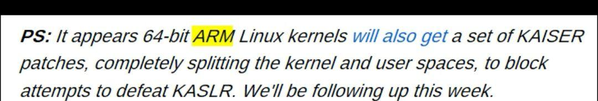

# 如何看待 2018 年 1 月 2 日爆出的 Intel CPU 设计漏洞？

> **类型**: 回答
> **作者**: Dio-晶
> **赞同**: 0
> **评论**: 13
> **时间**: 1514961603
> **原文**: [https://www.zhihu.com/question/265012502/answer/288280755](https://www.zhihu.com/question/265012502/answer/288280755)

---

理解能力不足，请教一下OS的同志们，这个PS是什么意思?

没有涉及该BUG的AMD和ARM64应该不需要合入该PATCH吧。谁能说说内核是怎样做分支的? 是否判定INTEL型号才PATCH? 还是扫射所有人? 求不误伤。

---

*由知乎爬虫生成于 2026-02-01 15:39:00*
