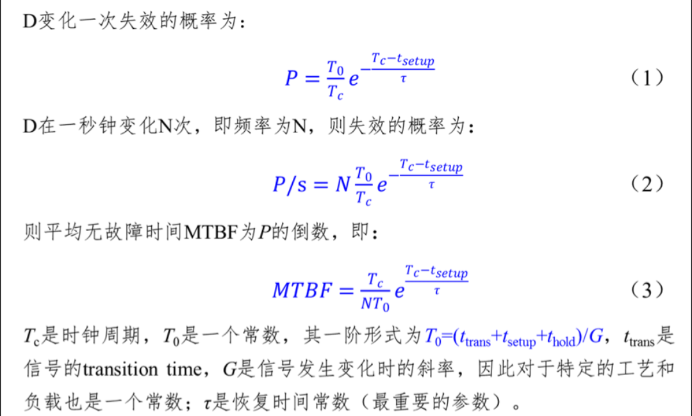
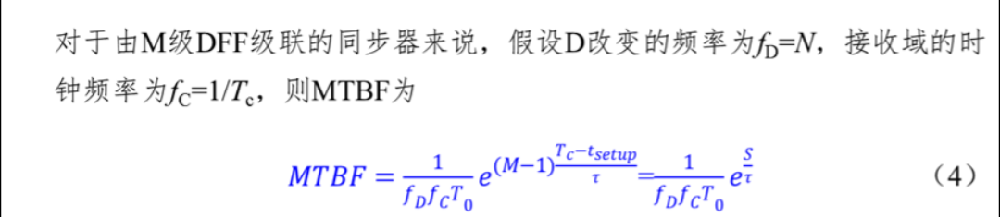

# 中国的哪些地方能体现出来工匠精神？

> **类型**: 回答
> **作者**: Dio-晶
> **赞同**: 0
> **评论**: 57
> **时间**: 1502886437
> **原文**: [https://www.zhihu.com/question/23908444/answer/215427961](https://www.zhihu.com/question/23908444/answer/215427961)

---

刚好最近的一件事有一些感触，凑个热闹，IC业者，只谈IC角度。

其实都是人，只要努力，没有什么不同的。

中国也是（中国人是很上进的民族），对于工匠精神嘛，还是先要有钱，然后有时间，再其次，工匠精神一定就会有了。

三代出贵族，要坚持三代啊。

在集成电路领域的，都应该知道异步处理是什么。 菊花司的规范简单粗暴，“异步处理以接收端时钟频率算，1GHz以内打两拍，以上打三拍，打拍寄存器在PR最后阶段替换为工艺库中专用的防亚稳态寄存器”。这个规范作为质量高压线无人敢挑战，不用多想，国内大多数IC公司差不了多少。

这个原则是怎么定义出来的呢？ 其实是一个公式，截个图如下，不涉密，网上能查到。

  
  

异步处理其实无论怎样打拍，都是无法绝对避免亚稳态的，只能是把尽力概率MTBF缩小到一个可以忽略的地步。公式有汉字大家都能看懂，G和工艺相关比较难以改变，那么要提升MTBF，降低频率，增加拍数就是最简单粗暴的做法了。而恢复时间参数T（希腊字母tao，知乎打不出来啊），用通用DFF的角度来看，改变阈值电压是能够降低的，所以有防亚稳态寄存器（推测是改变了寄存器阈值电压）。

讲到这里一切都很正常，没什么工匠精神的事，直到最近，部门一位博士进一步查找了一些改变器件恢复时间参数的专利。我们看到，其实，如果能定制特殊的DFF cell，例如放弃C-Q延迟，是可以把回复时间提升到一个非常高的水准，这种情况下，异步处理即使在高频下也可以做到只打一拍！！！一拍！！！

大多数同志可能对这个没感觉（IC的应该有吧?），简单举个栗子，以麒麟或者高通8XX为例，CPU和总线是异步的，这样，一个cache miss的请求从CPU到总线到数据返回，需要两次异步处理，按通常的异步FIFO来说4拍CPU时钟周期+4拍总线时钟周期的延迟损耗了，要粗算的话，大约是5-6ns的延迟，这是一个没有收益的纯损耗，而做CPU拼得是一个精细化设计，每一个CYCLE都要拼尽全力去优化的。这样说很像工匠精神吧，是不是? ԅ(¯ㅂ¯ԅ) 附带说个数字，我了解的，不和人争辩。apple Ax ：麒麟96x : 高通 82x的DDR访问延迟大致是8:10:11的比例，不黑不粉，苹果是真的强。

但真正在查询这种异步处理定制电路时，让我感受到了厚重的工匠精神。是来自Oracle和apple的大量从十年前就开始该电路的技术积累和研究。特别是查到的这位和我同校的师兄，目前就在苹果，[https://www.linkedin.com/in/bo-tang-73a1831/](https://link.zhihu.com/?target=https%3A//www.linkedin.com/in/bo-tang-73a1831/) 他将近二十年的职业生涯中的相当长的时间，他就在和这个异步处理死磕了，从GOOGLE能搜到他的相关专利……

这就是工匠精神了。

是的， 菊花司还没有这个工匠精神，这和目前中国很多产品的步伐类似，还在努力完成从50到90分的跨越，在野蛮生长的阶段，对于90分之后的0.1或者0.2暂时没有足够的精力和钱去争取，但跨过90之后，市场会带来钱，不过光靠钱也换不了工匠精神，还需要时间，五年吧（最怕的是砸钱的领导不愿意付出时间），异步处理的工匠精神也会有。

唉，加班挺累的，趁有空瞎JB聊了一段，纯感慨一下，感觉挺词不达意的。

---

*由知乎爬虫生成于 2026-02-01 15:39:00*
