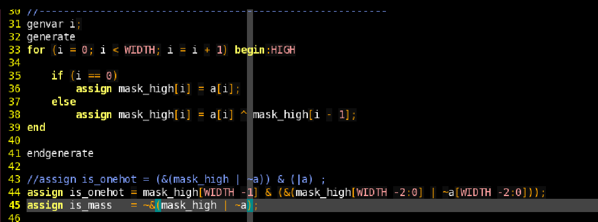

# 熟悉计算机体系结构是种什么样的体验？

> **类型**: 回答
> **作者**: Dio-晶
> **赞同**: 0
> **评论**: 213
> **时间**: 1493630315
> **原文**: [https://www.zhihu.com/question/59057984/answer/163253727](https://www.zhihu.com/question/59057984/answer/163253727)

---

好不容易放假一天，趁坐着洗脚按摩的功夫怒答一波。看答案讲没用的人挺多啊，挺不解的。

我主要做架构，兼一个80人规模世界顶尖的处理器设计验证实现团队的manager，指导兄弟们最多的就是苦口婆心劝大家看《计算机体系结构量化研究方法》和《数据结构与分析》，前者是理解系统的基础，后者是编码的基础。收效甚微，嗨 (ノ=Д=)ノ┻━┻

你们知道现在招聘正统一个体系结构背景，IC方向硕士或者博士多难么……有钱都招不到啊。嗨(┯\_┯)

数据结构也是，‘’16bits位宽寄存器，用五（六也行）级逻辑判断其中有15个0和1个1‘’，这么道题目，面试无数，几乎没有人能答出来，连给我衍生‘’14个0和2个1‘’的机会都没有。

回想一下，我是怎么学的呢？数据结构是大学本科课程，比较感兴趣，是少数几个认真学习的课程之一，体系结构，原则上和我专业（通信）无关，但研究生老板恰好是2000年左右国内一大批EE类国外图书翻译版的评委，实验室一套全有，处于个人兴趣自学了体系结构一书。回想起来，这两本书贯穿了整个职业生涯。

表面上，体系结构很虚，确实像是装逼专用，实际上，这是一种系统分析的语言和理解的基础，学过的人和没学过的人要聊起来，要达成理解的一致，光铺垫热身就要很久。要类比的话，学了牛顿三定律的人，通常就认为世界是酱紫了，而学过相对论甚至弦论，看待一件事物时会有另一种视角，就是跟一个认为两个铁球同时落地的人讲光速恒定的赶脚。

体系结构就是如此，他用传统CPU为视角，对最本质的基础架构：冯诺依曼，进行了详细的量化分析。我常常问手下的兄弟，为啥我们要做通用CPU，这个和做个GPU或者DSP，甚至火热的TPU有啥区别呢？ 为啥要有CACHE呢？为啥要有MMU呢？ MSI和线中断又是啥区别呢？ 这些问题的答案，汇聚到最终，也就是对冯诺依曼的理解了，看明白这点，面对火热的TPU、寒武纪什么的，很大程度就能理解他们本质上是在冯诺依曼的基础上，在数据的时间性和空间性取了什么巧了。

对实际工作来讲，体系结构也是重要的，以ST验证为例，不懂体系结构的人，看待一个系统，就只知道CPU在取指，错一个bit就跑飞了，数据在总线上流动，乱七八糟，一个地址变化好几次，定位起来困难死了，分不清MEMORY或IO属性，不理解中断嵌套的层次，更勿论虚拟化和docker…… 这样的同志定位一个芯片系统性问题，得半年。

嗨，昨天还有人问我如果软件写错程序，会不会践踏堆栈，硬件要不要做一层地址判定保护…………这里的同志觉得呢？

有时候我还在想，国内好的体系结构的学生少，是学校不教呢，还是老师不合格啊…… 举个栗子，intel的skylake相比haswell一个大变化就是cache层次从inclusive变成exclusive，这个变化无论工业届还是学术界都是重要的吧。那么exclusive相比inclusive的优劣是什么？谁都知道exclusive会有效增大cache容量，那为啥不第一天就用呢？ 面试国内体系结构相关的硕士博士，结果是知道这个变化的人就少之又少了，更勿论……

  
  

2017-05-02，更新提到的题目，16bits寄存器找1的verilog表达，回复中依旧无人答对。如下图

看上去无人明白这个答案的意义，还是在讲什么加法器、迭代、二叉树之类，哎

╮（╯＿╰）╭

---

*由知乎爬虫生成于 2026-02-01 15:39:00*
