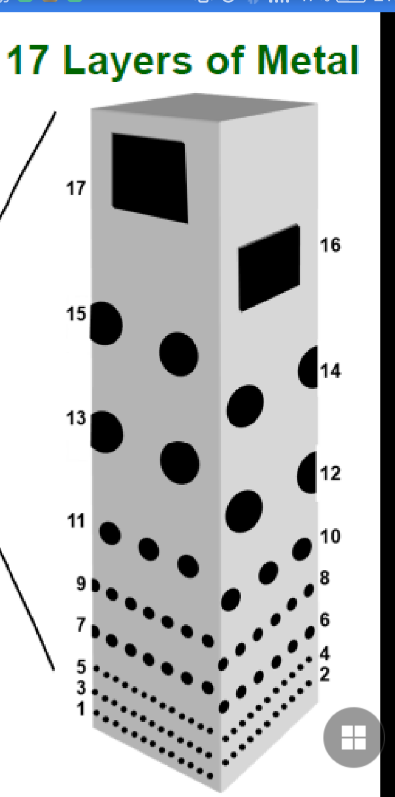
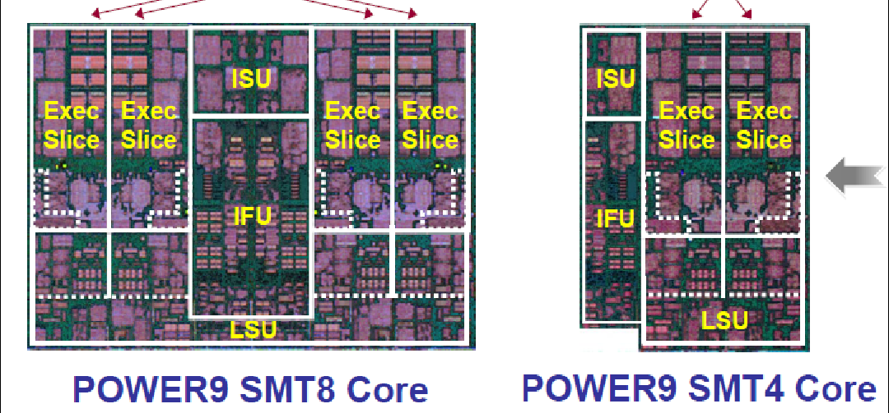
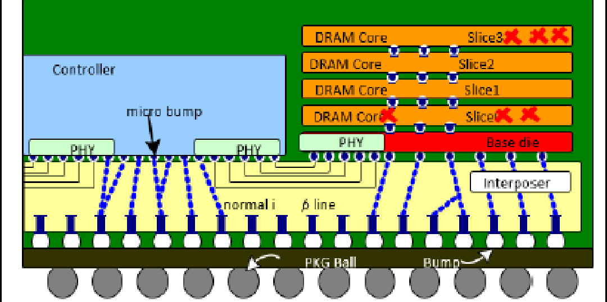
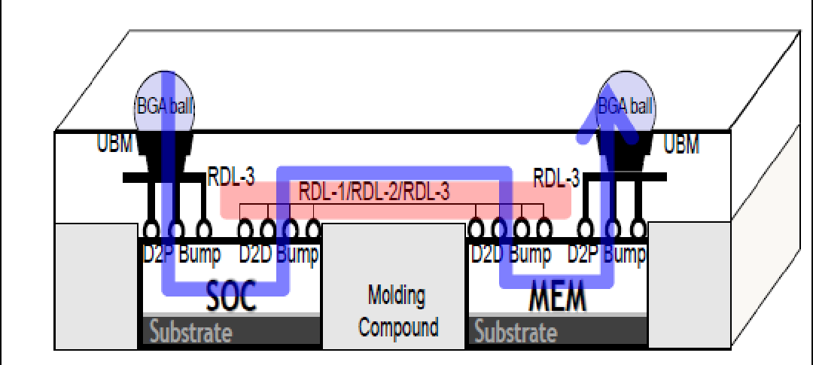

# HotChips 28 有哪些看点？

> **类型**: 回答
> **作者**: Dio-晶
> **赞同**: 0
> **评论**: 22
> **时间**: 1471917654
> **原文**: [https://www.zhihu.com/question/49909769/answer/118393090](https://www.zhihu.com/question/49909769/answer/118393090)

---

问得真快……

正在看，晚点再来装逼。

只说一句，IBM，逆超线程，强，无敌。

8-26更…………早看完了，但这几天忙的要死。今天美好的周末，开黑又凑不齐五仁，开不起车，只能吹牛。

从工业届的角度来看，hotchip的重要性比isca，HPCA之类更重要，因为这本身就是工业届秀肌肉 的一场狂欢，和学术界高瞻远瞩的论（cui）证（niub）相比，拿出来都是实实在在的炸弹 ，“talk is cheap，show me the chip”，

第一节。

首先是看到飞腾在hotchip装逼的消息，但他没发论文，不在这里谈了，另起一帖评价评价。

<http://www.zhihu.com/question/48948852/answer/119076778>  

第二节

如果INTEL是CPU领域荼毒生灵的恶魔，那IBM，就是藐视众生的创世神。神之九代目，P9现身。

120MB的eDRAM做的cache……

统一PCIe4，CAPI，nvlink，SMP多种标准的的25G serdes……

还有7TB带宽的片上互联……说到互联，我也是专家的专家了，可是看到IBM占全芯片面积1/6面积（约100mm2），还有下图这样故意show出来恐吓全世界的17层metal走线……再仔细一算，总线位宽1024……

神不缺钱 。

好想献上我的膝盖和简历……

但这都不算什么，你见过两个单线程核拼接成一个双线程的核么？ 共享前端，独享后端。

在知乎搜索一下“逆多线程”就能看到了，还有神奇的VISC。

虽然不全部是这样，但IBM的CPU已经有这样的雏形了。一个SMT8的CPU，中间劈开，就是两个SMT4的CPU，想要重核可以有重核，想要核数量可以有核数量。想一想都觉得屌。

  

当然，使用上好像有些限制，编译器和OS应该不能很好利用不同的SMT数量，SMT4建议是LINUX，SMT8仅建议PowerVM。

但即使这样，这种架构也可以说是近十年在处理器架构上非常重大的革新了，不愧是神。

第三节

摩尔定律并不会停止，即使工艺演进在变缓，东方不亮西方亮，封装，会继续延续摩尔定律的速度。

3D封装……那是扯淡，散热散不出去。2.5D封装，在封装的支撑范围内，将不同尺寸，不同工艺，不同功能的芯片集合到一起，是可以产生化学变化的。

这次HOTCHIP有五篇、五篇、五篇讲到了这个故事，还没明白的ICer，只会被摩尔给抹杀啊。

Tutorial的hynix，用interposer的TSV互联方式，用类似serdes的接口将SOC和HBM以高带宽集成到一起的方案，随后第二篇是Nvidia，马上就用Pascal的实际产品证明这种结构的强大，这个应该是NV和Hynix在samsung一起联合成果。

马上samsung就宣传了该技术，并且提出该技术在mobile可用。

然后是TSMC，是基于RDL的fanout技术，TSMC还一并展示了互联IO的设计技术，非常不错，类DDR接口，256bit位宽，2G速率，即512Gbps的带宽，功耗非常小。小道消息，TSMC的方案是和APPLE合作的，那么下一代iphone也许能见到这种黑科技哦，DRAM不用在背在CPU的背上（POP封装），散热问题大幅缓解，感觉能再加好多功能了。

还有就是xilinx，也花了大量篇幅来讲故事，还特意画了一张表来比较MCM/fanout/interposer的差异和优劣，就不贴图了。

本来还等着AMD，但是农企他很懒，这次什么信息都没有透露……

第四节

待续

---

*由知乎爬虫生成于 2026-02-01 15:39:00*
