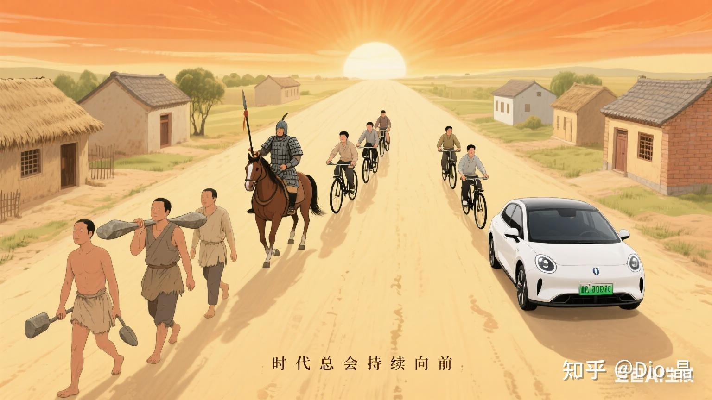

# 互联网自研AI芯片 ：）

> **类型**: 文章
> **作者**: Dio-晶
> **赞同**: 377
> **评论**: 58
> **时间**: 1756006111
> **原文**: [https://zhuanlan.zhihu.com/p/1894450386322061157](https://zhuanlan.zhihu.com/p/1894450386322061157)

---

> **TPU7，你也想要吗？**

还记得上半年Google的TPU7的发布，Ironwood，号称与B200相匹敌。各项指标看上去，也确实称得上炸裂。

> **为什么google行，我就不行？**

所以到今天，北美&东亚凡是能排得上号OTT，谁要是不自研芯片反而会被人怀疑是不是萎了。

想想也是，一个个都是搅动人类社会转速的巨棍了，那面对AI的FOMO，用卡是必须尽早、管饱才能安心的，而内部算法团队也想要用算法+硬件高效协同来弯道超车DeepSeek甚至某一天形成壁垒的呼声也越来越强烈，但现实中却又是不得不不定期kiss 黄’ass来排队买GPU，而且还往往不能保证供应时间和可靠，想象一下都挺受罪的。

但话说回来，真正能说得上做得好的，能用管够，还能真正和Huang扳手腕的，目前只有Google TPU了，而且整整做了七代。你是不是真的也行？

作为做芯片的一根老混子，但经历得多了，反而越发有些保守和迷信 ：） 到底应该怎么做？是什么样的条件决定了成败？ 越深想，越觉得，得做颗AI芯片可能没那么难，但其实也没那么简单，难度搞不好，都是命中注定。

天使和恶魔，在耳边拔河。

---

> **就不行。**

因为芯片设计这个行业，其实是一个伪装成高科技的制造业！！

左手《CleanCode》、右手《数据结构》、背着笔记本、面朝格子间，很容易让人误把ICer当做信息时代的Programmer，当然很多ICer也这么自以为 ：）

那其实是全球化技术分层后，在某些特别零碎的小片段中的幻觉。实际上的芯片伴随的是一个链条非常长的制造行业，连硬件集成整合都算不上（虽然有些人认为IP组装算个集成），更扯不上信息与服务了。以至于甚至于华为那样的硬件集成行业的公司中，海思都常常会表现得特立独行。

> **认清楚行业特征，对想清楚这事好像蛮重要的。**

> **制造业的本质是，所有的设计都是过程资产，最终的产品是一个物理实体。**  
> **所以制造业的最大特征是需要生产资料，OTT能理解和掌握生产资料么？ 这是核心矛盾点。**

与信息时代不占地、不建房、一台PC一张床就能开工不同，芯片设计依旧是与原材料及制造配套绑定的。当然，我们也可以认为整个信息时代都是基于全球化的分层分工演进出来的（某种视角来看，OTT是基于4G/5G通信网络的套壳产品，是全球通信网络建设的红利收割者）。但芯片设计行业因为某些特殊性，一直没有建立高效的抽象和分工，OTT的数字设计就是最终产品本身，而芯片设计的数字化部分只是中间产物，最终的产品是一个极其复杂的硅、铜、铝混合的物理实体。

对于要正式制造一个物理实体，那么整个时间周期就和写完代码今晚就上线的玩法格格不入了。甚至于芯片的反馈环路也比较长，动辄三年才能看清楚成败，而一个人也需要几代才能初步理解完整的制造流程。这对人和组织的积累要求也往往比较高，这与OTT年轻、快速的组织变化也格格不入。

制造业的链条远远比OTT想象的要长和复杂。下单、备货、库存、检验等等物理上需要去实操的行为就没法避免，更多的是，这种高阶制造业的生产资料也不具有普世性，光刻机就和中美之间的互相卡稀土是一回事，能不能拿到和能不能把控，都会产生两种芯片的结果。OTT也并不善于管理复杂的供应链体系，而且当前这国际形势不比Google还更复杂？

此外，IC作为一个制造业的商业模式也是基于每颗芯片的销售毛利 x 芯片的销售总量，最终来衡量结果形成闭环的，这是运作一个芯片团队，建立良好的目标感和使命感的关键，若做颗芯片只是公司内部的服务团队，最终价值的必须体现在另外的数字服务上，那么团队的价值观短期可以靠钱，长期容易礼乐崩坏（雇佣兵和人民军队的战斗力不一样的），这是很多芯片团队最终剥离OTT的重要原因。

嗯，思来想去，制造业要融入数字产业，搞不好LGBT是关键 ：） 需要得容得下不同的行为和价值观的文化。

可能这是Google能搞出TPU的重要原因呢，OTT是否能容忍和融合这样的差异化是破冰的关键，重回大唐？很难。

---

> **maybe可以。**

原则上我只能给出不可以的答案的：）

但是，最近和太多OTT做Infra的人（包含了想做和正在做芯片的）聊了天，有一个平平无奇但深入灵魂的问题震醒了我。

“一颗芯片从设计完成到拿到手，得多少时间啊？” 他们都很好奇

“Coding Done之后，8~10个月” 我答得很快，条件反射都不用过脑子的，100%NL-2-GDS是4个月，GDS-to-Silicon基于制造环节的差异能控制到4~6个月，领导肯定满意。

直到入睡之前，才重新被这个问题给惊醒，细思极恐。

回想一下，公司内部那些Diss互联网造芯片的那些专家热帖们，判断互联网造芯的核心锚点还是成本。

“1000亿采购，自研芯片投入10亿，节约10%的外购，ROI就很夸张了，主要是因为Nvidia芯片溢价太贵了“

“不行的，ROI算不过来，等他们熬不住，我们就胜了”

这都是不对的。

> **认清楚行业特征，对想清楚这事好像蛮重要的。**

> **信息产业的本质是，数据流转的速度和效率，正如淘宝让生产者直面消费者，美团雇人把饭喂到你嘴里，而要不是手机能力有限，字节都想让主播坐到你怀里。OTT的核心是效率啊，先谈效率，再看制造业喜欢的ROI。**  
> **当然，还有OTT擅长的系统解构。**

所以，那个问题还能衍生：

一颗AI芯片从开工到拿到芯片需要多少时间？ ~24个月

一颗AI芯片从开工到拿到芯片测试通过告后报喜，然后boss对外高调发布再客户评测采购到下单并送到客户手上需要多少时间？ >36个月

数字都能拆开详述，而列举数字的我却发觉我如同《肖恩克的救赎》中red上厕所先请示一般的自然，却又无力。

> **这个时间被流程禁锢了**。

我能感觉到问我问题的那些人的笑容之中，也许会有一到两位，那是革命者的笑容，也许，就像当年李想、李斌，问大众的架构师做一款新车需要多长时间一样。

细思极恐却又泪流满面。

100%NL-2-GDS（四个月），是基于人类编写的C-like Code，翻译成比机器码更深远，一种晶体管组成、拜访、通过有限跳线方式互联的Phisical Schematice的过程，用软件的描述可以理解为compile，其中有一些价值点，但总的来讲附加的创造性价值几乎为零，而就是个无附加值的样子编译过程需要人类感知的4个月的时间。 Why baby，tell me why？

实际上不需要。

我经常在酒局上讲一个故事，那是十年前的KP920，那个类似CHI Home Agent的模块（懂的人知道，挺复杂的），因为有bug没法ECO，需要重新提交100%NL，必须搞，最终交付GDS并merge到顶层，耗时是1个月。为什么会在喝酒的时候讲这个故事？ 因为这是你的青春，而且你知道再也回不去了。

那时候团队小，流程不完善，没啥事情不是一顿烧烤解决不了的，如果还解决不了，加两张色图。

现在，倒也简单，无论大小繁简，统统四个月。你说你要赌上你的职业生涯，要来挑战一波，抱歉，流程就是用来制止你这样的异常变量的。

很多人会和我一样，时间长了，潜意识就认为芯片复杂度就在这里，必须要靠系统、流程来解决。不是的，很多复杂度已经来源于后天而不是先天，是能够消减的，例如OTT擅长的系统解构就是一种方法。

> **OTT做芯片就不是一个ROI的事情。**

做一颗还行的AI芯片，投资是20亿RMB起步的，如果这颗芯片一版只能量产1W颗，那么不算成本，摊下来单芯片的费用就是20万RMB（和买一颗NV差不多），即使量产10W颗，那么平摊下来也是2W RMB（和买4090差不多）。一代芯片要量产超过10W，国内能做到的就寥寥可数了，到这个级别大佬你掀桌子去IPO割韭菜不香吗？还在OTT内部卷图个啥。

> **OTT核心改变的得是效率，是时间。**

Telsa也罢，蔚小理也罢，其实新能源车不会比汽油车便宜很多。前几代还蛮贵的吧，尺寸大那是因为电池大。真正引发变量的，也许是雷总半年出一个新款起床，而大众得两年，而且无力改变。

> 时间才是最可怕的，是复利。

一颗芯片从开工到客户上电，若需要三年的时间，这三年之中，AI会发生何种变化？

这是一个变化的时代。

流程保证的是一件事能接近100%成功，但若事情本身就不确定，那这100%要来何用。若目标本身就不确定性，为何不采取饱和攻击？ 做10件事，若每件事成功率只有30%.........为何不做？ 是，投资看上去变得更大，但在一个变化的乱世中，是否时间和机会更值钱？

话说回来，OTT做芯片若要赢，只能赢在效率，去掉可靠性测试、去掉发布会和采购竞标，还有，把我青春梦里那Coding Done to GDS，回归到一个月..........

写到最后，这些文字也是挖的个坑，制造业的坑，明坑，但机会也在这里，若能迈过去，就能成为新势力，迈不过去，万丈深渊。

---

无论天使也罢，恶魔也罢，时代的轮子一直向前，嗯，大家都有美好的生活也说不定。

---

*由知乎爬虫生成于 2026-02-01 15:39:00*
