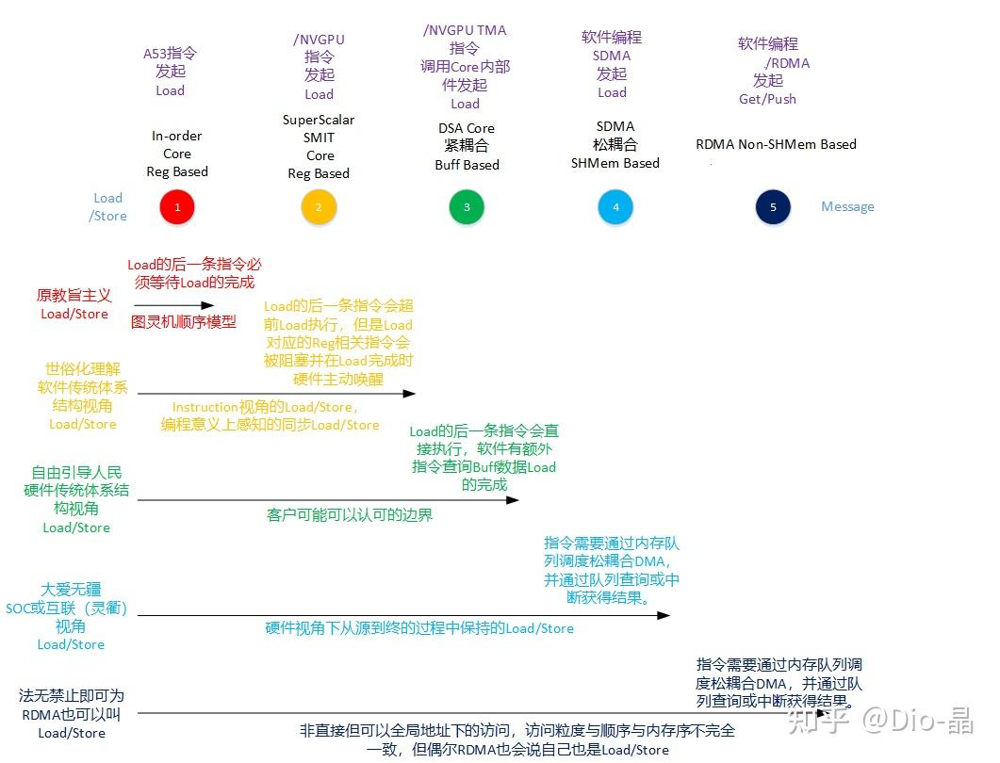

# LD/ST？ 内存语义？ 傻傻分不清

> **类型**: 文章
> **作者**: Dio-晶
> **赞同**: 355
> **评论**: 52
> **时间**: 1745124628
> **原文**: [https://zhuanlan.zhihu.com/p/1888313027880808563](https://zhuanlan.zhihu.com/p/1888313027880808563)

---

有人说我写文章喜欢打哑谜：） 我并不否认，因为这是我写文章的一个非常有趣的动机。

就像你辛苦爬上了一座山，看了看却发现四下无人，那不妨留下点记号，甚至挖个坑，希望让下一位爬上山的人看到，当他也发现这个记号时，无论你身在何处，你知道世界已经证明，你和他都不孤单了。

最近Zartbot写了两篇文章，第二篇还cue了我下面这篇文章的内容。

[https://mp.weixin.qq.com/s?\_\_biz=MzUxNzQ5MTExNw==&mid=2247493977&idx=1&sn=ceac5ef24a45f7dfb09199870967e3f4&chksm=f8e9636bc173881c2bfb98e07b1d3fa4236114039e2328133c71803acfb12ab7f157fe8b7242&mpshare=1&srcid=0415qNRixVZPat9CTQZaKx9J&sharer\_shareinfo=ba0618139b9a20732bd7a490f1294d63&sharer\_shareinfo\_first=ba0618139b9a20732bd7a490f1294d63&from=timeline&scene=2&subscene=2&sessionid=1745123867&clicktime=1745129196&enterid=1745129196&ascene=45&fasttmpl\_type=0&fasttmpl\_fullversion=7694450-zh\_CN-zip&fasttmpl\_flag=0&realreporttime=1745129196535&devicetype=android-31&version=28003953&nettype=cmnet&lang=zh\_CN&countrycode=CN&exportkey=n\_ChQIAhIQ3EmUvbBbBmU5QjYtn0F%2FlxL1AQIE97dBBAEAAAAAACzFJfKpHk8AAAAOpnltbLcz9gKNyK89dVj0XvqQBKTY5lqmcRFDvWdlG5tlpbHxxXWab16PGvcYK7RK2YTBOhbcpRHfgS6uZunhgc06rs%2BvMdXYlJaWhEeW9vajyGT%2BlHM1K1yJhX58yl1XMql%2Bwsbs%2FpJv2UVS%2BoOcbgNxCaJjuCzgMSHwfe9Hq%2B6j4lKJn0CkXeIbQpPTIlMeG%2BIgQpdh1punI2ks2ad55mmRetpOrUtO141rQ1WT8k2ZxNaq6sBqZhM7uL9tjydkNJQZghY6veqW%2F75hPVoh94qoCh4Nebu7sEV9j0kG&pass\_ticket=iuFwoviSBXE%2B5B%2BcT7f5YrrAeh6Gx8Jl7VH8EI621BLXSqs3MwohRCeJ66HjBt3h&wx\_header=3](http://link.zhihu.com/?target=https%3A//mp.weixin.qq.com/s%3F__biz%3DMzUxNzQ5MTExNw%3D%3D%26mid%3D2247493977%26idx%3D1%26sn%3Dceac5ef24a45f7dfb09199870967e3f4%26chksm%3Df8e9636bc173881c2bfb98e07b1d3fa4236114039e2328133c71803acfb12ab7f157fe8b7242%26mpshare%3D1%26srcid%3D0415qNRixVZPat9CTQZaKx9J%26sharer_shareinfo%3Dba0618139b9a20732bd7a490f1294d63%26sharer_shareinfo_first%3Dba0618139b9a20732bd7a490f1294d63%26from%3Dtimeline%26scene%3D2%26subscene%3D2%26sessionid%3D1745123867%26clicktime%3D1745129196%26enterid%3D1745129196%26ascene%3D45%26fasttmpl_type%3D0%26fasttmpl_fullversion%3D7694450-zh_CN-zip%26fasttmpl_flag%3D0%26realreporttime%3D1745129196535%26devicetype%3Dandroid-31%26version%3D28003953%26nettype%3Dcmnet%26lang%3Dzh_CN%26countrycode%3DCN%26exportkey%3Dn_ChQIAhIQ3EmUvbBbBmU5QjYtn0F%252FlxL1AQIE97dBBAEAAAAAACzFJfKpHk8AAAAOpnltbLcz9gKNyK89dVj0XvqQBKTY5lqmcRFDvWdlG5tlpbHxxXWab16PGvcYK7RK2YTBOhbcpRHfgS6uZunhgc06rs%252BvMdXYlJaWhEeW9vajyGT%252BlHM1K1yJhX58yl1XMql%252Bwsbs%252FpJv2UVS%252BoOcbgNxCaJjuCzgMSHwfe9Hq%252B6j4lKJn0CkXeIbQpPTIlMeG%252BIgQpdh1punI2ks2ad55mmRetpOrUtO141rQ1WT8k2ZxNaq6sBqZhM7uL9tjydkNJQZghY6veqW%252F75hPVoh94qoCh4Nebu7sEV9j0kG%26pass_ticket%3DiuFwoviSBXE%252B5B%252BcT7f5YrrAeh6Gx8Jl7VH8EI621BLXSqs3MwohRCeJ66HjBt3h%26wx_header%3D3)[https://mp.weixin.qq.com/s?\_\_biz=MzUxNzQ5MTExNw==&mid=2247493955&idx=1&sn=0e880f3d509f0b494287cb552cbdb236&chksm=f8dd30dccb86aa1af236b9d23b7a24701fb318f68ed466ada2e47439f67d0366216f607350cd&sessionid=1745123867&scene=126&sessionid=1745123867&clicktime=1745129255&enterid=1745129255&subscene=10000&ascene=3&fasttmpl\_type=0&fasttmpl\_fullversion=7694450-zh\_CN-zip&fasttmpl\_flag=0&realreporttime=1745129255021#rd](http://link.zhihu.com/?target=https%3A//mp.weixin.qq.com/s%3F__biz%3DMzUxNzQ5MTExNw%3D%3D%26mid%3D2247493955%26idx%3D1%26sn%3D0e880f3d509f0b494287cb552cbdb236%26chksm%3Df8dd30dccb86aa1af236b9d23b7a24701fb318f68ed466ada2e47439f67d0366216f607350cd%26sessionid%3D1745123867%26scene%3D126%26sessionid%3D1745123867%26clicktime%3D1745129255%26enterid%3D1745129255%26subscene%3D10000%26ascene%3D3%26fasttmpl_type%3D0%26fasttmpl_fullversion%3D7694450-zh_CN-zip%26fasttmpl_flag%3D0%26realreporttime%3D1745129255021%23rd)

他也在打哑谜，除开他喜欢炫耀他所做的eRDMA，这两篇文章看似毫无关联，但实际上是在讲他认知或者总结的一个事情：即计算领域里没有所谓的固定的Ordering，很随性，计算机体系结构中，乱序什么的这个事情是一个典型的Tradeoff，也就是一个可以谈价格的商品，当今的CPU/GPU，大多数都支持乱序，甚至丢个包也没啥，状态都在，replay一下就好了。而传统的网络却一直在遵从保序和不可丢包这一非常古老和严苛的传统，那你用这种传统的网络语义来传递内存语义的时候一定得浪费很多不必要的力气。

Zartbot详细列举了Nvidia GPU的Memory Model，其实就是告诉你，好的GPU Scale-up互联，应该是基于这个Memory Model来适配，而不是简单的Lossless & In-Order。

其实，一个支持内存语义的网络真不需要那么守旧的。你真的无需在GPU scale-up接口上进行严格的保序和防丢包设计，只需要按照内存真正的语义诉求去执行，表达其原生的语义，做出最好适配的网络语义就好，这也是我上一篇文章中留下的那个记号。

[Dio-晶：AI fabric is a bus or a network？](https://zhuanlan.zhihu.com/p/708602042?utm_psn=1896649210075530957)

---

今天不打哑谜了，揭穿Zartbot的哑谜之余，顺带把我前端时间在公司内写的一篇文章转出来，它也其实是我上面那篇文章中对这个哑谜进一步的澄清和说明。

我在上面的文章中大量提到了Load/Store/Atomic，我把这个定义为Bus的行为，以及是对内存语义的定义 ：）

最近Ualink也发布了，那个什么ODCC会也吵得不可开交，还有人问Google的Scaleup根本没支持Load/Store，那为啥也说是内存语义呢？ 不妨接机澄清一下。

> 其实，LD/ST和内存语义是两个维度的概念，前者是一种行为或者说动作，而后者是一种能力，就像你是个光头和你是不是一个和尚之间的关系，当然大多数时候，如果没有意外的话，和尚应该是个光头。

但这里，还是先把这两个事物进一步展开来看一下 ：） 其实光头和和尚本身的定义就有很多故事的，讲清楚这两者大致上结果可能会清晰些，或者，让理解更混乱？

---

> **先看LD（Load）/ST（Store）**

如果

先问一个问题，Nvidia在SM引入了TMA，可能很多人都会疑惑，TMA算是Load/Store吗？

如果从计算机体系结构的历史来看，大致上Load/Store这个词可能来自于IBM在CPU的RISC上，对Load a data from Mem to Reg或者Store a data from Reg to Mem的指令的定义，CPU大多数时候Add、Mul的指令都是对Reg内的data进行的计算的。

但这个算是一个完备的定义嘛？ 当我们在UaLink或Nvlink上谈Load/Store，是这个意思吗？

算了，画了一张图。

1、如果你强调Load/Store是指令的同步行为，必须按照指令顺序执行要等load完成后data inside reg才执行下一条指令，那么你属于体系结构中最原教旨主义的Load/Store定义 ：）

2、如果你意识到CPU发展到今天，先进的Super Scalar OoO CPU早已不是顺序执行，所谓的load在执行后也是异步挂起，其他指令都可以随意乱序，而Load完成时，其Load对应的目标Reg会触发一个硬件的Flag解除Dependency，唤醒其相关的指令再执行，那么你基本上对Load/Store的理解就世俗化了。对于软件写代码的同学，1/2两种模式是不感知的，而所谓Load异步执行唤醒下一条指令的行为也并不感知，此时的Load/Store是细粒度的单个行为。大致上也对Load/Store加了一个前缀，即Instruction Direct Load/Store，而且比较显性的是，这些行为映射到汇编指令中是ld、st、mov前缀，传统的软件人员对Load/Store的定义基本上都是如此的。

3、但是，2中的硬件乱序执行不是万能的，如果Load需要的数据量比较大，例如Matrix的计算（出呈现为粗粒度连续多个Load/Store），超出了Super-Scalar的OoO以及Regfile的控制范围，硬件再没有办法帮你隐藏内存延迟并检查相关性时，就会两手一摊躺着地上，没有Regfile了，给你放一个显性地址的Buffer吧，你自己把数据搬进来并且自己加flag polling检查这些data inside buffer的结束吧，此时你看到的就是Nvidia的TMA（国内的话是昇腾的MTE）。软件编程的同学一看，咦，需要我写指令等待Load的完成，那不就是个DMA，而不是Load/Store了吗？ 你说啥都对 ：） 从软件视角，这种行为是DMA（Direct Memory Access，这个名字也蛮不严肃的），从软件看来，此时的Instruction不再是ld xxx、st xxx，而变成了多条指令的某个命令组，所以软件确实可以不认是Load/Store，但是呢，要是从体系结构视角看，其实还是Instruction，不过是Macro instruction（或者CISC）罢了，所以，不同视角的定义是不一的，而在Core的硬件设计人员来看，这只是Load/Store不需要设计硬件唤醒机制而交给了软件显性的polling某个Flag的指令罢了，而从SoC的硬件设计人员来看，所有的Load/Store都是从一个Core的接口发出来的，并无差异（甚至于没有破坏Core内部Cache coherency）。硬件并不知道一个Load是from Mem to Reg or Buffer，从硬件的NoC的视角，TMA也是Load/Store。

4、如果数据量更大，Buffer放不下，变成Mem to Mem时，SoC就会在CPU之外的放一个DMA，或者叫System DMA，此时这个DMA在软件的视角，从Core内部Polling flag指令，就变成更显性的memory mapped address poling的等待了，但从硬件SoC的视角，不过是另一个Core（DMA也是个Core）发出的Load/Store。然后能，如果放到Nvlink/Ualink来看，从1到4，都是Load/Store（小包，且直接内存访问），在GPU的Scale-up接口或者说在Nvlink交换机的互联视角，并不知道一个Load来自于CPU LSU or SM TMA or SDMA，都是芯片内部一个NoC的Node，跨芯片发起的Load/Store行为。

5、RDMA（Remote Direct Memory Access）是不是Load/Store？一般来讲，如果RDMA over ETH，即RoCE那肯定不是，因为Ethernet使用的是Packet，其很多属性和行为与Load/Store是不符的，需要进行多次转义，但是如果你也知道华为还搞了个UB的URMA，一种能够over在UB链路上的RDMA，因为UB支持Load/Store语义，那么URMA也可以发出Bus的Load/Store的语义，即RDMA在over UB也说自己是Load/Store语义，从不为这种无聊的事情浪费人生的角度来看，我的建议答案是：是是是，你说的都对。

所以，你看这个Load/Store的概念都是渐变且灰度的。。。。。。。。

若一定要一个相对严格的定义。

**那么软件的视角上，只有调用instruction中的ld、st指令，并且操作的一方是Reg一方是Mem，才算Load/Store。**

**但是在硬件的视角，严格定义上的Load/Store，是指相比Message，把Transaction、Transport都合为一体，简化为具有耦合关系的rd req ->re dat或者wr req -> wr rsp，高效直接一次性完成整个信息交互的行为。作为硬件公司，我们号称支持Load/Store时，是基于一个硬件系统上支持了这种行为的运行，即使软件的同学认为GPU TMA不是ld/st的指令，但这和软件换做用SM就直接运行的ld/st指令在硬件上的需求是一样的，硬件特性支持的是底线，而不是某种行为。**

**所以，无论是网党还是计党在说一个Scale-UP协议支持跨节点load/store，都应该算是硬件公司提供的面对客户的能力（吹牛逼的界面），并不妨碍源头客户是否采用CPU LSU or GPU TMA or SoC SDMA or NIC RDMA。**

---

**那么，内存语义又是什么呢？ 和尚和光头又是什么关系？**

不打哑谜，讲答案。

**内存语义其实是程序员基于内存的特征表达的一系列语义，是一种语言的表达方式（就像英语、汉语），也是现今的程序员所编程的即Program的主要语法，与此对照的包括IO语义、Storage语义等等。**

**内存的特征包括体系结构定义下各ISA有细微差异但总体一致的Attribute、Coherency、Consistency、Single/Multi-Copy Atomicity.....etc，而所谓的差异，包括最前面提到的不同ISA下不同的Ordering等特征，大多数时候被某些显性的Instruction描述或compiler处理掉，最终体现为对全世界的软件人员都相对一致的特征。**

**因为内存语义的高效性，软件基于这一堆的特征表达了非常丰富的应用语义，并最后呈现为微信啊、淘宝之类应用。**

**而所谓支持内存语义，实际上是指程序员基于内存语义来表达的这些程序代码，能够在跨Scale-Up的设备之间，以性能有一定程度保障下运行（关键就是这个一定的度！！）。也就是和尚去了日本，也得是和尚（虽然能结婚，有些纯度的差异）。**

跨机是一定有损的，所以如果一定要强调支持内存语义就是一行代码不改，那是不讲道理 ：）

这个世界并不是非黑即白，中间是灰度的空间。

首先，高效的内存语义基本上是需要直接地址空间，即程序员能够在instruction中直接操作数据的地址，这也就是所谓的Direct Memory的说法，当然，在硬件具体实现上，因为MMU这种烦人的东西的存在，硬件上也存在比较多的变数，做Global Address或者PGAS甚至某种模拟的Address Agent都是可选的空间。

然后再看行为。

- 最初的，如果某些业务，例如Dense大模型的训练，程序员使用内存语义时更多是基于生产者-消费者的表达方式时，是比较容易被Send、Recv这类与网络Message行为亲和力更好的语义高效表达的，所以如果只是针对这一类场景适配，Scale-up支持内存语义是可以不需要load/store的，Google只支持高性能的RDMA，也可以号称支持内存语义即如此 ：） 也就是和尚可以不是光头，带发的和尚看着很糙。但也可以说这种Scale-up系统实现了**Coarse Memory Semantics**。

- 所以这涉及的就是一个度的问题，当出现MoE这类模型推理甚至推荐之类的网络，就需要相对小粒度的数据交互，额，例如软件直接跨机获取内存什么的，使用LSU/TMA会比RDMA更加高效，而这种小颗粒的语义即使是TMA在软件看做是DMA，但在Scale-up的接口上也会体现为Load/Store，所以，出于需要尽可能支持更大范围的内存语义的程序在Scale-up系统上能运行，Scale-up系统最好支持这种行为上更高效，甚至从网络视角把transaction和transport都揉为一体的Load/Store的直接传输，这是ualink/nvlink等ScaleUp系统所谓支持内存语义都是指Load/store的原因，即为了保证一定的道德底线，和尚还是都搞成光头比较好。**也可以说，支持Load/Store的Scale-Up，算得上实现了Native Memory Semantics，这里加一个Native表达大家的道德底线 ：）**

- 但是，内存语义又不仅仅是个load/store行为就ok的，还包括例如cache coherency等特性，截止到今天为止，AI Scale-up系统都不支持coherency，所以也有传统做CPU的人会说纯血Scale-up只能有小型机大型机才是，而nvlink/ualink没有支持Coherency算不上完整的内存语义也是对的，在通用计算领域某些对延迟比较敏感的业务若没有cache coherency则性能损失比较大的，这还是算是一个灰度状态吧，如果你只认大悲寺和尚的才是真和尚，说当前Ualink/Nvlink的内存语义只做到了90分也是可以的，**要达成Full Memory Semantics最后登顶这10分难度很大**，AI相关的业务付出那代价往往不值得。

- 此外，内存语义也并不是说要完全照搬片上总线（noc）的行为，毕竟系统拉远之后，物理特征和本地是有区别的，所以这里会增加有非常多体系结构研究的空间，即软件在本地内存语义的某种高效表达，例如某些read、lock、modify、unlock行为，甚至更复杂且可抽象的表达，在Scale-up拉远时若直接表现为某些req-rsp的频繁交互，那即使是load/store，性能也会非常低，所以在scale-up接口侧是可以归纳并新增一些macro operator（大多数时候携带更多信息的大颗粒load/store）来高效表达的。其实这个和CPU内部做macro instruction是一样的道理，额，也就是和尚吃不了肉，但可以用豆腐来做鱼香肉丝一样 ：） **Characteristics Memory Semantics，入乡随俗了，这协议才算得上开枝散叶。**

总结一下：）

**支持内存语义其实是指软件基于内存语义所表达出的丰富的软件行为，能够尽可能多且最低损耗地在Scale-Up系统上运行。**

**所以一个Scale-Up协议支持load/store这种原生内存访问行为是为了如上的“尽可能多“和“最低损耗”的达成，这是个度的概念，你可以无脑定个70%，或者换句话说，Load/Store更倾向于是Native内存语义的表达。**

**为了保证更丰富和机制的内存语义在Scale-Up系统上无损的传递，一个好的Scale-Up协议应当不仅仅是Load/Store，还需要定制若干Macro行为来让某些更复杂内存语义在跨机时的高效表达，这是下一个哑谜，也是Ualink/Nvlink还没有做到的事情。**

---

*由知乎爬虫生成于 2026-02-01 15:39:00*
