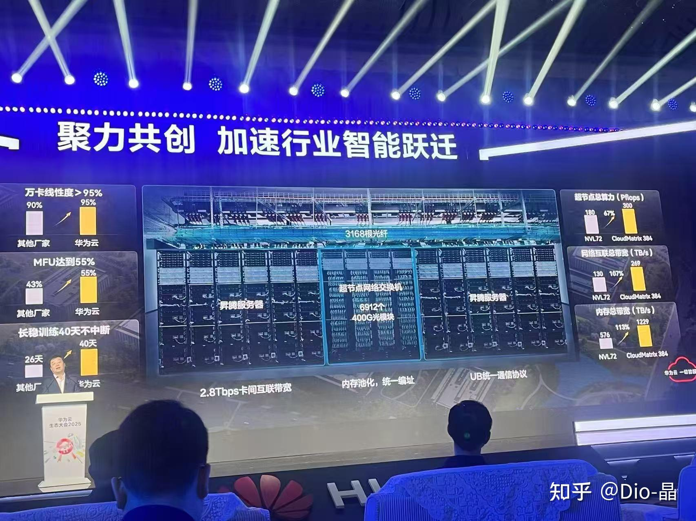
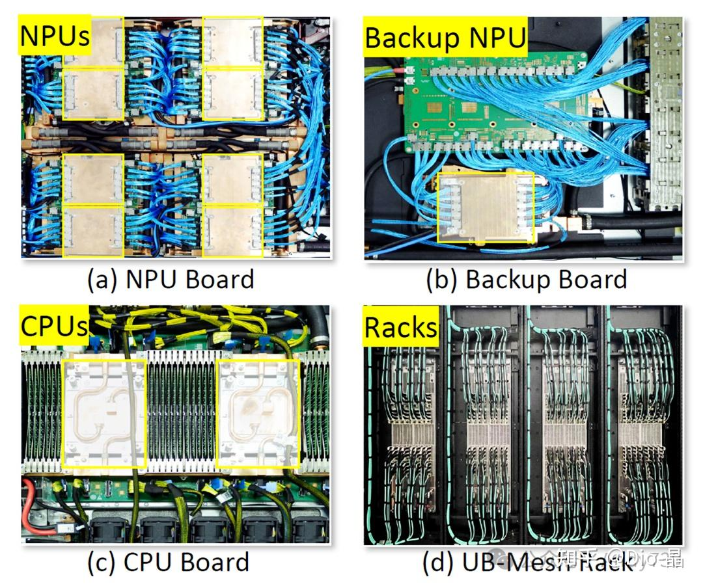
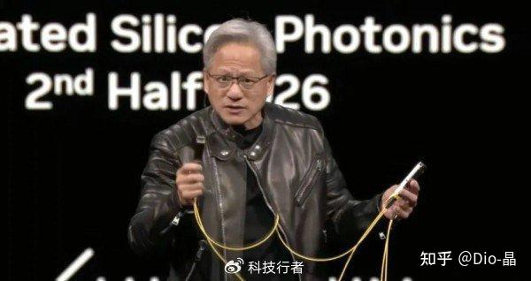
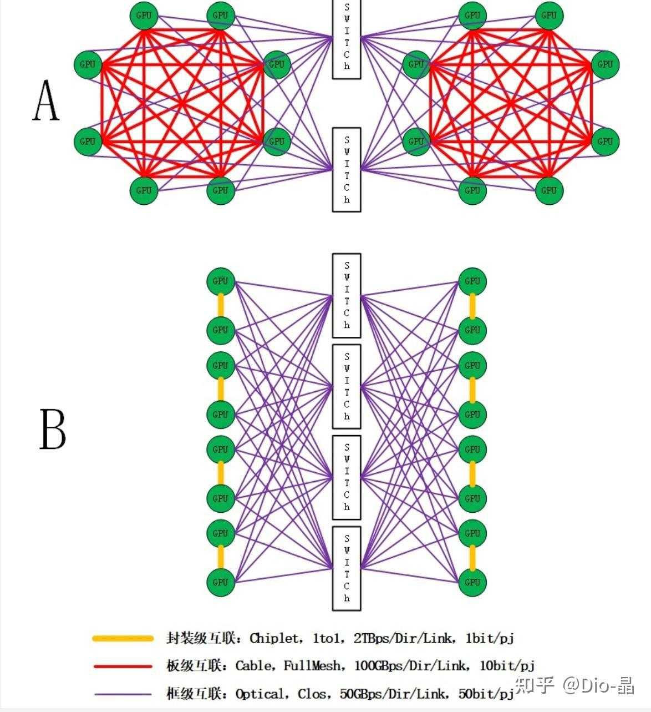
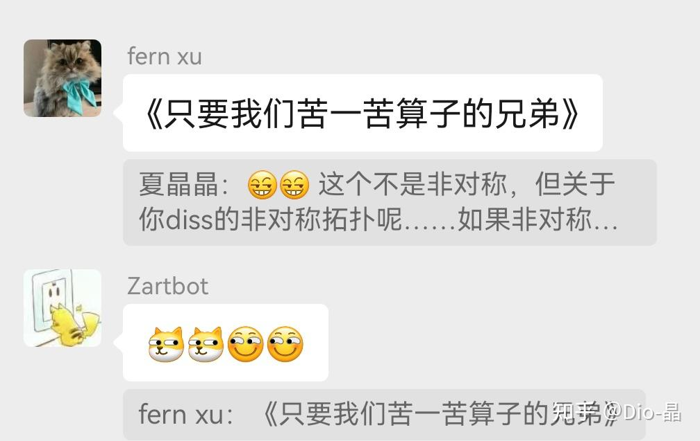
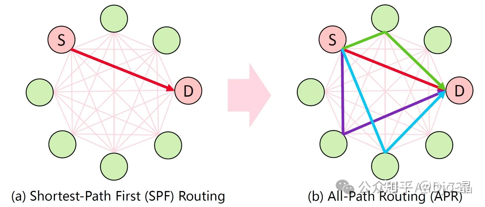
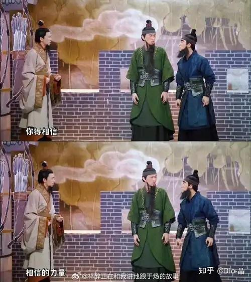

# CloudMatrix？UB-Mesh？ 傻傻分不清

> **类型**: 文章
> **作者**: Dio-晶
> **赞同**: 478
> **评论**: 60
> **时间**: 1745124614
> **原文**: [https://zhuanlan.zhihu.com/p/1896840813339714409](https://zhuanlan.zhihu.com/p/1896840813339714409)

---

本文转自一位IP属地为日本，笔名金屌的网友。

这位网友蛮屌的，他基于网上公开信息中的一些关键线索，对坊间留传的关于菊花司近期发布的CloudMatrix和UB-Mesh的重重流言，给出了一些感觉逼近真相的推断，非常具有侦探精神。也是，日本姓金的，搞不好是田一兄的表弟吧。

如下，只负责转载，有问题找我没用。

---

华为发布的昇腾CloudMatrix 384超节点，号称采用UB互联完成了384颗NPU的互联，并号称能够与Nvidia的NVL72比肩。

[华为云生态大会2025，CloudMatrix384超节点发布！](http://link.zhihu.com/?target=https%3A//mp.weixin.qq.com/s%3F__biz%3DMzg3MzI1NjU1OA%3D%3D%26mid%3D2247600214%26idx%3D1%26sn%3Ddf55abff0e034062e4fcfa7a696eb815%26chksm%3Dcf20dec833a492e60fb7b159282f25fb4ab981b163e4f890dac9747e85ec0a655b944103beaf%26sessionid%3D1745050815%26scene%3D126%26clicktime%3D1745059988%26enterid%3D1745059988%26subscene%3D10000%26ascene%3D3%26fasttmpl_type%3D0%26fasttmpl_fullversion%3D7694450-zh_CN-zip%26fasttmpl_flag%3D0%26realreporttime%3D1745059988206%26devicetype%3Dandroid-31%26version%3D28003952%26nettype%3DWIFI%26lang%3Dzh_CN%26session_us%3Dgh_cd568039d4d6%26countrycode%3DCN%26exportkey%3Dn_ChQIAhIQg%252Bsa9VIzVt0JSdEtjaHKXhLwAQIE97dBBAEAAAAAAIXZM1oT%252FJoAAAAOpnltbLcz9gKNyK89dVj09lNklJOecajmPvu5CJdla2BFVi8VhedSrHzECI39XmPf4yh%252FRrvudeNO5eCzDtZhZK%252FE75Wy0GvX2%252Bum1%252BtlT%252BBhwmDj1DcDZkVdMI%252FGe3qWRM9sgGcnCg2K0HW4w1CikxRllCv9XaynEffRbGXQ1F2jzowQnOgOycy1Gll5XW6rezz990%252FFJYAwAt%252BYTNCuiI9njwOso0pEuxbHNqUOhXMC7jztHQa8X6A0qVjHnaT6O2ZCCVaWmmpal29cNalCM1jIJUCa4Z4QxA%253D%253D%26pass_ticket%3D9QJxxFZep9xxurTbhhByoi7Oa%252BoH%252BgIfdEhkarLtJFRVFcwfk4hKLsUs7rex0UbH%26wx_header%3D3)

好巧不巧，不久前的三月底，华为还发布了一篇名为UB-Mesh的论文，也描述了一种也被称为超节点的NPU互联结构。

[UB-Mesh：一种分层局部化的n维全互连数据中心网络架构](http://link.zhihu.com/?target=https%3A//mp.weixin.qq.com/s%3Fsearch_click_id%3D1538925934996587456-1745059749458-4689906917%26__biz%3DMzg3MDY0OTQ0NA%3D%3D%26mid%3D2247503202%26idx%3D1%26sn%3D3b6e86f8a6fdfa2bace891a8e570b281%26chksm%3Dcf7c5051dffe90d4f6666f005bfc881e26e3ac44c14aefd980786961d4aa22ed142a26dbac22%26scene%3D7%26subscene%3D10000%26sessionid%3D1745050815%26clicktime%3D1745059749%26enterid%3D1745059749%26ascene%3D65%26fasttmpl_type%3D0%26fasttmpl_fullversion%3D7694450-zh_CN-zip%26fasttmpl_flag%3D0%26realreporttime%3D1745059749480%26devicetype%3Dandroid-31%26version%3D28003952%26nettype%3DWIFI%26lang%3Dzh_CN%26countrycode%3DCN%26exportkey%3Dn_ChQIAhIQUaSBp56uGfzutw%252FfdXJ7MRLhAQIE97dBBAEAAAAAAKDLKPdGFtoAAAAOpnltbLcz9gKNyK89dVj0rJ2lR0WZ02THImgJMLk0ZDklLmiQvOB0LpBTpEi0x6IPVO9H0y9iHKebNVSN%252FgquQrJPkfps7N8nqrevdEJl5Nd1SbDrN1W6ZIiSAzxaIlBkADhyy6%252FwUdAjO4uZkG84E4oiriESOmUjVqHyXEOjnx5tqQRkuhcn6n44ICZ4vNXNlCcNzfvobekLZdA2ESX5c51FsEsPa%252BGU%252FvBxhEm%252BoSAAieS2aZujk3q6YQ3ufihOv5u3xogKjGACHg%253D%253D%26pass_ticket%3DXwcSdIXVNVLJ2yK13sHbOTOmMB3kmLiOXrKABV0odELTW%252FNzfiQO0YeksX%252BGTd3r%26wx_header%3D3)

CloudMatrix？ UB-Mesh？傻傻分不清。这是一件事吗？ 确实也有传言说CloudMatrix的组网就是UB-Mesh，但也有人说不是，但如果不是，他们之间是个什么关系呢？

---

在爷爷的坟前认真地阅读了这两篇文章之后，金桑发现有好几个关键信息指向这两个东西是相互独立的。喔，搞不好中国的菊花司也是个草台班子，里面的两拨人并没有想清楚怎么配合。

CloudMatrix机柜图

UB-Mesh机柜图

你看上面两张图，分别是CloudMatrix（引自网页）和UB-Mesh（引自论文）的硬件框图，基于我们对Rack的硬件些许初级的认知不难发现，UB-Mesh的硬件全是1U的超薄Chasis，而CloudMatrix的Rack中，怎么看都找不到1U框的结构。而且，如果数数量的话，UB-Mesh论文很明确说每个Rack是64个NPU，但CloudMatrix每个Rack中NPU的数量是384/12 = 32个NPU，对不上，根本对不上。

此外还有，CloudMatrix在新闻稿中，反复强调了其在DeepSeek的价值。其运行R1的推理，可以做到20TPS下，单卡Decode吞吐1920Tokens/s，而在UB-Mesh的论文中，对于中国大陆这个号称国运级的AI网络Deepseek产品，则完全一字不提，这显得很异常，政治上也非常不正确。那就只有一种可能了，即这篇UB-Mesh的论文，是在去年12月26日之前就已经完成了撰写！！

无论如何，眼下的线索已经可以假定CloudMatrix和UB-Mesh是在描述两种不同的硬件形态了，这又是为什么？ 难道是菊花司在分裂！ 哄多尼？

---

在进一步分析这两个事物的关系前，金桑想先引用一下前两天SemiAnalysis关于CloudMatrix的分析。

[SemiAnalysis--关于华为CloudMatrix和910C的分析](http://link.zhihu.com/?target=https%3A//mp.weixin.qq.com/s%3F__biz%3DMzU4ODY5ODU5Ng%3D%3D%26mid%3D2247492528%26idx%3D1%26sn%3D4a4d02684801d70bca898875fdf2049d%26chksm%3Dfc5a33f91cb5c4379a23d3e80f91049caef1939f1258acc185b122f1401168efaeb7ed86206e%26mpshare%3D1%26scene%3D24%26srcid%3D04180r3KuYYR04CB6snMKfxS%26sharer_shareinfo%3D5072c9e95add8c5d6ced013872010cb4%26sharer_shareinfo_first%3D5072c9e95add8c5d6ced013872010cb4%26ascene%3D14%26devicetype%3Dandroid-31%26version%3D28003952%26nettype%3DWIFI%26lang%3Dzh_CN%26countrycode%3DCN%26exportkey%3Dn_ChQIAhIQR%252F%252F%252BJUtV%252FRwx16jHU%252FeEghL0AQIE97dBBAEAAAAAAK%252FPLUhCor0AAAAOpnltbLcz9gKNyK89dVj03ailhjQkVErtjZzlORNNHDFY0e49va9k4Vu%252B%252FUKnMTKDOTVwomcF%252BKc6JFQP6vkCY8YbUzvafxECvPYWW59j0BcElu0J4ehLM60%252BTEnnYE%252FMUYV6UZTUzYkOb0SqWCvnkE6rpcbQgmj4O%252Birgfpi4ppWsGowzjoJCHRvMITaPHf%252FB%252B6JTf92Ug6kYo3Ihw8TYfdK8BPmrLPQAehxmIcLXdz56C%252Fh77JtGr%252F3lqSXHGZsexT0NYShWy8I5Sv5w7dTMmd8v0yyMZC95S49ehc%253D%26pass_ticket%3DT%252FA9VuCVZiVT3c7gKg1LXRnD6v4z%252Bda0X%252FJY4zhulbLBn0%252BCw8vxQiJ8IavF7SUf%26wx_header%3D3)

SemiAnalysis的分析师无疑都非常专业，比中国那些为了炒HWJ或者光纤电缆的小作文可强多了。

可文章中提到的关于CloudMatrix的两个弱点，却让人觉得他们又有点那么点菜菜子了。

第一个，文章估算CloudMatrix的总功耗接近500KW，是NVL72 145KW的4倍，并以此认定其能效不如NVL72。毫无疑问，简单看数字是如此。但这对中国真的那么严重吗？ 建设核电站似乎比突破EUV光刻机来的轻松很多，你是认真想要把AI赛道的竞争从芯片制造变成核电站+电网的竞争？那基建狂魔嘴角都憋不住笑好吧。

第二个，也是文章中更大的错误，即对光纤的认知，也许是受到黄仁勋在GTC2025上嘲讽光纤的影响，但也许是整个美国科技界普遍性的误解。

- 光纤数量的计算看上去是足够专业的，从网上公开的信息可以查到，910B具有单向~200Gb的Scale-out能力，及单向~200GB的Scale-up能力（7个200G端口），那么如果910C是2x910B，用400G光模块来算的话，每颗芯片需要7x2x384=5376个400G光模块做Scale-Up，及2x2x384=1536个400G光模块做Scale-out。这与网上发布的5376个光模块的数量是相符的。SemiAnalysis文中的观点与黄仁勋在GTC2025上的观点类似，这么多光纤带来了巨大的成本和功耗的代价，但这是真的吗？
- 冒昧猜测一下可能CloudMatrix的架构师并没那么在乎光纤的成本，毕竟和Nvidia公司不同，华为这个公司本身就制造光模块，所以光纤在CloudMatrix中是属于一个公司系统内垂直整合或持续联合优化的一部分，甚至还可以是公司的销售或外部合作策略的一部分。
- 首先让人觉得SemiAnalysis不够专业的事情是关于光纤的速率的描述，Semi默认一个400G光模块速率是8x50G，并以此推算910C的Scale-Up带宽是7x8x50 = 2800Gbps，但一个高质量的QSFP-DD光模块，是可以运行8x53G=424G or 8x56G = 448G速率的，而如果芯片及光纤甚至上面的协议都是华为自己的，那为什么不能是8x60G或8x64G甚至更高呢？影响光模块传输速率的屏障是什么？是dell还是富士康的标准？
- 其次令人不安的是，传言Nvidia在scale up的策略上在GH200系统中使用光纤联结256颗Hopper GPU的失败而坚决转向了NVL72的全电互联，但看上去CloudMatrix在384颗910C用光互联做Scale-Up却成功商用了。这是否表明有可能这个UB协议相比Nvlink协议解决了光路传播上的可靠性等问题更强，而获得了更远更灵活的互联能力，虽然光纤增加了系统整体的功耗和成本，但光纤拉远降低了集成复杂度，cloudmatrix ～50KW的Rack相比NVL72那145KW的Rack，对Data Center的部署无疑具有更高的友好度，甚至于50KW量级的Rack是可以做到风冷部署的。
- 但最大的阴霾，还是黄仁勋对光模块的成本和功耗的那种负面的态度（下图），历史上，上一个可类比的不相信光的是Elon Musk在tesla上对激光雷达的负面态度，确实，在musk造车的早期激光雷达昂贵无比，但musk绝对没有想到激光雷达能够被中国人卷成今天几百块钱的白菜价，今天再继续坚持纯视觉比激光雷达+camera更优不过是嘴巴硬罢了。同理，光模块这种东西，是最适合中国人把它卷到白菜价的，目标就是让国产光模块加上那关税也比老黄在美国买的便宜就好了呗，这个东西并不需要EUV光刻机，打开看优化空间也非常大。要记得，华为也卷过激光雷达，那么光模块……为什么不呢？

---

> 光纤是一个不可回避的线索和伏笔。

因为在UB-Mesh的论文中提到了用电来做Rack内的互联，这引发了纷纷传言，即菊花司的CloudMatrix是否如GH200一样是失败的，不得不切换到与NVL72相同的去光留铜的路径？

再读一遍UB-Mesh的论文，当然不是。

中国人常说，“黑猫白猫，抓到耗子就是好猫”。即使自动驾驶市场把激光雷达价格打到九块九包邮，那也不是说就放弃毫米波雷达，也不用camera吧。能用光的地方用光，能用电的地方用电。

> **道法自然**。

搜索一下UB-Mesh论文中的数字，一个关键字会频繁出现，即8000。

引用我柯南小老弟那句话，真相只有一个！

> **CloudMatrix是一个商用的384个NPU的Scale-Up超节点，而UB-Mesh描述的是一个8000个NPU的Scale-Up超节点方案。**

纳尼？ Nvidia的scale-up超节点，在Rubin Ultra时代也只是NVL576，居然有人想做8000卡超节点？

你相信光吗？

老黄他不相信啊。若不相信光，那就只能在一个Rack内反复折腾电呗，即使把计量单位从Chip换成Die，也过不了千啊。

把能量无限压缩到一个Rack内，真的是省功耗吗？ 确定不是手搓炸反应堆？ 得把数据中心的建设代价都算进NVL的能效指标里。

---

作为菊外人，笔者无法假设论文描述的这个8000个NPU的超节点是什么状态？ 仅仅是paper work 还是 已经隐秘部署在中国的某个角落？ 不过从论文中对多种拓扑结构的优劣对比在话语间始终留有商量余地的描述来看，可以推测这个超节点的状态是反复调优的过程中。

此外，文章中对为什么可以选择Mesh的拓扑结构的也是有段话解释的。即8000个NPU，若采用Clos（这是前面Semianalysis专家们对CloudMatrix组网的推断）拓扑，可以提供最高的灵活性，但会需要大量的交换资源，包括非常多的光模块和High Radix的Switch。

> **不為也、非不能也。**

所以UB-Mesh这篇论文的主张是，若要部署一个8000 NPU的超节点，可以在Rack内采用电，而Rack间采用光的多Rack结构。并且在Rack内外建议使用定义为不同的维度，并使用不同的拓扑结构。

若非固执于单一互联材质、单层拓扑结构，那拓扑的分级是不可避免的。

还记得知乎的一位朋友在一篇文章中还描述过在分级中的一些取舍得失，能感受到这位朋友的朋友的患得患失的心情。

[Dio-晶：站在AI Scale-Up域的一个岔路口](https://zhuanlan.zhihu.com/p/707355769?utm_psn=1897224481753260339)

今天再回头看，PlanB不就是cloudmatrix的组网么？而且，Nvidia的rubin ultra，其实也走向了PlanB呢（只是紫色的光换成纯电）。

而UB-Mesh，不过是PlanA的更深入的探索之途。

---

> **关于Mesh**

Mesh，这个词还是逃不掉的。在互联Topology中Mesh作为一种非对称拓扑，始终不是一个讨喜的词，解释起来都像那孔乙己涨红了脸，“Mesh不能简单算非对称拓扑……Mesh！……这互联的事情”，聊天群内外充满了快活的空气。试问谁又不爱简单的全对称的Clos呢？

毫无疑问，UB-Mesh这篇论文最大的破绽就是完全没有仿真其运行DeepSeek的性能，尤其是Mesh面对DeepSeek独特的All2All流量（全对称适应性好）时的挑战。

作为旁观者，手上没有数据，解释起来也很苍白。

但论文中有张图是可以做一些推断的。

看上去在UB-MESH描述中的NPU，也不是昇腾910C的样子了，论文中的NPU是自带了switch功能的（并未听闻910C有这个能力，所以这是910C next？）。就像图中绿色、紫色、蓝色的路径，如果这个switch做得足够好，即在系统中的每个NPU都包含了一个分布式switch，那么所谓的mesh拓扑即使物理上是非对称mesh，但并不会存在点到点无法直达的情况（分布式转发甚至比一级clos延迟更小），所以在逻辑视角UB-Mesh有可能是可以非常好的支持all2all的逻辑流量的。

算了，还是留个念想等菊花的人再补一篇ub-mesh for DeepSeek的论文再聊吧。但要是菊花司装死不补，笔者确实也没啥办法。

---

如上这一切都是这位网友基于公开信息的分析和瞎猜，算不得数。

最终一切以菊花家官方信息发布为准。

---

*由知乎爬虫生成于 2026-02-01 15:39:00*
