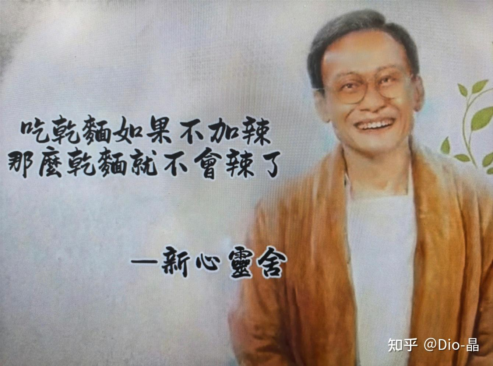
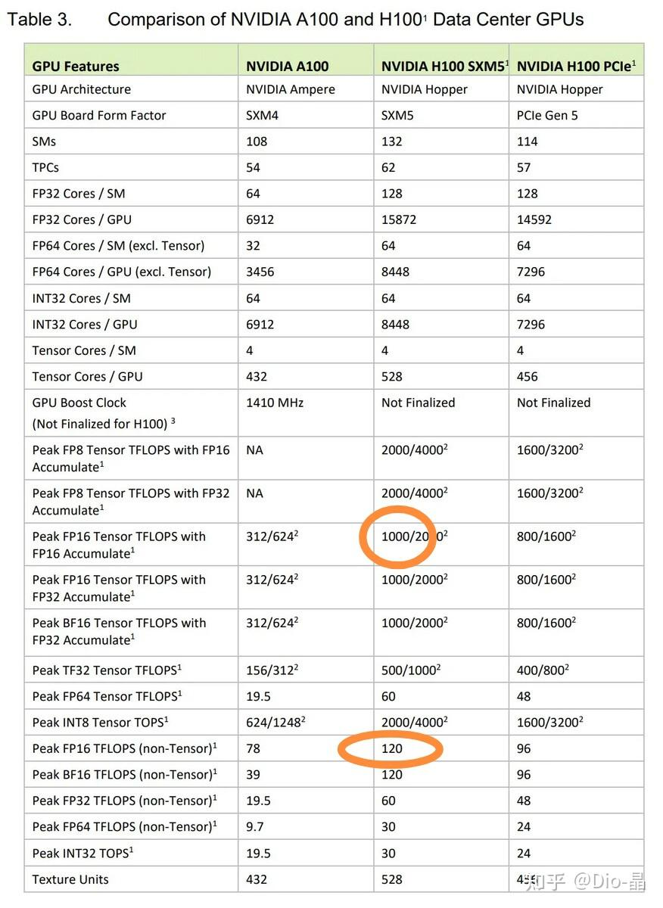
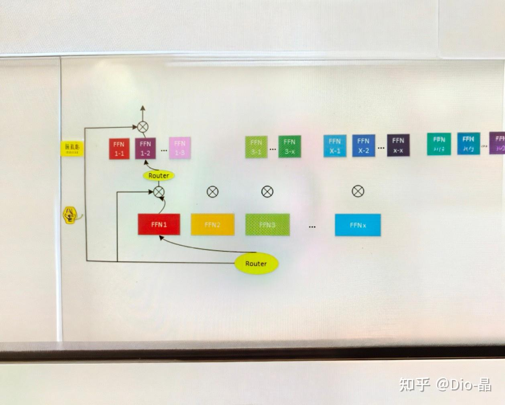

# 民科3：也许稀疏的意义，是它根本没意义

> **类型**: 文章
> **作者**: Dio-晶
> **赞同**: 237
> **评论**: 31
> **时间**: 1734164509
> **原文**: [https://zhuanlan.zhihu.com/p/12618700803](https://zhuanlan.zhihu.com/p/12618700803)

---

民科文，知音故事会，不具有任何代表意义 ：）

曾经，我茫然前行，打硅的路上，AI风，刺痛着灵魂。。。。。。方向感突然一恍，想讲一讲。

---

今天写的这个，源自最近又被安利了一波关于AI的Sparse的发展前景，顺带要在正在做的芯片上支持更丰富稀疏计算的能力的诉求。

啊，其实这是一件好事，等了好久，终于有算法的侠士探头进来说，“脱发的那个小师傅，你能不能把硅铲改成硅耙我再挖挖试试？”

AI的Sparse这个话题可算渊源悠长。。。。。。。

从最初我们认为人脑的20W低功耗源于稀疏，到最近随着模型的增大越来越焦虑的Energy Wall的话题。甚至于，更有那些第一性征的同学振臂而呼，“是时候核算一下了，即使O1-Mini搞定了9x9的乘法，但用一个O1模型做一道数学题消耗的计算量，和它本应该需要多少次计算，到底差了多少个数量级，值得不值得？”

虽然换个口味做做硅耙是很令人开心的，但民科硅匠还是忍不住想给个暴论：当前AI算法的稀疏可能也是没有意义的，耙子没用。

---

啊，首先我们就不该以碳基生物的固有思维和经验来衡量硅基的价值。

Silicon base这个东西，天生就有蛮多反常识的东西的蛤。

例如，我们随手打开一个典型Nvidia H100/A100的Spec来看，如下。

[https://www.notebookcheck.net/Nvidia-unveils-H100-Hopper-compute-GPU-and-Grace-superchip-architectures.609352.0.html](http://link.zhihu.com/?target=https%3A//www.notebookcheck.net/Nvidia-unveils-H100-Hopper-compute-GPU-and-Grace-superchip-architectures.609352.0.html)

整个表花里胡哨，我们就看H100的FP16算力一个东西（中间列），这个算力又分了Tensor和Non-Tensor两个值（后者大家一般都忽略的）。其中Tensor也就是Matrix的FP16算力是1000TFlops（去掉结构化稀疏），而 Non-Tensor也就是Vector的FP16算力是120TFlops，相差了~8x。

我们假定Vector（GEMV）相比Matrix（GEMM）是一种稀疏的计算，讲道理Sparse应该比Dense更具能效对不？

不对的！

H100在Cache 100% Hit的情况下，跑1000TFlops Matrix（Tensor）算力的功耗与跑120TFlops Vector（Non-Tensor）算力的功耗基本上是相等的，也就是其中880TFlops Dense算力是白送的。

同理，如果你再查查B200更甚，2250TFlops FP16 Matrix（Tensor）的功耗与跑大约150TFlops FP16 Vector（Non-Tensor）的功耗也是基本相等的（B200通过把Tensor尺寸翻倍让比值提升到了~15），Dense白送了2100TFlops算力。。。。。。

如果你再进一步，和General CPU的Scalar比一下，同等功耗下CPU（不含SIMD）的算力大约极限是1000Core x 2GHz x 2MAC x2 = 8TFlops，大约18x，这是GEMV比AXPY的倍率，和SMIT的宽度比差不大。

> **民科公式：Matrix如果是M\*M的尺寸，Vector尺寸是M\*1，Scalar的尺寸是1\*1，做成SOC之后，三者算力差是M\*M** **：M** **：1，功耗大致却只是1.2 : 1.1 : 1。**

那些从计算机系下山的大侠们啊，当你们成功把O(n^n)化简为O(nlogn)时，先洗把脸，冷静冷静，我们还得比一下logn和M到底谁大来的。

换直白的话说，如果想要用GNN来替代CNN，当前你至少需要从算法中获得超过16x16=256倍的Flops差才能勉强看到收益，小于这个值的只剩论文灌水的价值，但即使大于这个值了，搞不好明天CNN的大侠又可能会搞个大Kernel、大Batch，又让硅匠把M再扩一倍到2M…..就像B200的TensorCore尺寸。

> **反常识的地方就在这里，你对民科嗤之以鼻，打开GPT的源码说，你看，明明有70%的weight都是0，这不就是稀疏么？ 对，即使70%的零，使用TensorCore做Matrix计算依旧比化简算法用Vector划算得多（白话：就算你看到大量的0，嗯70%，依旧不值得把Matmul算子改成SIMT）。**  
> **反过来，大侠们，如果你能够把一个Sparse算法回退到Dense，硅匠能白送你M倍的乘法算力，白给哦。业界确实也有人用TensorCore来算GNN或SPMV的，稀疏度没高到CSR级别的话，真的赚哦。**

在硅基上，Dense的Compute Flops在某些时候有可能是近乎白给的 ：） 其原因是硅基上Data的Move功耗早已远大于Data的Compute功耗，只是算法的大侠们往往只关注Compute的表层数值罢了。

硅基的Dense是免费的，这个基本特征是整个Nvidia GPU（及其他DSA）成为AI Training最佳选择的根本原因，生命与环境之间，相辅相成，互相选择，在硅基的武林，Dense的CNN派打败了Sparse的GNN派，并最终诞生了最适配M\*M力量的Transformer大魔王，**并构筑了当下既有的硅基生命的智能结构的既有事实**。

PS1：我知道会有进阶的同学指出Vector Unit支持更Complex的运算符，datamove也更麻烦，我当然也知道，但Sparse本身就伴随着Divergence，等价的，稠密变数少，稀疏变化多，体系结构这么多年了没有免费午餐也没有冤大头。sparse tax。

嗯，业界也有很多所谓结构化稀疏，其实都是偷鸡。如果结构化稀疏能节省一半的数据读取，收益很大，如果不能节省数据搬运，仅仅省算力的话，结构化稀疏收益非常非常低 ：）

这些是没打过硅的侠客们，无法理解的。就像我再举一个例子，最近FP8很火，不过若要FP8算力做到FP16的2x，但功耗其实是大约1.3倍（和N的1.1倍不一样），2/1.3=1.5倍这就是AI Low Precision的硅基收益率，算法的同学知道为什么吗？衍生这个答案再打个哑谜，这个收益率仅限于类似Nvidia的内积Tensor结构，如果用外积Tensor（ARM SME），则FP8收益率很可能降低到1.2~1.3（甚至不可实现） J。

没真正画过Silicon乘法器结构的很难猜出来的，O(∩\_∩)O哈哈~

为什么提到FP8呢，其实低精度也是稀疏的一部分，这是从AI的结构（下一段解释），在算法无法获得把硬件Matrix变Vector变Scalar这种级别并且跨越M阶数的稀疏时，采用的一种挤海绵方式的稀疏：） 这有效，但硬件还是保持在Dense。

PS2：题外话，麻烦叫我们硅匠，而不是硅工。

---

但毕竟当下Scaling Law在变缓，Energy Wall在高耸，环境再恶劣也许也有出路？人定胜天嘛。

那AI到底有多少可以稀疏化的优化空间？能不能跨过M的鸿沟？

两个月前，图灵奖得主Jack Dongarra有一个演讲《New challenges of distributed and parallel software in the AI era》：“经典密集矩阵计算的事实基准Linpack，与今天的实际应用的性能不再强相关，设计一个具有良好Linpack性能的系统，可能对今天的实际应用来说是错误的选择。例如当今的顶级高性能计算中心，软件仿真的主要负载是3-D PDE的稀疏矩阵计算，而不是稠密矩阵计算。在TOP10的高性能计算中心，新基线测试HPCG（包括了稀疏与密集计算、通信的模式）只能达到1-3%的峰值性能，与纯密集计算50%的峰值性能相去甚远，这是软件优化的新挑战。”

这不是什么新概念，是HPC的历史，而他是想用HPC的历史来推测AI的未来的。。。。。。。虽然我也不敢把话说得太绝，但我毕竟曾经干过基于AI的Dense趋势逆水行舟，反向在HPC领域增强Dense算力价值但未遂的黑历史，所以对这两者之间的差异是有一点点感触的。呵呵，如果这两者具有本质上的差异，那么未来改变不了历史，历史也映射不了未来。即使HPC的历史是一部从Dense走向Sparse并且看上去跨越了N鸿沟的故事，但AI也许并不能。

暴论：我认为当前的AI算法和HPC算法基础不一样，无法复制HPC从Dense走向Sparse的历史。

知识的本质是事物的结构和关系。

所谓AI算法即压缩，就是寻求知识的最简的结构和关系并表达出来。如果要更民科地表达，这是在求解：“**我的邻居的邻居是（否）我邻居的过程**”，世间万物皆可以此表达。

HPC是基于确定性的F(x)在不断优化最优解方法，是基于已知的知识（已知结构和关系）下对某个Special Application求解，已知的表空间结构+Special是把Dense化简为Sparse的来减少F(x)中需要的计算量的基础条件，**HPC是基于确定性解决单一问题。**

但AI却是基于不确定的F(x)，通过穷尽Application的方式，在一个高维隐空间中对已知和未知的所有知识进行结构和关系的标注（Embedding）的过程，**AI是基于不确定性解决普适性问题。**

**HPC与AI，刚好是在计算天平的两侧。直觉来讲也是，泛化是均匀且密集的，专用则单调且局部的。**

在3维的城市里居住，毫无疑问，我邻居的邻居也算邻居，但这事在N维的高维时空中则完全不成立，维度太大且复杂，低维可以显性分类，而高纬空间要证明N维空间两个点的相关性，没有办法用再使用表空间的显性分类逐维计算的，只能定义一个N维的隐空间，通过空间的转换到一个相对对称的隐空间来做并发性的多维计算。

即就算我们知道A和B的知识在表空间是正交的（稀疏的意义），也没法在隐空间中直接给出划分（正交的信息无法传递给隐空间），只能让高维空间中的坐标通过数据的隐信息不断修正和逼近A和B的正交，最终的隐空间可能确实存在稀疏，但这是果而不是因，也许某些推理能够通过裁剪得到稀疏，但训练不行，并且推理的裁剪也因为训练的不确定性而变数极大导致无法进行确定性的稀疏。

因此，我们只能假定所有的知识之间全部都是一定程度的邻居，然后通过无尽的数据来修正，一点一点的修改相邻度，最终让所有用户在对称隐空间以对称或不对称方式寻找到自己的位置，然后通过坐标来计算相互之间的邻接距离。这个足够大且全相连的预设隐空间，只能是全Dense的假设空间。

Scaling Law之所以好用，也正式因为在一个超大Dense的隐空间做Embedding，那天底下任何F(x)也都能够被这种方法通过Scaling Law扩大空间尺寸来拟合了，大模型是F(x)的泛化而不是某个F(x)的特例。

Scaling Law之所以又不行了，这么个超大空间的的维度爆炸问题解决不了了。明明一个超大FC空间就能拟合的事情，还把Attention拆分为Multi-Head、FFN拆分成若干Layer，再拆分若干MoE，本民科的理解都是在解决维度爆炸问题的各种手段，而这些解法越来越难了。如我前面的民科疑惑。

[Dio-晶：民科1：我怎么有点觉得当前的AI算法，通不了天啊](https://zhuanlan.zhihu.com/p/720274928)

当下的AI算法（硅基智能）选择了Dense，这是从Embedding的选择就开始了。当我们把一个object表达为高维的正交向量时，就已经放弃了维度之间关系了。在AI的Embedding中，不存在“爸爸的爸爸叫爷爷”这样的维度关系，只存在爸爸Yes/No、爷爷Yes/No、及可能的Bias约束这种并列但Dense的关系。爸爸和爷爷的关系必须在通过FFN计算点积相似度才能获得。

PS3：我个人觉得吧，其实所有的差异，所谓表空间、隐空间，所谓AI的不可解释，都源于硅基与碳基之间在计算上类似Dense与Sparse的基础差异罢了。碳基用一种人脑的碳基计算架构来表达知识，例如什么是猫、什么是狗，我们是碳基所以叫表空间。而硅基用了适合硅基芯片计算架构的一种空间结构和关系来表达什么是猫、什么是狗。这两个空间结构也许有一天可以殊途同归（都是来表达“我的邻居的邻居是（否）我邻居”），但当下，两个空间互相是没法直接转义和理解的。你觉得很简单的猫狗判决（某种稀疏的逻辑），在硅基的Dense里就不是那回事。

PS4：高纬正交向量的表达的稀疏，某种意义上是可以采用低精度来获取的，低精度是全映射下像挤海绵的水一样的策略，举例就是一个FP16的模型降精度到FP8，可以推测其稀疏度（0的比例）也随之下降，大致就是用信息量不变下挤压网络的结构来的压缩，很有效 ：） 但快挤得差不多了。

不过，等等，你要这么说我就不困了啊，那算法上的KV Cache的稀疏算什么？ MoE不算稀疏？

算！

AI有没有稀疏？

有有有！

> **如果知识的求解是：“我的邻居的邻居是（否）我邻居”的过程。即使表达这个答案的空间结构不一样，但求解这个过程本身就存在两种范式，一种是通过坐标计算两者之间的距离，一种是不断聚类分割寻找到相似的群体。**

嗯，民科的脑回路很简单。

类比一下，和向量数据库的算法也挺相似的，向量数据库包括：

1. 直接对向量进行暴力的距离计算和排序，也就是各种向量矩阵乘、排序，并存在高维空间维度爆炸的难题；
2. 类似Hierarchical Navigable Small Worlds (HNSW)，基于某种临近关系把邻居分组，来在多层之间逐级查找，也就是分层跳表，树状搜索，但问题会出现在很难表达高维相关性，假设第一维按男女分了类，那么再向下搜索LGBT就变得困难了（仅举个例子，不代表算法）。

1是Dense，2是Sparse。和AI的问题是一样的。

那AI算法中“我的邻居的邻居是（否）我邻居”是否能通过HNSW类稀疏算法来分割呢？至少当前这事是没走通的。主要的屏障在于：1、空间维度太大；2、表空间和隐空间没有简单的映射关系。

1. 所谓维度太大，在于Embedding的高维，那么在X1、X2、X3维也许A和B的距离都是0，但到X32维可能就存在巨大的距离，那A和B到底还是不是邻居呢？ X1和X32的判定优先级又是什么？本质是还是Embbedding的表达，用足够高的Parallel Orthogonal Dimension来事物，缺乏了对非正交信息的描述（Embedding的每个坐标之间缺乏Dependency）。
2. 所谓映射关系，即我们作为碳基生物通过某种学习知道了A和B，一个是鱼，一个是鸟，这是碳基生物的表空间里很典型的聚类，但这个特征又怎样表达给隐空间呢？没法直接写到FFN里面去。嗯，碳基的所学，没法用Teach的方式传达给硅基。

在我的民科世界中，正是因为这两个原因，导致了当前基于Dense思路发展起来的大模型，做Sparse困难重重。

如下我个人的民科理解就特别单纯：

- MoE是稀疏，那正是一层的HNSW（通过训练得到的隐空间聚类），并且因为很难训练隐空间的深层聚类，导致当前看到的MoE通常都只有一层，即浅层隐空间。
- O1模型的COT也是一种稀疏，但是它每一次思维链的递归，大概率当前的算法都会回到浅层隐空间或者表空间（甚至调用搜索引擎来判决），没法做到真正的隐空间递归，所以o1在效果上更倾向于数学（表空间聚类特征明显，正交度高），而不是逻辑的推理。
- KV Cache是稀疏，这是一个特例，因为这种稀疏的源头是时间，所谓花有重开日，人无再少年。时间是所有维度中唯一的例外，这一维度无论对硅基还是碳基都是对等的（也许感受不一样），所以碳基的表空间对硅基的隐空间（时间无关性空间）能够建立起一定的递归映射关系，所以时间维度在无论在硅基和碳基的稀疏都是存在的，但也只有时间这一维。嗯，KV的稀疏性是长期且稳定的存在，这个地方是真有可能找到超越M的空间。

**当前这些稀疏，除了KV之外，都无法获得能够超越M阶数值得改变算法的Dense2Sparse计算范式**

当然话也不能说得太绝对 ：）

就拿MoE来看，我的理解是它是通过训练获得了一层隐空间的聚类，我也很好奇，有没有可能训练出多层隐空间，至少碳基的逻辑推理是存在多层递进的（虽然碳基学习的过程也挺难）。多层的MoE，更加的稀疏，从碳基的眼里看上去更像碳基 ：）

**如果走这一步，也许有超越M阶数值得改变算法的Dense2Sparse计算范式诞生，但至今未出现。**

会不会是卡在SDC上了？这也是个硅基的生命特征。

想不了那么多了，管他呢 ：）

生命终究会找到自己的出路，回头看，却像命中注定。

Sparse是人脑想出来的，必然是关于世俗之物，一昧的追求世俗向往，那是.......

Dense，不好吗？

---

*由知乎爬虫生成于 2026-02-01 15:39:00*
