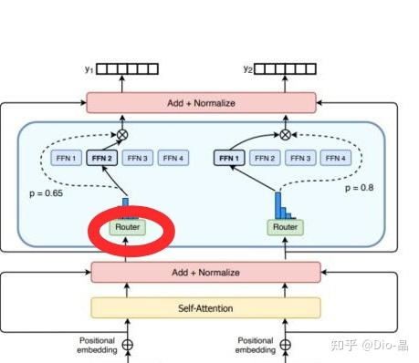
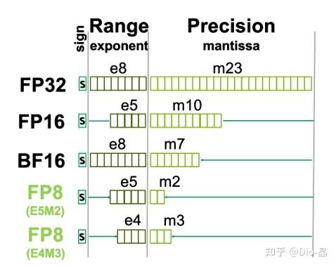

# 民科2：不使用MoE，非不为也，实不能也

> **类型**: 文章
> **作者**: Dio-晶
> **赞同**: 202
> **评论**: 40
> **时间**: 1726661168
> **原文**: [https://zhuanlan.zhihu.com/p/720758034](https://zhuanlan.zhihu.com/p/720758034)

---

继续写民科 ：） 进入瞎扯淡模式。

上一篇文章《[Dio-晶：民科1：我怎么有点觉得当前的AI算法，通不了天啊](https://zhuanlan.zhihu.com/p/720274928)》挺民科的，可能我数学确实不行，又买了《线性代数的几何意义》再看看，有人告诉我GEMV是个仿射变换，但我理解FFN是索引不是变换啊，算了，内积就内积吧，几乎所有AI挖矿的男侠女侠都并不觉得卖的铲子有啥问题，反正能用。想想也是，《玉女素心枪法》的关键是玉女素心，枪或剑并不是关键对不？《五虎断门流星锤》感觉听着也还是挺唬人吧 ：）

来民科一把MoE。

嗯，Llama3没使用MoE，好像Mistral的Large2也是Dense，不是MoE。 Llama3的官方说法也就一句话“考虑到Dense模型训练更稳定，所以选择了Dense结构”，何为“稳定”，何为“更”，没有详细解释。当然，也有好事的同学在帮忙说明，“MOE的主要作用是降低模型训练及推理成本，从效果上比较的话，同等规模的MOE是肯定干不过Dense模型的。”大哥，这是疗效，和稳定并无关系 ：） 那，就容我冒昧了，作为造铲子的硅匠，我想来给个非常简单且民科的答案，MoE的大模型训练越大越是无法收敛。不复杂，大概2000字就能写清楚。 MoE，非不为也，实不能也。做不下去了。

**那本硅匠不妨再起一议：MoE缺乏稳定性的原因是铲子的SDC（Silent Data Corruption）问题。**

我对SDC的认知，最早是在2019年，回想起那还是大晚上的在路边吃着鸡煲宵夜，突然就被拉入XX会议，“什么，你说YY的CPU4计算某个乘法函数会极低概率会出错？能重现，但跑自检程序又是Pass的。啊，难道最近太阳耀斑爆发？”。。。。。。。再然后我就知道了SDC。

计算机会算错数？ 计算机还能算错数？ 就是会错！还是悄咪咪的算错值！

我刚开始也是很惊讶的，后来自研处理器卖得更多了些，慢慢就习惯了，喏，在2021年还写过一篇类似的民科《[Dio-晶：我就蹭蹭热点（2）](https://zhuanlan.zhihu.com/p/383074778)》

你买个显示器偶尔也能遇到黑点不是，计算机作为工业制造的大量电子器件的集合体，是符合制造业固然有制造缺陷存在的规律的。

不过，正常的CMOS数字电路，基于DRC Rule脱离了场效应，基于PVT的Constraint保证了电路在工艺电压温度波动下的稳定性，在加上出厂时有CP/FT等等远超显示器等模拟器件的测试方法和覆盖率，所以我们通常认为大规模集成电路的可靠性远大于普通低密度电路板级的设备，这挺反常识的，但结果是如此的，正常集成电路的缺陷率是很低的，你说有器件失效我信，上电自检或者复测一下确认就好，但SDC？ 最初我看到SDC存在，也是满头问号的。

但确实存在某些电路，存在制造上的缺陷，而这种缺陷用通常的测试方法无法充分覆盖，最终流入产品，并且在某些非常特定的组合条件下被激发，就是SDC。

到2024年的今天，我对SDC的理解也在逐渐超过2021年的我了，我当前认为，SDC和乘法电路相关度很大，乘法器比普通的控制电路更加容易出现SDC，这个逻辑特别重要，因为这和AI关系很大。

因为CMOS电路是一个开关逻辑，本身就不是为计算而诞生的。让MOS管这种二元开关电路做乘法，需要解决离散数学、量化、溢出等一系列问题，而在自然界、甚至原始器件中，乘法本身就是个信号放大器，不应该这么复杂。

那用MOS管算多bit的离散数据的乘法，有什么问题呢？ 其实就是逻辑组合空间超级大，嗯，又是一个高纬空间问题。任何事情，复杂度高到一定程度之后，就会存在破绽。CMOS电路做控制电路，通常的条件是if、else if、else，这是一个树状的电路逻辑，但乘法不是，乘法是幂次方的组合，2的16次方是65536，H100的TensorCore有16x16x4个FMAC，而一次FMAC需要两个FP16数据输入，那么就需要（65536x65536）^1024种乘法才能遍历一个TensorCore的所有输入输出数据的组合。算法的同学应该能理解吧，树形结构的电路是比较容易通过测试用例进行相对完备遍历的，而幂次方的组合电路要遍历那是没可能的，而没法做遍历测试的结果，就是多个器件的关联组合路径（Cross Trigger），如果其中存在的制造缺陷并不会被检出，就只有你跑到某个Pattern时才会触发，所以SDC表现为低概率、能重现、数据Pattern相关。

所以SDC的原因：工艺的演进让逻辑规模变大，并且微缩让PVT的Margin也在缩小，AI驱使大量的CMOS组成复杂的乘法器件让Cross Trigger类制造缺陷难以被测试筛除。

以我粗浅的数学理解力，怎么看SDC都无法避免，也不可能清零的。

---

**问：SDC的概率高吗？ 答：如果观测就高，如果不观测就低。**

**薛定谔的猫。**

真的就是如此，我手上某颗芯片的发货比例中，A产品占~5%，但是关于SDC的报告大概有95%来自于A产品线，为啥，因为因为A产品工作场景苛刻，对计算结果有校验机制。

万懂之王特朗普老先生就说过，只要不检测，就没有新冠，越检测新冠越多，一个道理。

懂的同学自然懂 ：）SDC的真实概率比你想象的还要高。但因为没有真正的统计值，所以这个并不完备的概率也只能估计。。。。。。甚至我觉得Nvidia的老黄可能也并不清楚真正的值。

PS：和新冠是一样的，如果需要一个什么值，包括概率、原因、分布等等，PPT上总是能凑出一个满足他期望的值的。

不过大多数时候，这事真不严重，我发现软件对计算结果感知并不是想象中大，真的，反直觉吧，很多人不信，但确实如此，控制类电路其实很少有SDC，偶尔预取或者分支预测错误也不会出啥错。而容易出错的计算部分，大多数的计算即使带着SDC的错误往往也都pass了，你想，一个浮点数，本身存在离散数学的分布误差，偶尔错一个bit，特别是尾数，不影响，真不影响。而且即使错的多了些，那真正重要的计算结果，客户必然会验算，如果不验算，那么结果也不会有那么重要的影响。就像新冠存在大量的无症状一样 ：） 真的，我也是慢慢才接纳这个认知。

---

说这么多废话，还没一句话到MoE。。。。。。。。。

下面进入民科结论阶段。

我最开始发现MoE和SDC有关系也算是巧合。我权限比较高，偶尔会去统计一些数值（纽约下水道管理员）。然后就发现，上报SDC的case中含MoE的字样特别多，最初我也不觉得有啥，可能MoE模型本身趋势强烈呗，直到我确认一个用MoE和一个不用MoE的两个客户，前者对SDC敏感高（而且感觉上MOE的人更喜欢拿棉签捅喉咙），我才推出这个民科的结论。

**民科结论：SDC的错误，在MoE的Router上的错误影响度可能是其他错误的~10000x以上。**

我猜测这就是Llama3没法训练出MoE的原因，规模越大问题越大，其他人，若训MoE推测趋势可能相同，就这么简单粗暴。

整个结论从前到此，存在三层逻辑，每层逻辑存在密接关系链，但都没有明确的数字证明。

就如今天的新冠，信则有，不信则没有。

---

其实这事也不是无解，我曾经提了个解决思路是做ASIL-D的Dual Core Lock-Step，AICore支持双核锁步执行一个算子，硬件校验计算正确性。正常执行时不锁步，算力不变，执行Router算子时锁步（算力降低到50%），保证Router算子的绝对正确。。。。。。。小李飞刀，对面是上官金虹咱能不能飞两刀？

但这个思路我推广了一圈，没人愿意接受，没人能够承担如何识别不能错误的关键算子及部分时间算力打五折的损耗。

**客户所有关于SDC的诉求，最终还是汇聚成两个字：清零。**

清零也不是没有办法。。。。。。。。新冠不就清零了

先抛出另一个耸人听闻的变异问题：FP8做大模型训练有可能也是有问题的。

看完上图，对数字敏感的同学可能已经反应过来了。

每个浮点数的bit position对错误的容忍程度是不一样的，指数错误的影响程度是尾数的100x以上吧（毛估）。 FP16中对SDC敏感的指数占比是6/16，而FP8中SDC敏感指数上升到6/8。

很简单的数学，先不看算法和精度本身的差异，SDC造成FP8的模型训练不收敛的概率是FP16的100x。

AI计算对错误的容忍度其实是很高的，无论是Meta还是OpenAI，其实都是带着无数SDC错误训练出了优异的模型。

**AI模型的算法也是在不断进化，本身随着精度的变化，其对错误的容忍程度也在不断提升，如果某一天FP8真的把大模型训出来了，那本身就证明模型的容错能力的进化了。**

**你可能知道我要说什么了：） 确实，用Dual Core Lock-Step并不是治本的策略，算法本身的容错性的不断进化可能才是生命演进的正途，而MoE如果不行，那就是被淘汰了呗。**

**新冠，新冠。如果最终大家都进化了，让它变成一个感冒，最后不也清零了。**

**嘿，我估计，如果FP8如果能训练顺利，算法这么耐操，搞得不好模拟乘法器就真可以走上舞台了。**

---

*由知乎爬虫生成于 2026-02-01 15:39:00*
