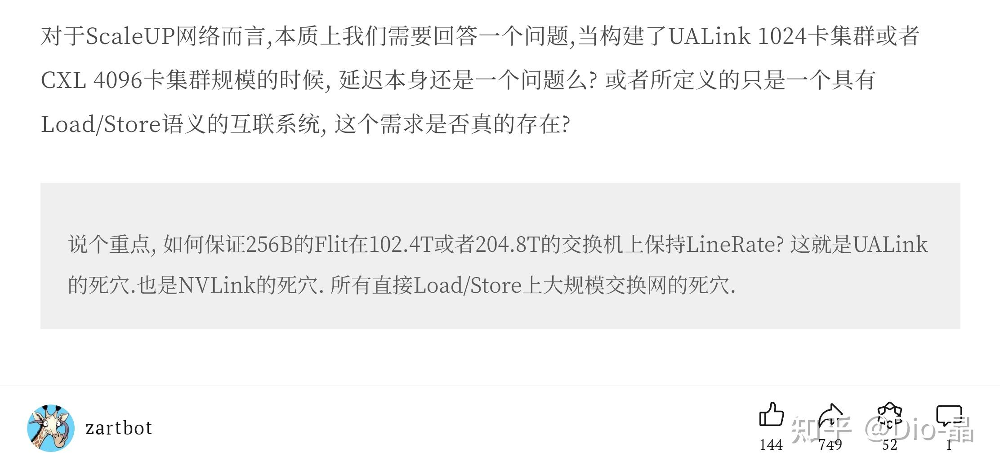
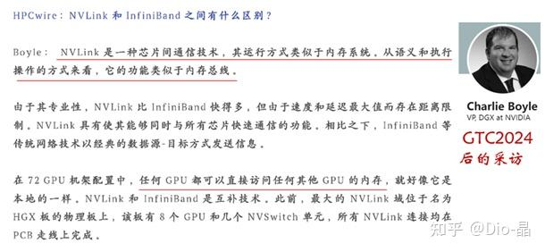
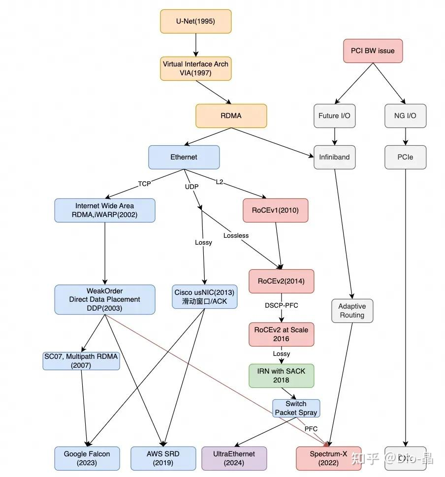
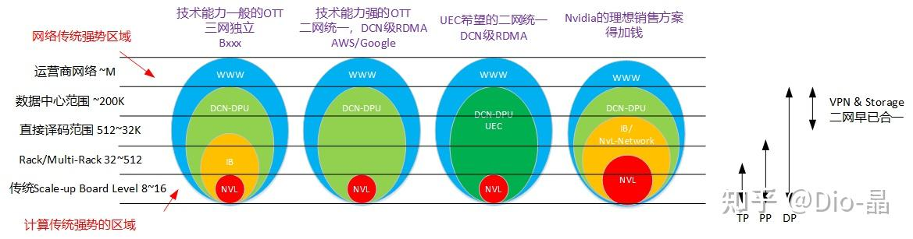
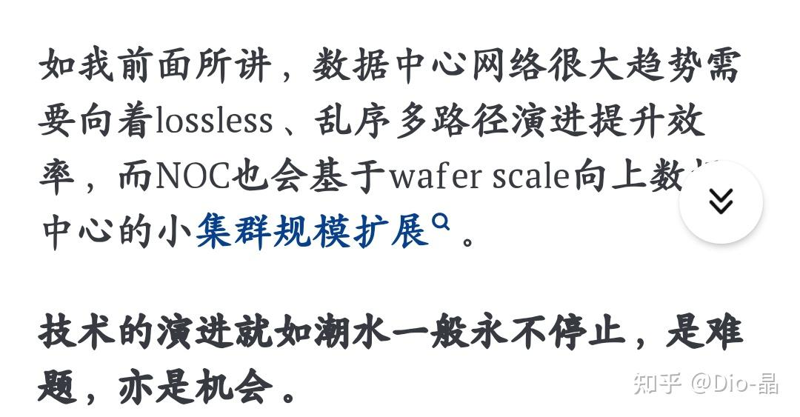
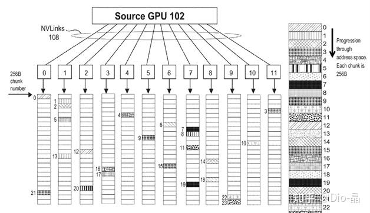
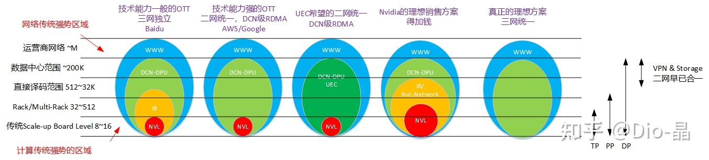

# AI fabric is a bus or a network？

> **类型**: 文章
> **作者**: Dio-晶
> **赞同**: 642
> **评论**: 108
> **时间**: 1720959790
> **原文**: [https://zhuanlan.zhihu.com/p/708602042](https://zhuanlan.zhihu.com/p/708602042)

---

今天周日，宜洗脚、玩手机。

在AI的互联里一直有一个谜题 ：） 节点之间到底应该是用什么方式交互。有说Direct Load/Store/Atomic的，也有说RDMA的Read/Write的，更有在Actor之间用某种间接Message的（Tenstorrent）。

Nvdia的Nvlink包括GH200、NVL72，号称一个as a single GPU，都是基于内存语义Load/Store/Atomic的。但在Nvidia之外，周围大多数同学都对此是反面意见的，例如大网红Zartbot，如下《再谈谈三万亿的破绽》。

[再谈谈三万亿的破绽](http://link.zhihu.com/?target=https%3A//mp.weixin.qq.com/s/2ZrD-FqHeYy9zA7FM_bYXg)

**死穴！ Load/Store是走向死穴的死路一条！**

哈哈，我不是为了反对他才写这篇文章的啦，Zartbot写得挺好的，从他屁股所在视角是没错的。

我觉得吧，党内无派，千奇百怪。吃个豆浆都能分出甜党咸党，那在AI这个新领域下，存在计算流派（计党）和网络流派（网党）的两种技术一定程度截然不同的视角也一点都不足为奇。

东方有诸子百家，西方有雅典学派，那都是人类历史思想最为爆发的高潮，我个人也是比较喜欢这种有竞争合作、保持新陈代谢，那种具有活力和生命力的环境的，并期待其随着成长演化的过程逐渐变得成熟，并形成适者生存或者相互交融制约的最优解 ：） 黑猫、白猫，也许是黑白猫。

---

不知道你是否也常常会八卦一些趣闻 ：）

1. 去年我私下的渠道告知我，NV原生的Nvlink团队和外来的MLX的团队干起来了，Nvlink要赢。
2. 但今年初另一位大神说他收到的消息却是nvlink收归以色列了，而且NV的NvSwitch要和IB Quantum整合为一颗芯片了，我心里就嘀咕，卧槽，风向反了啊，居然被干翻了。
3. 而到黄老板上了GTC时，告知大家的却是IB的Quantum和Ethernet的Spectrum合一。
4. 当然老黄作为大Boss在GTC也侧面暴露了另一个信息，Nvlink-Network的声音消失了。
5. 有一个小Trick，带Nvlink-Network的NvSwitch架构会有点像IB Quantum Switch哦（都没有Shared Buffer），但如果去掉Nvlink-Network的NvSwitch，则就稍微疏远了些，此时IB Quantum则更像ETH Spectrum了。
6. 这事应该还没完。。。。。。

喜欢甄嬛传的同学不妨脑补其中的斧声烛影 ：） 老黄的地位差不

Nvlink是GPU的Fabric，它是一个计算域的Bus，主推Load/Store/Atomic，妥妥是计党的手笔。

Ethernet是DCN大网的承载体，它是一个Network，以TCP/IP的复杂网络协议为基础，原生的网党。

而Infiniband是一种非常奇葩的东西，它应该算一个Network，但为了达成一些目的违背了Network的很多原则导致网党有点看不上它，而计党呢，算是需要的时候拿出来爽一爽，不需要就爱答不理的态度 ：）它的固有问题导致在Nvidia内部它应该也活得不好。

故事归故事，但所谓的计党网党之分，本质都是个历史遗留的原因。

过去ICT行业是分层解耦的，在业务上形成了比较清晰的界面，BRCM、CISCO是网络公司，Intel、Nvidia是计算公司，基于相互之间的标准化接口再在HP等集成公司组合为系统，那么接口之外，各公司就在各自的领域独立发展积累，并形成了知识的碎片化。而随着AI的大发展，原有的界面就成为了掣肘，需要打破重新融合，所以大伙儿才凑到一起，掏出各自裤兜里珍藏的宝贝，姿势上有些对不齐，也很正常：）

中国的科技公司分布的行业和历史，基本上也在决定国内流派的力量分布和倾向性，因为国内做计算的人和历史积累都远少于做网络的，右倾相当严重，就像Zarbot同学，当然还有更甚的，嗯，说得就是那个直接用ETH做Scale-Up的ETH-X。

写下此外，也希望同仁们能基于知识和背景历史渊源，相互理解各自问题的出发点和视角，有所不同，所以能更加倾听和换位思考，兼容并包，理解万岁。

注：本文的Load/Store/Atomic是指物理链路上的行为，即在内存语意空间，包括xpu core的同步Load/Store/Atomic和dma（含nv的tma）的间接Load/Store/Atomic。这是硬件侧视角。软件侧视角往往存在重新包装调用，很多时候dma的Load/Store/Atomic都会被包装成Read/Write/Send语意，某些时候xpu的Load/Store/Atomic也可以对上呈现为Read/Write/Send，例如shared memory的mpi。

---

网红大咖Zarbot不知道哪儿搞得一张图很有趣，我不确定这张图是否完备，但要我来说这张图实际上是网络从1995年互联网爆发期就开始进入计算领域的历史记录，腹黑一点，就是网党入侵计党的经略沙盘 o(\*￣)￣\*)o

Zarbot是个妥妥的网党 ：） 因为要计党来画经略图，那应该是从IBM Power GX Bus开始，然后是Intel QPI/UPI、AMD hypertransport/Infinite fabric、Nvidia Nvlink的故事（最边上也是CXL），其中还能涉及耳熟能详的那些人，Jim Keller就是其中重要的贡献者。嗯，有空我画一个 ：）

## **大家都是在努力解决计算的扩展性问题** **：）** **这是主要矛盾，其他都是次要矛盾。**

原本的计算，就像在一个小屋子里，一家人开开心心吃着火锅唱着歌，一不小心爆人口爆得有点多，一个房子住不下了，所以得分家。

- 计党讲究亲情，就是再怎么分家也得过得跟一家人一样，即使是两套房、四套房，大家都得过得和以前一套房一样，对齐、打通，无论代价有多大。
- 网党啊，毕竟是外人，看着计算总觉得人长大了都得独立，什么，写信都不行，得，给你加个电话差不多了，这就是RDMA。（原本的网络通信，是像发送邮件一样，相互连姓名样貌都不知道，只有一个ID地址，要的就是无论路途有多困难，加西亚一定得把信送到。而RDMA，其实就像是电话，让家人们知道互相的状况，拨号建立链接，还能听见那亲切的声音，能煲）。

从两种出发点来看，两党的主旨就很简单。

- 计党的好处是更亲和、提升BW/iops更容易些（原因后讲），限制就是规模（扩展的代价大），代表性的就是而HCCS、Nvlink、XALink；
- 网党的好处是扩展性，坏处则是交流上隔了一层，提升带宽代价高不少（后面比较），代表性的就是IB、RoCE、ETH-X、UEC（美国内部也是XAlink vs UEC的计网两党的）；

业界有时候会把两者称为Scale-Up（计）和Scale-Out（网），UEC还特意搞了一个三级分层的定义，Type3 Scale-Up对应AI的TP层，Type2 Scale-Out对应AI的PP层，Type1 DCN对应AI的DP层。看着很清晰，其实乱的一批。啥时候一个AI模型就被这样分割了，啥姿势算是Up？ 啥姿势又算Out？所谓计党网党，不过是技术流派之争，吵吵闹闹也互有融合妥协，这标签一打下去，直接画地为牢了。

业界确实也有类似三层分层现状，主要还是RoCE的各种问题很难解决（少部分OTT能解决，所以Zartbot的图上Google/AWS是和UEC并列的），相当多OTT没有办法有效在ETH上运行高带宽的集合通信，所以不得不增加了一层Infiniband（其实问题很大），UCE强调这个，其实是先证明Infiniband有价值，然后再替代IB的路数。

我们在商业面当然也可以学学UEC讲Type1/2/3及统一的故事，但是技术的同学建议就不必要了，被条条框框一套上，这思路就被锁死了 ：）

**懂得自然懂，统一牌公交车，坐稳，发车**。

---

站在计算的角度，点评一下过去网党征伐计算的战绩 ：） 也就是RDMA这个战车啦，这仗真心说打得挺烂的，靠IB在HPC领域撑住了场子，但DCN领域的空间一直没打开。

RDMA最大的困境，在于如何解决**Lossy**和**Out-of-Order**的主要问题（后者包括多路径和重传），以及上下文爆炸的次级问题。

这两个问题和网党原生的主旨，也就是扩展性是具有强烈冲突的，规模一大，复杂了，不可能不丢包不乱序。而这些问题在计算领域又是无感的，本来无一物，何处惹尘埃？

嗯，我2020年刚开始搞RDMA的时候，也觉得很矛盾，所以还写了篇小文记录心路历程：<https://zhuanlan.zhihu.com/p/295368691>。

乱序其实对计党很轻松，因为计算内部的NOC都是乱序的，“什么？ 必须保序？”，“脱了裤子放屁”，原生的计党都认为网党处理不好乱序就是菜，所以我也觉得合作一下，乱序不难解决。

但所有原生的计党，都不理解网络为什么一定要丢包 ：） 包括我这种还制定过接口协议的在内。“不丢不行？”，“就不能处理一下？” “压着一下啊？”......

所以，当时我认为Out-of-Order可以搞定的，但Lossy还是不行得，还得Lossless ：） 这事最近被Zarbot嘲讽了。

**他嘲讽得对，真男人就应该硬钢Lossy和Out-of-Order。**

做Infiniband的架构师大致和我是同样的观点，所以搞了一套私有网络，核心就是基于Credit的Lossless（不硬刚Lossy），这事儿要上纲上线吧，就是妥妥的网党叛徒，这种私有网络及Credit机制，就是典型对网党的主旨：“扩展性、兼容性”的背叛嘛。在加上IB的流控机制适合于非确定性小流量，对AI的确定性大流量也并不友好，所以，IB不应该是AI互联的答案。

题外话：IB交换机和ETH交换机架构差异蛮大的，前者是Non-Buffer的，后者是Shared-Buffer结构，而Nvlink交换机也是Non-Buffer结构，所以我最初也猜测Nvidia确实可能选择合并Nvlink交换机和IB交换机，但最终不知道出于什么样的决策，也许是链路层上Nvlink的Load/Store和IB的Read/Write行为差异更大？或是什么非理性的原因？ 导致了IB和ETH的交换机合并，至于Buffer，那大概率也是用Chiplet了，把Shared-Buffer做成独立Die拼接了。

RoCE则是比较尴尬的感觉，保留了ETH上的扩展性、兼容性，算是根正苗红，但Lossless和Orderring的问题还是得解决啊。

业界也有一些解决方案，例如PFC什么的，看上去很美，实际上真的就是瞎扯淡，现网问题单挂着呢。。。。。。就XXX集群，开PFC，用A家交换机没问题，切换B加交换机有问题，怎么定位？头大，网络仿真仿的也是个寂寞。

不过，AWS、Google号称是解决了RDMA在ETH上的Lossy和Out-of-Order，也许还是RoCE，也许完全不是了。UEC也在走同样的道路，硬钢Lossy和Out-of-Order，估计也得魔改RoCE。

**为什么讲这一段废话呢，因为我感觉，要真正解决网党的困扰，Lossy、Out-of-Order还有RDMA的Context Size，你需要一个计党带路，暗度陈仓，额外还让渡了一部分计党的利益（注：当前很多新协议解决Context Szie，即QP爆炸问题的本质就是更深入计算并兼并了部分计算的利益获得的）。**

---

好，不装了，摊牌了，我是计党。

计党一直致力于解决更具亲和力计算总线（Bus）的扩展性问题，把Load/Store/Atomic扩展到更大的范畴，希望发挥出其计算原生的价值。

**计党的主张也需要有网党的人来带路，并且让渡部分网党的利益，才能做成。**

Nvlink是一个Bus，其承载的主体也是Load/Store/Atomic，虽然其lib也会出现Read/Write/Send的DMA语义，但这是Bus内部语义，相当于，在Nvlink上体现的行为还是Load/Store/Atomic。

我特别关注Nvlink-Network的发展情况，因为这也是Nvidia的计党在扩大Load/Store/Atomic规模上的一次努力，当前Nvlink-Network的状态，是因为没有获得MLX的网党带路？还是说出现了什么不可逾越的困难，其中关键都是计党非常关注的。

## CPU/DMA的Load/Store/Atomic相比RDMA Send/Read/Write的独特价值是什么？

**No1：Load/Store/Atomic相比Send/Read/Write的特征是Smaller Granularity & Higher IOPs** **。**

首先，得回到最初始起点，计算应该是Dense的还是Sparse的 ？

我们都会说，当前的AI相比人脑20W具有巨大的能量浪费，LLM的Attention计算是高度稀疏的，每个token推理只需attend到少数历史token，FFN的矩阵计算，其真实的激活也是高度稀疏的。如果我们相信这个逻辑，那么更长期的AI算力会更多趋向于Sparse（题外话：我认为当前Sparse困境受限于<https://zhuanlan.zhihu.com/p/687281753?utm_psn=1796834308553568256>

这个文章最后提到Memory Dimension Wall，而这个问题看上去可能会随着多重虚拟地址映射的创新而解决）。

当然，不仅仅是Sparse，还有Low Precision带来的数据压缩，推理的A16W4伪量化等策略也会导致每次读取的数据Pattern减小（128Byte），这些都是Load/Store/Atomic的发挥空间。

- Network的Granularity是4KByte & Above（典型RDMA是4KB为主）
- Bus的Granularty是64Byte to 512Byte（Nvlink是256B为主）
- Network上BW 1TBps的RDMA，设计上大致只能支持4KB粒度100M IOPS（含传输层），如果只看CQ的吞吐率，只能做到10M个Command级别；
- Bus上如果BW不受限，按500ns延迟计算的话，某大尺寸CPU按256 Outstanding（256Byte Size）能力，IOPS就可以做到512M IOPS（没算错吧？），若有64Core那是32G IOPS。

所以，Load/Store/Atomic的IOPS比Send/Read/Write的IOPS高2个数量级以上，并且Small Granularity更适合Sparse的数据访问，若未来计算走向Sparse，则Load/Store/Atomic的价值会更大些。

**No2：Load/Store/Atomic是Fabric Stateless，并且提升带宽时端侧设计代价更低。**

完整的表述，应该是Load/Store/Atomic是在计算侧是Stateful，在网络侧是Stateless，而Send/Read/Write在计算端是Lite-Stateful（轻量级），在网络侧是Stateful。

无论是xpu的直接Load/Store/Atomic还是dma的间接Load/Store/Atomic，都不可避免是stateful，这是基于满足memory model的诉求而必须的，甚至于rdma最终为了适配pcie/某种bus的memory model，也必须包含load/store的state。

既然Load/Store/Atomic的state不可避免，何必再叠加一层Read/Write/Send的state？

在原教旨主义的计党看来，Send/Read/Write就是个圆环套圆环的把戏，就像那个《无极》一样无趣。

说白了就是Load/Store/Atomic原生就是Program的语义，其语义已经完备且表达了计算的需要，也就是常常说的内存语义，译码路由往往也在源头侧完成。而Send/Read/Write相当于二次语义，当然大多数时候对Program是轻量级Stateful，即异步的集合通信调用，当然，Load/Store/Atomic也可以是DMA发出，也可以是异步调用。

Stateful这事，做网络的同学都知道其代价有多大，如果本身源头Load/Store/Atomic的Stateful已经存在了，那么在网络层完全可以利用其已有的Stateful，在网络层按Stateless处理，还是直白地讲，Load/Store/Atomic不需要传输层和事物层，这两层已经在源和目的完成了。

Stateless的意义不仅仅是减少网络侧复杂度的问题，而是Stateful在高带宽下，已经做不下去了。当前普通rdma接口，通常做到800Gbps就算是业界领先了，而以我的经验来看，单一RDMA引擎硬件最大规格就做到1.6Tbps@4KB粒度的吞吐率差不多就是业界第一了。而Load/Store/Atomic呢，其本质是分布式源头，并不存在速率约束，想做多大做多大，nvlink的2TBps就源自于此。

而如果再叠加事务层，Stateless的好处就不仅仅是吞吐了，还有QPair的上下文，Load/Store/Atomic是无链接的传输行为，有N个人要和M个人交流，Read/Write/Send需要建立NxM的QPair链接，而Load/Store/Atomic完全没有类似的需求，还是类比电话和面对面，电话每次都要拨号的，而面对面，想说就说，想听就听。嗯，对对对，你会问安全和隔离怎么办？ Load/Store/Atomic的安全隔离都是依赖于MMU的地址映射表来控制的。

此外，Stateless可以大幅减少随着Send/Read/Write传输层、事物层的面积开销，当前2TBps（双向）的传输层+事务层设计开销大约是60mm²@7nm，如果折算成ARM CORE N2大约是3mm² 一个，即20个N2 CPU的等价算力，若下一代要升级4TBps，如果没有整合优化，那就是120mm²，等价40个，有很多人说拿CPU做Load/Store/Atomic不划算，这面积省下来给通用算力，既可搬运也可以运算不香么？在追赶Nvidia的过程中IO带宽如果持续提升叠加晶体管密度的劣势，在端侧的代价将越发难以承受。要知道，Nvidia的Nvlink并不承担这个开销，这面积都挪给算力了啊。此外，还有省下事务层建链接的QPair的宝贵HBM内存带宽和容量。。。。。。

有好事的同学不妨去比对一下，2TBps的Nvlink控制器的面积，与2TBps的RDMA的控制器面积 ：）

注1：有很多固有误解，就是Load/Store/Atomic不能处理丢包，必须要Lossless。其实呢，这只是过去Bus做成了Lossless罢了，只要交互有传输层存在，有信息记录，就可以支持超时丢包重传，即非不能也，是未为也。Nvidia也有一个专利，写Load/Store/Atomic如何实现超时丢包重传、以及抗重放的，大致是nvlink-network的设计机制吧。

注2：程序已有Send/Read/Write语义，软件也可以用接口包装的方调用Load/Store/Atomic来实现。典型来讲，菊花的HCCL在昇腾的玩法就是基于DMA的Load/Store/Atomic，对上在再包装一层Send/Read/Write语义的，即Program是异步调用，网络上走Stateless的Load/Store/Atomic。

**No3：Load/Store是Native Multi-Path & Load Balancing**

在AI的互联中，Packet Spray & Adaptive Routing变得比以往都重要，这几乎是把复杂Topology和多Ports高带宽用起来的全村唯一的希望，需要支持的就是Multi-Path & Load Balanceing。

Load/Store/Atomic原生就是多路径的行为，因为Memory天生就是Multi-Banks Interleaved结构，整个片上的NoC就是Packet Spray & Adaptive Routing结构。

因为在Load/Store/Atomic语义中Orderring是由ISA+Memory Model来保证的，所以实际上On-the-fly的Load/Store/Atomic都是无序的行为。这也是RDMA处理Orderring的困境的源头，Send/Read/Write因为看不到原生程序中的Orderring语义，RDMA Verbs在最初设计时也缺乏了Orderring的Semantic导致只能处理顺序语义（当然如果有人愿意在Verbs中增加Orderring的语义也是好的）。

此外，Load/Store/Atomic在处理Multi-path时，远比RDMA的路由选择或负载均衡来的简单。

你猜Nvlink是如何在Multi-Path中选路和带宽均衡的？

答案出乎你的意料：） 引用一个NV的专利，基于Ports的Bitmap随机选路即可，无论有多少Ports，如何的Topology，甚至于用着用着有几个Port掉线了，都没有关系，列出一个Port等价性的Bitmap，逐包从中选一个1，走就好。

对于256Byte的细粒度，在大流量统计下，随机是延迟、带宽最均衡的结果。就像遍地的信徒都对着菩萨许愿，嚯，菩萨咋保证公平遂愿，随机选呗，最公平。

**No4：Load/Store具有亲和性，融合编程**

Load/Store/Atomic从编程上是最亲和编程语言的交流方式，相比打电话，这如同面对面聊天一样轻松。

嗯，有同学会问，用Load/Store/Atomic做通信，会不会消耗GPU的线程。。。。。。。其实如果是GPGPU，倒不会啦，对SIMT架构来讲，Thread的数量本身就多，一个同步的load在Stall时会切换Thread，让Stall的Thread挂起，同步语义变相的成为了异步语义，不使用Load/Store/Atomic，不还得花费N个Core的面积的传输层和事物层代价做Send/Read/Write。这不还是个朝三暮四的故事么。。。。。。。

个人建议，后续还是省着点飙RDMA的带宽，提升带宽还是可以多用用Load/Store/Atomic，毕竟后者的逻辑是省不了的，即一定范围内无收敛高带宽用Load/Store/Atomic，对外收敛带宽时再上Send/Read/Write。

此外，融合算子，不仅仅应该融合Vector、Matrix，还应该有Memory Access。相比向量计算矩阵计算融合算子，MatrixEngine、VectorEngine、MemEngine三部分独立运作，算子在各个Engine独立或融合地运行，才是最佳。

啊，可能有同学会想到：） 如果我以前已经写了集合通信库，使用了Read/Write/Send语义了，要切换Load/Store/Atomic会不会有很多困扰 ：） 答案是不会，因为粗粒度兼容细粒度，很难，反之，用细粒度兼容粗粒度则相对简单。

**No5：Load/Store管理简单，或者说和Network的出发点不一样**

gpu片上总线的传输带宽通常是20TBps级别，远大于IO的Bandwidth，但是片上没有流控机制，或者说控制面非常简单化。

Nvlink同样没有控制面 ：）

这可能是出乎网络背景的同学认知的一个关键点，就是Load/Store/Atomic即使以20TBps流量密度在到处乱窜，也并不需要太多精确控制，实际上，是无法精确控制 ：）

就像一个公司发工资，那是很容易精确到每个人手上的每一分的：） 但如果是国家要在宏观层面放2万亿的水出来，咋保证十四亿人口每人拿到￥1428的？不可能啦，这种总量大粒度小的场景，只能做宏观调控，而不再是微观操作了。

当前还有很多人提需求在2TBps的IO带宽上做逐包统计，精确到us级的反馈环控制，算一算，能做下去吗？

计党多年来的流控机制，基本上都是以宏观趋势调控策略为主，今天你多一点明天就少一点，关键是防止局部热点，并且引入随机过程的一些算法来达成系统均衡。

额，某领导曾经问我懂不懂BGP是什么？听着就挺难。。。。。。。计党的世界没这东西，你要问那互联的带宽利用率怎样保证？计党的主张其实就是，只要带宽足够大，而且还能提升，就不要保证。即如果在一定约束下，提升带宽的空间还存在，那精力应该多放在增量上，比优化存量的收益会更大。

---

## CPU/DMA的Load/Store/Atomic相比RDMA Send/Read/Write的缺点是什么？

**No1：Latency敏感。**

Load/Store/Atomic的IOPS的关键点不在意单点带宽、吞吐，而在于Latency，即IOPS与Latency为线性负相关，当Latency超过一定阈值，则进一步表现为IO带宽无法满载。结果上，这体现为组网规模有限，典型的，Nvlink只能在576P之内，这样的表象。

其实呢，这一点并不要命 ：）

可能出乎很多人意外 ：） 实际上Load/Store/Atomic如果做成异步DMA的方式，是可以做到无限的Outstanding，只要Memory Bandwidth大于IO Bandwidth，无需流控，可以无限Load Outstanding。

这个逻辑的本质，其实和Zartbot提出的NetDAM很类似，其实，只有获得了Memory的控制权，端侧的IO的能力才能发挥出蛮荒之力。看明白了NetDAM的话，再进一步，就是无限outstanding的Load/Store/Atomic DMA了。

希望很多网党的同学能够了解这一点无限的可能性 ：） 这样大家就更有互相带路的利益交换空间了。

**No2：Topology敏感。**

Latency其实对Load/Store/Atomic没那么要命，要命的是Topology。

坑其实在前面讲Load/Store/Atomic的优势3和优势5就挖好了。

所谓Load/Store/Atomic管理简单，换句话说，就是难以精细化管理。

所谓Load/Store/Atomic天生Multi-path和Load Balancing，是基于粗放管理下的随机或伪随机策略达成的。

这隐含的需求是：所有Port必须具有完全等价性。

所以Nvlink的Topology必须是Clos。。。。。。或者具有某种等价性，这也是我写前一篇文章的触因。

[Dio-晶：站在AI Scale-Up域的一个岔路口](https://zhuanlan.zhihu.com/p/707355769?utm_psn=1796087465674674176)

所以，如果要想使能好Load/Store/Atomic，大概率也得上Clos。嗯，每次我听到有网党的同学提议做Clos的时候，我的内心都是暗喜的，对这样的网党同学，我也会尽可能对他有求必应。

**No3：系统可维护测试性**

实际商用的时候，计党严重缺乏DFX能力，故障域容易爆炸，观测、诊断相对困难，弹性伸缩受限。而网党虽然管理复杂，性能也并非最优，但DFX能力超强，故障容错、弹性、扩展性等要好得多。所以计党在打榜、比拼性能、跑分的时候一定能战胜网党，但用户真正用的时候，用户要的是系统最优，除了性能，还要综合考虑可靠可用性、易用性、可维护性、可扩展性，恐怕更愿意使用网党的产品。------ 一位资深网党看完本文对Load/Store/Atomic的评价，前一段时间我遇到的一位Gaudi的资深架构师，也说了差不多的话。。。。。。。。他和Load/Store/Atomic有血仇那种。

说得没错，所谓Load/Store/Atomic的维护简单，反过来就是可维测的能力是不足的，坦然承认。有得必有失，但若说看用户选择，那Nvidia和Intel Gaudi之间也算是一种结果啊。

---

如上就是我作为计党对Load/Store/Atomic在AI集群中的优劣了。

写了很多，要问为什么写这些 ：） 也是一种担忧吧。

Nvidia的计党人数是大于网党的，MLX毕竟是外来的，所以IB正常来讲是打不过Nvlink的，Nvidia的超节点主要依赖于Load/Store/Atomic。

Intel看着都是计党，但其AI芯片其实是一个独立的网党公司在运作（不愧是Intel），所以，Gaudi这芯片，完全以标准网络接口来做互联的，也能工作不是，维测也不差，就是打不过Nvidia罢了。嗯，Intel gaudi最近还跑到ETH-X发表了引导分享。

而中国的比例，大家都懂的，做网络的太多了些 ：） 如果某一天，我们真的把Load/Store/Atomic全部干掉，只保留Read/Write/Send，像那个ETH-X，就走上和Nvidia不同，而和那个Intel Gaudi在相同的那条路上。。。。。。也还是有点心虚吧。

rdma的Read/Write/Send在规模上具有高于Load/Store/Atomic能力的，所以rdma是不可或缺，但是load/store呢？也应该有其其存在的意义的

**有没有一种可能，其实我们需要一种能兼容Load/Store/Atomic和Read/Write/Send的统一性互联呢？**

中国人总有一种大一统的执念，车同轨、书同文。什么Scale-Up、Out也罢，什么光、电也罢。是否呢提供了一种统一的物理层接口形态，虽然私有，也能overETH。那在统一的物理层和链路层之上，Load/Store/Atomic或Read/Write/Send不过是基于带宽、距离、Topology的取舍之间的变化罢了。

南拳北腿，学武之人若能融会贯通，当不拘泥于定式，在实战中感受距离、力道，用以置敌。

我把前面这张图画完整一点，如下是我个人观点，100m ~ DC这个范畴，肯定是Read/Write/Send的空间，而3~10m的Rack内外，应当选择Load/Store/Atomic，至于10~100m之间，则尽可能驱虎逐狼，适者生存。

**不管黑猫白猫，捉住老鼠就是好猫。但也许黑猫白猫都抓不到老鼠，那你需要熊猫。**

---

*由知乎爬虫生成于 2026-02-01 15:39:00*
