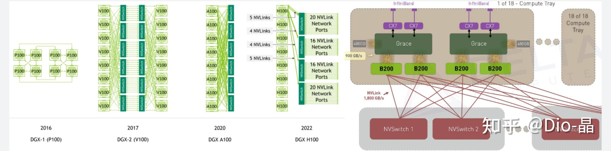
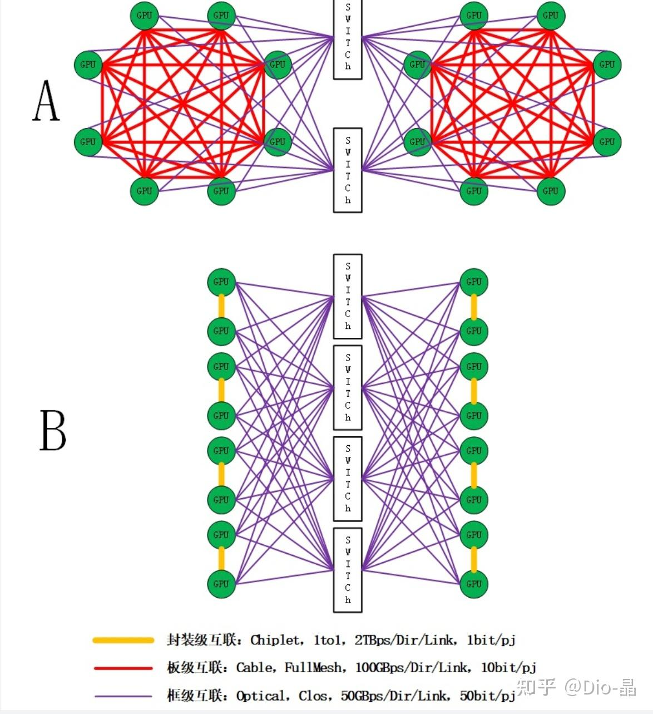
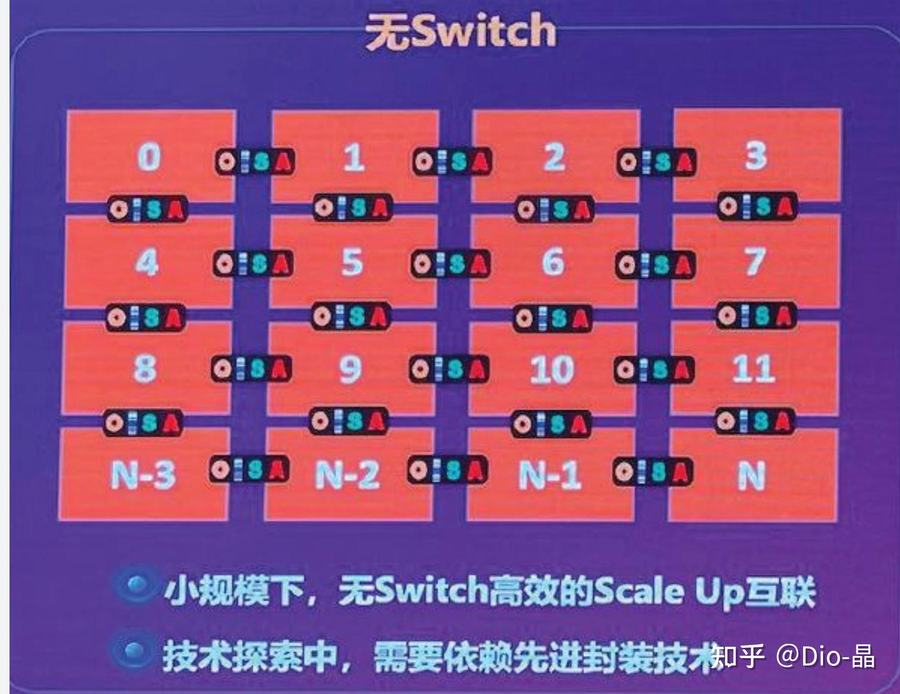

# 站在AI Scale-Up域的一个岔路口

> **类型**: 文章
> **作者**: Dio-晶
> **赞同**: 474
> **评论**: 47
> **时间**: 1720256284
> **原文**: [https://zhuanlan.zhihu.com/p/707355769](https://zhuanlan.zhihu.com/p/707355769)

---

我有一个朋友，他是做AI的训练芯片，就是让Nvidia增值到3亿刀的，大号的，H100、B200，类似的。。。。。。

他最近遇到了一些技术上的困扰，但在他周边得到的反馈却往往是进度、KPI、XX比、更换参照系等等奇怪的维度的答案，所以我帮他把问题引出来，不知道能否在万能的群友中找到更技术性或更前瞻性些的答案。

我本不喜欢Scale-Up这个词，奈何大家都这么称呼了，所以就还是这么叫了，我们可简单把他理解为高带宽（>1TBps），不收敛，可以做内存语义访问的高性能网络吧，对应Nvidia就是Nvlink域，对应Scale-out就是Infiniband或ETH（不在本文讨论范畴）。

Nvidia的产品在Nvlink域基本上都是不收敛的，包括下图从最初的P100非对称互联，到基于V100开始基于Switch的Clos结构，再到GH200妄图用Nvlink-Network扩展但最终失败，再到最新的NVL72通过低密单板和高密Cable在最大维度达成了72颗GPU产品化的TB级别带宽的无收敛Clos交换。

不要小看NVL72，这其实是世界上第一个大于16P的Scale-Up无收敛产品（GH200是失败产品），而且这个产品是结合了A、B、C、D等多项工业皇冠级的技术于一体，在凑齐全部龙珠之前，想要复制它几乎是不可能的任务。

所以我朋友的问题来了，>16P Scale-Up AI训练芯片，该怎么做。

--------------------------------------------------------------------------------------

**NVL72是基于Clos在单一维度的电 Cable在单平面做Scale-Up的极致，同等规模下无敌，近妖，不可复制。**

任意1v1满带宽，程序猿对拓扑近似于不感知，可维可测能力超强（NVL72实际上是64/72容错）。

但正常人，面对的是基于距离的分层，层次化感。封装内部是Chiplet接口、单板上是PCB或高密Cable互联、Rack之内是中密度Cable互联（NVL72是变态高密）、Rack之外更大可能是中低密度的光互联。

**即，大概率我朋友做出来的Scale-Up网络是分层次的，最上层Clos，下层。。。。。。**

我知道很多人会跳出来不满意，好好一个Scale-Up网络还分层次，不爽、不爽，但是没办法啊，互联的最简单的属性是距离感，不同的距离，会有不同的最优解。只有Nvidia这把业界各项技能树点满之后搞出不分层的杂技，只能利用距离和分层来破局。

下图是典型的两种Scale-Up两分层结构（当然也可以三分层，太过了）这是16P的互联实例，因为Clos的可扩展性，实际上也能组32P、64P，规模依赖于Switch的交换能力（按x4Port算，组16P需要64Lane Switch）

**注：图上能效写反了，应该是pj/bit。**

PlanA有点类似传统DGX，其想要的距离感是每个单板内部X/Y的平面空间，通过Cable达成超越单板出板接插件能力的内部互联（Nvidia NVL72其实是放弃了单板集成密度，也放弃了这个空间收益），然后出板打满Optical的插口数量，对接Switch。

PlanB其实有点类似NVL72，也放弃了单板的集成密度和单板内的互联空间，有点类似NVL72，但是Nvidia把这个空间用作了Grace+Hopper的紧耦合，而PlanB则放弃CPU+NPU紧耦合而用于NPUtoNPU的互联。

我列出了Chiplet、Cable、Optial三种接口的大致带宽情况，此外特别还有功耗的差异（距离就是数量级），图上单位写反了，是pj/bit。

--------------------------------------------------------------------------------------

Clos是一种全对称互联，可以基本做到编程对拓扑的不感知，友好性很好。

当然，坊间也有朋友提到Mesh、Torus之类的topology，即放弃Clos的全局对称，通过局部locality来超车Nvidia，如下图。

这也算是条路，可惜业界主流的集合通信算法在Mesh/Torus上太麻烦了，软件适配的工作量很大，这也是Dojo、Cerebras，甚至Jim Keller的Tenstorrent等芯片始终无法大量铺开的原因。

Mesh/Torus还是更适合空间计算那套路数，只能在局部空间和Nvidia能打，普适性不行。我在Torus花费了很长的时间，掉头发、掉头发，就不坑我朋友了。

--------------------------------------------------------------------------------------

**回到PlanA/B，我帮我朋友问一句：先不考虑Mesh/Torus，基于相对通用的集合通信策略，如果我们在更长远的路径上，需要对Scale-Up分层，那PlanA和PlanB两种结构，which one Better ?**

- **A，Cable一层+Optical一层，他们更佳的Link带宽选择是X GB/s和Y GB/s**
- **B，Chiplet一层+Optical一层，他们更佳的Link带宽选择是M GB/s和N GB/s**
- **C，英伟达无敌，黄教主万岁，坚决不分层，单层Clos和Transformer最配了**
- **D，Mesh/Torus/DF是打败英伟达的唯一解，三尺白绫送给这位朋友聊表心意**

---

*由知乎爬虫生成于 2026-02-01 15:39:00*
