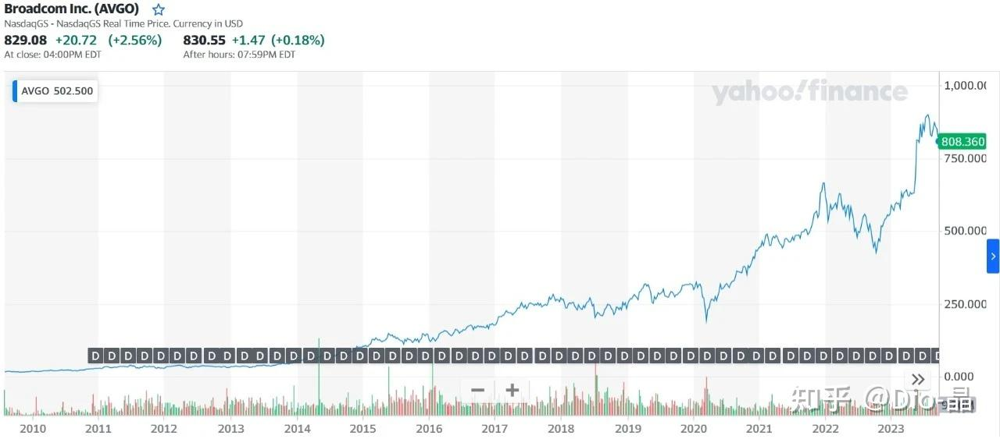
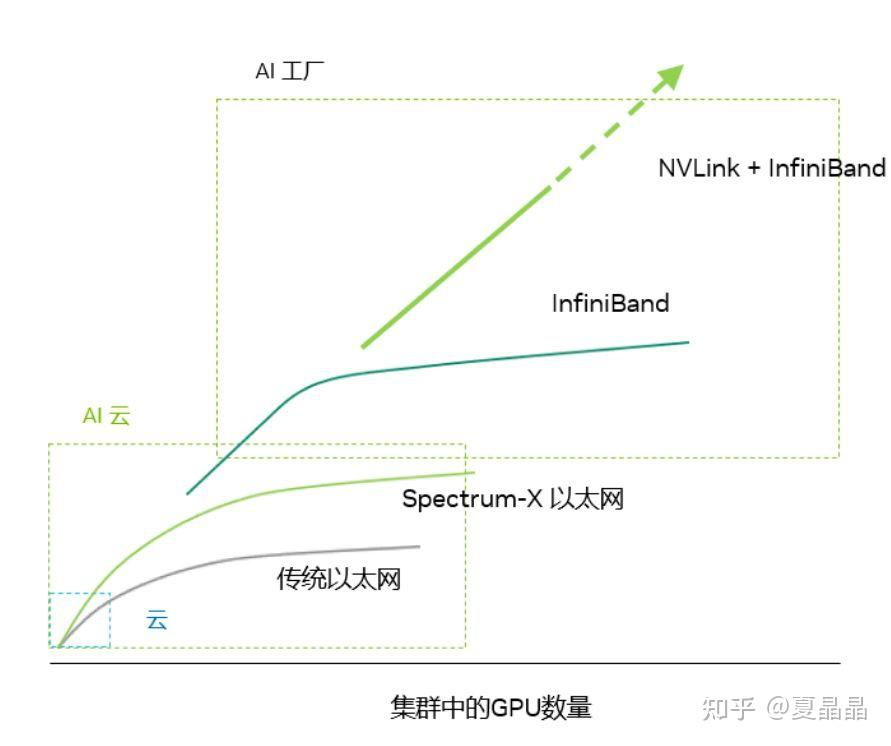

# 从HOTI到AI-I架构

> **类型**: 文章
> **作者**: Dio-晶
> **赞同**: 381
> **评论**: 26
> **时间**: 1696562397
> **原文**: [https://zhuanlan.zhihu.com/p/659017509](https://zhuanlan.zhihu.com/p/659017509)

---

2023年的Hotchip 35结束了。。。。。。。很乏味，相当的。也没啥可写的。

是的，Intel发布了Chiplet（长得很像华为的鲲鹏处理器了哦），ARM频频暗示他的新商业模式（得加钱），而AMD则不过在他上一次某个宣讲的胶片上增加了两页来意思意思（真没意思），Nvidia占据了Keynote却没讲芯片，倒是给自家疑似要推出的新数据格式LOG8做了一个暖场（数据格式的演进对算力提升驱动力是最大的）。

也可能各家现在都学明白了，在这个流量经济时代，上春晚真没啥了不起了，独立人设的网红主播擦边带货才是王道。Nvidia、AMD、Intel都有了各自的直播平台了，就像最近Intel的Innovation Day才是Intel的直播间（可惜I家一直培养不出网红，本来印度哥Raja倒是个人选，讲到一半突然几个美女冲出来跳段舞，想想都挺带感）。

当然，也可能随着人到中年，随着普遍性的认知提升，小时候觉得好吃的薯片，也变得。。。。。。。

---

但是，有一说一，Do AI的同学们，你可以忽视Hot chips，你绝对不应该忽视其后一天Hot Interconnects！

互联这个领域，因为历史悠久，文化也过于保守，那各种名词如古老的符文一般晦涩难懂，什么DragonFly、FatTree，这都是些啥？？？ 德鲁伊Cosplay吗？最终导致互联领域始终带不动流量，只能在HOTI这种传统论坛上贩卖真枪实弹。

但是，有一说一，Do AI的同学们，时代又变了，在以ChatGPT为起点的大模纪元二年的今天，AI的本质已经不再是简单的计算了。

> 单个芯片玩不了大模型！ 互联和存储，与算力同等重要。  
> 如果不考虑CUDA的系统buff增值，单硬件成本来讲，MEM和IO的成本都已经大于了Chips本身。

推荐一个帖子，[mackler：芯片军备竞赛新十年](https://zhuanlan.zhihu.com/p/654968895)

所以，要做好AI，你必须理解Interconnets，以及为什么HotI的价值 > HotC的价值。

---

我先假设你已经看了HotI，啊，如果你确实没看，也没关系，我推荐你看下面两个Topic就够了：

- 一个是Bill Dally的Keynote（[https://www.youtube.com/watch?v=napEsaJ5hMU](http://link.zhihu.com/?target=https%3A//www.youtube.com/watch%3Fv%3DnapEsaJ5hMU)），是的，他讲完HotC的Keynote，马不停蹄就到HotI讲Keynote了，而且其含水量远小于其HotC的内容。他提出的Dragonfly+OCS主张，简直犹如捅了整个HOTI的马蜂窝。
- 一个是Pannel，EtherNET vs EtherNOT（[https://www.youtube.com/watch?v=yAjP1idJvB8](http://link.zhihu.com/?target=https%3A//www.youtube.com/watch%3Fv%3DyAjP1idJvB8)），这个Pannel背后还有一个巨大的组织Ultra Ethernet Consortium （包含AMD、Cisco、Intel、HPE，没有Nvidia）。和Bill Dally的Keynote连着一起看真的贼有意思，稍微有点主见的你，看完铁定忍不住想要写一点东西来站队和参战。

OK，你看完了，大多数同学就能很简单地分清楚黑白，这是Nvidia帝国和Non-Nvidia联盟在互联上的战争！

简单地看，Nvidia推Nvlink嘛，肯定是EtherNOT啦，而Non-Nvidia联盟肯定是EtherNET。不知道为什么还牵扯进一位学术圈，挺理想化的Torsten Hofler教授，可能主要是Dragonfly和他主张的HammingMesh路线存在巨大的分歧，哈哈，我和他还打过些许交道，后面得顶一下他。

---

但是呢，我写这篇文章如果只是简单在EtherNET vs EtherNOT之间插个旗的话，那毫无写意，我擅长的是和稀泥，嗯，和为贵。我们还是把得失先盘清楚，放到台面上，讲道理、讲道理。

所以，在如果你先已经建立了对HOTI的状况认知，容我先问几个问题。

1. 如果Nvidia是EtherNOT的，那他怎么销售他家的spectrum-x（[NVIDIA Spectrum-X Networking Platform](http://link.zhihu.com/?target=https%3A//www.nvidia.com/en-us/networking/spectrumx/)）交换机呢？ 这不打自己脸吗？
2. Bill Dally真的是毫无不顾及他的Reputation地来推广Dragonfly？传统数据中心的网络怎么办？拆了吗？
3. 金钱是不撒谎的，除开黄家万亿帝国，你怎么解释这波AI浪潮把Broadcom给带起来的？

所以啊，这里面有一个天大的误差，车速飙得太快了，导致很多同学，包括HotI上Pannel的一些大佬，都没有跟上车，还是容我来把整个故事捋一捋，把逻辑盘圆了。

得，老司机带大家上车，上车。

---

其实Nvidia的逻辑都是顺的，但为了趁着当前的风口多卖钱，黄教主能趁乱多折现些股票，Nvidia始终没有对整个故事一次性讲完整，总是只讲最赚钱的那一面。

但你要相信，Nvidia的布局一定是全面的，所以你是能从他的各个分支上凑出全图的。

对于EtherNET vs EtherNOT，其实黄教主在[NVIDIA at COMPUTEX Taipei 2023](http://link.zhihu.com/?target=https%3A//www.nvidia.com/en-us/events/computex/) 这个会议上给出了一个全貌的，下面这张Nvidia的图，可以当做一个非常好的AI硬件系统沙盘来参考，极其重要、极其重要、极其重要。

PS：这张图描述的是一个逻辑上的单GPU的尺度。

> 看明白这张图，那我们应该争论的，就不再是事物的黑白了。这个世界是彩色的，我们需要更多考虑的是边界在什么地方？能否存在妥协和融合的空间？ Nvidia的框框的位置和大小，对不对？

---

不说废话，我们先假定Nvidia是对的，那么站在Nvidia的视角，这个基本的楚河汉界是什么样的？

其实，对于AI Factory和AI Cloud，我和Nvidia的理解是一致的，我也在一直理解其中的差异，寻求那不可调和的和可调和的空间的答案。

> AI Factory，这是Bill Dally这次主要针对的对象，它包含如下的特质：

1. 单一化业务，整个系统只为大模型或搜推广存在，几乎没有其他业务的复用性；
2. 用于超大模型的推理、L0基础大模型的算法研究、更大尺寸的探索、L0和部分L1的预训练；---本条可以讨论
3. A Single monolithic data-center-sized GPU，或者说巨大的超节点尺寸（Scale up），当前Nvidia的尺度是**256** chips为Single Node。
4. 系统成本高，很高。但实际上它利用了短距电/光传输的特质（<10m），把高带宽互联的$/GBps做到了比传统互联更低，来获得的更多的低成本互联带宽，所以说系统成本高，但单位带宽上是低的。
5. Few Tenants；
6. 对模型的各种尺度变化非常友好，但对多用户复用并不友好。
7. 因为整个系统表现为Scale-up（**256**chips的Single GPU），互联带宽需求远大于正常数据中心（DPU是不适用的），存在巨量的Allreduce和局部All2all带宽；
8. Rack之间的带宽几乎**不收敛**，或只做**1/2收敛**。
9. 为了计算的极致高效，IO通信基本上能够做到预先编排，并且一段时间内存在确定性路径（局部TF并行，PF并行时呈现为不同TF节点的同编号），因此DragonFly和OXC都是合理合适的选择；
10. Cut-Through Switch，低延迟，固定可配置路由，几乎不需要Shared buffer架构的Switch（IB Switch/NvSwtich均是Bufferless）；
11. 因为DragonFly和Bufferless Switch的选择，整个系统对不确定性流量的抗冲击能力非常弱，但因为无法绝对避免，所以拥塞控制还是要做好的，避免出现意外。
12. 系统巨大化后，容错变成一个大问题，因此多路径和选择性重传是必备的技能，一旦出现丢包，要做到快速（低于1ms）切换路径重传，保证业务的持续稳定运行。
13. 流量模型：带宽巨大（大包）但路由固定的Allreduce流量，带宽较小（小包且延迟敏感）但路由随机化的all2all流量；
14. EtherNOT，使用IB+Nvlink Network为主，但因为IB的若干不足，Nvidia推荐Nvlink Network替代IB。

你看，如果把上下文限定在AI Factory，这些逻辑是否和Bill Dally的逻辑几乎一致了？特别关于第7点，我曾经写过一篇文章。[夏晶晶：AI DC的参数面互联最优解是OXC吗？](https://zhuanlan.zhihu.com/p/629283582) 其实可以再拿出来强调一遍了，Google和Nvidia都已经给AI Factory这个上下文下的最优解OXC背书了，OXC是适用于AI Factory的。

> AI Cloud，这是Bill Dally故意不明说，但实质上又是广大数据中心当下的主要形态，它的特质包括：

1. 多样性业务，整个系统要能够适配千奇百怪的各种网络，及训练、推理的差异化部署；
2. 以当下常见模型的推理和L2的Fine Tune为主，可以做部分和用于L1训练，也可以挑战一些大模型的基础探索工作；--肯定有争议，待讨论；
3. Distributed GPU Cluster，或者说若干有限尺寸cluster的分布式组合（Scale up + Scale out），当前Nvidia的尺度是8 chips为Single GPU，然后再通过收敛的Fat Tree做二次8 Chips之间的更大规模组合；
4. 成本较低；但实际上低成本源自从Scale-up到Scale-out的带宽急剧收敛，全局带宽足够低带来的廉价和灵活性，而其$/GBps实际上比AI Factory贵，即系统成本低，但单位互联带宽成本高；
5. Many Tenants；
6. 对模型的各种尺度变化不友好（通常TP必须限制在8 chips之内），但对多用户复用比较友好，当然，计算单元颗粒度小，易于分配也是友好的原因之一。
7. 因为整个系统表现为局部的Scale-up后的巨大Scale-out，即8 chips的Single GPU，再通过ETH互联为上万颗GPU的Cloud，互联带宽因为需要100m级别的光互联，因此带宽昂贵，通常只能控制到比当下数据中心略高的级别（单GPU ~200Gbps级别），因为多用户复用和存储的拉远，所以DPU是必备的，网络上无法承载巨量的Allreduce带宽，但可以承受一定程度收敛后的PP/DP并行带宽和存储访问带宽；
8. Rack之间的带宽会较大收敛，否则成本无法承受，会按**1/8**甚至**1/16**收敛。
9. IO通信不能承受TF并行的reduce带宽，带宽会在算法层面控制降低一个数量级后运行，即通常是现有算法，然后算法人员基于互联的约束规划算法的部署解决问题，[Meta Platforms Is Determined To Make Ethernet Work For AI](http://link.zhihu.com/?target=https%3A//www.nextplatform.com/2023/09/26/meta-platforms-is-determined-to-make-ethernet-work-for-ai/)，这篇帖子讲得就是就是这个内容。
10. 交换机会复用标准的ETH，此时的最大受益者就变成了broadcom，[华尔街认为博通或是英伟达之后AI繁荣下的最大赢家\_腾讯新闻](http://link.zhihu.com/?target=https%3A//new.qq.com/rain/a/20230904A02OVA00)，这个帖子讲得就是这里的故事。
11. 标准的broadcom ETH Switch及RDMA，标准的DPU架构，因此互联形态肯定是基于传统的Fat Tree为主，Switch也要尽可能满足多用户、多业务下的不确定性流量，特别是在带宽收敛之后，要尽可能不丢包来保证RDMA的性能，因此Switch必须是Shared Buffer结构，而DPU也会采用一些硬件RDMA的辅助机制。
12. Scale-Out的系统对容错并不敏感，计算节点（8 GPU）相对较小，错误域比较小，出错后便于隔离和重新分配，因此容错能力并不需要像Nvlink-Network那么苛刻。
13. 流量模型：带宽随机化，路由随机，有大包和小包混合，整个网络还是建立在尽力而为的基础上，对传统的ETH架构冲击比较小。
14. Ether，兼容传统ETH的架构，对历史遗产的继承很好，关键是普世化，谁家DC都能搞起来，所以才有那么多DC的同学纷纷在证明这种架构其实多么多么适配AI，**ultraEthernet**是非常有希望的。

从上面的对比可以看出大量的争议的来源，脱离场景，所谓**EtherNET vs EtherNOT**的吵架不过是鸡同鸭讲。

而那些浮于表面难以调和的冲突，都是基于不同场景之间的利益争夺，背后都是Money。就像Meta为何要发文说FatTree带宽8:1收敛能跑DLRM的训练推理呢，本质就是Meta不想买AI Factory，想证明AI Cloud也能达成AI Factory的功效呗。

关于整个AI Factory vs AI Cloud，我还是想列出三件我认为必须要点出来的关注点。

> 一、Bill Dally以及黄教主，对他们定义的AI Cloud和AI Factory之间的差异，肯定是门清的：） 但是他们不会特别点出来。因为AI Factory的利润率远高于AI Cloud，前者的销售是整系统，而后者的销售模式是近似于白盒，能卖系统的谁卖白盒啊，还不说后者有Broadcom等一干人要分蛋糕。所以黄教主在各种场合会不予余力地推销AI Factory，包括DGX H100 SuperPod，DGX GH200 SuperPod，并且Nvidia有意地会把AI Cloud和AI Factory做出技术壁垒，非黑即白，让客户不能自己用AI Cloud搭出AI Factory。当然，你一旦说没钱只想做AI Cloud，老黄也能扭扭捏捏从兜里掏出Spectrum-x + Bluefield的AI Cloud的纯ETH Fattree+DPU的参考设计卖给你。所以，最重要的是你到底要什么？  
>   
> 二、对于Nvidia的挑战者们，最应该看到的是如果Nvidia一定要非黑即白，那其间的灰度就是可以破局的空间，即Nvidia当下的AI Cloud的GPU是8 GPU为Node尺寸，而AI Factory的Node尺寸是256 GPU，两者之间Nvidia会有意留空来保证互相之间的切割，所以突破边界，灰度空间还有16/32/64/128共4个档位是可以做差异化竞争点来挑战Nvidia的，然后问题就变成，到底什么尺寸是最适合的？  
>   
> 三、如果按照AI Cloud vs AI Factory来定义AI系统硬件的话，AI Cloud到底能够覆盖多大范围的AI业务，如果不能覆盖的，增大多少Node尺寸能否覆盖？ AI Factory还能做到多少AI Cloud不能做到的事情？如果把AI Factory继续做大规模还突破边界做什么事情？   
>   
> 这三个疑问和AI业务与Node尺寸的关系相关，我在下下段也想讲一下我的不成熟想法。

---

先回到Hot Interconnect的冲突上。

HOTI上，Bill Dally毫无疑问在讲最赚钱的AI Factory ：） 但是他讲的核心观点其实是想表达，AI与传统HPC是有差异的，像IB+FatTree就是为HPC超算设计的，并不适合AI Factory，他不能直接打脸自家DGX H100 SuperPod，但他必须为未来埋伏笔，即AI Factory不能再像HPC超算那样组网，不经济，成本太高，要做下一代更大的2048的AI Factory必须改变形态，所以**AI Factory需要的是Nvlink-Network + DragonFly+OXC**。阐述Nvidia下一代AI Factory的主张是最重要，AI cloud怎么做他其实完全没讲，所以要跟他吵ETH的话，完全就打在了棉花上。

首先还是理解一下Bill Dally对未来的预判，我们很多时候会把AI超算和HPC超算混为一谈，可能这也是Nvidia卖AI Factory时在客户侧遇到的困扰。因为两种我都做过，所以我比较理解Bill Dally在说什么。HPC超算往往面对的是从FFT到MD的各种分布式计算模板，其互联结构需要做到一定程度的General，所以小包低延迟、全交换都是HPC超算必须达成的，但是AI完全不一样，大模型的结构越来越固定化，TP+PP+DP+MOE，为了保证计算和通信的相互掩盖，主要的通信在物理上都是固定编号的GPU和另一个对应编号的GPU在进行，且一段时间相还对固定化，所以，如果要追求AI系统的Scale-up的极致，Nvlink-Network + DragonFly+OXC真的就是合理的选择。

但是，如果真的走向Nvlink-Network + DragonFly+OXC，又确实会在当前的数据中心内形成巨大的割裂，即AI Factory和AI Cloud的会相互独立。

那AI Factory和AI Cloud之间的矛盾是否真的不可调和？

如果我们回头看看Torsten Hofler教授推崇的HammingMesh，他会上讲得不太好，但他本质上就是一个调和者。Torsten教授源自HPC超算，他是在HPC的思路上对AI做了一个重新的定制化，HammingMesh简单来讲就是局部的Mesh+全局的FatTree，他其实想给出一个在局部能够Scale-up超越Nvidia的8P框架（mesh是一种不收敛短距高效互联的方案），但全局又能Scale-out兼容传统的FatTree不变的解答。但是Torsten 教授手上没有Nvlink或者IB这样的自主协议，用ETH做Mesh互联就有点尴尬了啊，￣□￣｜｜ 而且他对硬件PCB的设计好像很陌生，他的Mesh只能说是一个逻辑概念，硬件上，一个RACK内部怎么互联和布局呢？

---

最后，还是逃不开的命题，做AI，应该选择AI Factory还是AI Cloud ？ 或者说，Scale-up和Scale-out之间到底应该选择怎样的平衡？

最简单来讲，有钱有能力要自主的，能Scale-up肯定最方便，不收敛的Node越大越好，算法在硬件上的负担越轻，更加能够放开手脚，打开脑洞去探索，那选择Nvidia的AI Factory，关起门自家用，悄悄开辟一个新的大大大模型纪元，那不美滋滋。

进一步来讲，也可以简单算一下模型尺寸，当前8卡H100的HBM容量大致是~600GB，如果有HBM3E加持大约能到~1TB。要保证时延在8卡内完成单个大模型推理的模型尺寸上限就是600~1000B，而如果要做训练，PP并行，单个8卡内能够存放的pipe尺寸就是100~200B，这个尺度无论中美的限制是一样的。如果AI是一个赢者通吃的战场，模型领先一步的价值远大于拿一个现成模型改改赚钱更有价值，那突破8卡的限制的重要性就更大，你至少得买一个AI Factory专职做探索，或者在Nvidia的挑战者中选择一个兼容AI Cloud但单节点尺寸至少大于Nvidia的AI Cloud 8卡尺寸的做备份。

再进一步说话的话，如果把AI看做一个商业模式，那就是自有国情在此了。Meta开源了Llama大模型，所以视野可见内，相当多美国公司会采用在Llama之上二次开发L1/L2的商业模式，但这种模式在我国很难行得通，模型的中国自主是必须的，但是国内首先没有开源自主大模型，就算有，谁又能服谁呢？谁要是用了别家的模型做微创新，在当前这个国情下说粗来就落了下乘，那就只能百模大战卷到底呗，东亚的习惯性内卷，倒也不是坏事，大局未定之时，也许能卷出点啥呢 ：） 有人说未来就应该是百模千态的，当下确实也说不定。

---

写了半天，其实哥也就是个云玩家 ：） 哈哈，且行且看且从容吧 。。。。。。。

---

*由知乎爬虫生成于 2026-02-01 15:39:00*
