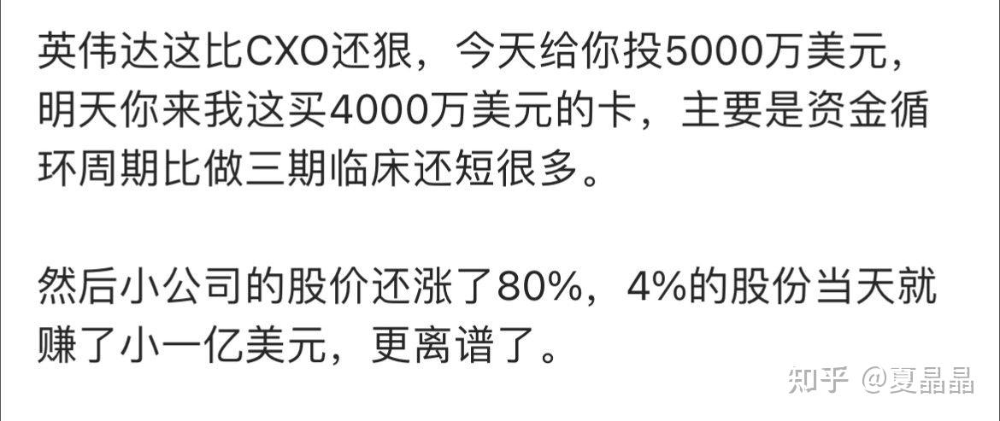
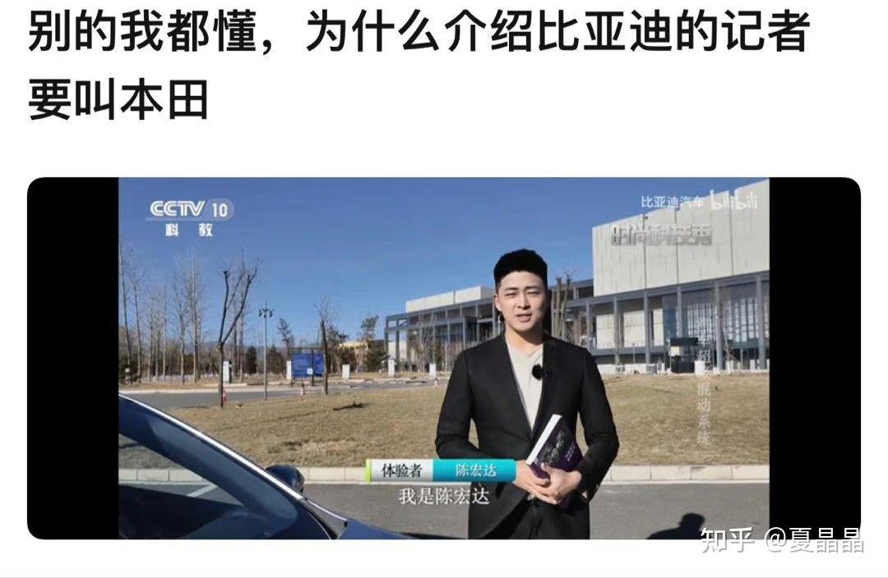

# 技术汪眼中的道与术

> **类型**: 文章
> **作者**: Dio-晶
> **赞同**: 75
> **评论**: 5
> **时间**: 1691244251
> **原文**: [https://zhuanlan.zhihu.com/p/648225840](https://zhuanlan.zhihu.com/p/648225840)

---

最近写了两篇嘿嘿嘿的小作文 ：） 这里补充一点注解。

题目看着差不多，其实在我技术汪的思维逻辑中，是道与术的差别。

“道”，可理解为真理、规律、本原，简单地说是战略；

“术”，即技术，方法、工具，简单地说是战术。

老子曰，“有道无术，术尚可求也。 有术无道，止于术。

---

### 第一篇讲的是道。

[夏晶晶：谈一下英伟达帝国的破腚](https://zhuanlan.zhihu.com/p/639181571)

所谓道，就是道理。我不想重复文中的逻辑，简单举个例子，如下。AI一个好好的算法行业，怎么就变成了一个超级重资产的制造业？

但你再看看又一个新闻，你释然了，一切都符合了逻辑，这TMD是金融业。

[AI初创公司，用英伟达GPU抵押融资23亿美金](http://link.zhihu.com/?target=https%3A//mp.weixin.qq.com/s/ZXeNCeDf42EC-f5aRhO7_w)

这就是道，也许你没想通其中的逻辑，但存在即合理，短期内也不见得就会出问题。

但是，你也学过，道可道，非常道，大道不变。最终天道好轮回，苍天饶过谁…………

---

### 

### 第二篇讲的是术。

[夏晶晶：数一数英伟达黄家刀法欠缺的招式——（上篇）](https://zhuanlan.zhihu.com/p/642260820)

所谓的术，就是可以计数（在计算机体系结构与量化范围内)，可以盘算得失的逻辑。首先，算术的前提要我们双方是对等的，都是人，并没有绝对你能做到而我不能做到的点，那么，因为你过去选择了某些路径的历史负担，或者当前时间点下外部依赖条件和约束的变化，或者对于未来的变数的展望的不同，那么，大家要达成某个相同技术点时，所进这一步能够得到的收益，和付出的代价是不同的。

在这个基础上，一个技术点的术，在X公司可能是蜜糖，而在Y公司则可能是砒霜。

所以，再看一下这篇文章在知乎上的回复，你一定能感受到这篇文章的一些不协调之处，正如某个回复直指要害：“满篇都是说服自己”。

对。因为这篇文章其实并不是我站在通用计算机体系结构的角度写的，而是站在我所就职的公司当前的技术平台的视角，是我站在我现在拥有和可获得的技术高度和过往，说服自己能够做到的相比英伟达的差异化技术点。

所以后一篇文章该展开的地方看着又欲言又止，是因为只放出来了一半文字，这篇文章是我对技术之算计（也就是常说的量化）的表，而另一半《算一算Nvidia不能而我司能的技术の差值（上）》则是算计之里，是基于具体技术点量化对比的结果，出于我司和英伟达在技术上的不同的历史包袱、当前能力、外部依赖条件下，在技术组合上能够计算出的超过英伟达的收益点。涉及太多东西只能发在公司内网而没法发到知乎，也许有某些好事之人搬运的就不关我事了……

但其实呢，如果脱离我司背景，站在一个Startup公司的角度，很多招数大概率都是不成立的，也是算不出来的，切勿生搬硬套。每个公司都应该有自己的“术”的计算者和其独特的结果。就像……

---

*由知乎爬虫生成于 2026-02-01 15:39:00*
