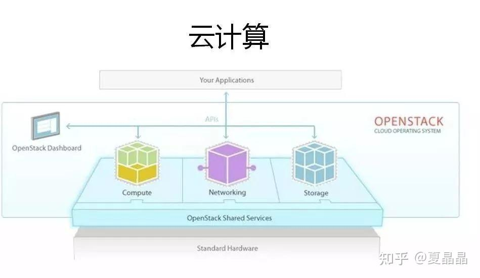
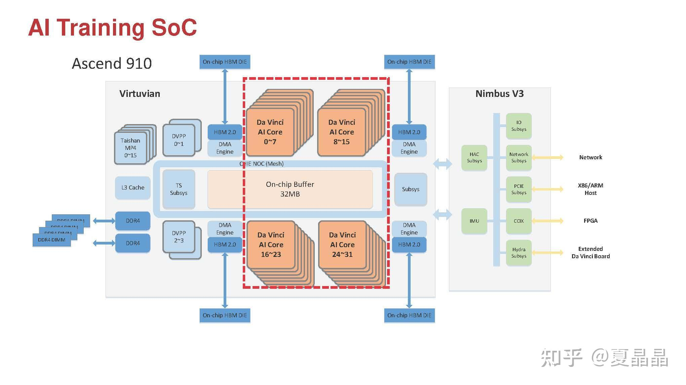
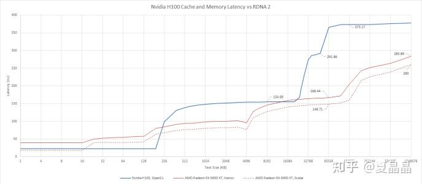
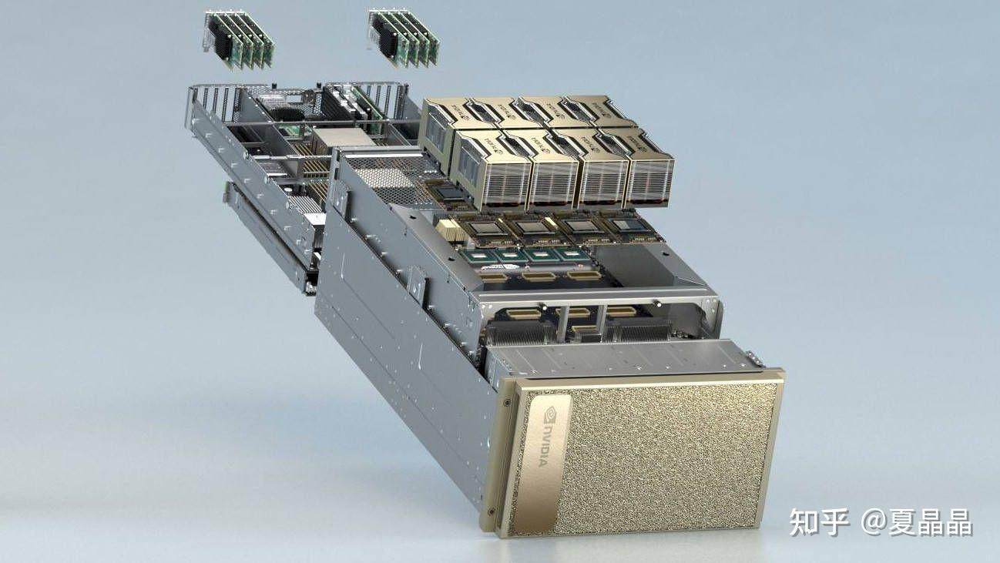
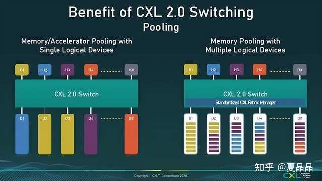

# 数一数英伟达黄家刀法欠缺的招式——（上篇）

> **类型**: 文章
> **作者**: Dio-晶
> **赞同**: 383
> **评论**: 63
> **时间**: 1688886877
> **原文**: [https://zhuanlan.zhihu.com/p/642260820](https://zhuanlan.zhihu.com/p/642260820)

---

上一篇《谈一下英伟达帝国的破腚》写的是道，打算再讲一讲术。

<https://zhuanlan.zhihu.com/p/639181571>

写上一篇文章，其实是被周围对Nvidia GH200的各种歌功颂德不胜其烦，所以周末憋不住气连写了两篇帖子揭示一些不一样的视角。

可是呢，哇哇哇，点赞暴多啊。这简直让我感觉打开了一个全新的世界，小黑子只要不露出鸡脚，那黑黑黑的感觉真是棒极了，八卦和吐槽真的是个老少咸宜、大家都很喜闻乐见的爱好嘛。

好吧，再黑一轮，从架构下探到具体的微架构。

---

陆晶晶：黄师傅你家刀法中有几招不全，我担心日后你若遇上真正的高手，一旦被他看出破绽，必死无疑！

额，黄师傅他的身份其实是转轮王不是细雨，想学电影直接断是断不了的：）

但我还是要尽可能点一点，即使禅机未到，虽点亦不中，也可以化身石桥，静待机缘。

退而求其次，若能帮助买GPU的同学借口杀个价也是学习雷锋做好事吧。

---

> 缺的第一招：CUDA之先天的客位

Cuda是Nvidia最大的城墙，高耸入云，是几乎所有AI后继者无法跨越障碍。

但若是回到源头，Cuda天生在体系结构上就存在一些不足，她是妾，不是妻，CUDA永远做不了主。

CUDA的起点是一个PCIe Device上的Driver，后来所构建的一切，不过是这个Drive变得足够的厚重和巨大，以至喧宾夺主。

主是Host，是Window、Linux这样的RICH OS，GPGPU的GP，无论掩盖多少次，它最终无法独立完成整个软件流程，TensorFlow没法运行在GPU上。

以最简单的容错能力为例子吧，想一想为什么你家买了几千张Nvidia的GPU，要一次性快速地训练一个大模型，但也许不到1天，宕机了，嗯，领导对你下了约束，要容忍宕机，要添加CheckPoint，每次宕机后要在20min之内重载恢复。所以你逐渐习惯了大模型训练的不断重启，也习惯了经常性去抽插奇重无比的HGX框，拔掉坏GPU换新卡。但这事你理应好奇一点，都是数据梳理，为何在CPU上跑分布式数据库业务不是这个样子。那是因为CUDA没有错误的识别分类、重传、处理能力，在CPU上很多偶发的错误是可以容错和快速纠正的，但在GPU上出错就得停工，甚至于，让CUDA及时报错就相当强人所难，甚至于很多时候，嗯，可能很多人都不知道，GPU上的某些bit翻转类软失效，GPU都缺乏足够的识别和纠错容错的机制，导致错误数据逐级使用并传递，嗯，你的大模型不收敛了，你以为是你的毛病，但也许是GPU某个偶发的bit Error没有被Detect而罢了。

所以，GPU永远是AI加速器，CUDA始终是AI加速库。

一个业务，理论上最好的策略是一个统一的编程框架，统一的调度器、统一的内存管理、统一的IO。CUDA天生就与Rich-OS是存在冲突的，CUDA有自己的编程框架，独立的调度器（其实并不好用），分离的内存管理（你需要独立CUDA Malloc接口），还有些奇怪的IO Direct。

对，什么storage direct、rdma direct、PCIe direct，你看着这些NVIDIA吹嘘高大上的技术不觉得怪怪吗？ 如果是个正常host CPU，所有storage、rdma不仅仅是direct，更天生就是native的。那GPU的storage、rdma为什么就不能是native？

此外，很多时候，你希望让部分算法开放开源，例如你在Rich OS运行TensorFlow编译出一个非常完整的计算图和其中详尽的依赖关系，你希望按照你的意愿高效地调度，但是不行，你得通过CUDA的允许（如果某些计算图涉及到CPU-GPU之间的频繁交互，这其中的困扰就更多了），而CUDA调度器和RichOS的调度器并不配合，最终你被迫把业务分层分解。

**CUDA其实非常狡猾，他依附在RichOS之上，不断评估着RichOS的功能特性，把“收益 <代价”的部分丢给RichOS兜底，把“收益>代价“的部分收进去封闭起来卖钱给客户(有时候把代价优化一下包装成收益卖钱)。**

**商业上这招是个好招，但若真要死战不休，让cuda吃不下或者利用好cuda吃不掉的host部分设置关卡，是有破招之机的。**

异构计算，想一想，为什么你会认为这个词在计算机体系结构是一个褒义词？而不是贬义词？ 谁在洗脑？ 为什么不能做到像Mobile/Client那样，一个OS统一调度大核+小核 或 控制Core+计算Core的完备性呢

---

> 缺的第二招：CUDA不支持虚拟化

RichOS这些年最大的一个技术演进就是虚拟化，虚拟化不仅仅可以让资源池化更加高效使用，还具有强大的容错和隔离的能力，但是CUDA的内存不在Hypervisor的管理之下，PE更不是。

当然Nvidia有推出Partition的模式，支持多个Group分割使用，但这总是权宜之计，对用户的调用和使用都有巨大的限制，无论是容错、隔离、搬迁，并没有正常的Virtual Machine那么自由自在。

理论上，基于PCIe Device的SRIOV或者Virtual I/O机制，都是能够在GPU的计算、存储上套一层虚拟化层，让其资源与Host的Hypervisor直接接轨，提供虚拟化能力的。Docker同理。

这其中的瓶颈，大概率来自于GPGPU原生定义时的微架构缺失，中断其实不是大问题，内存页表结构是比较困难的点，但不是不能克服，那最可能的死穴还是在CUDA本身的软件栈及调度器的复杂度导致虚拟化难以嵌入。

简单来讲就一句，异构编程的全虚拟化是可以做的（当然我没法直接拿业界现成的东西证明），但Nvidia没有做到，不要陷入Nvidia不做就是体系结构不能做这个陷阱。而云计算，需要虚拟化。

---

> 缺的第三招：GPU缺乏与CPU的融合能力

我先做个假设 ：） 两年之内Nvidia会裁掉Grace的CPU团队。

当然，作为黄粉你完全不信，甚至于真有这一天出现的时候，黄粉也能换一个说法，对老黄的果断和明智歌功颂德，就像老黄讲他砍掉手机业务是多么明智的故事一样。

在我看来Grace当前并不是一个成功的产品，而留给Grace团队证明自己的时间不多了。

坊间不是都在鼓吹所谓的超融合架构嘛。何为超融合，也很简单，把GPU、CPU做成一个SoC呗。Nvidia为何不做？ **不能也，非不为也。**

Nvidia的GPU架构的原始需求来自Graphic，因此其memory model，典型的什么Constant Memory、Texture Memory属性，和传统的CPU Shared Memory Model完全无法融合。GPU的Cache也因为Graphic原因设计成128Bytes Cacheline with 32Bytes Sector结构，和CPU的64Bytes Cacheline冲突严重。还有Barrier、Atomic等等机制，CUDA走得越远，越发难以回头。

是的，所谓超融合，把CPU和GPU融合到一个SOC中，把HBM和DDR融合到一个SOC中，不是一件简单的事情，Nvidia暂时没有这个能力。

举个例子，中国倒其实很早就有这个能力哦，我引用下面这个图，国产昇腾910，虽然算不得GPGPU，但确实把AI的DSA+HBM和CPU+DDR完美融合了哦，图左上角就是16颗CPU（居然用了内部代号Taishan），左下角是DDR4，上下是四颗HBM。整个系统一套Memory Model，一套总线、一套cache、一套DDR+HBM地址对CPU/NPU做到了全局Cache Coherency，这颗芯片原本思路不仅仅不需要Host CPU（PCIe支持RC/EP双模），而且还能多颗芯片通过右下角的Hydra接口自主组成一套完备的SMP（4S就是64Core CPU+128 Core NPU），但没人能用起来，嗨，默哀一秒钟这个想得太多的架构师。

Nvidia是缺乏这个能力（不要总觉得Nvidia就万能啊），不得不做相对松耦合的结构，我猜Grace团队提出过Chiplet的方案，但这会影响Hopper的主成本和结构，被毙了，所以搞了个基于pcb合封的鸡肋方案。

grace和hopper之间的访存行为或者svm/一致性的行为，你基本上都能在IBM这篇2018年的论文《Functionality and performance of NVLink with IBM POWER9 processors》中找到：[https://ieeexplore.ieee.org/document/8392669](http://link.zhihu.com/?target=https%3A//ieeexplore.ieee.org/document/8392669)，Grace团队并没有超越5年前的IBM。

NVIDIA差一点就收购了arm，但Grace+Hopper的arm的页表还是arm上richOS管理，GPU的页表还是cuda管理，所谓svm也就是GPU通过PCIe的ats借用一下地址翻译，离超融合什么的，差远了。GPU的L2甚至于不能cache CPU的ddr的数据(别问我怎么知道，我就是知道)，连个cxl.cache都比不上。那grace剩下唯一的价值是自主可控和配货卖高价了？

其实下图可以看一下Nvidia GPU的MEM Latency就能明白，H100 HBM的访问延迟高达373ns，这个延迟的设计目标肯定是源自SIMT对延迟不敏感的特质，但是这个延迟你要放个CPU进去，分分钟死给你看啊。

PS：AMD的延迟虽然也很大，但已经在CPU还能喘口气的窗口，如果在努力优化优化，MI300的CPU+GPU超融合就是合理达成的了。

---

> 缺的第四招：GPGPU相比DSA对AI天生不足

GPGPU是AI最高效的计算硬件架构吗？ 很明显的答案，不是。GPGPU只是SIMT架构的并行性能比CPU好，编程具有亲和性，再加上良好的CUDA生态解决了很多底层的问题。

所以答案很清晰，AI的DSA与GPGPU之间，差的其实就是一个CUDA生态。当然，说得很简单，实际很难，需要非常多的时间和人力。

很多人都在说，Nvidia的GPGPU这两年，变得越来越AI DSA了。

**Nvidia通过在SIMT架构的紧耦合扩展上，增加AI所需要的独特单元，包括TensorCore、TMA等等。**

确实，但你也要明白，这一招的破绽有两个：一个是它杀敌一千自损八百，DSA越多，GP就越少，无论TensorCore还是TMA，对HPC和Graphic市场的竞争力都是损失。二个是这个DSA源自SIMT，而SIMT本身的架构约束限制了其AI DSA的上限。

这两个破绽都是这两年AI芯片 Startup公司说得最多的逻辑吧。

展开一点，我就直接来个列举

1. SIMT天生是类似CPU的Cache+Load/Store结构，但是这种结构对于矩阵计算并不合适，矩阵计算往往都是简单直接的大颗粒的左矩阵x右矩阵，更适合Buffer+DMA结构，让Kernel显性控制数据流水和缓存比Cache miss、Load Store不能Coalesce等penalty优很多，虽然Nvidia也在Cache+Load/Store之上加了一个TMA，但原生体质不够好：） 弱于直接做DSA的原生Tensor+DMA。
2. SIMT的Load、Store能力决定了其Tensor Core的尺寸做不大，这几年Nvidia最大的微架构优化，就是在不断增大SM的Load/Store位宽来保证为Tensor Core供数据，所以能看到Nvidia的Tensor Core大致每代翻2倍尺寸的演进，但这弱于直接做DSA的任意尺寸更高效的Tensor Matrix。
3. Nvidia基于对Graphic+AI的固执，Tensor Core的尺寸始终有一个维度控制在4维（RGBA），导致Tiling策略相对复杂，Tensor的物理实现也会存在困难。对应的，DSA可以更加高效地设计Tensor的尺寸。

如上这些点，在做AI DSA的路径上，都是具有在硬件上超越Nvidia的空间的（先不说CUDA）。

举个例子，壁仞就是比较巧妙的在第二点的SIMT与Tensor尺寸矛盾上做文章，用外积Tensor，再通过多个Tensor之间做Systolic，解决了SIMT的供数能力瓶颈问题，既支持小号Tensor的灵活度，又支持大号Tensor的高效率。

[https://www.bilibili.com/video/BV1G14y1275T/?buvid=ZE4B9DE6BFC5137C47DBAE8F92B3F6C0E70D&is\_story\_h5=false&mid=OsOuFC1LRN47rHpEl4lyhw%3D%3D&p=1&plat\_id=114&share\_from=ugc&share\_medium=iphone&share\_plat=ios&share\_session\_id=881AD2B4-715A-42C5-85EA-1DF22D25233B&share\_source=WEIXIN&share\_tag=s\_i&timestamp=1688477670&unique\_k=EXiUa0W&up\_id=517221395](http://link.zhihu.com/?target=https%3A//www.bilibili.com/video/BV1G14y1275T/%3Fbuvid%3DZE4B9DE6BFC5137C47DBAE8F92B3F6C0E70D%26is_story_h5%3Dfalse%26mid%3DOsOuFC1LRN47rHpEl4lyhw%253D%253D%26p%3D1%26plat_id%3D114%26share_from%3Dugc%26share_medium%3Diphone%26share_plat%3Dios%26share_session_id%3D881AD2B4-715A-42C5-85EA-1DF22D25233B%26share_source%3DWEIXIN%26share_tag%3Ds_i%26timestamp%3D1688477670%26unique_k%3DEXiUa0W%26up_id%3D517221395)

---

> 缺的第五招：被CPU束缚的硬件形态

先放一个Nvidia DGX的硬件框图。

然后提一个问题，这个DGX是一个2x CPU+8x GPU的复杂单一系统，它是一定要长成这个样子的吗？或者说只能长成这个样子吗？

为什么2颗CPU做成一个板，8个GPU做成一个板，这是最佳的定式，还是被迫为之？

哦，你又提到了GH200，Grace+Hopper是放到一个单板上了，但是，G+H是一个细粒度的Scale-out啊，你买了多块G+H的单板，他们组合起来的样子是并行的多个小系统而不能组成大的单系统啊。

其实SMP CPU是可以不集中在一个单板，而可以更加灵活扩展的。无论是AMD还是Intel都有这个能力，但是为啥没做呢？ 大致上可以猜到，因为这得加钱做一些额外的硬件定制（不用重新投片），但Nvidia即使一台8卡H100的DGX能卖到400万美元，其中两颗CPU付给AMD的价格也不会超过4000美元 ：）

**不仅仅是CPU，但凡AI GPU厂商愿意把利益分享给其配套部件的厂商，很多定制和变数都能够展开。**

Grace大概是想搞定一些事情的，但是Grace的NOC源自ARM，而ARM自己都没能很好解决SMP多路的问题，更不用提更加灵活的SMP CPU+GPU了。

**所以，即使是异构编程的框架，CPU+GPU的结构，你依旧在这招破掉Nvidia的硬件形态约束，以1+1/1+2/1+4等形态定义硬件，而这些硬件，既可以组合成2+2/2+4/2+8/4+4等灵活搭配的Scale-Up单系统，也能组合各种Scale-Out的多机系统。**

> 缺的第五招：PCIe能力不足，不支持CXL的MEM扩展

英伟达做PCIe的slave做得久了，对卡他PCIe脖子的intel master固然是敌视的，甚至于自己搞了一套独立的nvlink出来，但是PCIe持续演进的好处也是要敌视的吗？ 我猜大概率是的。

英伟达用grace扩展内存，既不能池化，容量也受限，还贵。用基于PCIe延伸的cxl，他不香吗？价格便宜量又足，用户可以在标准PCIe switch自主管理和分配memory。dram失效率很高，用户可以在pool这一层灵活维护。要更进一招，在pool上做cache coherence也不是不可以的。

你看amd的mi300就是如此，推荐一把。

额外再补充一个要命的点，如果利用好，amd是有可能对NVIDIA来个翻盘。

**GPU通过cxl扩展的memory，是可以用作cuda malloc的memory，是vram。而grace扩展的memory，只是host临时开放ats给gpu的pin memory，在编程亲和性上，两者是天壤之别。**

**再进一招，cxl扩展vram，是可以做hbm cache的 即把hbm作为pool的dram的cache用，最终，如果做得好，你可以得到一个软件视角TB级别的HBM vram。**

> 缺的第六招：chiplet组合能力

英伟达的芯片至今没有chiplet(hbm不算)。

GPU是独立大芯片、CPU grace是独立大芯片，swtich也是独立大芯片、dpu也是独立大芯片。

大芯片固然好啊，但费人费力啊。

想一想，grace的CPU大抵是可以给bluefield用的吧，那么多套颗switch芯片的交换部分能不能共用呢？能不能基于不同规格chiplet组合高低系列化呢？

你说，这事以NVIDIA的技术能力有啥难？ 随时想做都能做。

我猜，搞得不好，NVIDIA内部并没有人能在技术层面拉通所有产品架构。技术的本质是人，以色列人不一定具有那么大的世界观和牺牲精神。黄师傅固然有这个power，但不一定了解细节。黄师傅之下呢？ 谁？

---

一不小心写了六七千字了…………

打住打住，未完待续。组织一下语言下次再黑。

---

*由知乎爬虫生成于 2026-02-01 15:39:00*
