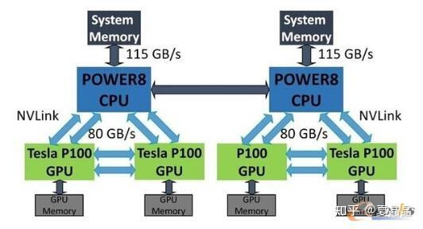
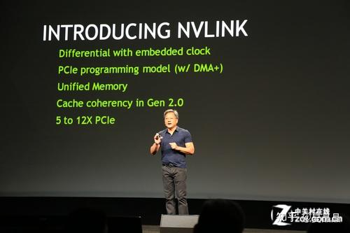
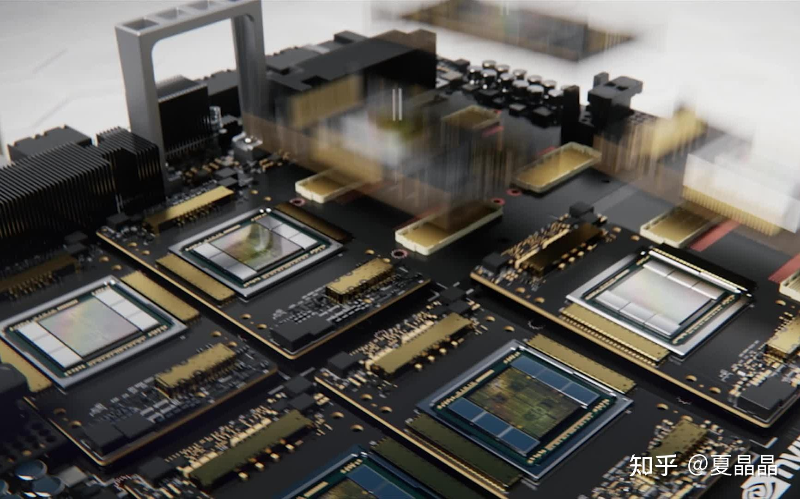
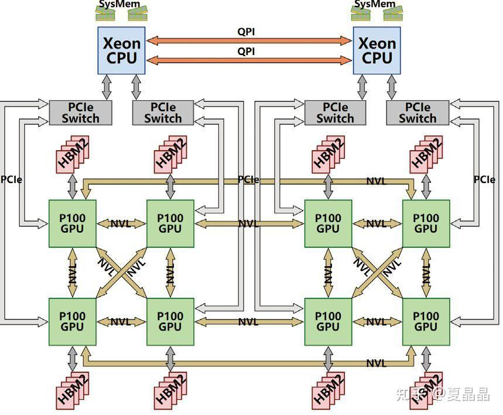
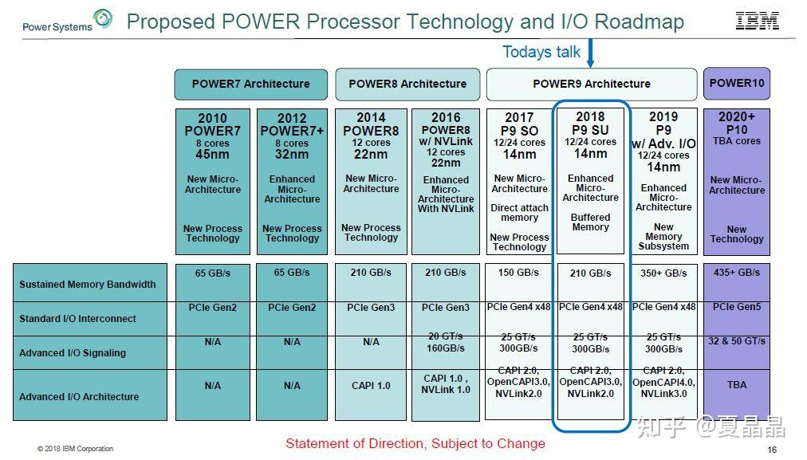
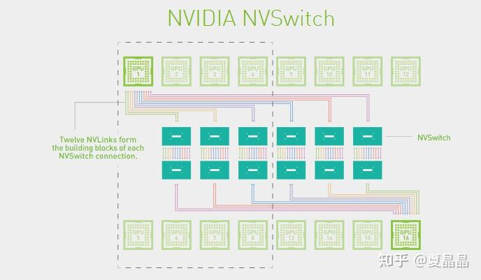
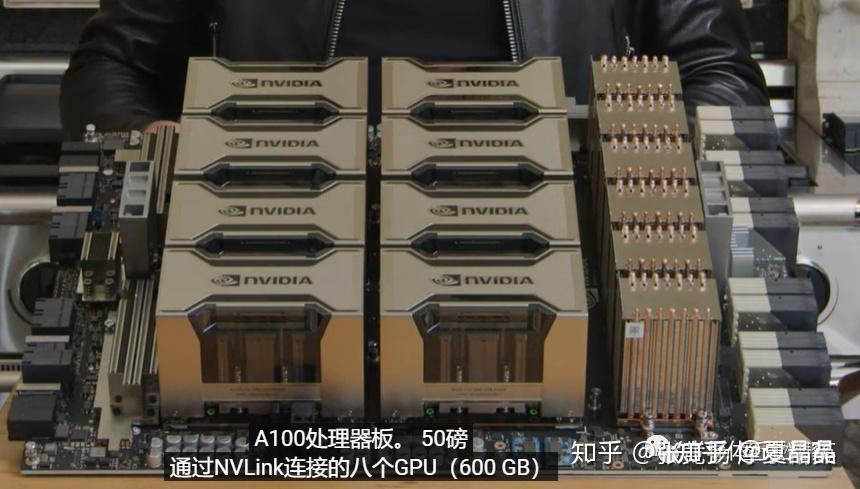
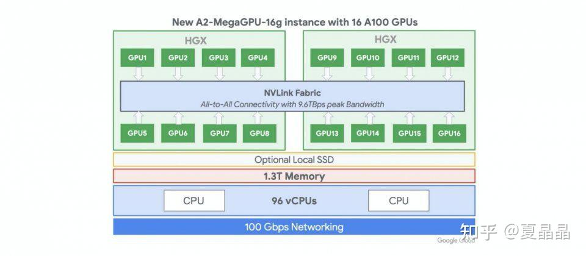

# nvlink那些事……

> **类型**: 文章
> **作者**: Dio-晶
> **赞同**: 1921
> **评论**: 65
> **时间**: 1687699293
> **原文**: [https://zhuanlan.zhihu.com/p/639228770](https://zhuanlan.zhihu.com/p/639228770)

---

写这个源自我在清华同窗一个技术八卦群聊起了nvlink的若干技术，然后就打算写一写我作为一个旁观者所见并试图还原的nvlink的历史。

首先申明，我没有在NVIDIA工作过一天，也没有获取一些非正常渠道的秘密信息或文档，但这不妨碍我把所有从公开渠道获得的零碎信息组装成一个相对完备的逻辑…………

大多数历史都是官方润色过的并故意隐藏掉细节的，nvlink也不例外。

正如一个博主所说，我们在谈到马嵬坡的时候，往往想到的历史就是杨玉环、李白、《妖猫传》，还有山口百惠，但是真正能够让我们以史为鉴知兴替的，是为什么是在马嵬坡？这一切究竟是怎么发生的？禁军的荣誉感和忠诚度呢？为什么面临帝国内乱，他们想到的第一件事情不是逃难，不是反攻，而是干掉一个叫做杨国忠的人？为什么干掉杨国忠那么重要？

甚至于最近的，为什么是那个厨子？

这个世界没有什么下大棋，历史的真相如果当局者没有总结，后人或者旁观者都只能通过一个个小故事的细节和关系，梳理总结成完整的逻辑。我希望通过推测尽可能看到Nvlink历史上的若干细节故事，还原出它的部分真实。

---

> nvlink的诞生

Nvlink诞生于超算 ：） 是的，超算。

在AI出尽风头之前，IT领域真正的技术探索其实都是依赖于超算驱动的，这是一个类似于攀登珠穆朗玛峰并沿途下蛋的持续性技术改良的模式 ：） 和当下AI驱动技术动辄就颠覆的模式相差蛮大，说不上谁优谁劣，最终都是优胜劣汰吧。

Nvlink的初始技术相当大部分来源于IBM，是的，IBM几乎是一切技术的源头。考虑到IBM那些年在美国的超算市场逐渐下滑，曾经的Blue Gene黯然失色，而Nvidia有恰好想在技术上更进一步，他们的结合以IBM的高傲大概率是Nvidia主动贴上去的，但也算得上郎有情妾有意，不过分手的时候也大概率Nvidia赚得最大。

IBM和Nvidia曾经是有过一段如胶似漆的日子。最简单的，你看业界的文档标注IO带宽的时候，只有两家是乘以二把TX和RX算到一起的，例如正常我们谈200G网口的时候，这网口就是8组25Gbps的Serdes，但IBM和Nvidia是唯二把这个IO标成400G的 ：） 后来被NVIDIA收养的Mallenox应该很不习惯。

Nvidia GPGPU的片上总线NoC看上去也有很多IBM的影子，我经常把IBM的NOC论文中的行为套到Nvidia上，几乎都对。

应该还有很多，我们能够找到关于这段感情遗留的痕迹。

嗯，回到Nvlink，它提出的主旨很简单，就是突破PCIe的屏障，达成GPU-GPU及CPU-GPU的高效数据交互，当年正是intel把持pcie最恶劣的情况，PCIe device之间的数据直通需要经过CPU才行(基于所谓访问安全的约束)。所以，那是2016年的秋天，橙黄橘绿，IBM的Power8和Nvidia的P100完成了基于Nvlink的灵与肉的结合，2+4，没有PCIe，产品是HPC。

> Nvlink的演进

- Pascal的Nvlink1.0的IO速率是20Gbps，8Lane per Port，每个Port 320Gbps（双向），这其实是一代不完全成熟的产品，因为这个Port的速率很独特，GPGPU内部微架构团队可能也还没有完全接纳。
- Volta的Nvlink2.0的IO速率是25Gbps，8Lane per Port，每个Port 400Gbps（双向），从此时开始，GPGPU对这个数字就锁定了。
- Ampere的Nvlink3.0的IO速率是50Gbps，4Lane per Port，每个Port 400Gbps（双向）。
- Hopper的Nvlink4.0的IO速率是100Gbps，2Lane per Port，每个Port 400Gbps（双向）。
- Blackwill的Nvlink5.0，没发布，但以此类推，大致就是IO速率200Gbps，1Lane per Port，每个Port 400Gbps。

我就好奇大了，Blackwill Next咋办呢？ IO速率400Gbps？ 1/2 Lane per Port ？

P：V：A：H：B的Port数量依次是4：6：12：18：24，以此递增芯片带宽160GB/s：300GB/s：600GB/s：900GB/s：1200GB/s。

很多人对单个Port速率固定，每代增加Port数量的方式不太理解：） 这其实是一个芯片快速设计的技巧，即每个Port的MAC在逐代演进中可以做到几乎不变或只是不断精细化打磨。

至于多个端口之间带宽怎样分配？ 其实也是解耦的，Nvidia采用了Swizzle随机+地址求模的方式均衡Port间的带宽（从这里你能看到Nvlink是多路径乱序的协议）。

下图是Nvlink在2016年诞生时，黄教主播下的种子，留下的期待 ：）

---

> DGX和HGX

大狗熊和黑狗熊，很多人傻傻分不清。

Nvidia最初推出的是DGX，2016年发布的第一代DGX-1，这玩意儿其实是一个单机，严格来讲，小型机。虽然当年数据中心建设虽然如火如荼，但Nvidia还是希望能以一个硬件system的模式，把一个Box卖给客户，并获得足够高的利润。君不见，这玩意儿浑身内外都涂满中东土豪的金色，差点就想告诉你你买了一块大金砖。

DGX-1差不多是15万美元左右，到DGX-2则到了40万美元，相比买单卡的溢价非常高，买到即亏到。

DGX并不适合世界上最大的IT采购商：Cloud，缺乏弹性，我猜它卖得并不那么好，当然作为旗舰产品撑场子是绝对合格。

简单的说，DGX V100的CPU连块网口都没配置，更不用提符合Cloud Service的DPU。

其实Nvidia也是到了Ampere的时代，才理解了数据中心的OVS ：） 其标识在于CPU开始配置独立网卡CX6并支持VPI。

大狗熊和黑狗熊长得是很像 ：） 但细节展开差别蛮大的。

今天讲Nvlink，那以V100 DGX vs HGX为参考，DGX的跨板Nvlink是通过背板互联的，而HGX的跨板Nvlink是通过线缆互联的。

就这么个点，至少就决定了DGX只能整机在Nvidia购买，而HGX是可以卖独立器件再OEM给浪潮、Dell制造组装的（后者是大型互联网客户的典型采购模式）。

其实呢，互联网的同学们也是骗自己，还在假装自己是买到了最便宜的白盒Device，然后做了高难度的DIY呢 ：）

<https://zhuanlan.zhihu.com/p/639181571>

---

> NvSwitch的演进

Nvlink至今到Hopper发展了四代，而Nvswitch至今有三代 ：）

也就是说第一代Pascal时期其实是没有Switch的，当年的一机八卡，是一种类似Cube的直连系统。

多卡系统做Reduce怎么都是跑不掉的，oh，holy shit，当年分析Cube直连系统，算Ring Reduce的路径覆盖最大化可真玩死哥了。我感觉应该很多人和我一样，纷纷给Nvidia留言了“fxxk”、“Damn”等信息，握爪。

Nvidia受不了了，既然这么多程序员的数学都是体育老师教的，那还是暴力全交换吧。

所以在Volta to Ampere之间的2018年，Nvidia推出了基于NvSwitch的DGX-2（HGX和DGX差别在于硬件设计，逻辑上两者是一样的）。

- Pascal只有DGX-1
- Volta有DGX-1和DGX-2
- Ampere及Hopper只有DGX-2
- 什么时候会有DGX-3呢？

nvlink2.0对应的Nvswitch1.0支持18个Port，每个port x8，IO速率25G，交换能力就是400x18 =3.6Tbps

nvlink3.0对应的NvSwitch2.0支持36个Port，每个Port x4，IO速率50G，交换能力就是400x36 = 7.2Tbps

Nvlink4.0对应的Nvswtch3.0支持64个Port，每个Port x2，IO速率100G，交换能力就是400x64 = 12.8Tbps

嗯，对数字敏感的同学有没有觉得很奇怪 ：） 为什么是18？不是16 = 2^4 ? 不是说好一机八卡吗？

因为爱啊！！！

这多余的两个Port是为IBM留着的，其他人都不配。

你不信？ 你打开你买到的DGX V100/A100的机框看看，所有的NvSwitch芯片，都只连接了16个Port，无论谁家买的，都有2个Port在哪儿，多情自古空余恨啊。Nvidia翘首以盼，整整等了两代，IBM都无法再次崛起重新入主超算领域，反而迎来了AI的爆发。我们从IBM流出的一张图可以看到，支持Nvlink3.0（Nvswitch2.0）的Power9原本是在计划中的(HC30)，但最终，IBM，那个男人，他没有做到他的承诺。

Nvidia固然从IBM得到了很多，但是最终它并没有辜负这段感情。

---

> Nvlink-Network的诞生

Nvlink-Network和Nvlink是两个东西，是两个东西，是两个东西。

为什么好好的有Nvlink了，还搞Nvlink-Network ？

这个问题的源头来自HGX的形态，为什么DGX/HGX-2 V100有8P和16P两种机器销售？ 但DGX/HGX-2 A100却只有8P唯一形态 ？ 下图是Nvidia官方的Nvswitch互联图。

下图是A100的HGX单板，黄教主端在手上，注意看最右侧，六颗NvSwitch芯片的右端，是跨板的Nvlink端口，通过这一组端口你可以将两张8P的A100单板组合成一个16P的HGX系统。

OTT负责基础设施的老板们啊，中国那花10亿美元购买A100的那个公司啊，打开你的机箱看一看，你定制的HGX A100单板，Nwswitch芯片的外侧端口，是不是悬空的？

为什么？ 难度微软给OpenAI提供的是一机八卡的HGX做训练，所以中国做AI的所有人，所有人都认为只能做一机八卡了？

哦，你画了几十万美元买的A100八卡板，他的NvSwitch3.0芯片，都在哭o(╥﹏╥)o啊，18个Port，其中两个Port永远地留给了那个男人，但是还有8个Port是悬空的啊，悬空的啊。

嗯，中国购买的所有NvSwitch3.0芯片，都只使能了8/18的Port。。。。。。。老板，快开除那些不上进的家伙。

这个世界上根本就没有16P的A100，对吧？ 不对啊，有一家有，如下，Google的A2-MegaGPU-16g实例，这是我在世上唯一找到官方的A100 16P系统。

[Google Machine Type a2-megagpu-16g](http://link.zhihu.com/?target=https%3A//gcloud-compute.com/a2-megagpu-16g.html)

微软和AWS都没有看到A100的16P实例，先不忙裁人，这事必有蹊跷 ：）

我不是Nvidia的架构师，不知道详情是什么。我只能猜测一个答案。

Nvlink这个协议其实不适合跨Board，对Cable不适。

大概率，Nvlink是做Nvidia做计算的同学主导的，类似Intel的UPI，做计算的人做IO，往往都图个简单粗暴，没有做强大的纠错码，也没有出错重传的设计，遇到丢包直接全机蓝屏。

勇敢地说，我是计算的，我做互联也是这德行 ：）

Nvlink1的速率是20G，Nvlink2的速率是25G，Nvlink3的速率是50G，Nvlink4的速率是100G，真的都是整数哦，你看，只有做计算的人才干的出来，网络的人不会这么莽的。

做网络的同学会用26.5625G、53.125G、106.25G，这种完全无厘头的频点，这也是大多数Cable和Optical Fiber的频点。

此外，16P的A100系统，两个单板之间需要互联64x6 = 384 Lane需要互联，无论是cable还是Connector，大致上都有非常巨大的工程问题。

为什么Google搞定了？ 为什么技术不能复制到全世界？ 不知道。

但我猜Mallenox的同学被Nvidia包养之后，来了IO的同学，一看，这队友是在送人头 ？ 扶了一把。

所以，就有了Nvlink-Network。

Nvlink-NetWork大致上是按照网络的方法做了协议改造，对，你打开Hopper驱动，历历在目，100G频点之外，多了一个106.25G，IB的Sharp也被融合到Nvlink-Network放到了Nvswitch内部（驱动都没变）。

收购Mallenox是Nvidia最成功的联合了吧。虽然从近期GH200的故事来看，Nvlink-Network的领域在逐步扩大，已经到了256，下一跳，肉眼可见的范围内，Nvlink-Network会吃掉IB。以色列人可能也无所谓吧，毕竟股票赚了那么多。。。。。。。

最后露一个值个几万块的Nvlink-Network的秘密 ：）

Hopper的Nvlink带宽是900GB，要在这么巨大的带宽上同时满带宽支持Nvlink-Network需要的特性，包括重传、纠错、编码等，GPU宝贵的Silicon面积会被耗掉非常多，至少1000个CUDA Core起步吧 ：）

我给的答案是：只有GPGPU+Nvswitch才能组合出完整的Nvlink-Network，懂得自然懂。

---

> Nvlink-C2C的诞生

先说结论：Nvlink-C2C是个错误的技术路径。

我仿佛记得Nvlink-C2C的主架构师Dai dai是我大学同学 ？ 有这么个模糊印象。

如果单纯从技术的角度，Nvlink-C2C真的是一个恰到好处的设计，挺佩服的。增之一分则太长，减之一分则太短，信号速率低了，PCB会变贵，信号速率高了，功耗会变高。

但是Nvlink-C2C从系统来讲，并不是个好选择。

总遇到有些人，把NVIDIA当做宗教信仰一样崇拜，把黄教主说的就当做圣言。

嗨。

- 为什么要绑定Grace+Hopper的1:1配比？ 那下一代Grace+Blackwell也是1:1 ？
- 为什么每个GPU只能配搭500GB DDR容量？ GPU这么贵，就不能一颗GPU搭两颗CPU带1TB DDR吗？
- 为什么要配搭高价销售？ 爱马仕卖中国人就一定要配货销售吗？
- 为什么不就用Nvlink？Nvlink C2C是900GB带宽，也就x36Lane的Nvlink4罢了。
- 资源池化、池化、池化知道不？

嗯，你会说，Nvlink-C2C功耗低啊，号称是PCIe的1/5啊，话是没错，可这省的功耗大致是多少？ 算一算啊，不到10W！

你明白了吗？ 在一个700W功耗的GPU上，有一个技术省了10W，作为一种噱头，高价卖给你，你是不是赚大了？

你已经回顾了Nvlink的整个历史，你的心中应该有一个正确的答案，最佳的搭配，应该是IBM+Nvidia那种，让CPU和GPU都支持Nvlink，然后通过NvSwitch应该做非2^N的Port数量，方便搭配，GPU和CPU基于NvSwitch做全交换。当前Nvlink-C2C所号称的所有好处，DVM、Cache Coherence，都是能够拿到的。

为什么不呢？ 我猜Nvidia收购ARM最终没有成功，虽然魔改了ARM的NoC，但是想在ARM的Memory Model中加入Nvlink接口，水平不够。

嗯，我上我可以的。 ^\_^

---

这些大致是截止2023-06的Nvlink的历史了，从最初的超算想要脱离PCIe的束缚为起点，到现在不仅仅自身不断在前进，还不断侵蚀周边，向上打IB，向下吃Chiplet，都是可以载入人类计算机体系结构的历史。

但这些大概率都不是其诞生的第一天就规划好的，他更是像一个活物，随着环境的变化和各种机缘巧合的事件触发，不断膨胀、进化、吞噬，螺旋上升，但天下并无长生不灭者，有生之年，一起扶阶而上吧，希望我们可以看至终章吧。

---

*由知乎爬虫生成于 2026-02-01 15:39:00*
