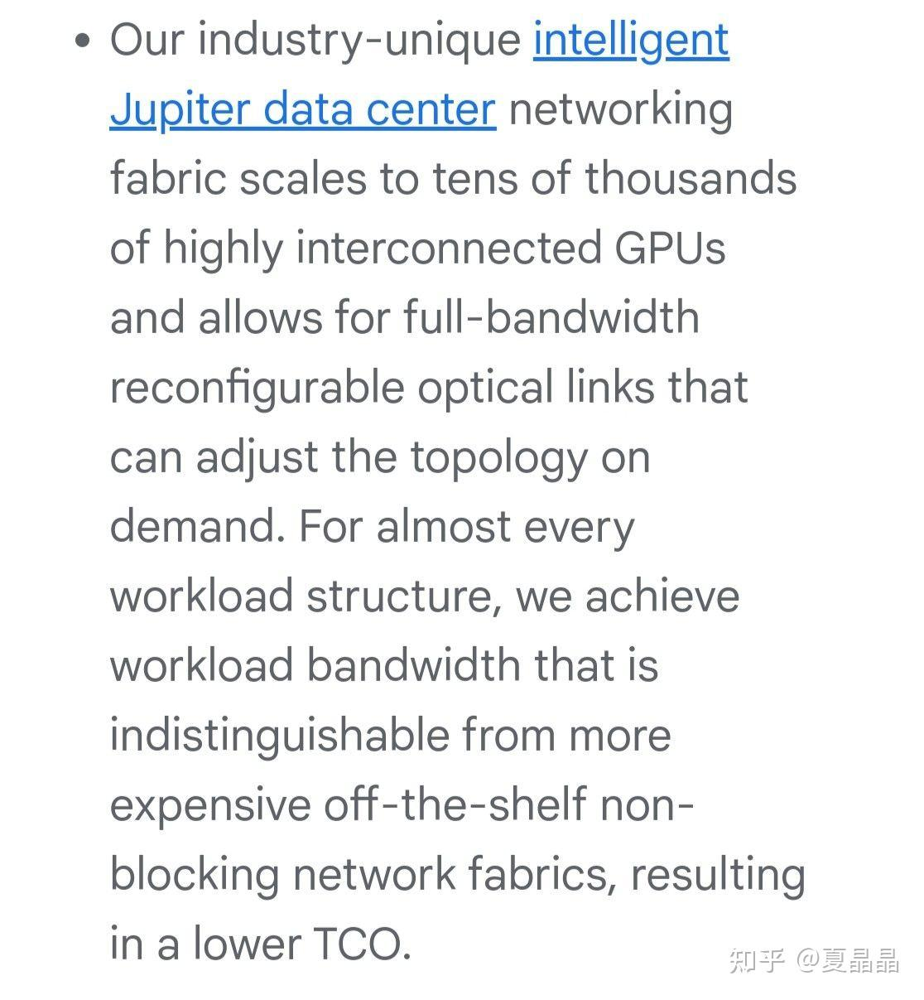
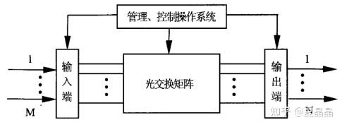
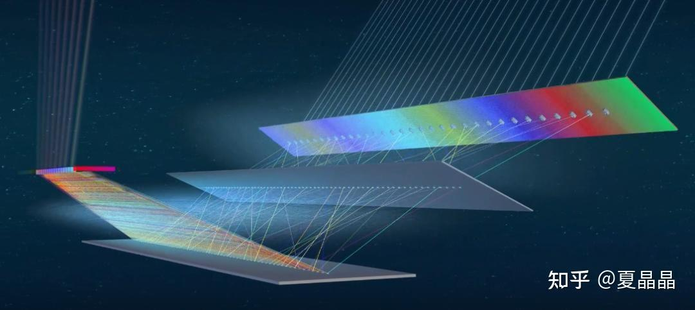

# AI DC的参数面互联最优解是OXC吗？

> **类型**: 文章
> **作者**: Dio-晶
> **赞同**: 187
> **评论**: 21
> **时间**: 1684060500
> **原文**: [https://zhuanlan.zhihu.com/p/629283582](https://zhuanlan.zhihu.com/p/629283582)

---

> **先说答案，我认为 是！**

今年来google公布了两篇重量级的信息。

一个是TPUv4，一个是他家的H100GPU集群。

TPUv4有一篇论文，论文的标题是《TPU v4: a optically reconfigurable supercomputer……》，下面这篇翻译已经算不错的了，其他多数翻译稿都没把optical当回事，都是以芯片666为核心。

[从Google TPU v4看AI芯片的未来](http://link.zhihu.com/?target=https%3A//mp.weixin.qq.com/s/OjsFYfu1MnAfNxTs0FdT9w)

其实我开始也没把optical当回事，毕竟Google就是个喜欢花里胡哨的公司，TPU是个内部的DSA，那明明electric能搞定的，换成optical既可以忽悠创新又能写论文，我上我也会。

直到我看到了下面这第二篇。

[https://mp.weixin.qq.com/s/Poc82h7P0Ap6l9YO\_f7RSw](http://link.zhihu.com/?target=https%3A//mp.weixin.qq.com/s/Poc82h7P0Ap6l9YO_f7RSw)

这篇也是中文，漏信息了，得看英文……

要开VPN

[https://cloud.google.com/blog/products/compute/introducing-a3-supercomputers-with-nvidia-h100-gpus](http://link.zhihu.com/?target=https%3A//cloud.google.com/blog/products/compute/introducing-a3-supercomputers-with-nvidia-h100-gpus)

Google不仅仅在研究玩票的TPU上玩OXC，而且在真正生产力及外卖的H100GPU上部署了OXC。

---

那首先OXC是什么?

就是光互联交换系统。

三句话解释清楚:

- 当前的交换机都是电交换。你说有很多光纤？ 没错，但那是光传输，不是交换。数据中心的数据交换当下都是电发射-光传输-电交换-光传输-电交换-光传输-电接收，转换很多，一看就亏。
- 光交换的问题是什么？切换速度慢！毕竟是光，你可以用铁路和公路的差别来理解，光路就如铁道线，A to B要改成A to C，得切道岔，很慢，ms级别延迟，没法处理城市公路那样的频繁复杂交互。
- 光交换原理是什么？ 其实是一堆反射镜。把一束输入光反射到某一个输出口上，网上介绍很多，如下图。不可以出现多束光打到一个出口的情况，所以管理比较复杂。

---

> 光交换好处是单节点(毕竟就是一堆反射镜)可以做到比电交换更大规模，也就是可以用更少级数完成互联，效率高，而且少了很多转换能效也好。  
> 但光交换一直以来卡在切换延迟太大，一直是没法在数据中心使用的。

> 直到google告诉你，用在 AI DC！

---

这个答案其实很简单，很多你一直想不明白的事情，也许就是某个人突然当头一喝，你就明白了，艹，这样啊。

首先，你得有或者将要有数万颗GPU或者NPU。

然后，你希望把这数万颗GPU放到一个大池子里面，池化。

当前GPT类大模型大家都看得比较清楚了，千亿级别的模型，用大概1000颗GPU就够了，但你内心又很担心万亿模型可能需要更多颗。所以最好是把手上的GPU尽可能集中到一起，让一万颗GPU既可以协同起来训练一个超大模型，也能随意拆分成若干个N\*8的资源，卖也好，自用也好，都相当方便。当然如果你家公司内部诸侯割据，各建私军，那打扰了。

如果以NVIDIA的GPU为参考，2*CPU+8*GPU为一个node，当然，只有cpu或者gpu是没法工作的，所以你还得插网卡把这些node互联成大池子，问题就是在这里。

通常来讲，cpu侧会出1-2个100Gbps的网口，不出意外的话，这个网卡是各家云厂商自定义的DPU，例如神龙卡之类。这个平面负责的是控制面和存储面，这个平面和正常数据中心网络没有差别，不需要OXC，不需要，不需要，不需要。

问题在GPU侧，GPU之间还需要一个额外的参数面网络。正如我在这个帖子提到的。

<https://zhuanlan.zhihu.com/p/620992759>

用1024张A100训练GPT，8P一个Node，在Node内模型并行， 然后按8个8P（64P）做8级流水并行，然后16组8x8做Batch 16的数据并行。。。。。。你主要需要用这个参数平面网络传输流水并行数据，带宽比控制存储网络需求大很多。

也许NVIDIA给你的第一推荐是nvlink-network超节点，嗯，你稍作思考 就会认识到这货在数据中心部署就是个笑话，你的可选是nvidia的第二推荐: 他家的IB卡，或者外购某个RDMA网卡。

然后就是一个吓死人的数字。

2CPU+8GPU，两颗CPU只需要1002=200Gbps带宽，但8GPU，艹，要效率最高得配8张400G卡，400\*8=3200Gbps。

***你有两万颗GPU，每个400Gbps带宽，没算错的话，总交换带宽是8,000,000Gbps，8Pbps。***

AI专属的，相比标准DCN 16倍且要做到二分带宽不收敛的第二平米网络。知道要多少代价吗？

如果是纯IB网络只能买mlx家卡和交换机，再加上光模块，这个网络的建设成本会最高做到数据中心的20%，当然比起GPU卡算不得贵，有钱人可以无视。

但问题还是在交换级数上，这么大带宽如果交换机口不够，这fat tree可能得做4-5层？ 这么多层的交换，毫无疑问又影响了训练效率。以及大量的光——电——光——电——光——电……你真的不是给光模块厂商打工吗？

你当然可以选择降格到200G卡，或者8卡只出4口之类贫民化策略，但是前者依旧影响AI训练效率，而后者，会让tensor并行和pipeline并行抢带宽，算法人员要是没做好，损失不可控，GPU那么贵都买了，效率还低下的话……做硬件的同学会被裁掉的。

---

所以，你一看Google你就明白了，这里有个机会。

再看一遍。

用1024张A100训练GPT，8P一个Node，在Node内模型并行， 然后按8个8P（64P）做8级流水并行，然后16组8x8做Batch 16的数据并行。

主要跨node带宽是pipeline并行。

P并行的特征是一段时间只会有固定且同号GPU传输数据，即单个网络训练期间，如果零碎分布在DC的nodeA、nodeB、NodeC被调度使用并行训练，那么有且只有A to B to C的确定性流量，其中B只有A in和C out的互联，不再有其他互联。直到训练完成重新分配资源切换topology。且此外任意node的pn(n=0-7)只会和另一个node的pn交换，即如果没有tensor并行或者moe，系统只有同号GPU的数据交换。

> 一句话: AI DC的参数面数据交换在训练周期内的主要流量的路由几乎是固化。

这不是几乎完美匹配了光交换？

OXC切换慢在AIDC毫无问题，而更大的交换规模可以大幅降低GPU大池子的fat tree互联的级数，还能降低交换功耗，额，对了，还有完美的多用户隔离功能，更重要的是，可能可以大幅降低交换机和光纤的建设成本……毕竟GPU的成本必须付，系统费用非必要不能浪费吧。

---

最后，问题来了？

> 国内的各大GPU云，谁家有部署OXC的技术能力呢？

---

*由知乎爬虫生成于 2026-02-01 15:39:00*
