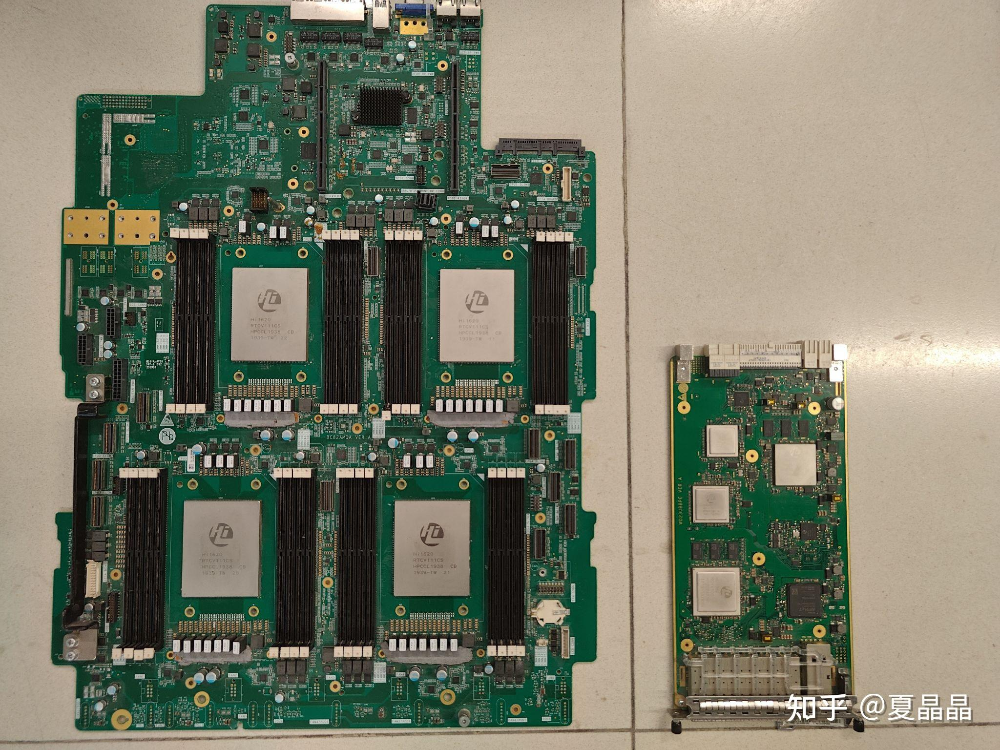
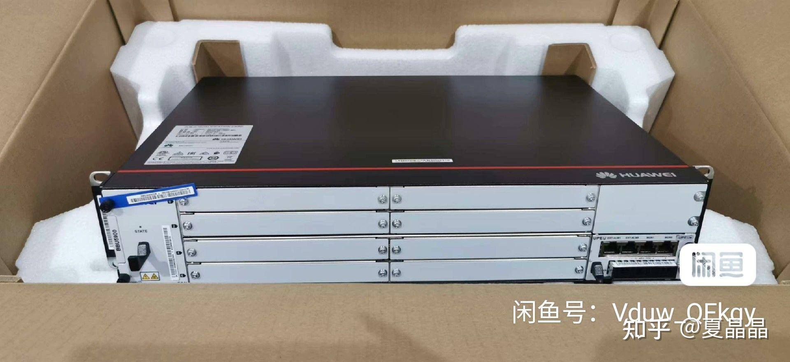
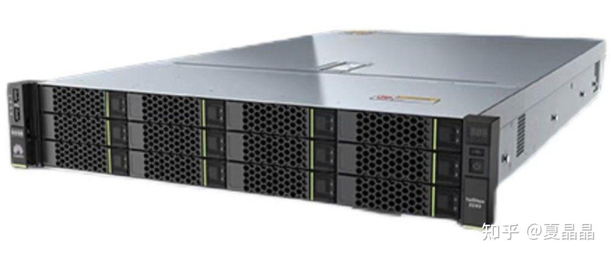

# DSA的翻身路

> **类型**: 文章
> **作者**: Dio-晶
> **赞同**: 93
> **评论**: 25
> **时间**: 1683022581
> **原文**: [https://zhuanlan.zhihu.com/p/626287371](https://zhuanlan.zhihu.com/p/626287371)

---

<https://zhuanlan.zhihu.com/p/619717622><https://zhuanlan.zhihu.com/p/620992759><https://zhuanlan.zhihu.com/p/624463524>

上面几篇文章，虽然文风和叙事方式各不相同，并且还略影响阅读 ：）

但如果能理解和总结的话，大致上当前DSA的困境差不多都讲到了 ：）

很难办啊。

但你要说DSA是失败的，我转身就看到了桌上藏品中的一个成功案例，那又怎么算呢？

都是咸鱼买的……不涉密

左边是4路通用服务器，通用计算。

右边是无线基带板DSA，4.5G基带处理专用。

两个设计我都有参与，底层设计上并没有本质不同，右边虽小但比左边赚钱多了。

即使伴随着二十年来摩尔定律的黄金周期，无线网络DSA这个形态也发展得相当好，虽然也有CRAN、ORAN等代表牧本定律的通用路径出现想要替代或白化，依旧也无法动摇无线网络DSA的蓬勃发展。 [@mackler](http://www.zhihu.com/people/59f76a6c40b262c91e0e8b9dbb100168) 认为DSA缺乏摩尔定律的roadmap，那无线从2G到3G到4G到5G到6G，无疑是一个完美的DSA摩尔定律了。

无线DSA成功的秘密是什么？

我尝试地给出两个DSA可能翻身做主的理由。

---

> **第一，标准化和解耦**

我冒昧猜测patterson教授可能没有实操过一个产品项目。

在他的演讲和笑容中你都看不到他关于项目管理复杂度的解法。

通用处理器的项目通常很庞大，毕竟涉及广泛，但出乎意料的一点是，决策链很短，基于IT领域数十年来不断的分层解耦，每个层次只要能保证各自的松耦合高內聚，大部分决策可以在各个层次的独立决策链中闭环。

但DSA呢？虽然基于domain的局部空间，项目范围可以相对精简，但是决策链条极其麻烦，也许是微架构的一个小变化，也可能直接影响到解决方案的界面甚至于用户的使用方式。垂直拉通看上去很美好，但公司大了之后，牵扯的人变得多之后，你会真实地发现，不同的人会有不同的立场…………不是所有人都是为成功而努力的(其实很多人并不是使坏啦，他们仅仅是把自我的成就感和权威放到了第一优先级)，然后呢，反正事就砸了。

无线这个领域很奇葩，居然有一个3GPP的标准组织，甚至于还搞出了cpri之类的domain领域标准接口。这其实就是标准化和解耦的模式了，为什么无线这个domain能发展出标准组织？仅仅是因为这个domain市场空间足够大？怎么触发的？ 如何复制？

这是个遗留问题，我还没答案，值得细细琢磨。

---

> **第二，基于领域互联的定制集成**

如果我们买一个通用服务器，再买一个无线基站设备。

就是上面这两货。

其实，他们最终的硬件形态是类似的，都是以相同规范的chasis插入相同规范的Rack内。

嗯，你说无线设备的Chasis密度高，能放更多，这其实不是关键，大多数基站的柜子空闲都还挺大，功耗比密度更优先。

但问题的关键确实是集成度：） 特别是定制化的集成度

标准服务器之间的互联协议是PCIe和ETH，这两个IT领域协议，前者存在的意义是以CPU核心的Tree结构，没法支持复杂的topology和数据流交换，后者的意义是更大范畴的松耦合互联。

无线自有的互联协议和组网是其DSA成功的关键，以Domain为目标的专用互联系统是DSA可能成功的关键。

所以Nvidia才有Nvlink，Tenstorrent和Tesla Dojo都做了自有协议的Torus互联。

> **DSA要能成，仅仅一个Domain Specific Accelerator是不够的，还需要Domain Specific Interconnect，即需要做到DSA+DSI，最终得到Domain Specific System，DSS才是最终胜利的形态。**

---

加油吧，DSA。

嗯，不过呢。如果我某天失业了，我倒想去试试ORAN…………哈哈，剑有双锋，我基本能理解无线领域DSA的成功原因，那么反过来……

---

*由知乎爬虫生成于 2026-02-01 15:39:00*
