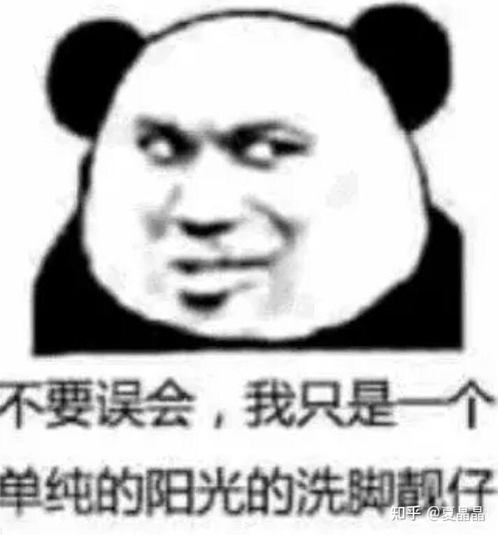
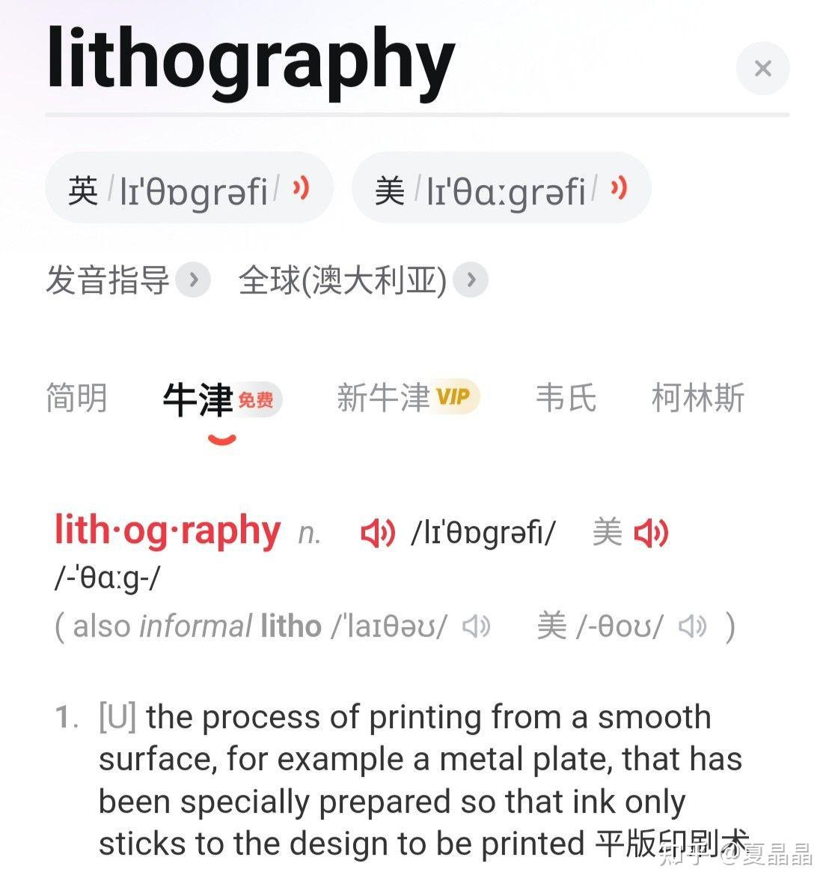
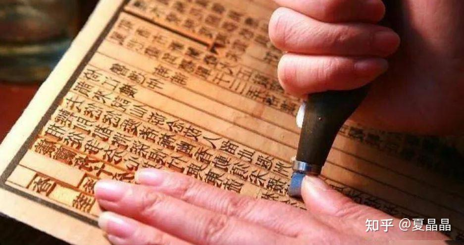
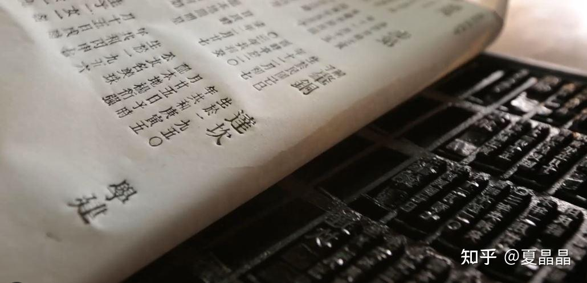
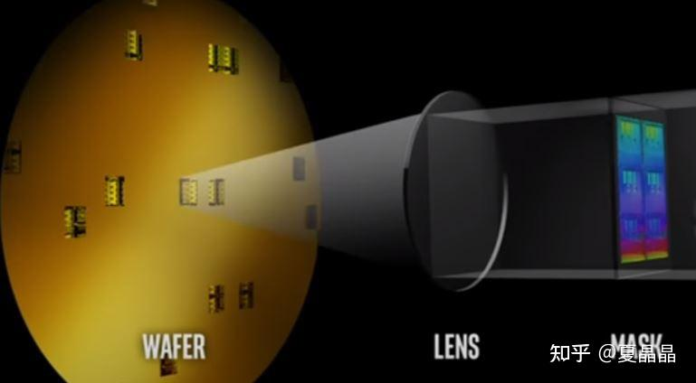
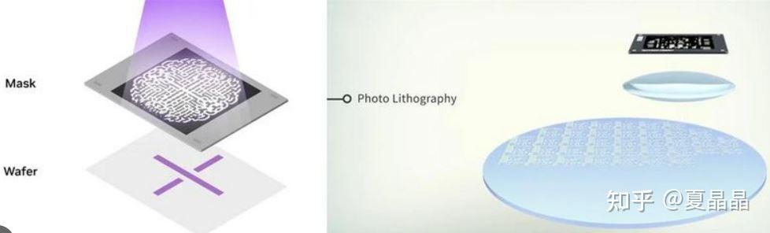
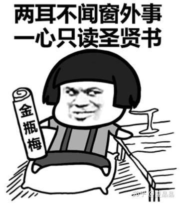
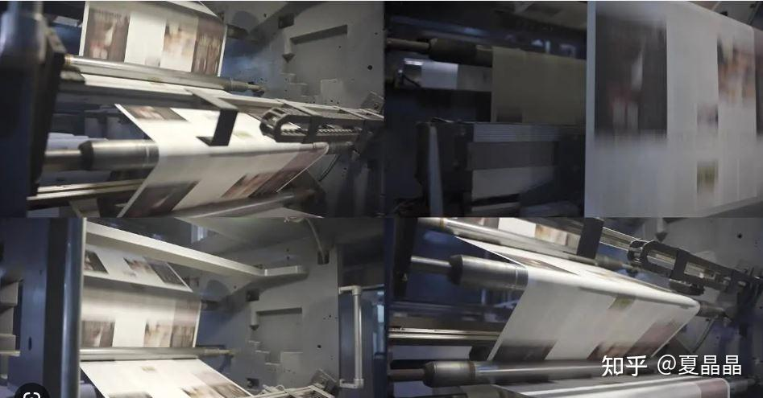
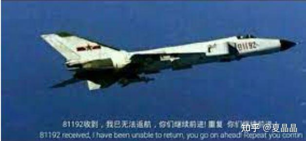

# 光？刻？机！

> **类型**: 文章
> **作者**: Dio-晶
> **赞同**: 148
> **评论**: 21
> **时间**: 1683002555
> **原文**: [https://zhuanlan.zhihu.com/p/626250796](https://zhuanlan.zhihu.com/p/626250796)

---

写这个帖子原本是看到了一个问题，本想直接回答，但想了一想还是写文章发图来得自在.......

[为什么造芯片要用光刻，而不用电刻或其他物质波蚀刻呢？](https://www.zhihu.com/question/594628534)

这事其实要怪就怪汉字的博！大！精！深！（你看这成语就很色色噢）........写这样的词就真的很容易让人误会。

光刻机的原本大家通用的英文是：lithography，像Nvidia最新推出的加速光刻的计算库就叫做cuLitho。给个牛津翻译，如下。

> **lithography的真实翻译是：光！印！机！ 是谁翻译的光刻机？是谁？**

一个刻字和印字的差别，我感觉几乎误导了整个中国对这玩意儿的理解。

这个是刻： 刻的特征是笔和划的延伸

这个是印：印的特征是整图形的复制

---

作为四大文明古国的四大发明之一（1/16），所有看得懂这些汉字的人都应该接受过老师的教育，应该能理解活字印刷术相比刻字、抄书带来的技术和效率的进步的价值。

> **ASML的光刻机的真相，他其实是：昂贵的高效的集成电路印刷机。**

下图是光印机的基本原理，以光为墨、以Mask为模，以Silicon为纸，把纳米级的电路Cell印刷出来的机器。

所以原答案其实并不复杂，可以。

你看着光刻的过程，本身以Mask作为模板，那么模板的精度其实和最终印刷出来的cell是一个量级的，当然我知道这里有个Lens，但为了解决DPC问题，Mask的精度局部是要更高的，你看Nvidia show的这花儿（Mask上的图案），不比最终真实Cell图案来得复杂？

所以，确实世界上有很多可以进行更高精度的雕刻的方法，但是，这是光印机。

### 而印刷的本质是：**复制的效率和成本！**

---

正如我经常忽悠，芯片的制造流程其实都是小学数学题。所以我尽可能用简单的数字算一下，就像替我儿子做作业，啊，计算同时开着水龙头和下水道，几分钟把水池灌满一样，要是计较为啥要同时开水龙头和下水道你就输了。

开始。

一颗Apple CPU的面积大约是**100**mm2，按5nm的A15算官方报的数是**15** Billion个Transistor。

首先，Transistor数量和Instance数量并不相同，但正如小学生不需要学习相对论，我们暂时把Transistor理解为一个cell，对比为一个汉字，这些Cell被放在TSMC的印刷字库中，可以理解为有数千个基本汉字，Apple的码农把这些数字编排成了一本大家都喜闻乐见的《金瓶梅》，有**150**亿个字那么长，你经常沉迷其中。。。。。。。

Apple的一本《金瓶芯》需要大约**70**页，也就是需要**70**张Mask模板来印刷。

但因为《金瓶芯》实在很抢手，所以你印刷用的Mask，也就是活字印刷模板你会做得大一些，一次印刷能印好几本，印完再切割开就好。一块Mask是**850**mm2，你可以在一张Mask上同时印刷**8**本书（模板Mask会部分有浪费，问题不大）。

最后，一块Wafer是12寸，代表着总面积是**70000**mm2，即你理解为印刷纸比印刷模板还大很多倍，这很正常，电影里面你见得多了，如下图，都不是事，也就是每张纸你用模板还得印刷很多轮呗，最终反正是裁纸再装订。

你看，规模出来了。

可以拿电筒 感受一下，对着墙，小圆钮一按光一闪，就那一刹那，1000亿个晶体管的1/70，或者等价为100亿个完整晶体管(数量超过地球人类总数)，就被印刷出来了。

每张Mask，需要在Wafer上印大约**100**次（Wafer是圆的，Mask是方的），即要光照100次，每次光照都会印刷8本书的1/70部分，因为边缘和良率的损坏，最终每张Mask会有**500**本书的**1/70**部分被印刷。

---

规模代表了什么？

每张Mask在每张Wafer上的印刷费用，假设DUV是$50，EUV是$100，小学生也会先假设嘛。

光印机的吞吐量假定是5000 Wafer/Mask (也就是每天机器光源发光500000次)，每年工作333天，3年折旧完，那么EUV的设备成本和三年运营费用是5亿美元，DUV是2.5亿美元。和传言和假设中的是不是差不多 ：）

Apple的A15芯片，需要印刷70次EUV（实际上我知道不会，但小学生计算不要太复杂），也就是$7000，加上其他流程和工厂要赚钱，每个Wafer最终算$15000吧，拆分到每颗Apple芯片的die成本，就是$30，算RMB ￥200吧。

每台光印机，具有每天印刷5000/70\*500\*15B = 500Trillion个完整晶体管的效率。

我的天啦。

你知道《金瓶梅》的字数是多少吗？ 无删减的版本大约是100W字，正版书也算￥200吧，即你得到的是5K字/￥。

Apple的A15《金瓶芯》可是150亿字啊，以我能帮我家小孩代笔数学作业的水平，没算错的话，应该是75000K字/￥。

这就是晶体管印刷术的Mass Production效应，你利用了一台大约5亿美元的设备，印刷出让最平凡的个人也能获得的75000K晶体管/￥的昂贵、高效的技术，这是当今人类科技跨越千年，吓得毕昇都要诈尸的进步尺度，真的值得赞美。

---

你要问没有什么磁、电、重力的方案造芯片吗？

也许有，但得用数学算一算能不能做到。

更昂贵的设备，但更高的晶体管吞吐率，N超过500Trillion晶体管/Day，成本低于75000K晶体管/￥。

更便宜的设备，用更多的设备数量弥补，n\*m超过500Trillion晶体管/Day，成本低于75000K晶体管/￥。

这事其实很难，不是知乎回答一下问题那么简单，但没办法，还是要做，从那一刻起，只能进，退不了了 ：）

---

*由知乎爬虫生成于 2026-02-01 15:39:00*
