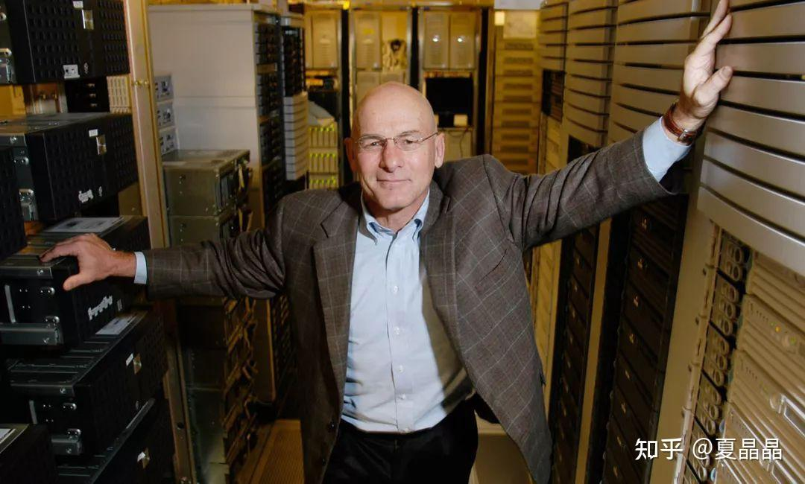
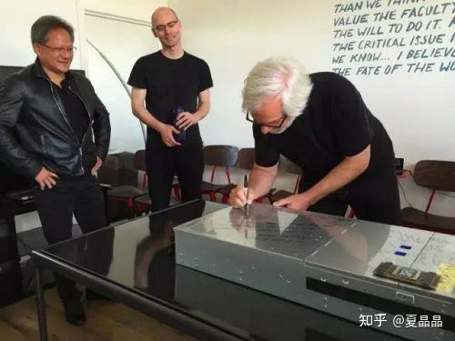

# DSA死了吗？

> **类型**: 文章
> **作者**: Dio-晶
> **赞同**: 344
> **评论**: 35
> **时间**: 1681216096
> **原文**: [https://zhuanlan.zhihu.com/p/620992759](https://zhuanlan.zhihu.com/p/620992759)

---

看到一位熟悉的同学发了一篇悲观的帖子 ：）

[mackler：DSA已死](https://zhuanlan.zhihu.com/p/619717622)

一边看，一边就有一种古藤老树昏鸦，那乌鸦凄凉地嘎嘎飞过的既视感，ε=(´ο｀\*)))唉，做不下去喏？

DSA

┏┛墓┗┓...(((m-\_\_-)m

死了吗？

要我说，还没死、但也可以说快死了。

你看我说话多好听，谁都不得罪。

---

先说DSA本身没有死。

如果我们再把David Patterson教授2018年12月在UC berkeley的演讲材料打开看，一些事物的发展固然和他预测存在偏差，但大的基本面没有出现重大问题。

***Patterson说：Only performance path left is Domain Specific Architectures (DSAs)***

1、摩尔定律在逐步停滞，还有Dennard Scaling问题，以及CPU/GPU这么多年蚕食DSA带来的ISA臃肿，体系结构的需要新的革命带来驱动力。

2、通过放弃通用性，专注于一个领域来获取定制化的PPA收益（衍生DSL的软硬件接口）。

3、芯片的规模化越来越大，开发负担逐渐在超越芯片的收益，领域定制化可以带来简化和快速的收益。

mackler同学觉得一个领域固化且有收益，就会被gpgpu加几条指令吸收吃掉了。

太阳底下又没有新鲜事 ：）

体系结构这么多年来，一直都有着一个牧本定律的，就是每十年一个特性就会在定制（DSA）和通用（GP）之间经历一轮摇摆，并不是什么新鲜事，最喜欢把固化的领域特征变通用的还不是GPGPU，而是CPU。每次某个定制应用快稳定了，就加几条ISA呗。。。。。。。

但世间的一切都是等价交换的，虽然Patterson教授当时可能确实没想到摩尔定律在TSMC的疯狂push下还在续命，但是你看其他的约束变量其实都还在他的预判之中。

光看见贼吃肉，没看见贼挨打。没有人是活得很容易的，GPGPU在CUDA中加入TensorCore，甚至于再加入Transofomer Engine，并不是没有负担的，都在负重前行，换个角度你再看，做CPU的人是否增加几条ISA，那CPU能不能也把Transformer给吃掉？简单讲理论是可以，但背地里其实很艰辛的，背负的过往和新增的未来都要承担，远远比不上DSA那么轻装上阵来的高效。即使是Nvidia，GPGPU的复杂度和开发代价，还能抗多久？

所以，即使在今天，如果一个真正的DSA，在Domain上已经放弃了广谱领域的范围，还不能把这一份付出的代价交换成为相比GPGPU的PPA收益，那只能说这个Domain选择上有问题，或者你实际上做得太通用了，或者直白一点，你还不够做GPGPU的同学努力啊 ：）

数据格式需要做那么全吗？能不能专注到Transformer？CV和NLP已经死了，放弃吧！

不要把DSA做成GPDSA啊，没有GP的命却背负了GP的病不好。

如果我们最终明确SIMT的廉价并发可以获得Embedding的以查代算能力，Matrix可以获得集中式的以算代查能力，那么能不能回归到DSA的本质，回归到基本的Matrix Engine+Graphic Engine最小级，我就不信做到这个程度之后还打不过兼容Graphic、HPC、AI的SM。

指令的精简、PPA、开发效率，都是可以换算成生意的得失的。

---

但是呢，不得不承认的是，我又很悲观，在AI大模型领域，DSA未来几年可能真快被玩死了。

不是DSA在PPA上打不过GPGPU

而是。。。。。。

如果一个题目本身的复杂度就非常巨大，这个复杂度的增长已经大于了摩尔定律的PPA收益或者DSA的定制交换收益或者芯片开发的难度的话。。。。。。。

AI通用大模型，如果我们把这个问题比拟成哥伦布寻找新大陆，无数的航海家、冒险者、江湖骗子，面对未知的大洋和风暴前仆后继地前进。

嗯，有一个人发现了新大陆，哥伦布，噢，OpenAI，而且给出了他的航海图。

你照着抄的话，很有可能也能找到黄金国，当然，也许还有其他捷径，以及可能真正的目的地丝绸之国。你怎么选？

如果没有意外的话，你会照抄 ：）

即使GPGPU不是AI大模型的最优解又如何？

我相信要是我上也是一行不拉地照抄！

嗯，你会买1024张A100，8P一个Node，在Node内模型并行， 然后按8个8P（64P）做8级流水并行，然后16组8x8做Batch 16的数据并行。。。。。。

你甚至发现，ChatGPT的模型尺寸都能几乎恰好地放到这个规格里。相当于抄袭还有人递纸条啊！

想一想，为什么世界会这么完美？

对，Nvidia甚至给了H100 NVL方案，两块卡，1750亿的参数量，啊，160GB容量放不下，好，加点钱，188GB容量只需要加点钱那简直是雪中送炭。

其实你内心知道，HBM这么贵的东西，怎么可能用来做真正上亿用户Inference......

但你已经被PUA了，要啥DSA........AI的形状就是Nvidia的形状，你是否已经没有再开一条路的决心和勇气了。

君不见，同样在做AI DSA的Tenstorrent和Jim Keller，他都被迫在卖IP了，虽然说赚钱不寒碜。

[Jim Keller究竟在做什么芯片？-36氪](http://link.zhihu.com/?target=https%3A//36kr.com/p/2194694482708608)

当然，这世间还有人还在战斗，例如google：[TPU v4: An Optically Reconfigurable Supercomputer for Machine Learning with Hardware Support for Embeddings](http://link.zhihu.com/?target=https%3A//arxiv.org/abs/2304.01433)，若还能赢，还能找到一块新大陆新航线，一切都还有希望，否则未来可能是黑暗的。

> **摩尔定律重来就不是什么物理规律，而是一种垄断宣言(你还不能反垄断)。**  
> **如果大模型的尺寸增长规律与Nvidia的硬件每代升级的曲线达成了某种契约，AI的DSA就死定了。**

---

写到最后，再点燃一点火花吧。

算法是一切的起点，当我们看到老黄赠送OpenAI设备的时候内心应该多想几步棋的。

我们应该想到老黄当年可能送了100台DGX，照了100张首次赠送的照片：）

但更应该想到的，是今年OpenAI拿到的DGX，肯定不会再是80GB的H100大路货了，也许是120GB，或者也许不再是8P的DGX，而是16P和32P（Nvswitch可以组出来的这个尺寸的）。这样盘下去，他们也许将真正掌握未来。

不能这样任其疯狂了。

你甘愿这样被人把控吗？

更大更强更自主的AI，只有真正做DSA的男人才能把握在手中，别只想着离婚割韭菜了。

---

*由知乎爬虫生成于 2026-02-01 15:39:00*
