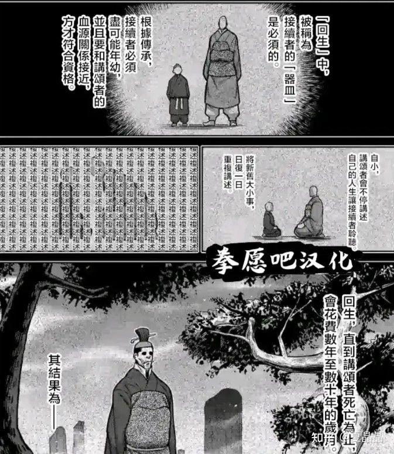

# 论人工智能的真实和ChatGPT

> **类型**: 文章
> **作者**: Dio-晶
> **赞同**: 420
> **评论**: 65
> **时间**: 1676799606
> **原文**: [https://zhuanlan.zhihu.com/p/607604879](https://zhuanlan.zhihu.com/p/607604879)

---

网上有一篇分析ChatGPT的文章引用了曾经著名的一部科幻小说，让我特别的沉浸和感同身受。

那是《神的九十亿个名字》，讲述的是西藏的僧侣找到两个程序员，让其用最新的计算机暴力组合字母，列举出神的九十亿个名字，当所有的名字都遍历后，神的旨意便会得到彰显，人类的使命也就完成了。

在神的九十亿个名字被暴力穷举之后，小说的最后一段话是：“***穹苍之上，一片寂寥，群星慢慢闭上了眼睛。***”

嗯，我是想把心中的一个名字列举出来，ChatGPT。

---

领导经常说我这个人喜欢咋呼，经常贩卖焦虑。其实这是在我面对不确定性的未来变数时的状态，而对于已经变成现实的，例如Nvidia A100、Intel Sapphire Rapids，我的表现往往是反过来的，“也就那样啦”。

所以，在ChatGPT出现的最初两周，我是相当不屑的(￣\_,￣ )

不过就是一个大号的搜索引擎？

- 和传统搜索相比只是把更多信息进行了组装，作为NLP，Transformer相比LSTM连上下文信息都丢失了，纯粹是独立信息之间的概率相关组合。
- ChatGPT搜索成本远高于传统搜索，谁买单？
- 一本正经地胡说八道。
- 你看，果然数学题算错了吧。

随着信息汇聚更多之后，我发现不太对劲了，并陷入了长达三周的自我认知的矛盾中。

我喜欢用人脑来作为AI算法的参考，因为无论怎样，智人及人脑始终是这个宇宙中目前唯一成功的智慧结构，有没有灵魂另说，但我坚信人的逻辑推理能力是某种超越简单网络结构的概率组合的，在逻辑中存在的Sequence结构一定是我们还没有找到的特殊的串行结构，这种结构并不适于在摩尔定律驱动的2D平面集成电路表达，至少应该是3D的。

我不相信ChatGPT存在逻辑能力。

但是，最终我屈服了，我现在相信ChatGPT已经具有了逻辑能力，并写下了本文后续的逻辑判断。

人与猴子的唯一差别，也许真的只是尺度大小的差别，当某些事物的尺度跨过某条边界的时候，新的表达形式就以”***涌现”***的方式诞生了（这个词很重要）。人不过是天地玄黄在熵增的大随机过程中的一个低概率的高阶组合体罢了。

---

我一直认为AI是基于大量数据的规律用低阶对高阶的拟合。这是我2020年写的，[夏晶晶：论人工智能如何落地](https://zhuanlan.zhihu.com/p/332291332)

还是商业落地和实用主义蒙蔽了我的认知，现在我更倾向于AI，特别是在大模型，**是利用大量数据不断对事物进行高阶抽象的过程。**

NN并没有什么不好解释的，如果用HPC的术语描述，NN每一层的Tensor运算等价于一次HPC的谱变换，就像下图，时域上的复杂信号组合，在FFT之后变成了若干零碎信息，即信息进行了一次高强度的压缩和重定位。

所以，Tensor是可以等价成线性FFT叠加一个具有进化选择意义的非线性激活的，即：***FFT（连续+线性） ~= Tensor = Matrix（离散化+线性）+ Activation（非线性）***

如果换成AI的术语来描述呢，就是信息被Embeding了。“***万物皆可Embedding***“的实质就是信息可以被抽象。

***抽象 ~= 压缩~= 谱变换***。

***然后，如果把Raw Data定义为信息（Information），抽象后的Embedding定义为知识（knowledge）。。。。。。***

那基于Knowledge的承载，我把当下AI领域的主要结构进行分类。

1. 类似PINN(Physics-informed Neural Network)的辅助AI，这类NN网络我在HPC+AI融合领域看得多一些，这类网络所在的原生问题本身并没有变化，即算法的本质还是人类对物理世界的建模，而NN的存在是加速建模后的数值计算的某些步骤，此时的NN的含义是对物理公式的低纬表达，NN网络及NN前后的Data都没有承载NN的抽象（只有加速拟合而没有抽象过程）。
2. 推荐、搜索的AI网络，这类网络NN深度不深，但整个系统具有巨大的结构化Embedding Table，其实知识图谱的某些算法也类似，此时的NN本身只具有抽象过程，很难说表达了什么意义，而真正的知识实质上是被巨大的Embedding Table承载了，它的本质，我认为是对信息的较低层次抽象。
3. 大模型，网络深度超大，且几乎不再具有显性的Embedding Table形态，高度抽象后的知识（Knowledge）的载体变成了NN本身。

如果NN的规模和深度代表了抽象的深度，很多逻辑都我能找到一个在我内心自洽的解答，下面的内容都是我自问自答的，不代表任何结论 ：） 纯粹是求个心安。

---

曾经我提出过一个问题： [Transformer所使用的embedding table，请问有没有人觉得是有问题的?](https://www.zhihu.com/question/457370601) 这个问题其实写得很愚蠢，但现在来看我觉得答案很清晰，推荐系统的embedding table为什么呈现出巨大和结构化的特征，本质是其从信息到知识的抽象层次不够高(网络不够深)，信息没有充分的压缩，还表现出原始结构的组织特征(结构化就是可压缩抽象的特征)。也正因为如此，巨大的浅层知识不能被网络承载，只能用大量的内存来存放，并最终在硬件计算上表现为图计算特征。

人与人的社交和喜好真的是浅层的吗？大概率是，我喜欢海贼王但兄弟原神，我们可能都喜欢二次元，两点一线的关系就这么简单，所以推荐确实就是浅层次抽象的AI。但是人作为一个实体的内在特征（内心），应该是可以再增加NN层数进行更深层抽象的(例如我想把兄弟掰弯……)，也许这才呈现出真正的人与人的不同（商业价值另说）。

---

为什么ChatGPT是LLM？ 这也就是一个必然了。

语言就是符号，是raw data经历了多次抽象之后的embedding，是人类的知识对世间万物的抽象描述。即LLM输入的Raw data已经是人类以自然界为raw data输入后，输出的embedding了。

人类从山顶洞人变成现代人，也就是在文字语言成型之后，即人类用万年的时间完成了一轮初始embedding。所以，从LLM可以更快地衍生到AGI，因为这本就是站在巨人的肩膀上递进抽象。当然AI也可以通过version学习这个世界原生的raw data，最终生成AGI，但那需要的规模则更大，也许在某些NN层次之后，AI也抽象出某种符号表达也说不定。

我个人不喜欢AI的符号派，文字本身就是人类用了上万年抽象出来的符号了，虽然世界上的语言数量众多，从数学家的角度都不够完美(正交度不够)，但如果还要坚持更进一步抽象更高层次的符号，不是不可以，而是没必要。LLM已经站在很高的山坡上攀登了，以人力再垫高两阶台阶，还不如机器暴力堆砌来得快，在无数次NN的抽象之后，所谓的符号，肯定存在，但那已经高阶到难以用简单的方式描述了，还不如用连接关系表达来的直接。[夏晶晶：论人工智能如何落地（再续）](https://zhuanlan.zhihu.com/p/530516917)

同理，如果我们希望用大模型解决更多的问题，例如制药、物理。也许也通过其原始复杂度以及能否有人多年积累的中间抽象作为台阶来预测模型的深度和尺度了，但无论怎样，更大也许就是答案。

---

我也不喜欢知识图谱，我觉得这就是再次妄图用人力去挑战机器罢了。

大模型抽象到一定层次之后，知识的表达不可能像Excel或者主谓宾地表达出来，知识已经成为了高阶隐空间的概率组合了，不应该存在明显的结构性。结构性，用时域频域谱变换的说法就是固有频点啊……

数据结构性 ~= 可抽象 ~= 可压缩

即使以人脑作为参考，脑子里的知识，绝不可能是按某种表格方式存放的，那样早就爆炸了。人脑在进化过程中还有意选择了对短期记忆的遗忘功能，防止结构化信息过多，影响大脑正常工作。失眠的同学有经验吧，如果老是回忆白天的场景，感觉上像不像CPU访问DRAM带宽拥塞了？ 每日总结（抽象）和遗忘是有助于睡眠的。

---

ChatGPT是否有逻辑？ 怎么来的？

我个人最擅长的能力就是逻辑推理，引以为傲所以坚定认为Transformer这种基于概率分布的组合是不可能形成具有Sequence特征的逻辑推理的，要么LSTM可以，但是规模太小。

到今天，我认为我错了。**因为Sequence是可以基于时序表达的，但是，Sequence也可以用recursion（递归）表达！**

**逻辑推理，也许，即使在我们大脑中，也并不是基于顺序进行的，而是基于多次概率组合的递归，甚至于某些时候说女人的直觉，也许不过是概率权重 > 递归权重罢了。。。。。。**

这个解释，也能够解答为什么逻辑能力的出现是以涌现的方式呈现的，也能解答为什么人和猴子在尺度上差异导致的天壤之别。就是递归的次数和概率的表达能力的差异，甚至于这还能回答逻辑能力的培养方式，回想家里的小孩，在长大的过程中，其实也就是某一天开始，你发现他的表达出现了条理。

ChatGPT有传言其逻辑能力是基于代码学习获得的，这也很容易解释。因为自然语言天然因为表达的丰富，除了法律文本外，大量文字的逻辑性不够清晰（需要更深的NN抽象），而代码的条件，if/else/case，已经具有非常直白的逻辑性了，正如语言能够通过概率表达一样，逻辑的形成自然分割成了多个可迭代和并发的概率组合。

凸(艹皿艹 )，如果人类的逻辑思维如此简单，让人悲伤。

因为逻辑能力也许就代表了一个人的意识本身了。记得小说《风云》、最近的漫画《拳愿》都有讲类似的故事。

---

关于数学：）

还有很多人期待着NN什么时候能解数学题了，未来也许就能推导出更多人类未曾涉及的数学公理。

ChatGPT能做一定程度的数学，这其中的原理是什么？很多时候，我会安慰自己，你看它调用计算器了：）

因为数学需要的是推导，推导和推理不一样，推导具有结果的唯一性，这是概率组合所难以解释的，而且确实也多次看到ChatGPT算错数。

但如果：**数学推导 ~= 概率遍历下的递归推理**，事情就变简单了。以正常人的能力来看，数学能力好的人，往往就表现为更加抽象化的推理能力。

ChatGPT所拥有的数学推导，我认为就是遍历的逻辑推理能力。那么，当前ChatGPT在小学数学能完美解答，中学数学能部分解答的能力，也就是其NN网络的递归+遍历下的概率组合能力了，若要更强，继续暴力堆砌，也许就是答案。

---

回到最初，我把当前的AI能力分成1、2、3种，如果可以的话，我想和人脑进行一些映射来理解它们最终可能的价值和作用。

1、PINN类辅助AI，会有点像小脑，生物进化过程中的物理知识被某种NN快速计算，获得了人的运动和感知能力，我们能够快速感觉到人和人能擦肩而过不会碰撞，并不会对此产生意识。嗯，其实我觉得自动驾驶应该走向这条路。

2、浅层网络和浅层结构化知识，就像人的海马体，但是人因为进化或者生存的原因，有意放弃了短时记忆（浅层记忆）能力，那结果就很简单了，如果把3+2合并在一起，人脑就被AI超越了，悲伤(⊙︿⊙)。

3、大模型，就像大脑，高度抽象的知识融入神经元本身，这些知识已经无法直接被符号或结构化数据描述，这些知识高度抽象，具有多模态能力和推理能力，但也因为高度抽象和概率分布，存在错误概率。如果以LLM为基础想象的话 ：） 结合推荐网络的Embedding技术，把自然语言再做一次浅层抽象后的Embedding作为LLM的Raw data输入，会不会再提升效果呢？

此外，如果再硬要说还缺什么？ ChatGPT好像还缺乏了人类的情绪，也许很多人认为情绪并不重要，但实际上以人为参照的话，情绪是支撑人持续学习（Self-Drive）的最大动力。

---

**说到最后，也许，transformer真的就是最后的答案，简单暴力的，在自然界也许就是最佳的，那剩下就是尺度了，再大一点，会涌现出什么呢？抽象的尽头是什么？有边界吗？**

**人脑还能更大吗？这其实受限于生物能源的获取和转换效率。而transformer的尺寸增长，需要的仅仅是电和钱。**

不过，对于业界如火如荼的热情，在积极复现的路上，我也能讲一个小小的恐怖故事 ：）

生物的进化存在随机性，AI也是。有没有可能OpenAI其实训练了十个初始模型（本身这存在随机性），然后类似育种的方式进行了挑选，以及在进行后续的进化中再施加选择性影响，直到最后。。。。。。。

所以，我是做硬件的，我并不想做广告，但追赶者你可能真需要更多硬件和范围的探索来暴力地把随机性变成确定性。。。。。。。就像《神的九十亿个名字》那样

---

*由知乎爬虫生成于 2026-02-01 15:39:00*
