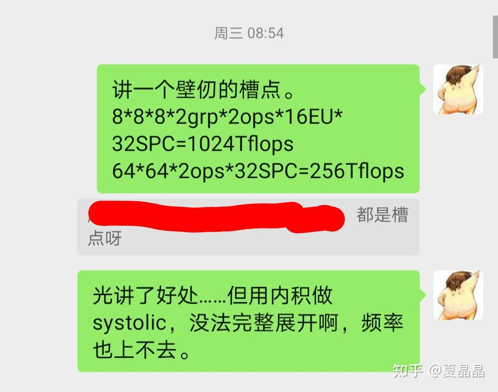
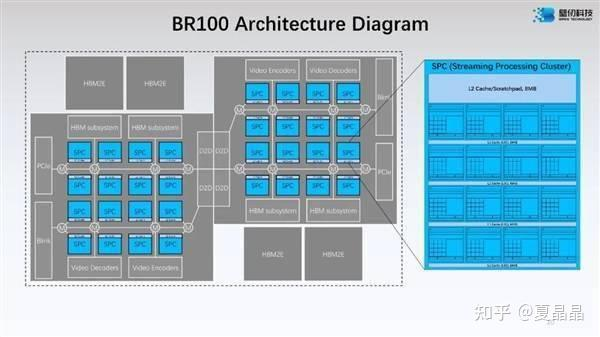
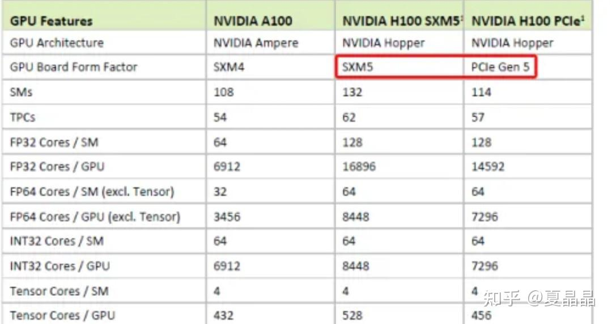

# 再凑一下壁仞的热点……

> **类型**: 文章
> **作者**: Dio-晶
> **赞同**: 120
> **评论**: 24
> **时间**: 1661694560
> **原文**: [https://zhuanlan.zhihu.com/p/558798037](https://zhuanlan.zhihu.com/p/558798037)

---

今年hotchips相当的乏味……因为IC网红化的大环境，每颗芯片都会开好几轮发布会，信息都逐渐从集中式过度到分布式，所以每次会议也就是递增式多一点点东西。

有趣的东西也有，等外网有胶片了再细聊。

壁仞也算是有趣的一个……

感觉可以继续蹭蹭(⑉°з°)-♡

[如何评价壁仞科技发布的最大算力GPGPU BR100？](https://www.zhihu.com/answer/2626248094)

本来回答了一波……

但其中关于tensor的结构和多tensor组合的猜测，猜错了-\_-||

很遗憾，主要是因为我个人喜欢外积多一些，但看上去做AI的同学都更喜欢内积。

**内积相比外积，在相同MAC尺度下输入矩阵的dimension更小。输入矩阵尺寸小更有利于卷积计算。但扩展性不会那么好……**

ps：注意看hotchip上壁仞讲多个tensor组合的等价性。

*ps：壁仞的tensor展开结构大致和NV在SM内部的4Tensor展开结构是类似的（4变16），但因为内部已经有2group………*

不过，我的答案也算是给出了另一个超越NV的微架构路径，外积虽然输入矩阵大，但好在扩展性更好，嗯，知道SME的同学应该明白我说得意思………

---

作为猜错的补充，额外补充一个有趣的trick。如果算得不对请指教。

我们认真比较一下壁仞的BR100和nvida的H100。他们都是外积。他们都号称1000TFLOPS BF16（不算稀疏）。

**BR100的T-core个数是32SPC x 16 EU = 512**

**H100的图tensorcore数量是8GPC x ～16SM（16/18的PG）x 4 = ～512。**

两者相当。

H100要达成1000T，需要保证更多SM可用（SXM是544，即17/18），频率要达成1.8G以上才勉强达成。

而BR100在1GHz完美达成1000Tflops。

**单个TENSOR，同频率下壁仞是NV的两倍！**

展开细节确实也是正常逻辑。

壁仞TCORE是8x8x8x2 = 1024 FMAC

NV的Tcore是4x8x16 = 512 FMAC

但我们盘逻辑的，得一步一步继续向前走。

要做大tensor，难点不在于堆乘法器，而在于load带宽的匹配，要能供得上数才是关键，要能把MAC喂饱才是关键。

难道壁仞这么狠，load path做得超级厉害？

嘿嘿✧(≖ ◡ ≖✿)

8x8x8x2需要load是8x8x2Bx3 = 384Bytes

4x8x16需要load是4x16x2+8x16x2 = 384Bytes

神奇不神奇？

<https://zhuanlan.zhihu.com/p/487389526>

在这篇文章我就提到了NV的一个奇怪的执念。

**他要维持4这个矩阵纬度，就不做方矩阵…**

所以NV是故意卖个破绽让别人超越他吗？

---

*由知乎爬虫生成于 2026-02-01 15:39:00*
