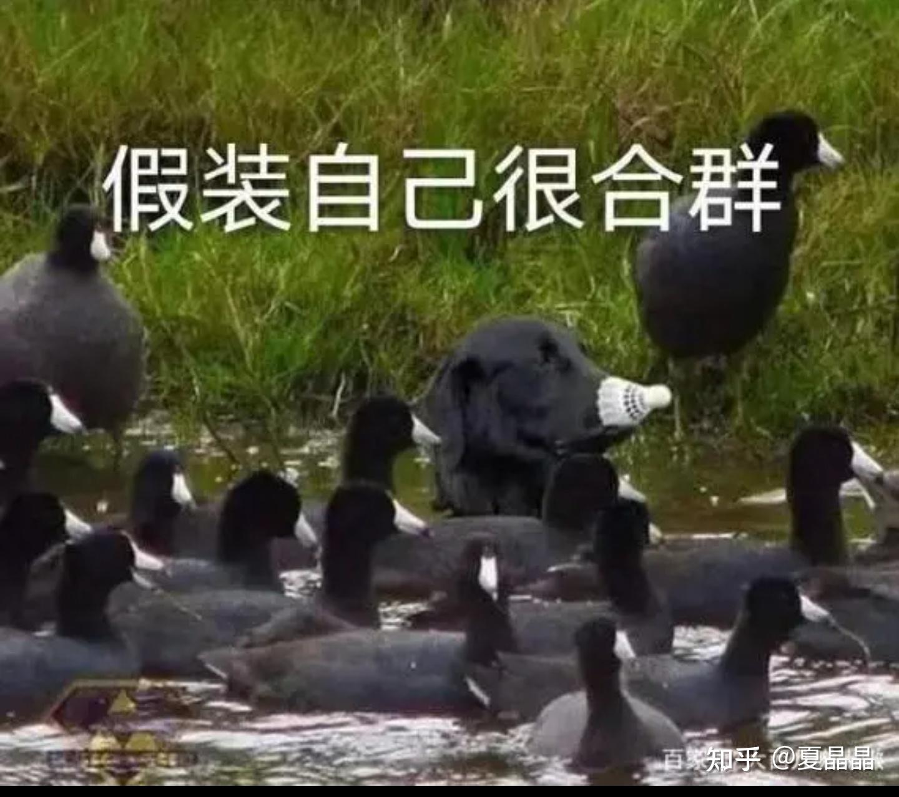

# 要做一个政治正确的DPU哦(´-ω-`)

> **类型**: 文章
> **作者**: Dio-晶
> **赞同**: 149
> **评论**: 27
> **时间**: 1659775930
> **原文**: [https://zhuanlan.zhihu.com/p/550599378](https://zhuanlan.zhihu.com/p/550599378)

---

做DPU有什么是比技术更重要的？

那，没有什么是比政治更重要的了！

[DPU技术大讲堂的听后感](http://link.zhihu.com/?target=https%3A//mp.weixin.qq.com/s/lGPTb9r8XUjrRB2LIrFEJg)

Winnie大姐姐发了一个DPU的读后感。

里面记录了每一个DPU公司都从其一个独特的视角阐述了其DPU设计的成功逻辑。

那么还有没有人有补充的逻辑呢？

有的！ 举手发言

其实这个逻辑很简单。

---

你如果把云服务整体看做一个统一产品，而无论IAAS还是SAAS或者BMS，只是这个大号产品的某个形态的表现的话。

那么DPU在这个产品中的位置是什么？

**第一、DPU首先是cloud这个大型产品的差异化竞争力的最大锚点。**

无论CPU或GPU或SSD，在业界都是成熟的产品，当然你也可以自己做私有的，但是CPU、存储、硬盘通常是直接展现给用户的特征，也只有AWS这种规模才有可能较大规模对CPU进行替换，大多数时候，各家的cloud的CPU、DDR、SSD是同质化的。那么最容易体现各家产品差异化及cost down的就是DPU了。

这也是DPU在未来存在巨大市场空间的必然逻辑。

*ps：当然有人会说SaaS是可以进一步掩盖硬件差异化的，确实没错。但是SaaS也有一条以snowflake为代表的多云化的发展特征（即APP运营者与cloud运营者不是一家），搞得不好某天MS也拆分成software vendor和infrastructure vendor，这也会对不同cloud硬件的同质化提约束。*

**但是，随着cloud的越发寡头化，谁家愿意把竞争力放到一个第三方购买的DPU上？看看那个企鹅，想一想，能够被复制的竞争力真的是竞争力吗？ 借用上汽的一句话，买DPU来用的cloud是没有灵魂的。**

---

**第二、DPU是cloud vendor对Cloud产品的掌控力的表现。**

这么大一个数据中心，CPU是买的、DDR是买的、SSD是买的，而且供货渠道千奇百怪，任何器件出任何问题都不奇怪。

这种基础下，如何能做到安全、容错、快速的资源调配？

做一个类比，一样米养百养百种人，如果你是一个国家的政府首脑。你如何把控国家。

基层组织建设！ 如果把数据中心当做一个国家，那么DPU就是国家政府把控全局的一个个街道办。

就像疫情来了，把控动员能力强的国家或者城市，嗯，说隔离就隔离了，说封城就封了，能力差的，躺平喏。

当然，很多人不喜欢这种把控力，但那本质其实是疫不够烈。换位思考一下，你如果是cloud的运营者，扪心自问，面对稳定大于一切的KPI，你想不想要中国政府对街道办级的把控力？ 某些US的XPU经常性升级一些patch，你真的不想稍微防备一下吗？ 如果某天触发它疯狂对外DDOS怎么拷住它？

**一个合格的cloud运营者，一定要通过能把控的DPU获得对整个cloud深入到毛细血管的把控力。**

*题外话：如果购买的第三方DPU出了问题，cloud的运营者大概率得背锅吧。但如果是自家的DPU出问题，还可以选择要不要干掉不听话的DPU芯片负责人，换个自己人……*

---

**第三、如果没有新的业务驱动数据中心东西向流量提升，DPU的唯一选择是FPGA。**

实际上当前最好的DPU可能是FPGA（内嵌几个CPU的）。FPGA开发代价低，cloud vendor很容易定制达成1、2两个目标，而且方便定期刷版本发布新特性卖钱。虽然有人会说FPGA性能或者能效不行，但是呢，如果网络流量小于100Gbps，FPGA是能很好搞定的，只有200G或更高，才是非ASIC不行。

那么，存算分离之后，现在到底会有什么业务（并且客户愿意付钱）能驱动数据中心东西向流量跨上200Gbps的台阶呢？

看一看，世界上就这么几家大cloud vendor，微软云是FPGA，google云是intel的DPU方案（intel的方案也有FPGA），阿里云是FPGA，腾讯云其实内部也做了FPGA DPU。没错，你会说AWS的nitro，但你看nitro发布到今天已经好几年没有更新新产品了。

---

DPU不好做啊……

领导说我是个喷子……就搞破坏

嗯，下次一定，下次一定写建设性的。

---

*由知乎爬虫生成于 2026-02-01 15:39:00*
