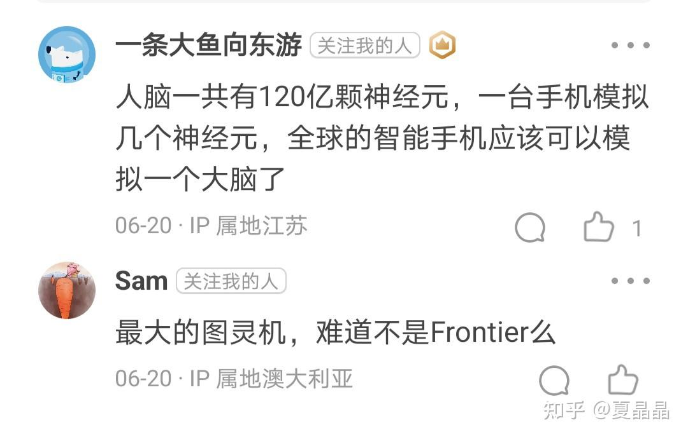
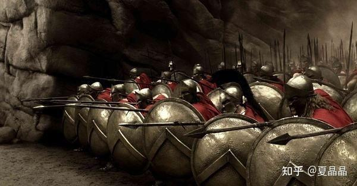

# 极与极（4）

> **类型**: 文章
> **作者**: Dio-晶
> **赞同**: 66
> **评论**: 15
> **时间**: 1657964819
> **原文**: [https://zhuanlan.zhihu.com/p/542350435](https://zhuanlan.zhihu.com/p/542350435)

---

写这一篇其实是对上一篇的延续……

<https://zhuanlan.zhihu.com/p/530717247>

做计算机体系结构的人，特别是做系统架构的，很关键的一个概念就是**scale，简称规模化，一定要加个"化"字。**

在我很多瞎扯淡的分享中，包括上面这一篇，总是有很多人对scale的回复（如下），其实比较尴尬，因为这些差异呢，都来自于概念上无法对齐的矛盾，进一步说就在于这个**scale**的定义。

这个世界上没有绝对的黑白，包括计算机体系结构，很多的边界和定义，本身就是被不断突破的过程，也因此产生了创新。

所有我这里有必要把我对计算机体系的scale这个词及其定义的理解，稍微分享一下。

---

scale代表的是规模化，而所谓规模，一定是基于**某一个单一目的（单一应用）**而存在的。

如果每个个体单独地各玩各的，那不叫scale，就像我们每个人的手机，全球手机的算力加在一起，那是吊打超算frontier的几个数量级的超级算力了，但这些手机能做核爆的仿真吗？ 别抬杠，确实有可能可以，如果算法做出某些突破，把手机变成超级计算机也是存在可能的，现在也有应用在采集手机上计算的某些数据整合后完成某个单一应用的存在。但我们按当前，偏传统的体系结构来讲，手机还是属于独立个体，不在scale的考虑范围。

我们先保守一点。

那么传统地讲scale，就再细分为scale-up和scale-out。

---

**scale-up的典型就是我在上面帖子中提到的IBM的Z系和P系小型机，所谓up，就是纵向扩展，其特征就是单一图灵机，表现为统一的内存管理、统一的设备管理、统一的任务调度、统一的文件系统。**

如果要做个比拟的话，scale-up就是一个超级英雄，超人、钢铁侠、爱因斯坦。

你看到的超级英雄，他力量强大，能一个打十个，但问题是，他很稀少，代价昂贵，很难变得更强，如果一不小心黑化了（出错了），造成的后果很严重。

---

scale-out，所谓out就是横向水平扩展。这里就比较有意思了，基于扩展的个体特征和连接关系，scale-out可以再进行衍生，这其中的边界会变得模糊，这也是很多理解偏差的原因。

**典型的scale-out就是超算，当今世界上台面上最强的超算就是frontier。他本身就是由非常强大的个体再通过紧耦合的并列关系组合在一起。**

如果要做一个比拟的话，最典型的就是斯巴达300了。

究其原理，超算所面对的单一任务，无论是核爆、宇宙、热、化学，实际上都是对物理世界的模拟，而物理世界的本质是基于某种尺度的空间展开，个体的力量只是精度，展开的规模才是尺度，所以超算作为一种典型scale-out，要的是军队一般的令行禁止、整齐划一。它的问题是，训练一个军队也不容易，费用蛮高，而单个个体能力毕竟有限，要解决一个高维复杂问题是比较困难的。

---

如果以超算作为典型的scale-out，再进一步展开谈谈，就比较容易了。

**如果从scale-out向scale-up靠，就是AI大模型大设备了，有时候也叫AIDC。是的，AIDC和超算有点像，但其本质并不相同。**最典型的AIDC是google的TPU集群，和传统超算挺不一样的，nvidia要在瑞士建立的阿尔卑斯AIDC也是类似的（阿尔卑斯会更像超算）。

我个人认为啊，AI的本质是用低纬度的计算模式去拟合一个高纬度的复杂问题，这是我们没法找到一个超级超级超级英雄的时候的一种次优解，一定程度等价于三个臭皮匠、人多力量大、人定胜天等等说法。所有有些时候，AIDC也被人称为scale-up，都行，都行。

所以相比超算，AIDC会在局部做跟高层次的耦合，也就是在局部架构存在超越传统并行计算的更深的耦合。

举个例子，你有的不仅仅是斯巴达300，而是斯巴达300基佬，按照典型8人一组（DGX）分小队，他们每个小队都能安全游过一条有无数专门吃JJ的食鸡鱼的河流。

---

**如果以超算scale-out再向着平民化走，就逐渐进入了分布式计算的维度。传统的数据中心（data center）在这个位置，当我们打开王者荣耀或者淘宝这样一个巨大的民用软件的时候，我们面对的是一个在规模和用户都无尽扩展的scale-out系统（非IaaS模式）。**

这里，最大的革新还是在于算法，从Google的三驾马车开始，程序猿逐渐意识到，即使硬件上没有那么耦合（最重要的是便宜，韭菜多），在管理制度上做出某些调度策略，也能够通过协同完成民用的一些任务，典型的基于数据中心完成单一业务的是google的search业务DC，以及阿里的淘宝DC。

要做个比拟的话，就是社会上典型的企业了，每个打工仔都有着独立的家庭和生活，但依赖金字塔结构的管理机制，码农+HR+销售，各自独立、互相鄙视互相内卷却又相互协调地完成了巨大复杂的工作……

---

想一想，体系结构也是很有趣呢。

回到最初，有没有可能算法进一步演进到把全世界的手机甚至IOT都联合起来**高效地**完成巨大的单一任务呢？

我给的答案是不能。

看一下这个混乱的世界吧，人类社会这么几千年，连个高效的社会制度都还没演化出来呢。

---

*由知乎爬虫生成于 2026-02-01 15:39:00*
