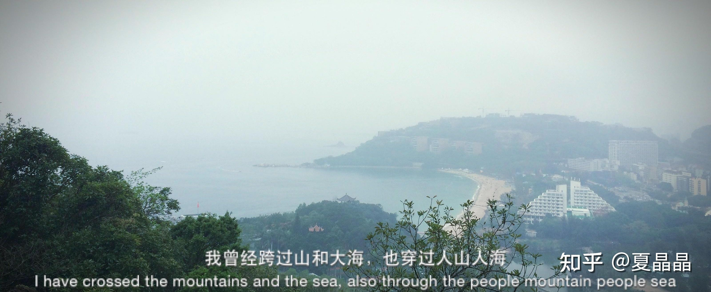
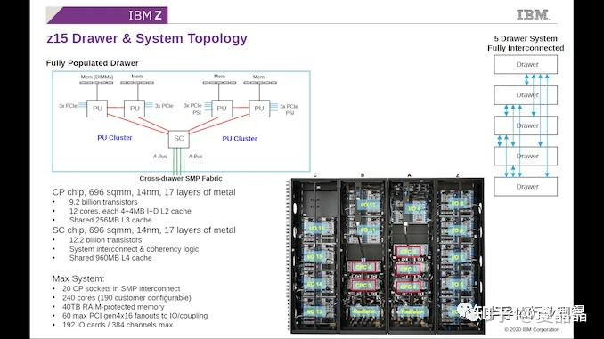
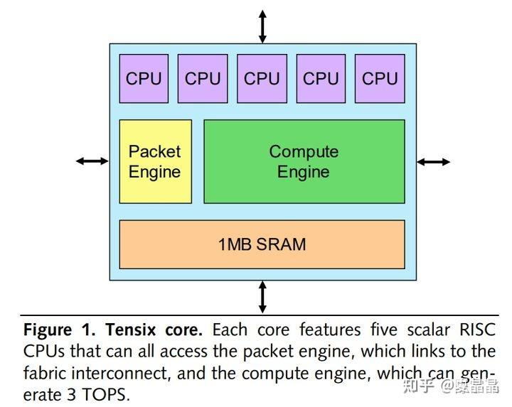
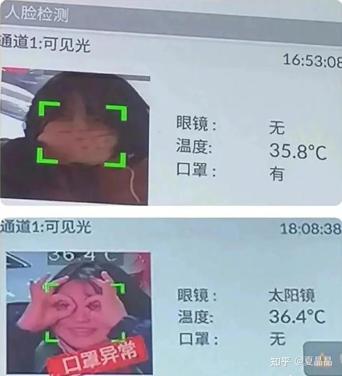

# 极与极（3）

> **类型**: 文章
> **作者**: Dio-晶
> **赞同**: 70
> **评论**: 2
> **时间**: 1655628682
> **原文**: [https://zhuanlan.zhihu.com/p/530717247](https://zhuanlan.zhihu.com/p/530717247)

---

经历和感悟，也是一位合格的架构师所必须经历的历程。因为很多时候所谓的架构及其演进，往往是伴随着某些过去的边界条件发生的变化而触发的。

这个计算机体系结构风起云涌的黄金时代，闲来有空确实值得记录一下，那些偏执狂，他们在某单一维度的两极，在那最极端的边界疯狂试探的行为。

通过这些对比参照，我们至少可以知道，某些技术当前的上下限在什么地方。到不是说要去复制，熊猫人部落的特征是平衡，当我们看过了易筋经、又看过了葵花宝典，在把JJ关起来或者割掉之间，我们也能找到更加合理的存在。

---

今天想写一下当今世上最大的图灵机和最小的图灵机，终于不用提Nvidia和Apple两个变态了 ：）

如果从算力来讲，数据中心当然是最大的图灵算力（实际上全世界手机加在一起才是最大图灵算力），不过这都是属于一个集合体，我想要描述的是个体，一个单个、完备的图灵机的差异，嗯，Cuda Core这类SIMT虽然能够集成挺多的，但它并不能图灵完备，所以也并不考虑在内。

而所谓的单体，我们可以定义为能够执行单个program的维度，虽然当下先进分布式计算越发厉害，很多单应用都能基于先进的集群机制（甚至类比某种政治制度下）多机并行执行，但我们还是可以一个单个OS（比作单个大脑）为衡量尺度，来定义一个单机。

那么，当今最大的图灵机和最小的图灵机，都是图灵机，差别能有多大？

---

毋庸置疑，要论做高达的能力，IBM说他是第二，没人敢说第一。表面上，可能长得和数据中心机柜也差不多，但小型机、大型机，是真正人类最顶尖科技的结晶，计算机里的航母，它把无数最高超的技术极其精密地组装在一起，数不清的零部件，如人体的无数细胞一样为达成目标协同工作。

IBM的小型机是Power系列，大型机是Z系列，他们的每台巨大的设备都能以SMP的方式运行一个OS，并执行一个超大型的业务（通常是交易系统）。

如果单看CPU Core的数量，两者相差不大，Z系的计算规模，其实嘛，某些时候P系列甚至X86普通服务器也能组装出近似甚至某些地方超越（例如P系列线程数量高）。但实际上Z系列在单线程性能、安全性、可靠性上远胜于P系列和X86，所以通常来讲大型机的Z系列是最大型图灵机的顶峰，即使力量能赶上，但身体的强健和耐操不是一个等级。

上面就是Z15的系统，Z16芯片也是出来了，但系统还刚问世，很多信息还不齐备。

如果我们看Z15，12\*20 = 240Cores、40TB的统一内存（被单一OS管理的内存尺度）、960 lanes的PCIe，核数量其实在当今堆核的战争下倒不是特别扎眼，但是这全局的内存、IO，其难度并不是简单的数字表达的。

我现在最大也就量产了4 Sockets SMP的系统 ：） 要做到20 Sockets这个级别，已经是远远超过我曾经说过的七个龙珠之类的技术点了，随便举两个例子，全系统TLB的同步、全系统的时钟同步，都是处于体系结构和算法顶峰难度的。

不过，大型机、小型机，难度是光刻机级，但做起来的性价比特别尴尬，整个市场随着业界软件的Scale-out发展而逐渐衰落，IBM、Oracle、EMC，所谓去IOE，好像去着去着就真去了。如果一定要说原因的话，还是单个巨大装置的演进随着其复杂度的到一定程度后，技术提升的难度太大了，如果再深刻一点的话，人类比我们想象的更加渺小，其组织形式的不完美（苏联也没了）约束了人类集合力量发展大型装置的能力，也许正如鲸鱼是世界上最大的生物一般，航母规模的大型装置是不是就已经是人类集合力量表现的上限了？

*题外话：不知道中美之间走下去，会不会有一天小型机、大型机也被禁了啊？ 如果到那一天，是否到时软件也都能分布式化？还是不能？ 如果不能，嗯，也许光刻机被人解决了，大型机谁来做呢？ 好吧，我也许算是最接近可能解的人了，至少知道可能的答案在什么地方。但虽然做这东西实在是没法赚到钱，要我做的话，还是得加钱吧。*

---

最小的图灵机。。。。。。妈的，那是Tenstorrent

他的Core叫tensix，表面上看上去是没什么特别的，实际上，这个很小的core，包含了一整个图灵完备的CPU+MEM+IO完整系统。

感觉上没有什么特别，但Jim Keller是真的这么干出来了，很多人做多核，要么喜欢做得图灵不完备，要么喜欢把内存或者IO做成某种共享而导致不能独立运行，举个例子，阿里著名的倚天710有128个CPU，它可以跑一个OS调度128个CPU，但是，无法独立运行128个OS并且相互交互 ：）

**合很难，分亦不易的。**

Jim Keller把一个完整的图灵机做到了极致的小，嗯，1MB的SRAM，如果按照GraySkull集成了120个这个core来估计，整个小图灵机的尺寸大约只有~4mm2，每个core可以独立运行OS，独立完成一个图灵机的所有完备工作，然后120个图灵机可以在某几个高级core管理下以actors方式相互交流、学习、配合。

嗯，有人传言我特别推崇Tenstorrent，其实并不是啦。虽然他做得很巧妙、架构很精美，但它毕竟是为一个特定的目的而设计的，而我是一个做通用处理器的，所以更多的是好奇，特别的好奇。

AI撞墙了 ：） 这是最近很火的话题。

<https://zhuanlan.zhihu.com/p/530516917>

如帖子所述，在我看来，Nvidia的GPU救不了AI，但也许Tenstorrent，它更像人脑，更像能够独立工作的无数神经元的组合，我赌五毛钱Tenstorrent可能可以。

---

*由知乎爬虫生成于 2026-02-01 15:39:00*
