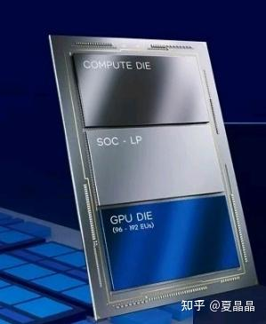
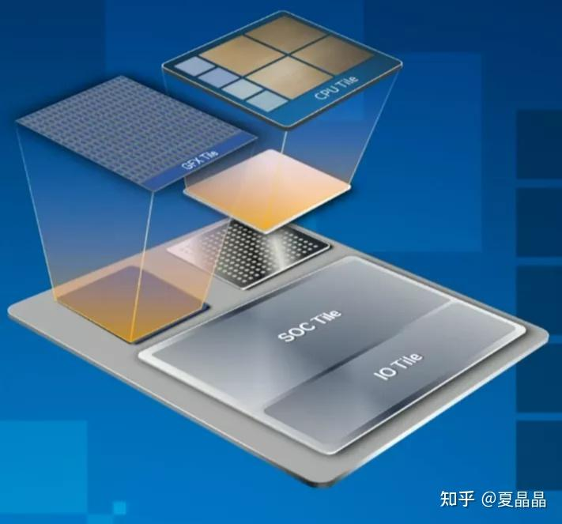
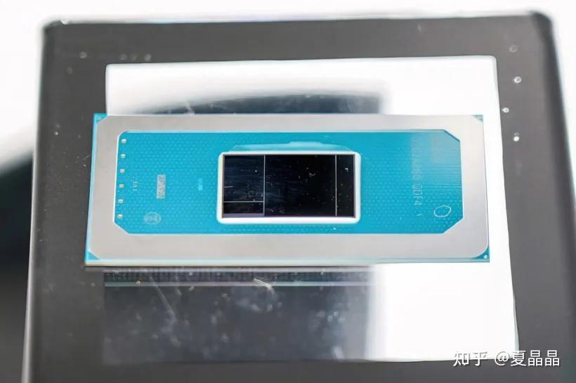
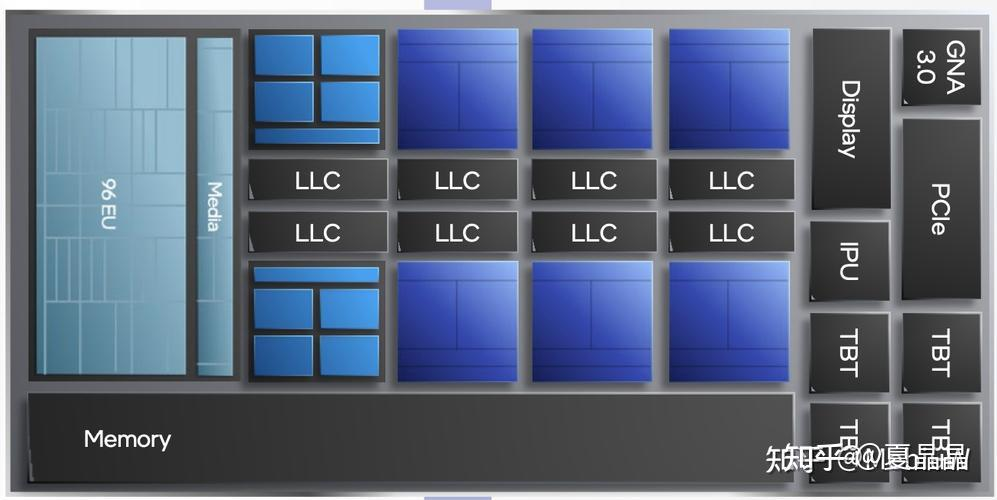
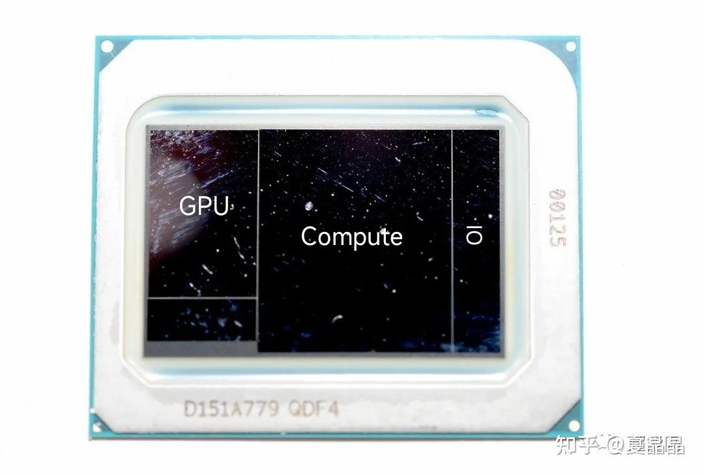
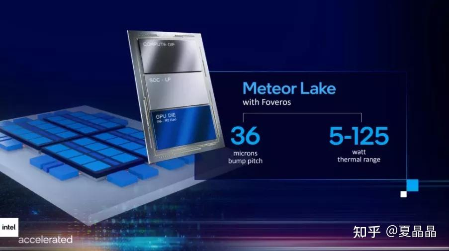
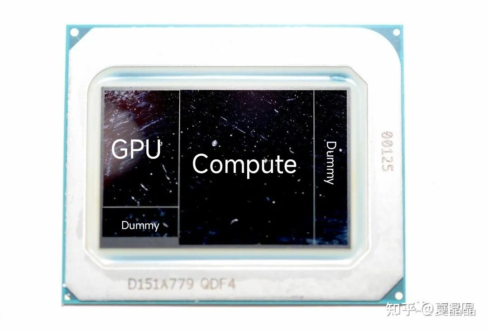

# 我就蹭蹭热点（6）

> **类型**: 文章
> **作者**: Dio-晶
> **赞同**: 86
> **评论**: 7
> **时间**: 1652520871
> **原文**: [https://zhuanlan.zhihu.com/p/514387259](https://zhuanlan.zhihu.com/p/514387259)

---

其实最近也没特别的什么热点，pathways之类能力太菜不敢凑，ZEN4之类的信息泄露啥的都是明牌一眼看穿的……

我就凑凑intel的meteor lake，第十四代client处理器吧。

主要是这颗芯片存在很多值得推理的信息，而看着坊间流传的各种猜测信息，我觉得你们说的……

我是一个喜欢没事找事盘逻辑的人，反正疫情期间玩不了狼人杀，来盘这个正好玩玩。

盘的不对请指正……

Intel的图很清晰，看上去这是一个chiplet，那么问题来了，这个chiplet是怎么组合的？

网上的猜测当然相当多，例如下面这些。

[英特尔 14 代 CPU Meteor Lake 流片，增加了什么新技术？](https://www.zhihu.com/answer/2232951765)<https://zhuanlan.zhihu.com/p/436120477>

不对，不对，不对。

Intel画的首先是个效果图……并不是真正从上到下三个die，依次是compute、SOC、GPU（很多人天真地这么去凑chiplet……）。

嗯，下面这张图放出来，你又怎么凑，下图看上去还增加了IO TILE。难道说intel画错了？ 那不可能，工程师会下课的。

所以，综合上面的图，intel有三个die的样子，但是位置不好定。

已知的额外信息是GPU可能采用TSMC 3NM，COMPUTE DIE原计划intel 4NM，但也有传言要转向TSMC 5NM。

OK，最近更进一步的信息有leak，实物图出来了。

一瞬间很多同学就懵逼了，怎么看上去有四个DIE？

相对聪明的一批同学瞬间就回答了，左下角是dummy die……

OK，符合逻辑，没人会做这么小die的。

那么剩下三个DIE怎么划分，立刻就众说纷纭了。有兴趣的同学可以去统计外网内网各种说法……歪果仁也没多聪明

其实这时候应该去打开上一代CU alder lake的dieshot。

所以，更聪明一些的答案会按照这个映射，从左到右依次是GPU、COMUTE、IO die，完美。当然还有人认为是从右到左，问题不大。

*ps：Intel用compute die而不用cpu die来命名，注定了compute die包含了大小核及更多的内容，其面积也应该是最大。*

逻辑盘到这里，该我上场了。

因为，还是不对。

首先，我们要回到源头，Intel这个芯片采用什么技术做chiplet？ 答案很清晰，intel提到了35un pitch，这是 foveros技术，emib是55um pitch。

*ps：可能混用两种技术吗？ 大概率不会，没必要，而且emib太耗基板，太贵了。*

那么真相是什么？ 我的逻辑如下：

正面有两个dummy die。左下和右都是dummy，正常的架构师，也不会做一个右侧那样特别细长的die的，应力问题很大。

那么soc die在哪儿？ 在下面啊。

这些die的正下方，是intel的自家7nm active interposer。soc tile和io tile都在下方。

为什么最右侧有一个细长的dummy die而不是被compute die完全覆盖呢？ 这里涉及chiplet设计的另一个秘密，模拟电路，也就是io serdes，是不能与数字逻辑3D重叠的，只能做单层。如果在dummy die的位置放上面，那么下面的interposer也必须是空白的（浪费），那还不如放在成熟工艺的下面，上面贴dummy……

---

嗯最后说一句，其实这就是intel IDM2.0的秘密啦。

所谓IDM2.0，就是尽可能减少对先进工艺的silicon产能需求，更多去延续上一代工艺的silicon产能，说白了就是新工艺太贵了。

你看这个meteor lake，如果按我的推理以及intel的原计划，其实他60% silicon是自家N工艺继续，30% silicon在自家N+1工艺，10% silicon是业界别家N+2工艺，在摩尔定律的今天，这是最优解。

---

当然，问题来了，算一算含硅率，作为客户，你购买intel最新一代meteor lake CPU，它究竟算是4nm最新工艺天顶星高科技，还是一个7nm老工艺挤牙膏呢？

---

*由知乎爬虫生成于 2026-02-01 15:39:00*
