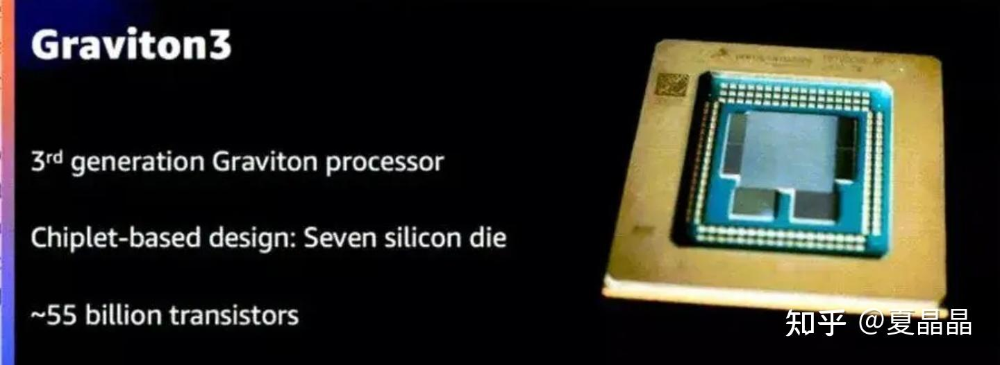
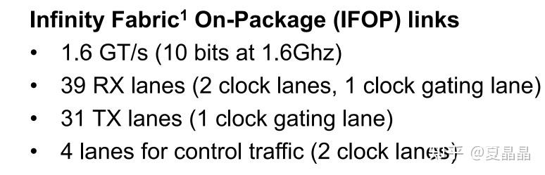
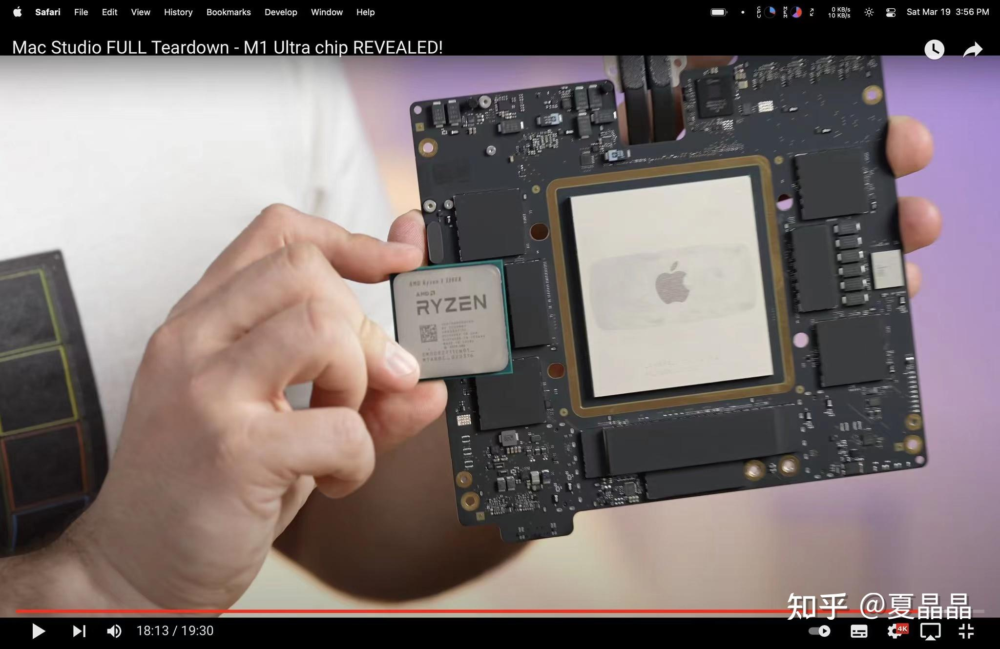
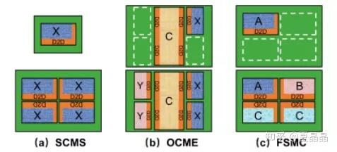
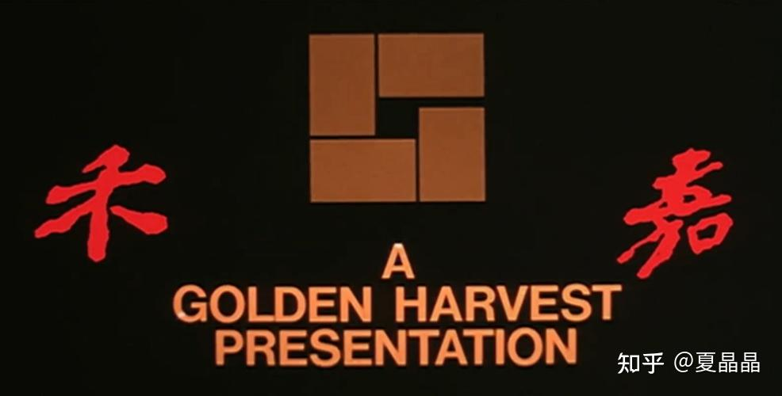

# chiplet是一个多维的世界

> **类型**: 文章
> **作者**: Dio-晶
> **赞同**: 144
> **评论**: 35
> **时间**: 1647746470
> **原文**: [https://zhuanlan.zhihu.com/p/484050565](https://zhuanlan.zhihu.com/p/484050565)

---

哎呀,,Ծ^Ծ,, 不知道是不是封闭+巅峰赛连跪。疫情让人越来越心里不健康……

最近没事都是找着热点怼，疯起来连自己也咬……

( ｰ̀εｰ́ ) ( ｰ̀εｰ́ ) ( ｰ̀εｰ́ )

[算一算Chiplet的成本！](https://link.zhihu.com/?target=https%3A//mp.weixin.qq.com/s/baQoJ4ZrPsBEcXGRRLv-4Q)

今天看了这篇公众号，啧啧啧，从学术角度来看，挺好的，也算是在这个领域建立概念或者方法的innovation吧……

但是，唉，为啥要说但是呢……

这个世界处理实际问题时，他是个多维空间取舍问题。国际象棋你走几步能把所有棋子连成单一食物链，但围棋往往并不如此……

**善弈者谋势，不善弈者谋子。 ---省级金牌奕星留言**

举个栗子……

最近做chiplet的实操热点，是以做出最节省基板产能方案为目标！ 意不意外，惊不惊喜。

为什么？

这是一个比青山镍战疯狂得多的隐蔽战争！

谁都知道intel这两年不太行，AMD借助着TSMC的东风在ZEN2/ZEN3上性能成本都领先intel，甚至最近在美股市值上都超越了intel。那AMD未来几年能赢吗？但你看AMD CPU今年涨价涨的，那是败像！

intel在过去两年，通过反正我也说不清的一些方法，用了～10亿美元的代价（我猜的），把台湾几家主要基板厂（substrate）的未来几年产能全包了，全包了，全包了|ω・）

在PC&Server这个领域，除了intel产能足够，其他所有fabless（含AMD）狗咬狗抢剩下的残渣……

这是一个700亿美元的市场（甚至包含未来的IDM2.0大计划），用10亿美元（我猜的）就完成了一道护城河，美如画的商业战略。锁龙局，AMD即使把TSMC买下来，也打不赢intel。更勿论国内若干CPU startup……

中国电子产业的崛起，吾辈任重道远。

至于intel，未来五年大势无虑，虽然股价我是看不懂

（＃－.－）

---

故事固然是故事……还是回到技术

划分chiplet需要从体系结构的本质为起点。

一其实很简单，颗CPU，如果要从体系结构来划分，他应该是compute、memory、IO三部分。

**AMD的Chiplet策略是：compute + Memoy&IO**

**kunpeng的chiplet策略是：compute&Memory + IO**

**apple的M1 ultra是 2 x compute&memory&IO**

**intel的sapphire是：4 x compute&memory&IO**

ps: intel SPR其实是一个妥协下的缝合怪，一代而亡的临时产物，他下一代会选择AWS策略。

**AWS的graviton是: compute + memory + IO**

看上去很简单是不是……

每一个架构师都是一位棋手，要想真正理解其所图谋，我的方法是多看他们的访谈，逐词逐句，然后闭上眼，幻想你站在他的位置，看天下如棋，如何落子。

再举个栗子，AMD的ZEN/RYZEN CPU和APPLE的M1 ultra，都是了不起的CPU、了不起的chiplet。

APPLE的Chiplet互联带宽2.5TB大家都知道。

AMD是多少? 我们打开ISSCC2022 ZEN3章节。

他作者笔误了，实际上每个signal是16Gbps，39+31=70 signal，70\*16= 140GB带宽。

**2.5T/140G = 18倍。**

都是CPU，看下图对比。并且实际上AMD RYZEN大概率在性能上超过apple M1 ultra，毕竟一个是坦克一个是跑车。而其中chiplet的取舍，可以差了20倍。

实际上AMD的第一诉求，是在基板甜点尺寸下放下足够大的silicon area，简单、节制、断舍离。

而apple，那是个究极变态……偏执狂……

---

最后卖弄一个小trick……

我引用的公众号引用的论文，里面关于SCMS的示例是错误的。

这个形态就是intel的sapphire rapids，他在逻辑上是一个die，但在物理上，是mirror的两个die。

但是能不能做一个die的SCMS呢？

你如果经常看看老电影，你知道的，能！

古人诚不欺我。

---

*由知乎爬虫生成于 2026-02-01 15:39:00*
