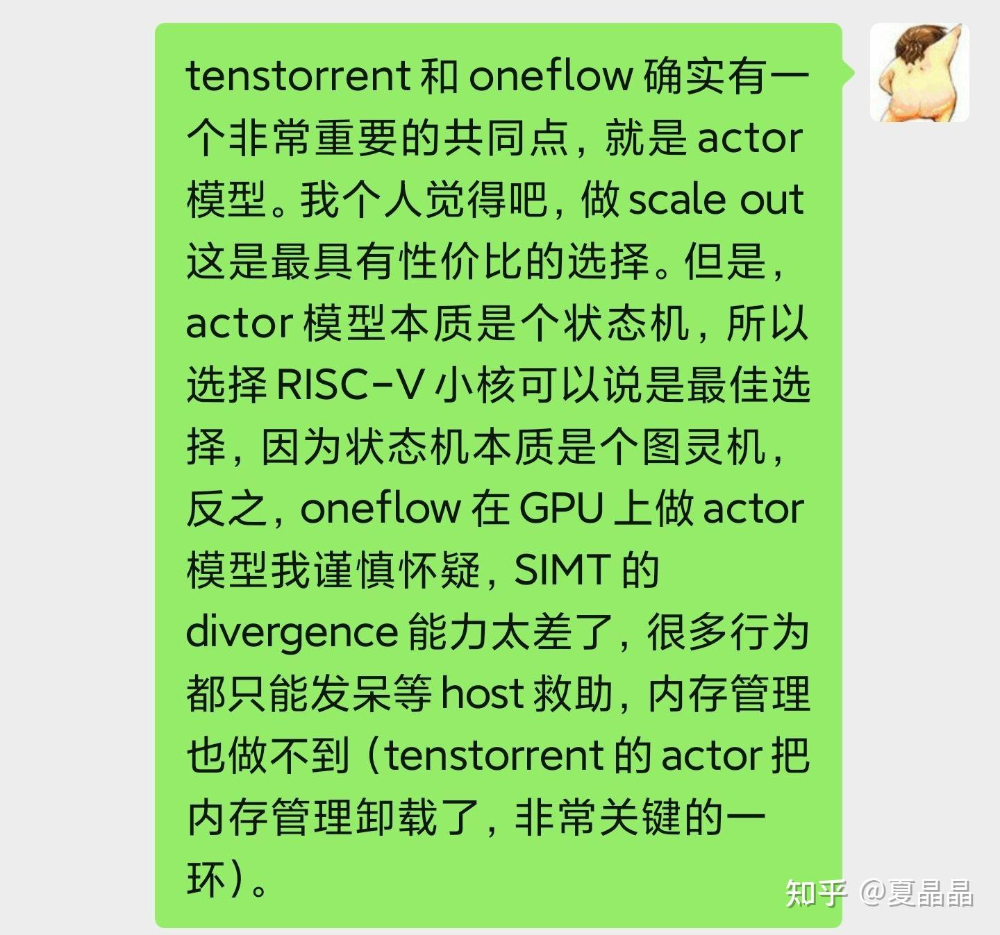
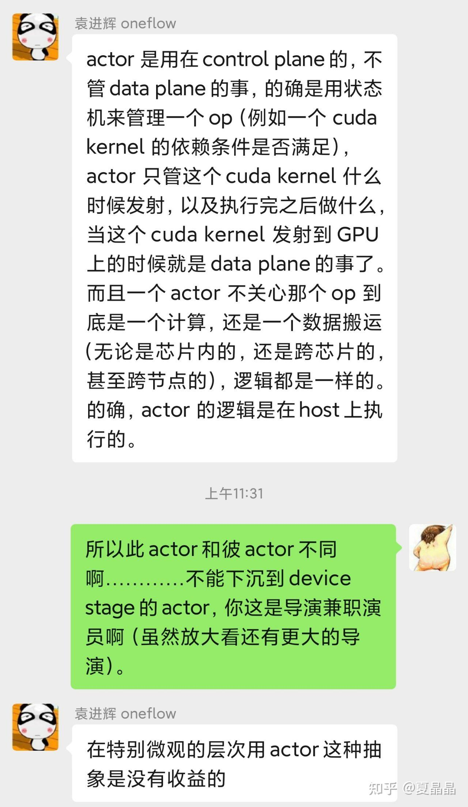
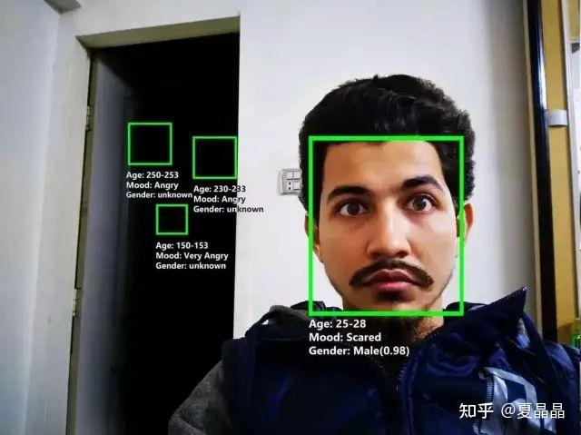

# 再谈tenstorrent

> **类型**: 文章
> **作者**: Dio-晶
> **赞同**: 82
> **评论**: 19
> **时间**: 1647151340
> **原文**: [https://zhuanlan.zhihu.com/p/480182683](https://zhuanlan.zhihu.com/p/480182683)

---

一篇有趣的文章。

[Tenstorrent虫洞分析：挑战英伟达的新玩家？](http://link.zhihu.com/?target=https%3A//mp.weixin.qq.com/s/egXyuUfGlSB2RqiQe6HSkQ)

这里引入了一个粒度的问题，要不要把actor模型下沉到device呢 ？

大家对事物的视角确实有很大的差异。

oneflow其实是受限于CUDA及GPU能够提供的能力，那如果我们做DSA的，该怎么做？

回到本源，空间计算作为AI DSA的一个火热的方向，他是个新东西吗？ 体系结构这三十年，啥玩意儿没研究过啊。

当然我其实年纪轻轻，也没有经历太多…… 我的第一任老师是freescale、第二任是cavium、第三任是IBM、第四任是intel。

来来回回，往往复复。

不外乎两件事情，OS kernel最核心、固化、厚重、邪恶的两个部件：**memory management 和 scheduler。**

来来回回，大家。也不就是在做一个循环：

**OS是神主掌一切---剥离内核到用户态（CUDA）---纯硬化性能爆表---要灵活软化分布式---死了死了回到原点。**

tenstorrent的借用了actor机制把原本OS kernel中的memory malloc卸载为软化分布式，以我十多年做通信处理器的经验，神来之笔。

AI领域第一人，潘多拉的盒子打开了！

---

*由知乎爬虫生成于 2026-02-01 15:39:00*
