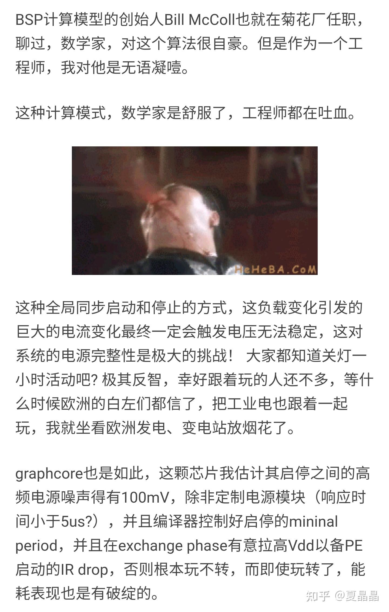
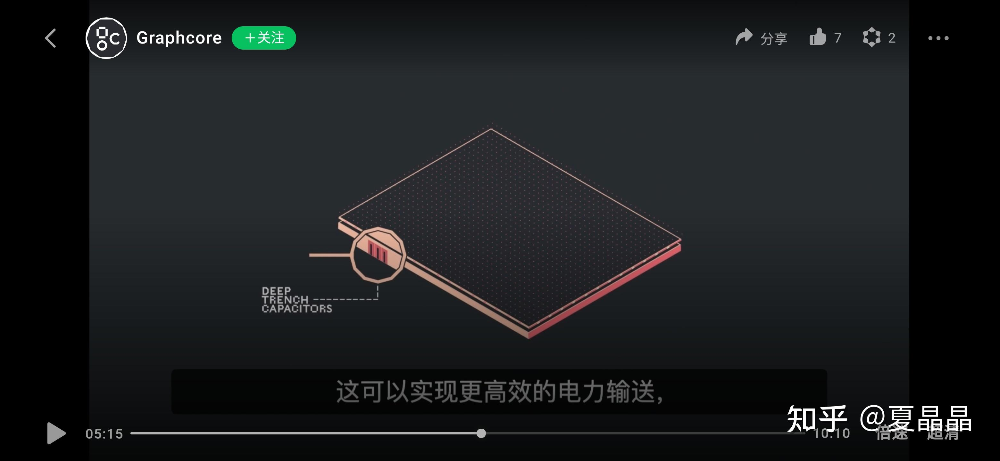

# 这个热点我要蹭我自己( ｰ̀εｰ́ )

> **类型**: 文章
> **作者**: Dio-晶
> **赞同**: 71
> **评论**: 10
> **时间**: 1646317442
> **原文**: [https://zhuanlan.zhihu.com/p/475450846](https://zhuanlan.zhihu.com/p/475450846)

---

哼哼，厉害如我。

上个月刚好还在写graphcore的问题。

<https://zhuanlan.zhihu.com/p/463833198>

---

其实很早我就跟人说BSP这个东西有问题，没人信。

嘿嘿，今天graphcore发布新产品了，3D封装哦。

[Graphcore全新Bow Pod系列：令人“WoW”的巨大功率和效率提升](http://link.zhihu.com/?target=https%3A//mp.weixin.qq.com/s/vxUqO1nYWuZxuPi0WDneIw)

可惜下层wafer好像没有像大家想象那样玩花样，就是铺了一整层的电容，DTC。

说白了就是以前的电源噪声太大，至少100mv起步，导致功耗损失巨大。这次加整整一层电容（相当于近计算的电池阵列）来改善Vmin，按照官方说法，拿到了16%能效收益……

最大赢家：TSMC

---

*由知乎爬虫生成于 2026-02-01 15:39:00*
