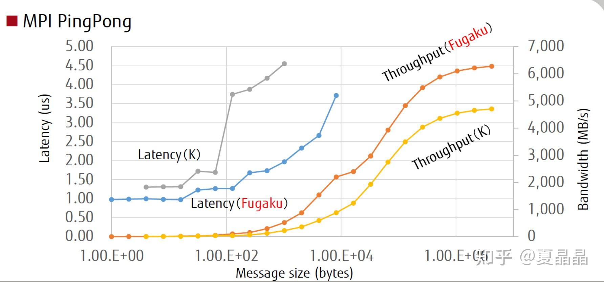

# 拿起棉签，捅一捅DPU的落地的困难

> **类型**: 文章
> **作者**: Dio-晶
> **赞同**: 261
> **评论**: 33
> **时间**: 1645977262
> **原文**: [https://zhuanlan.zhihu.com/p/473102686](https://zhuanlan.zhihu.com/p/473102686)

---

疫情憋在家，每天放风就是排队等候被人捅……

排队没事可做，只能想想着要不再捅捅周边这些热火朝天的XPU泡泡…………站着也是站着，总得找个乐子。

刚好前天晚上和我厂DPU项目经理喝酒，顺手捅了捅他讲得天花乱坠的喉咙……今天正好把这逻辑再捋一捋

前面其实已经讲过两个DPU的困难了，如下：

<https://zhuanlan.zhihu.com/p/409507738><https://zhuanlan.zhihu.com/p/412267070>

一个是DPU本身具有极大的设计复杂度，一个是DPU连萌芽都算不上的软件生态，今天第三个，是DPU要真正落地数据中心的部署困难。

梦想与现实，存在着巨大的沟壑。

**当今的数据中心，连RDMA都没有办法大规模部署！**

---

关于DPU治病救人的神奇故事，坊间已经有了许多，例如下面这篇，那是：**第四代算力革命，软硬件融合的超异构计算！**

[预见·第四代算力革命（三）：面向未来十年的新一代计算架构](http://link.zhihu.com/?target=https%3A//mp.weixin.qq.com/s/g5Htp0avE0791wOInBt8zA)

其实他写的也没啥问题，一年前我还没遭受现实的毒打前，大约也是在编这样的故事。

大家希望解决的原问题其实是一致的。

> **原问题：如果当下是DSA的黄金十年，那DSA要怎么大规模进数据中心? 要是进不了数据中心，那就是个青铜。**

但如果我们打开当今主流的数据中心看，其核心形态是IaaS，或者说即使是SaaS也是依托在IaaS的硬件设施规范上建设的，即一个SaaS/IaaS随时都可以转变成IaaS/SaaS。

而IaaS的核心特征是虚拟化，也就是用一种软硬件融合的方法，让众多用户复用硬件，嗯，共享单车。这个机制完好地运行了近十年（按照《软硬件融合》的说法卸载虚拟化的属于狭义DPU范畴）。

DSA与数据中心的矛盾就在于DSA硬件并不能支持好虚拟化，即使NV的GPU也不能，MIG什么的硬切割纯属扯淡（七个用户?），坊间虽然也有一些GPU时分复用的策略，但事实上业界部署GPU都是局部专机专用专卖，并不能做到普适性，也就没有大规模。

> **那就转进延伸问题：能不能干掉IaaS，实现Native SaaS/FaaS的数据中心，也就没有了虚拟化负担?**

有这个想法的人非常多，我曾经也天真地相信，只要能找到某个超级应用，类似微软的office，为这个应用建造一个巨大的专用数据中心，native SaaS，革命、颠覆、赚大钱。

逐渐地，我才认识到这个思想有两个大问题。

一个是我们天生因为IaaS效率不高而产生了技术偏差，以为做一个IaaS很容易，好像买一堆服务器放到一个房间就行，而其实搭建一个可堪一用的IaaS需要的技术栈相当厚，同理你要脱离IaaS建立一个native SaaS需要的技术投资也相当高（更难的是，没有AWS可供学（抄）习（袭）啊）。

二个是我们天生因为IaaS利用率不高，就认为做成SaaS/FaaS的利用率能更高，毕竟把异构都调用起来了不是? 但实际上，如果要比喻一下的话，IaaS是水啊，SaaS是可乐、FaaS是啤酒，当然可乐好喝没错啦，可你能只喝可乐不喝水吗? 不能啊。所有的数据中心都以IaaS为基础的核心，其实是用IaaS来填补SaaS和FaaS的利用率不足，削峰填谷的（即使IaaS不赚钱，但也好过设备空置亏钱）。IaaS的形态是整个计算云化中最普世的形态，因为IaaS最贴近传统的单机使用/开发模式，对传统具有最好的亲和力，作为编程者，你使用IaaS的方法和你在大学宿舍买一台电脑学编程的感觉是一模一样的。赚不赚钱另说，但只要降价，IaaS几乎不愁卖。

所以IaaS是数据中心的兜底，底裤要没了那啥啥都没了。如果我们不能沉下心，从学生开始培养cloud native的使用和开发，花个十年的时间把程序员和编程方式翻个天，颠覆IaaS很难很难。

> **再转进分支问题：能不能就在IaaS上打补丁扩展某些特性实现超异构计算?**

这其实是当今大多数数据中心真正尝试的方向。

简单来讲，要做到所谓的超异构融合，让计算在数据中心内部用比infrastructure/Platform更小粒度的Software/Function调配，必然需要比当前数据中心**更高的带宽、更低的延迟和更编程亲和的访问模式（memory mapped）**，能做到吗？

现实是，如果世界上最好的数据中心是AWS、azure、再算上个阿里云，做到SaaS还可以，到FaaS其实已经很难受了，到DC as a computer，做不到。

他们确实实现了RDMA，分别都是依赖于其自研DPU的nitro、catapult、神龙卡。如果认真打开看各种吹牛逼胶片的细节，你会发现真正提供RDMA的，并不是通用的IaaS或是SaaS，而是bare metal再加上storage，最多是大云边上的一朵独立小云。 为什么？

**先说memory语义上网，难**

1. 很多人认为实现memory语义，相比IO语义是件稳赚不赔的事情，但是呢，这个世间所有的礼物，早已标好了价格的啊。
2. memory语义的第一困难莫过于security & reliability。IB和ROCE采用了独立的pinned memory和鉴权都是为此，并因此导致了规模扩大后的QP pair数量爆炸。
3. 而第二重困难在于语义的完整性和顺序性，ROCE为此选择了PFC流控和back-2-N机制，这两个机制不仅仅导数据中心多路径（fattree）带宽不均衡，还会导致拥塞控制依赖而出现死锁。
4. AWS采用硬件乱序&软件重组&自家刷库方式缓解如上问题，MS采用了网管规划固定路径为loseless方式缓解问题，阿里未知。但总的来讲，这种补丁试创新都没有根本性解决问题。

**然后说更大的带宽，难难**

1. 当前数据中心网卡的主流是50Gbps，逐渐大家在转向100Gbps。很多人不理解，不就是加带宽吗？ 200Gbps、400Gbps的网卡不都有了吗？超算不都已经上400Gbps了，为什么数据中心不能上?
2. 其实这个问题在我上一篇讲CXL的文章讲了。一个400Gbps的NIC，按我经验的算法，外部带宽折合到DDR带宽是有一个1.5X放大倍数，即真要跑满RX和TX双向，需要400\*2\*1.5=150GB内存带宽。而DDR4 3200的CPU，按8通道带宽满打满算也就3.2\*8\*8=200GB，这CPU还能工作吗？
3. 这里我还是推荐一下netdam+CXL，我不认识网红zartbot，而且我也更倾向cache派，但我认为他的路子是对的。看他的论文和故事其实我也并不是完全认可，但你在做技术探索时，就像是隔着一堵墙挖了无数个小洞朝外看，而他的故事和一些其他故事凑在一起，感觉快形成可能的一扇窗了。

<https://zhuanlan.zhihu.com/p/466870704>

**最后说一个更低的延迟，难难难**

1. 至今没有一个人在数据中心把访问延迟真正做下来。一个都没有。
2. AWS的MPI延迟是15us，这已经是在业界大吹特吹了，如果你去看看panda老师在业界的评测数据，你会看到在AWS上运行超算的业务，例如WRF，是同规格传统超算的50%性能都不到。
3. 阿里神龙吹得更厉害一些，5us，我是不太相信的，得等一些测试报告。
4. 但是如果我们认为真正的传统超算才是真正的低延迟，那应该是多少呢？ 如下，超过2us就算输了。

---

当然，领导会站出来出来质疑。为什么传统超算能做到memory语义、大带宽、低延迟呢？ 这不正是我们超异构计算DPU需要做到的吗? 做一个超算不就得了？

传统超算，和数据中心，从外观来讲，确实有一定相似性。但他们，其实比猴子和人之间的差别还大。

超算的专款专用就不提了，把互联展开来讲，超算的网络其实就是一种L2转发，即使他有采用IP，也只是把IP当做MAC用的类L2转发，连L3都没有，更没有什么所谓overlay、underlay，所以规模也是小于数据中心的。vxlan什么的就更不必提起，用户数据泄密? 不存在的，都是国家机器，没用来破解他人机密就不错了，可靠性那是用checkpoint来解决。超算唯一的目的就是更宽更快更强。

讲到这里恰到好处地想起一起一首著名的歌。

*原始社会好，原始社会好，*

*原始社会人们光着屁股跑，*

*男的追　女的跑…………*

*太污了，不能唱下去了*

超算就是一个光溜溜的原始社会，一切以繁衍为天意，坦坦荡荡、快快乐乐，但也有一人艾滋，全村团灭的风险。

而数据中心，是随着社会文化演讲而成的一个文明社会。穿上了衣服，知得了礼仪，也带上了面具，却也知人知面不知心了。甚至所谓的bare metal，其实也都带着套……

所以啊，这衣服裤子穿上了，是文明了，但有时候反而也成了一种负担，要再脱下去反而被羞耻心给阻碍了。

---

*由知乎爬虫生成于 2026-02-01 15:39:00*
