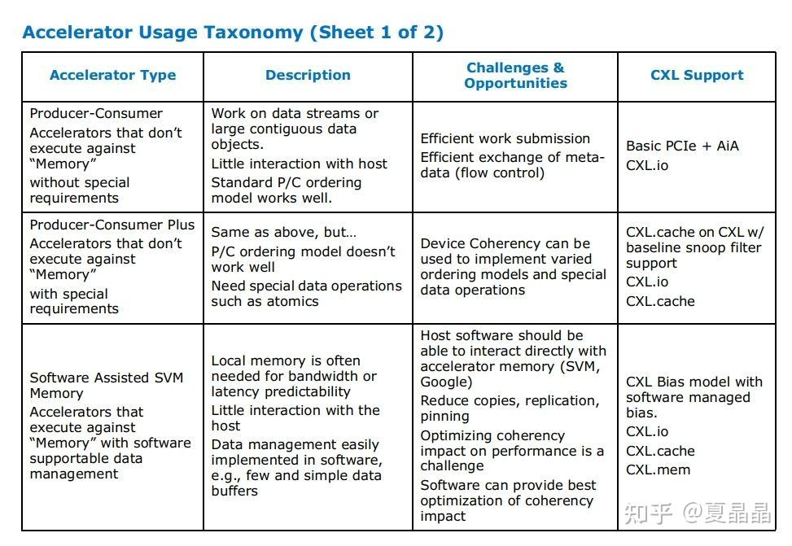
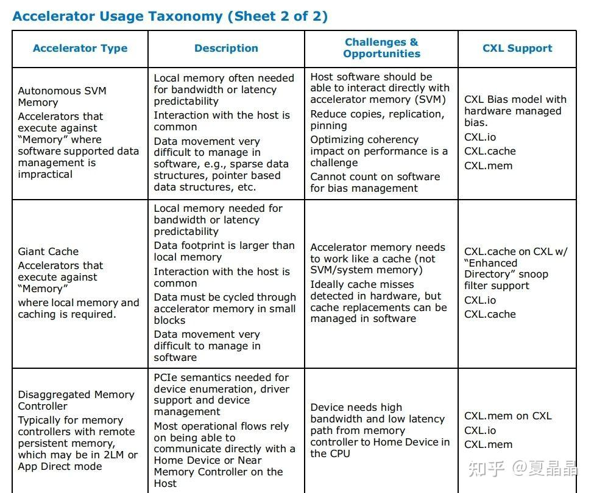

# 聊一聊CXL

> **类型**: 文章
> **作者**: Dio-晶
> **赞同**: 564
> **评论**: 52
> **时间**: 1644753192
> **原文**: [https://zhuanlan.zhihu.com/p/466870704](https://zhuanlan.zhihu.com/p/466870704)

---

今天想谈一下CXL，算是从GPU谈异构（15）吧

写东西比较随意，想到啥，因为上周恰好看到了CXL 3.0的一些rumor和可能的feature，然后又恰好看了一下思科的NetDam论文，触景生情，感慨颇深，不由得想扯两句。

我曾经提过一个问题，问的是类似这些协议的CC有什么用。

[OpenCPAI、Nvlink、CCIX、CXL，支持cache coherency的价值是什么？](https://www.zhihu.com/question/392146033)

这个问题提的不太好，因为我发现即使不钻进CC这个牛角尖上，从整个业界的芯片设计来看，CXL到底有什么价值，可能都没有公司特别是startup提出清晰的愿景。

重新提一下问，也希望好事的同学们有能力的，在面对这两年火热的DPU公司、GPU公司。**“CXL这个技术，在你家XPU上到底能发挥什么价值? ”**

这是可以用作衡量一家公司能力的问题(ಡωಡ)

答案不言而喻，**价值巨大！**

> **首先，CXL是intel对计算产业的一次巨大让利**

这个利益，不是简单地卖多少CPU返点那种。而是在处理器生态城墙上打开了一个曾经绝对不会打开的口子，一块原本在intel嘴里的蛋糕，它吐出来放到了桌子上。当然，能不能吃敢不敢吃，也是一种能力。

这个世界，一杯茶，那就是一个一个故事。

<https://zhuanlan.zhihu.com/p/331804131>

曾经讲过几个故事，没有展开。实际上在过去几十年的时间里，CPU的存储子系统部分，几乎是被intel完整地封闭在它私有的生态里面。

见过intel的合作合同的人可能不多，里面严格限定了你能做什么、不能做什么，包括HP、dell、某想，任何想在内存上做点手脚的优化，都是不能做的。intel甚至一颗CPU，支持多大的内存，都能卖两个价格。典型的某些内存数据库，缺的不是算力，就是缺内存容量想扩展的，不行，你得买CPU才能扩内存。历史上有很多个小公司尝试过某些歪路子（例如利用QPI扩展的），要么失败，要么被intel制止。连HP搞一个GEN-Z，也就是希望通过IO这个开口突破intel的封锁。

那么intel为什么要让出这块蛋糕呢？

答案也不难，intel为了多卖CPU，连PCIe的演进速度都一直在进行压制，就是不希望你有其他选择，缺算力? 多买CPU啊。但是，皂滑弄人不是，牙膏太难挤了，而AI这一波的爆发，给了nvidia GPGPU的巨大增长空间。卖GPGPU越多，卖CPU就越少。

很好，你要是intel CPU的架构师，你该怎么办?

反正，这是第一次，intel愿意放出一块利益，他希望把在座的诸位GPU、DPU用作一把刀，来与nvidia形成某种制衡，虽然这块蛋糕它随时可以吃回去，但是在到那天之前（有没有那天也是另说），你足以美滋滋地附着鲸鱼吃一顿好的。

*PS：CCIX在X86上（ARM另说）并不能像CXL那样真正融入CPU MEMORY体系，只能做成PCIe的IO MEMORY。因为只有intel自己愿意，才能真正把memory开放出来。*

*PS：题外的一个笑话，我是参加过CCIX协议制定的，为啥CCIX的接口 latancy比CXL差很多呢？ 那是因为CCIX不敢修改被intel把控的PCIe的link layer（ARM还傻傻用这个做多P互联，私有协议为啥link层兼容PCIE?），而CXL是intel提出来的，说改，linklayer就改了呗……*

> **然后，美味的食材需要一个优秀的厨子**

我一直都很好奇国内这些startup有没有在CXL上给VC吹吹牛，因为这个食材上，是完全可以做出独具风味的地方美食的。

intel在CXL 2.0 spec链接如下

[CXL SPECIFICATION | Compute Express Link](http://link.zhihu.com/?target=https%3A//www.computeexpresslink.org/download-the-specification)

在其appendix A中，其实已经给出了菜谱的引导。但以我与各种同行、周边交流的情况判断，大多数人没搞懂，更勿提这只是intel给的样板菜，真实的变化更加丰富多彩

来举一个典型不在菜谱中的CXL的好菜，就是思科的NetDAM，顺着论文看了几篇其作者zartbot的帖子，他在帖子中疯狂打脸国内DPU，令人扼腕的是看不到一个敢于反抗或者澄清的……

╮（╯＿╰）╭

他是一个相当优秀的厨子，NetDAM是一盘相当美味的大餐，而且他写文章讲得很直白，就是你们这些XX赶快来跟我学啊…………

我这里就用它做一个例子。

NetDAM当前采用了思科的memif接口方案，这玩意儿大概率是类似virio之类的软件方案，我没兴趣细看，但NetDAM的核心还是在NIC创新地增加了一块额外的NIC DRAM扩展，要真正实现存储级别的扩展，对软件体现出remote memory的属性，而要达成这个目标，最终得靠CXL才能实现其完整体。

表面上，你看完论文可以说NetDAM不就是网卡加个独立内存么？ 实际上啊

**重剑无锋，大巧不工！！**

我从我的视角交叉佐证一下它存在的逻辑

1. 服务器CPU的内存是DIMM，为什么有DIMM? 实际上是CPU需要的DRAM silicon size太大平摊放不下，所以采用了Z轴折叠的方式，用3D空间换容量来的。但是NIC这东西，需要的是独立、小容量的DRAM，用宝贵的空间换来的DIMM来做NIC的DRAM，天然就是亏的。只要能独立定义的DRAM诉求，最好就不要和DIMM合一。你喜欢喝鸡汤，他喜欢吃牛肉，如果目标都清晰了，何必乱炖在一起?
2. CPU的内存通道数量最多就是8通道了，这个不是不能做更多（也有12通道的CPU存在），而是当DDR通道超过8通道之后，无论是基板、PCB的代价就急转而上，走入一种成本你几乎无法承受的空间。如果按DDR5 5200速率算，8通道DDR带宽是5.2\*8\*8=330GB。而一个400Gbps的NIC，其实按我经验的算法，外部带宽折合到DDR带宽是有一个1.5X放大倍数的，简单来说要跑满RX和TX双向，需要400\*2\*1.5=150GB，NIC吃一半，CPU还玩个屁。这里，如果放弃DIMM用贴片DRAM，在NIC card上满足小容量150GB这个诉求是容易达成的。
3. 很多人没认真算一下400Gbps对DDR访问意味着什么。光看TX，意味着每1ns要均匀获得～512bit数据，如果按DDR访问延迟200ns及访问粒度64B，需要200 outstanding request，并且能均匀地应答响应。这是DDR难以做到的。

其实要解决400Gbps NIC问题，就只有两条路：

1. NIC与CPU进一步紧耦合，直接基于TB带宽级别的cache交互数据。
2. NIC与CPU进一步分离，各自有独立的内存空间。

NetDAM选择了第二条路，而这条路上，如果要让操作系统或者说系统协议栈能够直接操控NIC内存，最佳的搭配就是CXL。

*PS：第一个开放DOCA\_malloc库的DPU公司也许将成为最终的获胜者。*

NetDAM是CXL能够做出的一道相当不错的好菜，如果举目四望，广阔天地还有更多的好菜可做。随口举个例子，谁说做CXL.cache就真的要在ACC上做一个CACHE? 你用cache机制来实现transactional memory它不香吗？

厨子，刀在手，怎么用，存乎一心。

> **最后，做好CXL很有可能短期在中国国内获得独特的性能优势哦**

如我曾经写的关于创新的理解，有的公司会因为某些不可说的非技术原因，在技术创新上会有不可为的情况。

但留下的时间亦不多了。

---

*由知乎爬虫生成于 2026-02-01 15:39:00*
