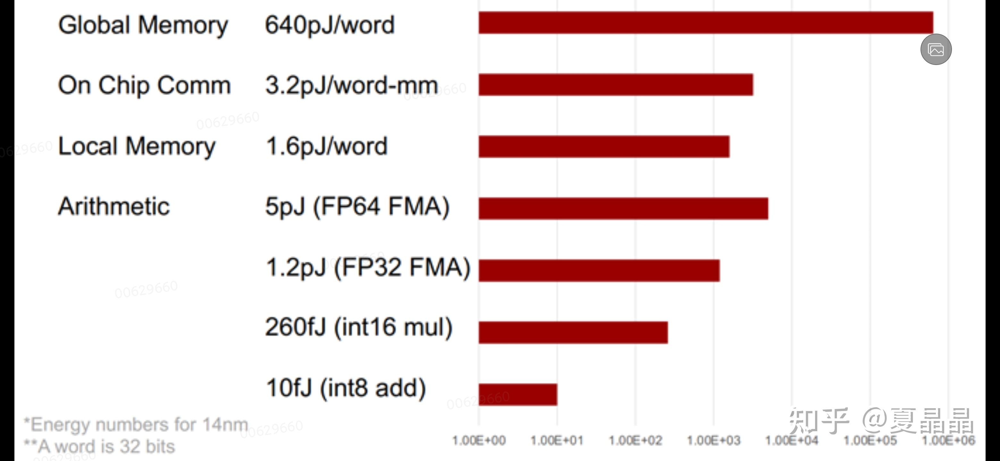
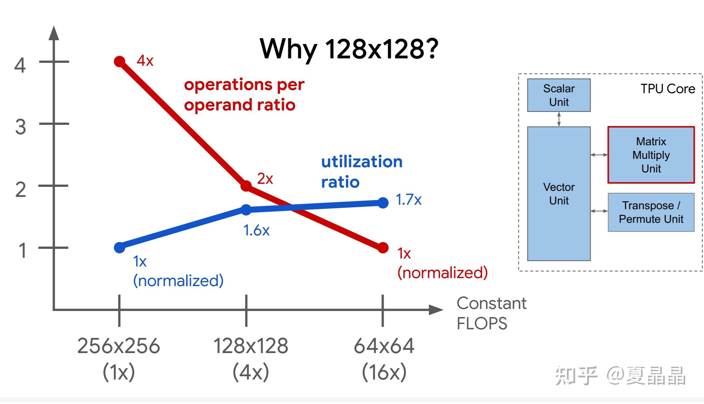
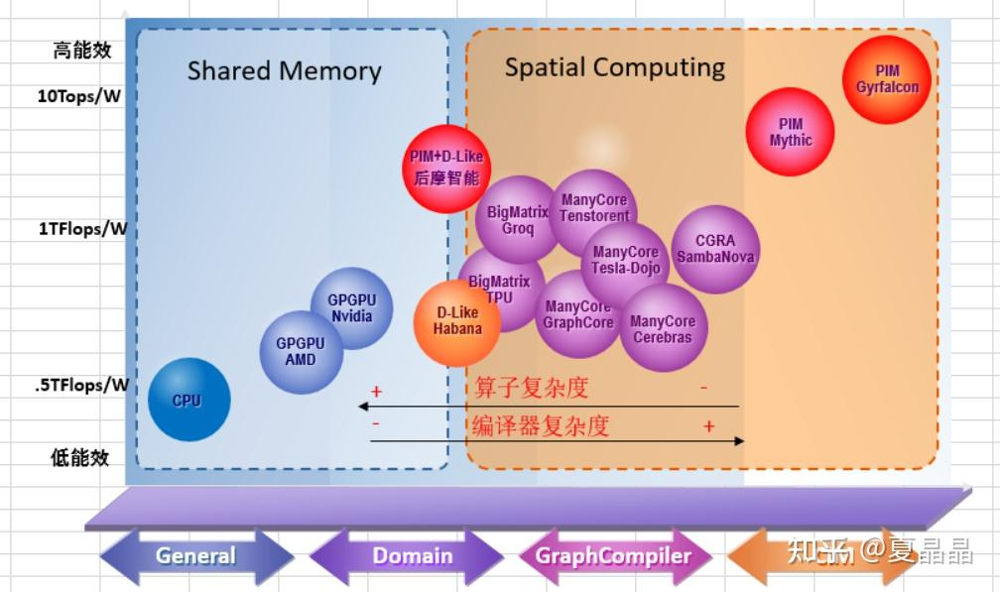
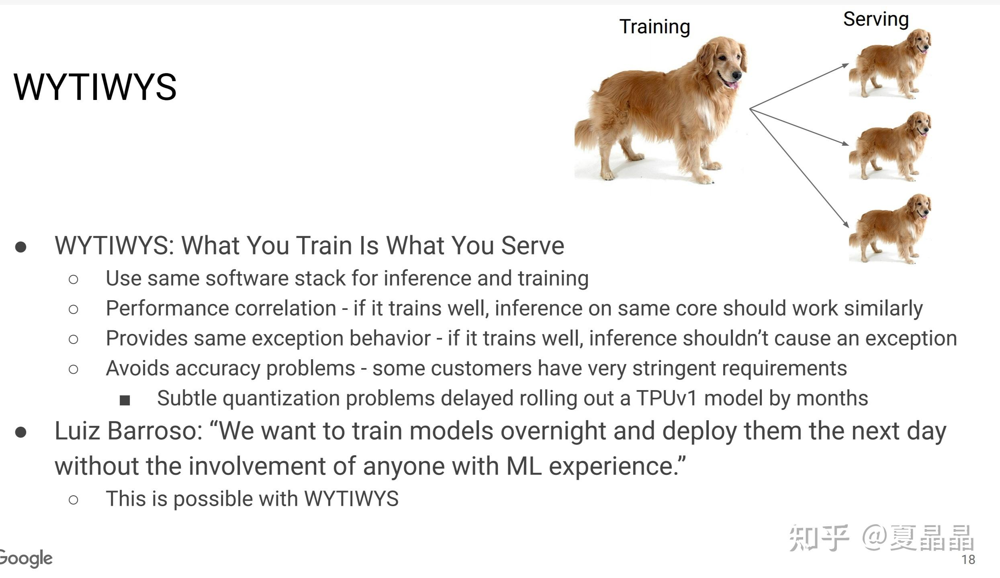

# 从GPU谈异构（13）

> **类型**: 文章
> **作者**: Dio-晶
> **赞同**: 355
> **评论**: 27
> **时间**: 1642322271
> **原文**: [https://zhuanlan.zhihu.com/p/457978103](https://zhuanlan.zhihu.com/p/457978103)

---

今天想写的这个还是从这篇帖子引起的。

<https://zhuanlan.zhihu.com/p/457265026>

这位兄台是PTG的架构师，我倒不是DISS他的分析，毕竟一千个人有一千个哈姆雷特。

他引用的数据大致上都靠谱，以他的视角看待这个问题也没有什么毛病。咋说呢，可能就是有些隐变量被忽略了，导致整体逻辑上有些不饱满。例如他引用了NVIDIA A100的250W PCIE卡形态作为基准，但他在回帖中也很清楚A100 400W的OAM卡形态能效会大幅降低，这种选择性就是情人眼里出西施嘛。OAM这多余的能耗损失花在哪儿呢? 煎鸡蛋了麽？ ԅ(¯ㅂ¯ԅ) 而这其中的原因，也正是一个架构上需要思考的问题呢。 此外，再顺着他的逻辑结论看，一众为AI专门定制的DSA，看上去相比通用GPGPU居然没有明显优势，这简直DSA了个寂寞啊。

**所有的架构取舍都是可以被计算的！**

AI DSA的一切起点，都源自NVIDIA bill dally的一些数字。

**上图只是一个参考，不同工艺、电压、不同厂商设计能力都会带来一定差异，但我还是归一化方便后续理解，这是计算架构的大方向，容得了偏差，如下RULES:**

1. ***一个数据的高精度乘加，是一个低精度乘加的4～5倍功耗。***
2. ***一个数据的乘加与数据在芯片内移动1mm的功耗基本相当***
3. ***一个数据的乘加与数据从SRAM读取功耗基本相当***
4. ***一个数据从DDR读取的功耗，足以做200～300次乘加***

我们基于如上四点来看AI的DSA架构该怎么做，下面一幅图是MIT还是谁的画的AI DSA能效比较地图，所有的AI DSA 秘密都在其中隐含了。

AI算力爆发的起点，是matrix计算单元。为什么矩阵运算能获得能效收益，如rule 3，一个数据从片上SRAM读N次的功耗，与一个数据读1次计算N次的功耗是相当的。那么如果你有大量的计算是matrix，那设计**一个NxN的matrix计算单元（读一次数算N次），除了额外增加了面积，从能效上来讲，相比传统vector计算，你凭空获得了N倍的计算算力**。这就是一切AI DSA剧本的开始。

更主动一点的故事，莫过于三板斧: 降低数据精度、减少数据搬运、更大matrix尺寸。

精度的事情我不再多讲，首先是matrix尺寸问题，nvidia 在volta架构引入了tensor core，但是这个tensor的尺寸是4\*4\*4，也就是数据复用尺度为4，这是一个相当小的尺寸，虽然有利于tiling的灵活性，但能效是不够看的，原因是什么，就是因为nvidia是GPGPU，它需要保证CUDA的兼容性，因此必须基于cuda的load/store能力做扩展，即使到了ampere时代，load/store专门做了优化，也就只能做到8\*8\*4。那么事情就很简单了，很明显Nvidia被GPGPU的GP给拖累了，要超越NVIDIA，放弃CUDA的GP做更大的matrix不就得了? 最简单的，华为的davinci架构选择了16\*16\*16，即一个数据复用16次，从单细胞的思维角度看，单看计算单元这是ampere的2倍能效收益。但如果我们再看google，TPU选择了128\*128，为什么它选择这么大他在其设计理念的介绍中说得非常清楚，值得推荐。

[http://pages.cs.wisc.edu/~markhill/seminar2020/jouppi2020\_10\_tpu-v2-v3.pdf](http://link.zhihu.com/?target=http%3A//pages.cs.wisc.edu/%7Emarkhill/seminar2020/jouppi2020_10_tpu-v2-v3.pdf)

嗯，我感觉国内很多同行看不太起TPU，总觉得它能效不行，架构一般般。其实啊，TPU几乎是除开GPGPU之外AI DSA至今为止最成功的实践了，你不见patterson教授每次都举它做例子吗？TPU在架构上的取舍考量的，那得失和值得学习的地方，值得聊三天三夜。

至于TPU延伸的groq TSP，其实也不简单是TPU的延伸，这是一个极其有趣的架构，非常具有创造性思维。因为**TSP其实整个芯片就是一个单CPU！**

写到这里，我把我画的一张图放出来吧，他是全面的对比图的进一步延伸。

不谈数据精度，相比GPGPU，要获得更高的计算能效，就必须放弃一定的灵活性，然后选择更大的matrix、CIM（PIM）、manycore（spatial computing）进一步减少数据move的功耗。

大公司，像NVDIA，因为其业务范围大，必须兼容并包，所以在架构演进中只能是后之先，持续积累工程工艺优势，以不变应万变。但众多的小公司，其实都在赌算法未来的变化，以千变万化博一个先先之先，以求出奇制胜。

但不得不说的是，近两年，越来越多的小公司选择了many core的sptial computing路径。

引用一下金学峰的帖子，这事我和他有过多次讨论。

<https://zhuanlan.zhihu.com/p/445953456>

暂时我还不能给出绝对的证据来证明这条路径的正确性，这种架构对静态图很完美，但是动态图终会有些尴尬，但是呢，从我作为芯片架构师手上的一些数据来看（**典型AI训练中，50%的功耗是被cache、bus、ddr消耗了**），我认为这条路大概率是AI DSA的未来必经之路，特别是我们的未来是大模型，或者越来越类似于人类思维能力的模型时。

**下一篇DSA（14）的帖子我预订专门讲一下many core spatial computing这个方向，很值得一谈。**

最后讲一下CIM，这条路径也是一条值得深入的路径，无论是mythic、gyrfalcon、甚至去年被国内VC追捧的后摩智能，如果光看能效，真的是爆炸的。其本质很简单，整数的乘加和浮点数的乘加完全就是两码事，放弃浮点（放弃训练），整数乘法逻辑上其实就是一堆移位器罢了，这些东西完全可以放入SRAM、MRAM、FLSAH的cell或bitline上，通过低摆幅获得极大的能效收益。后摩的技术路径也就是源自ISSCC2021的16.4的文章，基于SRAM的CIM，89Tops/W，论文有兴趣的同学可以去看看，结论我验证过了，靠谱。

但是CIM的毛病是什么呢？ 成也精度，败也精度。没有浮点就只能做inference，但是因为cell本身的特征，计算相比IEEE大概率存在误差，这种误差会出现啥问题呢？ 引用前面GOOGLE TPU设计理念: **所训即所推。**这也是TPU同时兼顾训练和推理两种功能的原因。CIM做不到啊，所以，还是难呢。

总结一下，如果单看tensor算力，我把计算架构大方向上的设计空间都列了一下，还画了张图。但这并不能真正成为AI DSA的竞争力体现，因为任何一颗AI DSA芯片都不是简单的FMAC堆积。有一句俗话，很多没做AI DSA的人都没有理解(๑> <๑）。**AI的网络中，有90%以上的计算是矩阵，即90%的计算量是可以被MATRIX计算单元加速的，但实际上这90%的计算（被加速后）只占了整个计算过程的10%的时间，而90%的时间都在花在了剩下10%非tensor的计算上。**

其各种部件的组合和搭配最终会形成其业务表现！MLPERF目前其实也不能充分表达当前AI DSA的真实水平，毕竟，不要忘了，世界上领先的大模型，那么多创造性的NLP网络、alpha网络，都诞生于TPU。

---

*由知乎爬虫生成于 2026-02-01 15:39:00*
