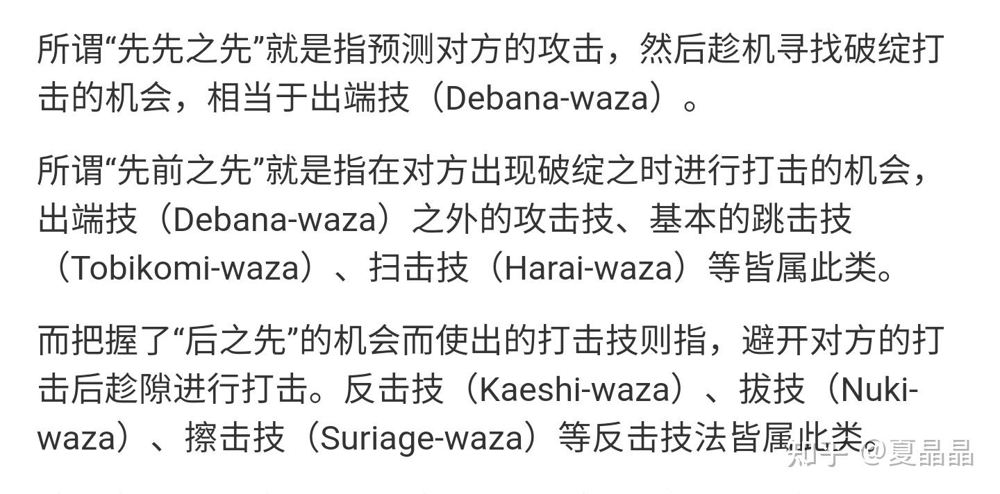

# 我理解的创新之路

> **类型**: 文章
> **作者**: Dio-晶
> **赞同**: 510
> **评论**: 58
> **时间**: 1638697680
> **原文**: [https://zhuanlan.zhihu.com/p/441253643](https://zhuanlan.zhihu.com/p/441253643)

---

这是一个万众创新、颠覆为王的时代。

我的上一篇帖子被人举报了，这篇更加偏离主航道的本来都不想写了……(▼皿▼#)

我并不是想针对谁，但憋着不说确实不是我的性格。嗯，下面的帖子是新华社的分享，也是母校一位学长写的。

[新华社分享页](http://link.zhihu.com/?target=https%3A//xhpfmapi.xinhuaxmt.com/vh512/share/10432867%3Fchannel%3Dweixin)

毫无意外。**颠覆式创新、重要的是灵光一现。**

看看周围，也差不多啦，包括我司的内网已经大量涌现如何各种鸡汤和培训教程了，什么普通人你也有创新之潜力啦，50招学会如何创新啦，牛顿就差一个苹果啦，跟阿基米德多洗澡啦，他们总是渴望着角落里某个不起眼的工程师像扫地僧一样站出来改变这个世界。

我问一个问题: 如果我们说苹果公司具有很强的创新（应该没有人反对吧），那苹果的创新之路是搞全民创新大革命？还是找了一大堆人参禅打坐然后求个灵光一现? 一个两万亿美元的公司，就把未来赌在这么不确定的灵光一现的方式上？

**先抛论点: 我认为的创新不是灵光一现，它是逻辑化的、甚至于是数字化产生的。**

～～～～～

前几天刚好有人问我，计算机体系结构这几年有些什么颠覆式的创新?

我的回答是: **太阳底下没有新鲜事。**

曾经的我也特别喜欢各种花里胡哨，总觉得能想到一些别人没想到的方法，我至今写的专利，大概有2/3是入职前五年写的。但后来嘛，阅读的论文超过一定的数量之后，才发现自己过去只是头发短见识短，读书太少，那些创新的东西价值是有，但要么是某种方法的特定应用，要么就是某些特定领域的奇技淫巧。

可能是我能力比较弱吧，所以我对我今天写的这个论点并不坚持，随意拍砖。

我认为现在已经不再是爱因斯坦的时代了，都卷成啥样了，光是重复的研究都海了去了。数一数，这世间比我聪明的人数以万计，凭啥我就能一拍脑袋把这么多聪明人卷了几十年的东西给颠覆了? 我没这本事。什么，你说你的方向业界研究的人很少? 那我劝你考虑一下换个赛道，教授拿钱的时候身体也是很诚实的。

～～～～～

我始终认为，体系结构架构师的理想模型，是一个巨型神经网络最后一层的FC(full connection)层，只是每个架构师基于不同的成长轨迹，最终都只能形成一个sparse connection。架构师最大的价值就在于对前验网络的链接及其的weight计算，所以每个架构师都需要不断增加FC的连接数和其weight的准确度来完备自己。

如果你发现没有可链接的前置层，如前所述，其实大概率是你没找到。这也是我们需要去外界和学术圈积极交流的原因。但你一旦找到，如果教授本身的方向就是对的（大概率），最好的合作其实是耐心地观察，提供数据帮助他，不要过多的打扰，静待收获。例如在RISC-V领域的luca benini教授。

<https://zhuanlan.zhihu.com/p/425114237>

**我认为创新的第一重，在于计算，是当某些前置网络的输入因为时间演进而发生了变化时，再若干的链接和权重相乘，导致某个输出的差值触发了预定的阈值，而引发一系列变化。这些个变化，都是能够计算出来的**

苹果在最新的M1中采用了MCM结构的LPDDR，获得了LPDDR的成本收益和GDDR级别的带宽收益，这是无可否定的创新，但这是绝对不是某些人推崇的拍个脑袋灵光一现。他是架构师的FC网络中，至少包括DRAM结构、基板封装、DRAM制造等多个前置网络变化带来的可计算的结果。大家都知道，HBM是2.5D封装形式的选项，LPDDR和GDDR是PCB级别的封装选项，LPDDR比GDDR便宜，那么有没有一种能够在MCM级别的最佳选择呢? 在基板加工工艺没发展到一个技术点的时候，其实是没有或者很不划算的，但恰好，前两年基板的某个制程被苹果孵育出来了（这是奇点），再加上苹果对美光的主导性和市场影响力，M1合封的LPDDR就水到渠成了。

嗯，你要说灵光一现的创新不也有很多很神奇的故事吗？ 确实有，那是在我们的FC网络不够完备，前置条件不够清晰的时候，来一把梭哈的行为，赢了会所嫩模，输了下海干活呗。其中的胜利者（幸存者偏差），就变成了口口相传的扫地僧神话了。

我天性不喜欢赌博。π\_π

写verilog出身的人，都知道十赌十输的道理。

～～～～～

是否通过计算，就一定能创新呢？ 也不是。

**我认为创新的第二重，在于算计。在于对一个逻辑树（决策树）的各种分支进行可能性推演，从无数的死路中寻找最符合逻辑的若干生路。**

每次有人跑来告诉我一个好主意的时候，我问的第一个问题都是: 这个方案为什么intel(nvidia)不做? 从我认识到自己的渺小开始，我就不认为我能想到的，MIT、斯坦福聚集的硅谷想不到。而事实上，我发现确实如此。

算计的第一步，是假设自己的第一步对手都已经想到了，然后开始计算对手的第二步。如果对手已经想到了这个方案，他为什么不实施? 他是留作后手、还是遇到了什么困难。如果是遇到了困难，那他遇到的困难有没有机会是我可以解决的?

真的，我现在做很多方案都是这么在推演。这两年我特别喜欢阅读intel/nvidia等公司的架构师和CEO的访谈，因为从这些访谈的思路上你有可能读出他们的一些决策逻辑。经验之谈，有时候你真的能发现机会，最佳的可能是友商架构师的FC网络有遗漏（极其稀少），其次最让人开心的是友商公司的组织形式导致（大公司的组织总有毛病），这种机会最美滋滋的（当然友商也能找到我司的毛病），但大多数时候，你会发现友商的困难是你也无法迈过的，那应该做得就是记录、孵化、耐心等待了。

在这个推演过程中，你不仅仅获得了逻辑，有些时候，获得的是惺惺相惜。我很喜欢火凤燎原的一句话: “计谋分三层，第一种计谋，单发，第二种计谋，双向互发，第三种计谋，融汇贯通。” 在地球的另一半，有人和你想得一样呢。

intel的ponte vecchio，我遇到很多人对他不理解，及各种不屑，认为这么个复杂的东西根本不能量产。但随着我也开始做3D chiplet，并且逐渐建立了一些FC链接之后，我认为ponte是一个无以伦比的创新，他所有的选择其实都是在前置网络相互之间所能达成的极致边界的艺术。如果我某一天能够碰上intel的大架构师RAJA，我希望能上去和他讲一句话，“我和你想得一样呢。” 我想，这是架构师的浪漫吧。

**我认为创新的第三重，如何出招。**

这是关于一个逻辑能够反复盘算清楚之后，如何实施的方法。我其实也在不断地尝试和探索，我个人的路子是以剑道的三先作为分类。先先之先（预测对手的出端技）、先之先（击其破绽的打击技）、后之先（避其攻击的反击技）。

苹果的合封LPDDR策略，就是典型的先之先，他虽然保密性高，但在产业链捣鼓的很多事情，并不是无迹可寻，但当他出招的时候，就是个当头直劈打先手，气势整个压制了产业链，你避无可避。 如果是小公司，那么往往就得出奇制胜，寻先先之先策，这不是赌，是拼。……当然，我司擅长后之先。

但这一切依旧是有迹可寻的，可以推理逻辑的，哪有什么灵光一现。

～～～～～

**所以啊，我理解这个世界内卷的激烈、对创新的渴求，但天天弯道超车弯道超车的，把灵光一现当成了主航道，甚至看不上在直道上堂堂正正的追赶了。**

**国运不是赌出来的啊。**

---

*由知乎爬虫生成于 2026-02-01 15:39:00*
