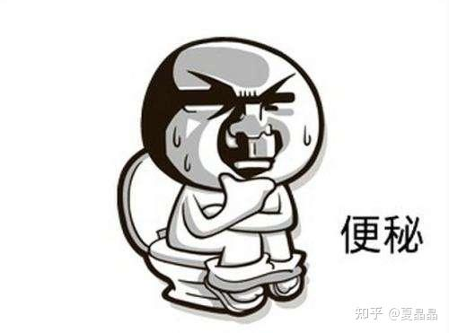

# 那是寻找七龙珠的故事（1）

> **类型**: 文章
> **作者**: Dio-晶
> **赞同**: 188
> **评论**: 33
> **时间**: 1638611669
> **原文**: [https://zhuanlan.zhihu.com/p/441111404](https://zhuanlan.zhihu.com/p/441111404)

---

最近参加海思设计验证大赛有点颓……我打算写点恶心的东西传播一下我的心情( ｰ̀εｰ́ )

我曾经回答过PTG的ARM芯片的一些猜测，在其后听到的一些传言也证实了我的猜测，ARM公版方案的多核scale-up可能是有些问题的|ω・）

其实很多人并不知道，多核scale-up的技术，和光刻机一样，是属于美国禁止出口中国范畴的。当然，掌握这个技术的公司（能做到可商用）并不多，IBM是所有人的老师，然后就是AMD和intel，其中intel的QPI和UPI最为著名，而nvidia的nvlink都算不得scale-up技术的。你说你有钱，想买QPI的技术? 不行的，对中国禁售，不是钱的事，ARM公版的技术方案你别嫌差，也是市面唯一能买到的了。

但为什么scale-up的技术大家都不太关注呢？ 因为他并不炫，它的本质，是体系结构的吃喝拉撒睡、是柴米油盐酱醋茶。在这个万众创新、颠覆为王的时代，就如李敖所讲，风花雪月的世界哪容得下美人便秘…………

ps:当年制定某司scale-up协议的五个人，两人流失海外，一人转岗，一人去了PTG，经历过一切历史的就还就剩下我了，如果这些下里巴人的故事没人想听，那再过个几年，有些principle大致也就该消逝了。

体系结构中的重要一环就是load/store，这是图灵机的一个重大特征，它实质上代表了计算过程中的状态扩展，计算随着不断的L/S像一个生命一样不断循环，直至结束……

load和store是不等价的，而我喜欢把load比喻为吃，把store比喻为拉。

不过这里需要额外更恶心地形容一下，绝大多数同学学习体系结构的时候，都把store当做一种耿直的一捅到底地A写到B的行为，实际上呢，除非是有特殊的语义，例如写寄存器或者noncacheable的某些行为，99%的store都是posted的，也就是逐级一节一节地进行的。想想也是嘛，谁拉屎是从头到尾完整一长条的，都是一节一节的嘛。posted write通常都基于cache或者buffer进行，最终表达为shitback，哦，copyback。其中每个POS都会提前反馈response，以提升拉屎的CPU的性能，即通常CPU并不存在write latency bound这个说法。

为什么要这么恶趣味地比拟呢，因为处理器和人是一样的，得不停吃东西才能工作，否则得饿死，当然稍微饿一下倒不一定马上死。

但拉屎那是真不一样，想象一下菊花被堵住，拉不出来的感觉，那是不是很酸爽? 拉不出屎，那就得憋死。

一个CPU，当他想吃的时候，一定是他有胃口的时候，他一定是吃得下的，如果喂得快呢，那么就是CPU效率高一点，喂得慢了，也就是稍微饿一下，一般来讲，并不存在撑死这种情况，但拉屎不一样，人有三急，要拉就必须得拉，如果因为一直吃吃吃，导致了拉不出去，芯片内部能够存放的空间是有限的，就如人的肚子一样，装满了，还吃，得炸。

当我们面对一个多核系统时，如果你把系统看成各个独立的个体的时候，其实也没那么难，因为若干个独立的个体，只要是生活能够自理的，你想吃就吃，想拉就拉，最多也就是抢食堂抢厕所罢了，大概率死不了人。

但是scaleup不一样，此时整个系统需要成为一个统一的整体，所有的吃喝拉撒，都做得像是一个人在吃，一个人在拉。也就是说，人与人不同的的吃和拉之间，存在了耦合关系。有人得等着另一个人拉完才能吃 \_(:3」∠❀)\_

嗯，再进一步说，所谓的cache coherence，用非常直白的一句话来表达，就是所有人的吃和拉，都必须被记录在案，严格按照有迹可查的方式执行。你吃下去的所有东西，都打上了标签，而标签具有和数据完全不同的生灭状态。独立自由世界允许一个人吃完拉裤子上，或者不知道吃了啥就拉，反正也没记录，但scale-up的世界，吃进去的一粒米，最后变成了米田共，都必须是精确记录在案的（当然某些一致性协议有一定的放松）。这些记录是万万不能出错的，要一个不小心出了错，就会导致某个下游的CPU发现……

其实我讲到这里，真正懂得做scale-up的人，他就该理解我在说什么了。不能懂得这个梗的，包括我在公司内培训，很多人听着看着一脸懵逼的的样子，入不了门的话，带不动也是没办法。

做一个处理器scale-up的系统，一个非常非常重要的技术点，就是要解决多核、多DIE、多芯片之间，如何顺畅拉屎的问题。是的，**七颗龙珠的其中一颗，在屎里**。呵呵，PTG或其他cpu startup，想要超越ARM解决scaleup的问题，这个 问题你避不过，不要嫌脏，这里就是没有仙女飘飘，只有吃喝拉撒。想当年吧，以我做scaleup的经验，有40%左右的scaleup功能的致命级bug，都是屎拉不出来憋死的。

到此为止还不是最恶趣味的……

因为单die或者单SOC的情况下，这个问题不算特别难，真正难的是多die和多芯片之间，特别是存在类似daisy chain菊花链（当年谁起名这么骚的）的topology的时候，问题难度指数上升。

曾经有一个非常经典的电影表达过类似的境况。。

嗯，你知道我在指什么。

《人体蜈蚣》

我不敢贴成品的效果图，我怕被举报。

〇rz〇rz〇rz〇rz〇rz〇rz〇rz〇rz〇rz〇rz〇rz〇rz

但事实上，如果要在通用2P之上更进一步，解决内存数据库级别、小型机级别的scaleup，你就得完整地完成一个蜈蚣实验，并且量产！ 它的难度在于，每个DIE/chip不仅仅要为本地的CPU拉屎留空间，作为B，还得为上游A拉出来要给到下游C的屎留足够的胃口，必须吃得下，拉得出。

其实到这个级别，我也没做得太好，这个级别还是IBM老师厉害，我还是太单纯不够变态(/ω＼)

写了半天，感觉上除了恶心啥都没讲? 嘿嘿，也算是吧，相当于加密了，但其实这是计算机体系结构中，书本上不会讲，但真实存在也非常重要的大粪坑！

---

*由知乎爬虫生成于 2026-02-01 15:39:00*
