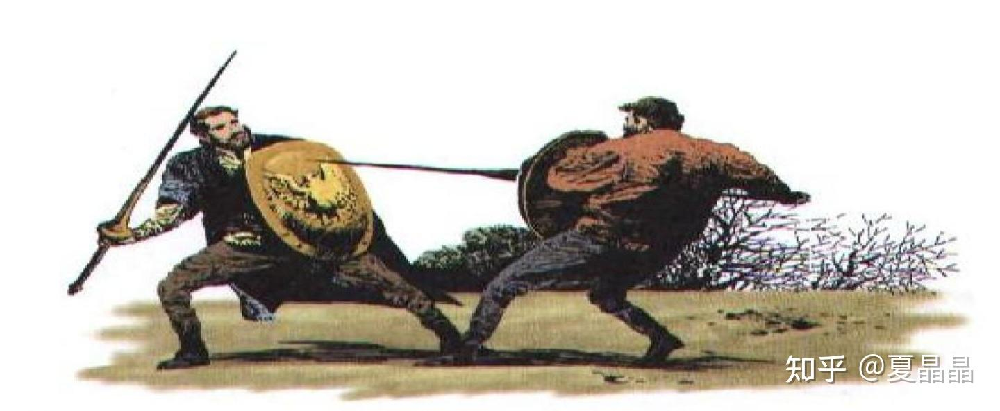
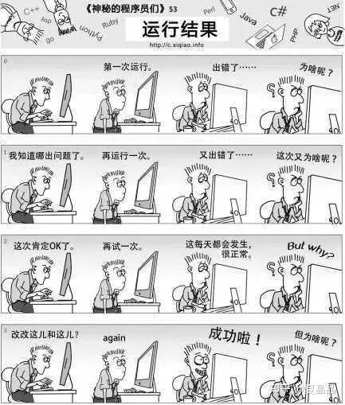

# 论人工智能如何落地（续）

> **类型**: 文章
> **作者**: Dio-晶
> **赞同**: 97
> **评论**: 13
> **时间**: 1635058834
> **原文**: [https://zhuanlan.zhihu.com/p/425114237](https://zhuanlan.zhihu.com/p/425114237)

---

最近被问到一个关于AI的问题……

DSE：design space explore

M：X问题通过AI拟合DSE寻优方法获得了很好的收益，比人工方式效率有很大提升。那Y问题是否也可以?

S：Y问题的相关系数的数量比X问题多很多，也就是探索空间的维数要大很多，DSE难以遍历。

M：Y问题过去以来都是依赖优秀架构师的经验求解，如果纬度这么多，到AI的DSE都无法遍历，人又如何能解的?

这一下子就进入一个很神奇的空间了。

这个事倒是让我回想起曾经写过的一个帖子。

<https://zhuanlan.zhihu.com/p/332291332>

**AI落地的关键，是反解耦，反流水线，反序列化。增加一个问题的空间纬度使其超越原本问题的纬度，混水摸鱼，让问题处于人力无法解答的范畴时再用AI拟合。**

如果现在回头看做法，我认为是没错的，其实我们目前在做的DSE，包括成功的若干实践，都是把一个相当复杂的过程看做完整且单一的黑盒，用众多的输入和众多的输出的数据进行拟合，与原本由人解决该问题时采用的若干步骤和步骤中所采用的数学方法都没有过多关联。要进一步解释一下的话，其中一是没法直接引入这么多复杂度，二个是原本人在解题时也采用了非常多数学近似的算法，某些算法本身可解释性也不鲁棒。

因为我恰好是Y问题的专家，所以这次的问题这让我陷入了深深的沉思，人是如何收敛一个Y这样超高纬度问题的?

然后我觉得我有一些想通了。

**Y问题在当下并不是被某个个体独立解答的，而是通过数十年来莫名其妙的演进和解耦，原始Fin通过非常多分层的离散的实时处理或经验过滤，然后再由复杂的潜移默化或规则化的关联，把信息相互传递，最终得到一个在不同收敛出口下也依旧保持了一定差异性的Fout。**

每一个人在这个环节中都基于某种模式形成的分工完成了某个F(x)，然后其结果被某个带有权重的链接关系交给了下一级的F(x)，环节中的个体甚至有时候无法感知他为最终fout产生了贡献，甚至某些F(x)被多种fin复用，它会因为需要适配某些fin的特征产生了新的F'(x)，它也会因为下一级反馈的某些反馈而修正F(x)。

**即Y问题当下并不是被优秀架构师解答的，而是被一个工程师组成的NN网络解答的。**

只是这个NN网络如此巨大，其复杂的分工和分层存在于整个社会的全部角落，导致了我们往往只注意到了给出答案（写汇报胶片）的某个或某几个所谓优秀架构师而忽视了（其实这些所谓架构师，不过是信息收集或过滤器罢了）。

这个NN网络的训练过程也如此复杂，它建立之初是基于money为驱动力，但同时被国家之间的技术积累or政治特征，期间也有某些个体特别的影响力，最终奇怪地拼凑而成。

有时候我们读历史书或人物传记，也许只是想知道，为什么这段奇怪的代码能够正确运行。

也许当前很多复杂问题的求解，是被基于文明这个巨大智能体所承载的。要解答类似问题的AI，并不是一个简单以人的智能为参照的人工智能，而是以一个五千年训练过程创造的文明的智能为参照。

我们想用AI解Y问题，并不是在用AI替代人的智能，而是在替代文明的智能。

**换句话说，这是在造神。**

要想人造一个NN网络来拟合Y问题，并通过DSE寻找局部最优解，除非数据足够巨大，否则并不能如我曾经所想，反解耦，反流水线，反序列化，用一个黑盒来拟合。还是得打开问题本身，通过观察这个问题原始的分层方式、历史原因、外部约束，以帮助我们完善人造NN网络的完备度和结构。

除非数据足够大，这个前提…………在数据爆炸的时代，我们真的数据足够大吗？ 如果单纯看信息量本身，也许当下世界足够多，但对于单一问题的归纳、经验、公式，我们的当下与历史相比并没有增加，甚至在减缓。

所以，我认为黑盒的NN方式对高纬问题是无解的。此时，人还不能胜天。

得白盒或者灰盒。

行得通吗？ 我……感觉……也挺难的。

这是一个非常危险的话题。

但我还是想引用三体的一句话：**弱小和无知，不是生存的障碍，傲慢才是。**

当前做AI的同学想要的都是：毁灭你，与你无关。

某些简单点的事情可以，但某些更复杂度的事，例如google在医疗AI上的事…………

[谷歌医疗AI再遭重挫！自宫头牌App，副总裁也已离职](http://link.zhihu.com/?target=https%3A//mp.weixin.qq.com/s/TEoe3d9DYuO7DGQeEQFghA)

你想要取代我，至少在我死前，听我把过去的故事讲完行不 ？ 你赶时间? 哎，还打我，不说了不说了。

---

*由知乎爬虫生成于 2026-02-01 15:39:00*
