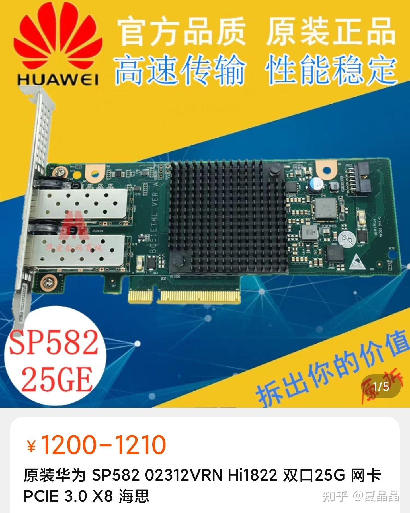
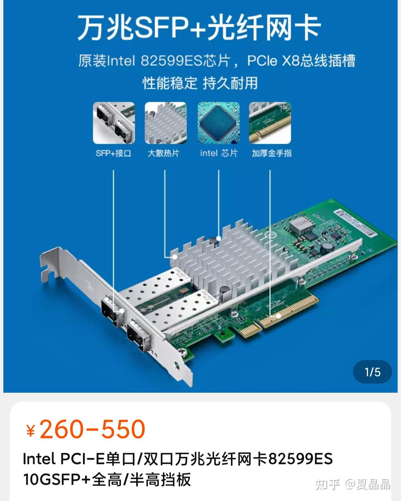
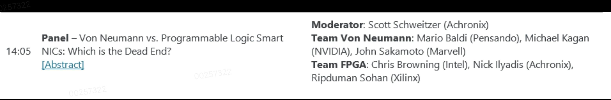
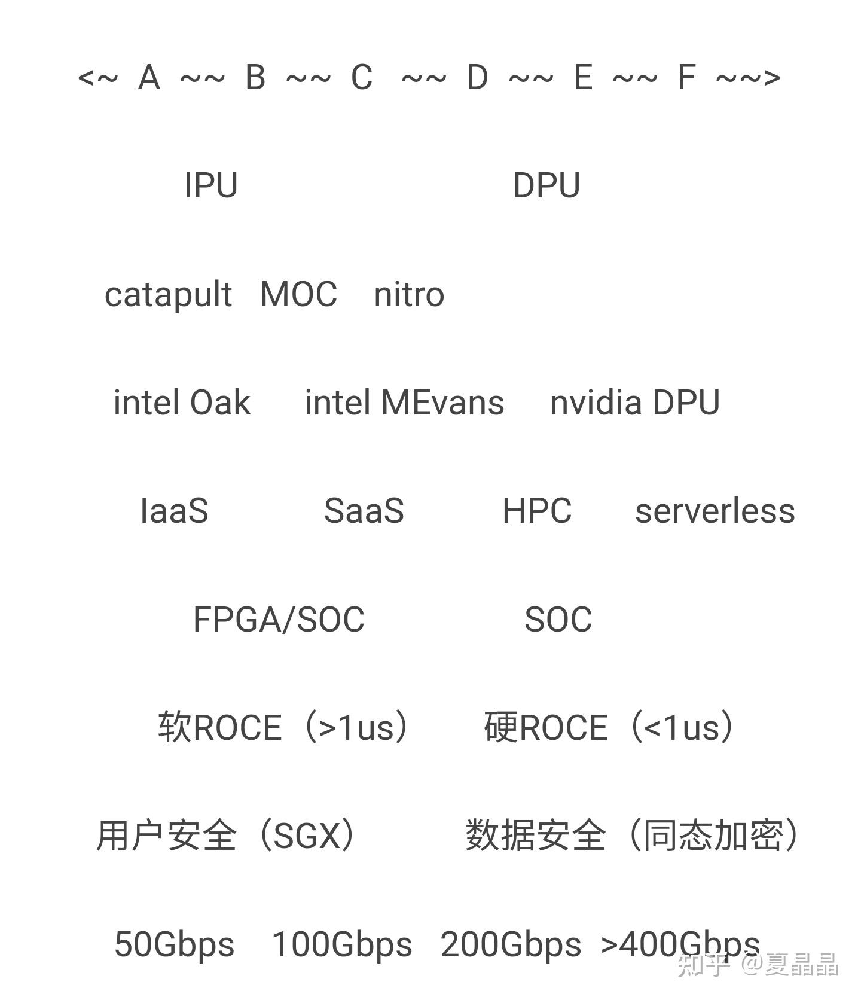
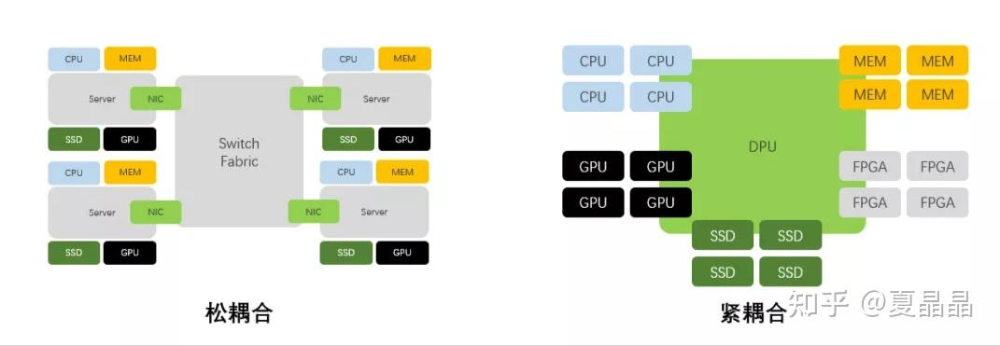
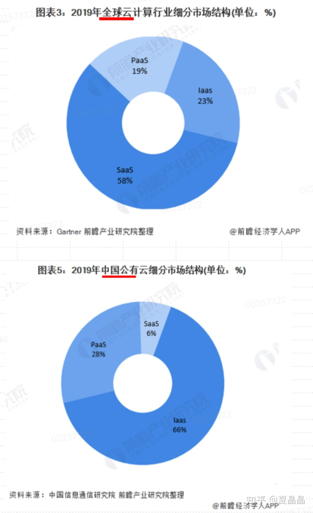

# 写一下DPU（长文）

> **类型**: 文章
> **作者**: Dio-晶
> **赞同**: 710
> **评论**: 133
> **时间**: 1631444240
> **原文**: [https://zhuanlan.zhihu.com/p/409507738](https://zhuanlan.zhihu.com/p/409507738)

---

原本是不太想写这个话题的…………因为从业务范围来讲，DPU在我❁属于鲲鹏处理器套片的范畴，和我相关度极高。

(°ㅂ° ╬) 万万没想到这原本无论是市场空间还是技术本身都蛮纠结的领域，今年突然就变成一锅稀里哗啦的热油。

相识多年的一位故人老S去了X豹…………每个人都有每个人的际遇…………奈何最近几月，以资本为名，身边有近二十位不明真相的同学又相继被忽悠跳入这锅乱炖，是福？是祸？ 这前路就有点让人说不清了。

咋开口呢，原本这个领域叫做smart nic，它原本就存在，并随着cloud的变化而不断演进。而DPU这个词是nvidia收购了mellanox之后命名的一个噱头，再然后intel又给了个名字IPU，因为股价和讲故事能力的原因，大家不大搭理IPU这个词。但是同学们有没有想过为什么会有这两个词的存在呢？I和D仅仅是为了商标吗？ 算了，慢慢讲，我先按“泛DPU”来指代这个领域。

很多人不知道，仅仅是在我❁内部，在我视线可见的范围内，就有三颗量产的泛DPU芯片进行过激烈的互噬。\_(:3」∠❀)\_ 呵呵，老S同学没有经历过其中的任何一颗。

下面是参与互噬的其中一颗相当成功的DPU（Hi1822）整板在淘宝上的链接，先看看价格，意不意外，惊不惊喜？ （有兴趣的同学算算每年有多少cloud server上线，算算能挣多少钱）

π\_π π\_π

7.0₴hlJJXpn9l3U£ [https://m.tb.cn/h.fc2xpRM?sm=868c8b](http://link.zhihu.com/?target=https%3A//m.tb.cn/h.fc2xpRM%3Fsm%3D868c8b) 华为海思HI1822 2102312N BC8M01ETHA SP580 25G四口万兆网卡

~~~~~

今天我来把我对整个泛DPU领域的逻辑捋一捋，后面要跳的同学也多深思一下要不要入坑。

~~~~~

先把各个名称和定义澄清一下。

首先是smart NIC，这个词的定义是基于与传统NIC（也就是以低价称霸世界的82599）相对应的功能更加丰富、价格也更贵的NIC。题外话，被nvidia收购的mellanox就是一直在82599面前苟延残喘，在细分市场找食吃，看到这个价格，传统硬NIC让我做，我也不做的（送命题）。

下面是淘宝上82599的链接，看价格……

4.0《iWM6XpnMxWo [https://m.tb.cn/h.fcdZJQP?sm=0a3372](http://link.zhihu.com/?target=https%3A//m.tb.cn/h.fcdZJQP%3Fsm%3D0a3372) Intel PCI-E单口/双口万兆光纤网卡82599ES 10GSFP+全高/半高挡板

借用英文的一段描述供参考：A good working definition is that a SmartNIC is a NIC that includes additional computational resources exposed to the customer, along with the necessary open-source tools to utilize those resources. The additional computational resources process network traffic both as it enters and exits the server as well as offload the host CPU at the application level.

smartNIC是基于cloud而诞生，为cloud运营商提供了可编程的资源，而要再进一步的话，其本质是为了让用户更加方便地使用cloud上的资源而存在的。

cloud为用户提供服务的方法大致能分成两种：**一种是把cloud上看不见摸不着的资源，以传统PC的使用习惯提供给客户，让客户完整感受到CPU、MEM、IO全部件；另一种是以某种APP调用的方式为客户完成某个独立的应用诉求。**

理解cloud的服务行为对于理解smartNIC及泛DPU的范畴很有帮助。

smartnic可以是CPU+HAC，可以是network processor，也可以是FPGA，对的，还有FPGA，即使在最近的hotio2021的panel上，也并没没有明确的胜负手哦，FPGA其实是目前各DPU SOC路线最大的敌人呢（不知道我司有没有这条路，是不是在我参与之前就被卷死了？）。

注：不要觉得FPGA贵，都是沙子，价格看量。

所有的形态差异，都在于cloud要选择用怎样的形态为客户提供服务。

DPU的D，是DATA，代表着它希望在为cloud用户提供服务时，参与DATA相关的协作。

IPU的I，是infrastructure，代表着它希望卸载基础设施上的工作负载。

无论是I或是D，其本质在于这个smart nic希望在cloud业务中如何方便客户使用的各个不同方面。

~~~~~

我把cloud上DPU当下希望offload的feature及其坊间的关键词按照ABCDEF的一个渐进性顺序罗列出来，当真正做的时候，你会发现，它们之间是存在相当多的无法统一的矛盾的。

~~~~~

**A：网管，即数据中心大型组网下的启动发现、路由策略、拥塞控制、故障处理、加解密等。重要的相关词包括：P4、ECN、DC-QCN、crypto等。**

**B：虚拟化，即数据中心存在众多租户时，为租户提供虚拟的PC模型的机制。重要的相关词包括：多租户、IaaS、OVS、virtIO、迁移、隔离、SGX、Vxlan、overlay等**

**C：存算分离，即数据中心disaggregation的第一步，把storage池化后，但又提供一种storage像PC一样在身边的感受的特征。重要的相关词包括：SDI、NoF(NvMe over fabric)、KV storage、软ROCE等。**

**D：集群通信，数据中心走向另一面，把一定规模的设备整合向单一用户或应用提供服务的形态，主要针对高性能计算(HPC)为主。重要的关键词包括：MPI、硬ROCE、<1us、高pps、HPC上云等。**

**E：Full disaggregated，即数据中心再进一步资源整合，以池化的异构资源池方式提供服务给客户，客户不再感知硬件具体形态，或者把整个DC看做单一的PC。重要的关键词包括：datacenter as a computer、disaggregated datacenter、SaaS、serverless、pool、RPC等。**

**F：边缘计算，极端的pool结构，把CPU/GPU/DPU合为一体，放弃完备的虚拟机可用性，用极简的融合方案提供单纯的特定算力，即只做RPC服务化的计算单元。重要的关键词包括：EDGE、AI+DPU、免host等。**

**除开A～F，不同形态还会有一些场景差异化的特性，包括security、reliability等等。**

～～～～～

从A到F一种以数据中心形态特征而逐次变化的。

有一句话说得好：**one size never fits all。**

那你做的到底是什么？

~~~~~

所以答案是一个倾向性的定义，每家的smart NIC在原则上从可编程性来讲都可以完成A~F的全部功能，但实际上为了达成其应用目标，会有所侧重和取舍。

简单来讲：**越偏向于AB的是IPU，而越偏向于EF的是DPU。**

我先简单画一个分类图（嗯，价值X万），然后慢慢解释。

CLOUD和共享单车没有特别大的差别，它的核心是通过资源复用获得社会资源效率的最大化（作为CPU业者，我不喜欢cloud，每人买个server不好吗,,Ծ^Ծ,,）。

A~B~C是典型的IaaS cloud的基础设施特征，用户并不希望看到这些特征（这些特征在PC上不存在），所以数据中心要么采用host的几个CPU CORE来隐藏这些特征，要么用SNIC来隐藏，显然后者更高效和经济，这是IPU的存在的主要价值，提供一个infrastructure平台的助力。因为IaaS上运行的是无数个独立PC，所以东西向的流量实际上并不高，往往50Gbps就够了，上100Gbps还得时间。IPU并不会主动接触用户的数据而是尽可能给用户提供一个不被入侵的独立空间。这也是为什么这个领域一定要强调叫IPU而不是DPU，呵呵，因为这涉及到一条安全红线的问题。用户买IaaS，数据安全性是非常重要的诉求，好吧，你叫DPU，那我代表用户问你一句，你到底有没有动我的数据？ 动了？ 你凭什么动的？ 你偷看了什么？ 没动？ 没动你叫DPU这个D是骗我？ 同学，别傻里巴机跟风叫DPU，滴滴之鉴，你跟不起啊。

D~E~F更倾向于把cloud改造得更高效。因为IaaS的利用率和用户体验始互相矛盾，导致IaaS需要非常大规模才能获得复用的收益（经常说得IaaS不赚钱就是如此）。所以大家都想通过隐藏用户的感知来提升效率，最初是SaaS，不过考虑到SaaS缺乏完备性且生于IaaS，其底层往往还是IaaS，所以需要更进一步，就是serverless，此时硬件形态被隐藏，GPU异构就能大显神威，此时才是真正的GPU上云的时候，nvidia需要在这个阶段后可以开始大发神威（这才是NV收购MLX做DPU的初心，NV不会主动建设IaaS），如果再向前一步，datacenter as a computer，又回到最初，让每一个用户把整个数据中心看做一个PC，此时互联会变成最为重要的特性，因为此时的DPU将成为主角，是在更大纬度把各种设施紧耦合起来的关键。高速高效的互联，此时的DPU那都是400Gbps带宽，硬roce延迟小于1us，网络上的隔离和安全逐渐由端到端的机制来承接。

~~~~~

我能做一个DPU兼顾IPU和DPU的所有特征吗？不能。这其实是国内各startup公司有意无意混淆概念的原因。

IaaS要做好OVS，而计算池化后OVS毫无用处（NV DPU支持OVS很弱的），计算池化则强调互联，要做到HPC上云及serverless，那200G和硬ROCE必不可少（互联成本靠效率收回来），但要在IaaS上做个200G网口，那是败家子了，要知道在IaaS上成本极其敏感，网络部分capex的预算只占整系统1%……

AWS的nitro可以说是在取舍之间做到极致的一个smart nic（有些starup动不动就喷AWS不行也是让人醉）。nitro是一个IPU，以服务IaaS及IaaS之上的XaaS为目标，此外它自定义了与infiniband媲美又兼容ETH物理链路的SRD互联协议，并选择100Gbps这么个稍超前的带宽配置，达成了ABC+D特性，即达成了IaaS to HPC上云的smart NiC范畴（国内无人做到相当水准），令人佩服。

~~~~~

在中国要做泛DPU，该咋整？

一句话：**对于startup几乎无解。**

~~~~~

**我跟随Nvidia的理念做一个DPU ？**

……人家黄教主推DPU是为了卖更多GPU！！ DPU售价我放到帖首了，你查查NV A100卖多少钱？

你有GPU搭配卖吗？ 有吗？

算你有GPU吧，你会发现，中国几乎连SaaS都没有，你再想想serverless或者计算池化这种形态上更胜于SaaS的形态需要多少时间能出现？ 特别是中国未来cloud如果走上国资云，会是什么样子？

为什么全球（美国）的cloud中SaaS占比特别大，而中国却是IaaS为主？ 这个问题我也是想了很久才有些基本答案，有空另谈。

~~~~~

**我跟随阿里moc、AWS nitro做一个IaaS的IPU？**

难，因为每一家cloud的泛OVS协议栈，都长得不尽相同，每家的cloud工程师，都发挥自己对自家业务的理解，做了非常多的定制化，而且这些定制化都是每家cloud的独门秘笈，万万不能被人偷学的。所以，每一家合格的大型cloud都应该自研IPU，你说中型的cloud？ 不存在的，cloud要么大，要么死。所以我们看到AWS做了nitro、微软做了catapuls、阿里做了MOC，国内大云没做的就只有腾讯了…………好像是能做，不过呢，其中最大的敌人应该是FPGA……在IPU这个领域，SOC做的不好还不如FPGA能效高编程易呢。

～～～～～

最后回到我❁

没法说太详细，但在深刻经历了三颗芯片的互噬之后，让我们更加深刻地理解到了各个特性之间的相互关系和作用。最终，我们找到了一条非常有希望的通过chiplet及套片联动的组合策略，在一个数据中心用一套系统达成A～F全部特征的路径，并希望以此成就领先世界的cloud。

to某些同学啊，与其当下快速地去做能力变现，还不如努努力混到鲲鹏\*昇腾的核心架构师团队，看看更精彩的未来长啥样呢。

额外说一句，这个方案极其罕见地在鲲鹏\*昇腾架构团队一致通过，没有吵架 (´ﾟωﾟ｀)。

---

*由知乎爬虫生成于 2026-02-01 15:39:00*
