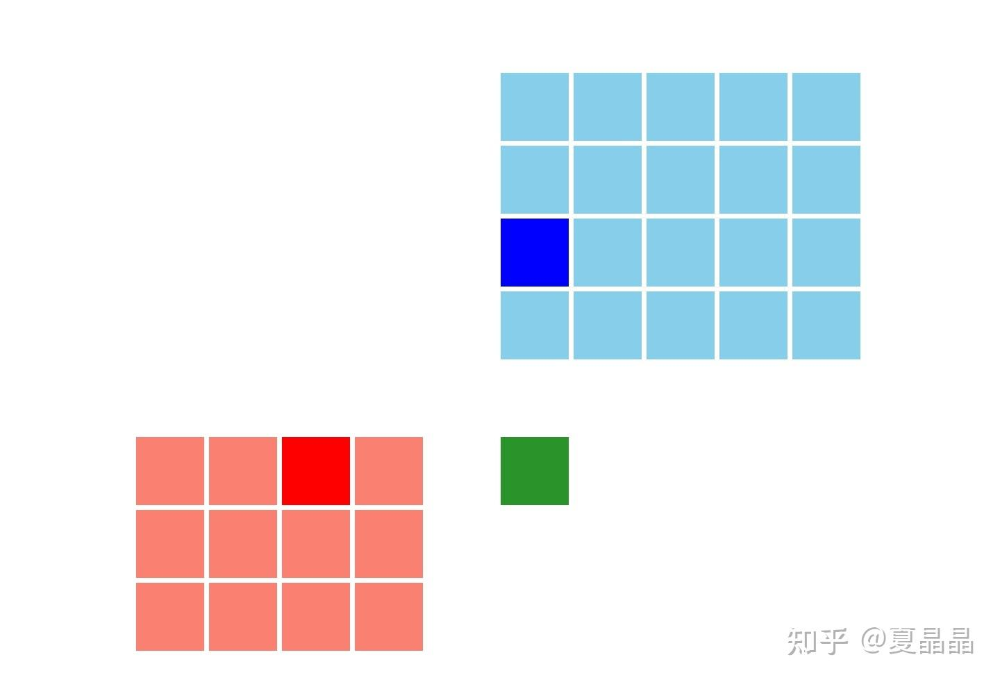
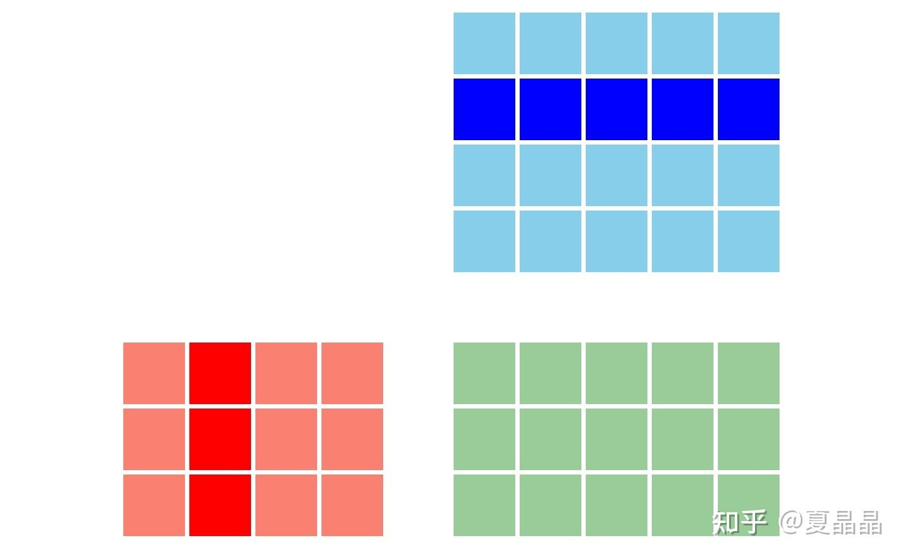
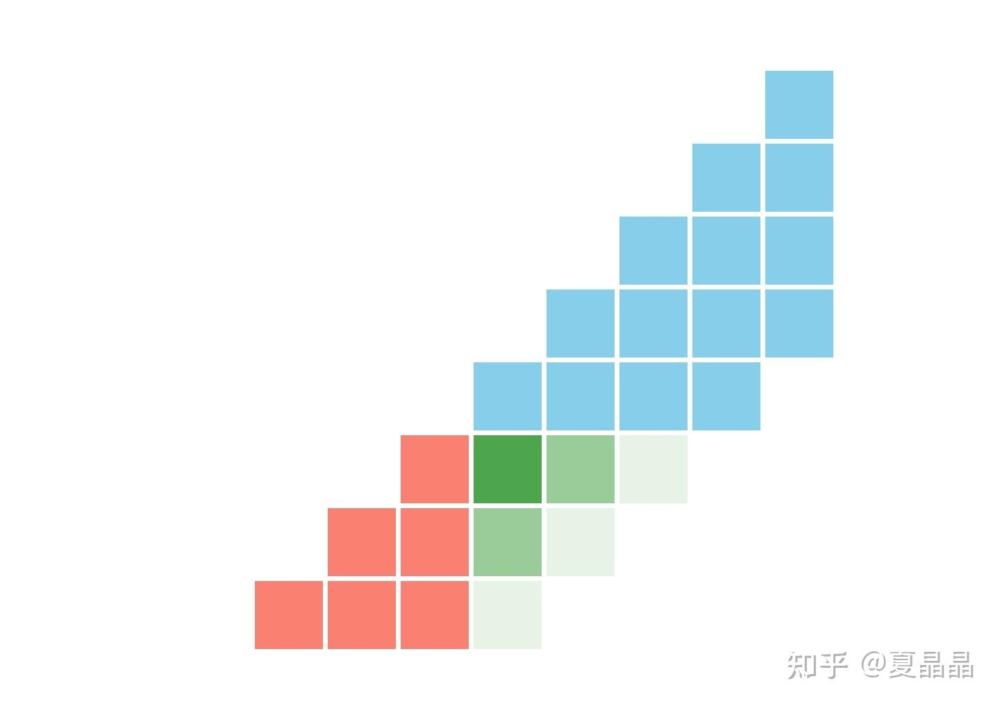

# 扫个小盲

> **类型**: 文章
> **作者**: Dio-晶
> **赞同**: 151
> **评论**: 36
> **时间**: 1630425588
> **原文**: [https://zhuanlan.zhihu.com/p/405571339](https://zhuanlan.zhihu.com/p/405571339)

---

上一篇文章讲一个恐怖的故事……

<https://zhuanlan.zhihu.com/p/404666570>

涉及到矩阵计算的几种模式：内积、外积、脉动。

看到有人问起，简单引用一个帖子扫盲一下。

[https://www.adityaagrawal.net/blog/architecture/matrix\_multiplication](http://link.zhihu.com/?target=https%3A//www.adityaagrawal.net/blog/architecture/matrix_multiplication)

帖子内有详细说明，简单来讲

内积就是一行乘以一列得到一个元素，根据MAC数量最大可以完全并行（一拍完成全部运算）。

外积就是一列乘以一行得到一个矩阵，执行N次。

脉动就是阶梯形势的一种乘法。

Google、Apple、intel、ARM、IBM、tesla、nvidia，都根据各自的某种喜好，选择了其中的一种。有朋友能分类他们吗？

我做过内积也做过外积，以我肤浅的理解的话：**内积比较适合卷积计算（CNN），外积比较适合矩阵乘（HPC），而脉动比较便于物理实现，可以做得很大。**

这份肤浅，延伸了一个问题，特别迷茫。

Tesla做dojo是为了AI，尤其是为了CNN，为啥做个外积？ 求大神指教指教…………

最后，从我个人偏好来讲，我喜欢外积。因为我是一个特别传统特别守旧的人。**只有外积，才遵从标准的IEEE754。**

否则…………你猜猜为啥精度一样你的计算结果和nvidia不一样？

---

*由知乎爬虫生成于 2026-02-01 15:39:00*
