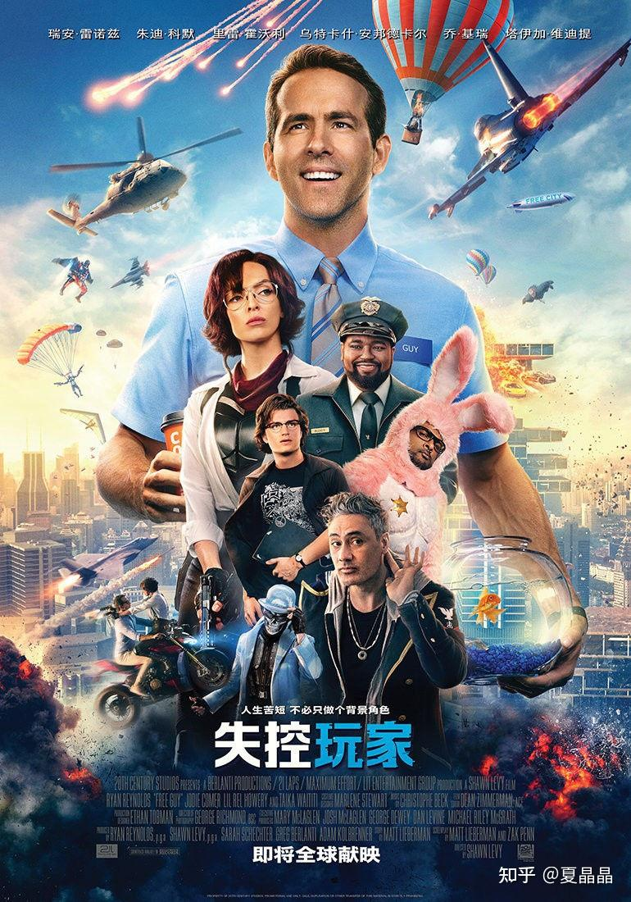

# 我就蹭蹭热点（5）

> **类型**: 文章
> **作者**: Dio-晶
> **赞同**: 24
> **评论**: 7
> **时间**: 1630422735
> **原文**: [https://zhuanlan.zhihu.com/p/405561337](https://zhuanlan.zhihu.com/p/405561337)

---

今天腾讯没有预期的跌停，也是挺诡异的。

看来大家对这热点也满不在乎的，确实很多人说未成年人充不了几个钱，只不过是气氛组，大不了以后王者荣耀输了不能怪队友都是小学生了……

但其实挺毁灭的，因为这断了根啊。

先不说依赖于反应速度的王者荣耀春季赛秋季赛会不会变成夕阳红赛了，认真来讲，玩游戏是从小养成的习惯，小孩时期断了，成年了也很难有了。

所以还是得解决如何快乐地玩耍的问题。

怎样才能保证小朋友每周三小时的时间尽可能游戏得有质量？

时间宝贵，要么把游戏变成用时更短的快餐，要么就是把时间拉长到更长的区间。

我觉得这事利好metaverse。

特别是看完这个电影……（怎样才能让领导也去看看这些充满想象力的电影啊）

最后的场景让我回忆起曾经养电子鸡的时代……

如果游戏的必备要素是互动，那么养成类游戏，特别是大场景开放类再加上当下的一点AI机器人的特征，可以做到一周只操作（含氪金）三小时，观察（观察不算游戏）一周的效果。

操作过程类似调参，对实时性、画质要求也不高。观察的时候不限时，高画质开心地非实时看自己的结果以及同学的结果。

很是一种契合当前政策，适合小朋友，还能使能metaverse的策略呢。

哈哈哈(ಡωಡ)hiahiahia

没有什么障碍能阻止人对快乐的追求呢……

---

*由知乎爬虫生成于 2026-02-01 15:39:00*
