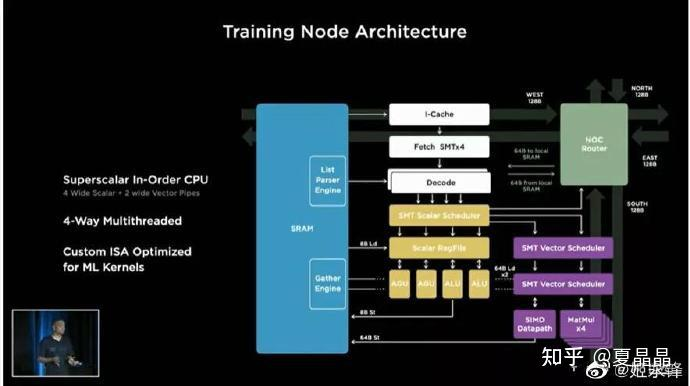
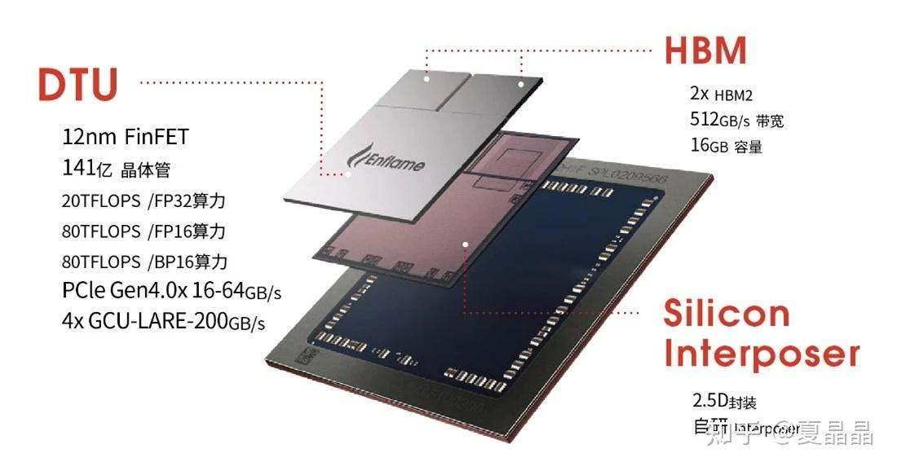

# 讲个恐怖故事

> **类型**: 文章
> **作者**: Dio-晶
> **赞同**: 149
> **评论**: 34
> **时间**: 1630204570
> **原文**: [https://zhuanlan.zhihu.com/p/404666570](https://zhuanlan.zhihu.com/p/404666570)

---

这周热点说少不少，说多不多。

DOJO风头太盛，一时无二。

[夏晶晶：Hot Chips 33 (2021) 有哪些看点？](https://www.zhihu.com/answer/2087506808)

我在上一篇回答的结尾表达了对DOJO充分的敬意，但我感觉在我身边的同学们还是对DOJO所展示出来的压制力还是有点忽视，也许有些人是有意的(ಡωಡ) 。

今天洗脚，讲一个恐怖故事，真的很恐怖哦，心理承受能力有限的同学可以不要翻下去ԅ(¯ㅂ¯ԅ)

~~~~~

DOJO采用了多核架构，整个芯片用20\*20的mesh把如下这图的362个如下的CORE互联起来，获得了362TFLOPS的BF16 tensor算力和22.6TFLOPS的FP32 vector算力。

AI最核心的tensor算力源自362c \*2Ghz \*4个\*8\*8matrix\*2FMA = 362TFLOPS。

没毛病(❁´◡`❁)\*✲ﾟ\*

362Tflops大致是什么水平呢？ nvidia的A100大约是312FFLOPS，也就是差不太多。当然dojo面积只有645mm2，而A100是825mm2，表面看DOJO面效更强，但A100原本128个SM基于量产良率考虑只打开了108个。所以打平了看两者也差不多。

讲到这里都算不得恐怖，再说人家DOJO强调的是scale-up的大杀器，单芯片算力重要吗？

不重要，所以恐怖在于此

~~~~~

有没有同学觉得这个DOJO这个core特别像一个CPU？ 特别是做RISC-V的同学们（猜测它就是个RISC-V魔改）

第一，只有做CPU的人才喜欢用8B、64B LD/ST来表征架构信息。想一想，如果不是玩CPU，谁会在意64B这么个通用编程的cacheline size约束？

第二，2\*64B LD，1\*64B ST，这是什么？ 这是一个标准compute density的CPU的Load/Store潜规则，这是做CPU的人台面下的默契。注意这一点，以及几个数字。

第三，DOJO采用了外积 MAC array，结构是4个8\*8的外积。嗯，不是这个行当的同学可能不太理解。这个世界上做matrix矩阵计算（GEMM）有三种范式，外积、内积、脉动（systolic），nvidia的tensorcore是内积，google TPU和intel的AMX是脉动，外积是相对罕见的微架构。

那你说恐怖在哪儿？

答案是外积是最大程度利用input reuse的架构。

如果我是Tesla的架构师，如果我手上有tesla的工程师团队和技术积累。在核的外部架构完全不动的约束下，我会把内积做成1个32\*32的，如果算法同学喷我说没有32个channel这么高利用率，那我会做2个16\*16的MAC ARRAY。

这意味着：

**很小的修改（会增加一些MAC）。**

**我可以做到362c \*2Ghz \*1个32\*32matrix\*2FMA = 1.448PFLOPS on 800 mm2。**

**退一步也是362c \*2Ghz \*2个16\*16matrix\*2FMA = 724TFLOPS on 700 mm2。**

2\*64B LD = 4\*8\*2\*2=2\*16\*2\*2=1\*32\*2\*2

哎,,Ծ^Ծ,,，本来这个公式，也是我想着什么时候失业了，找个方向混饭吃的呢…………

我就是个普通人，我能算到的，Tesla的架构师能没算到？ 那么为什么tesla没有这么做？

先讲第一个恐怖故事，曾经有一个撑杆跳冠军，叫做：布勃卡。

故事继续讲……

FLOPS算力指标重要吗？

不重要吗？

重要吗？

不重要吗？

你这就是理论值高，实际利用率上不去！

五十步笑一百步？ 这可是DATAFLOW！

随便看一个刚刚在hotchips上展示的一位同学的胶片，BF16算力值是80TFLOPS……

其实真的不是针对谁，借用三体的一句话：毁灭你，与你何干。

第二个恐怖故事讲完了。

不恐怖d(ŐдŐ๑) ？

我这个人从来不是正人君子。

如果有VC的同学看到，提醒一下。后续投资startup的时候可以多问一句……

**单芯片（800mm2内）你有达超过500TFLOPS BF16的路径吗？ 没有要啥钱？**

---

*由知乎爬虫生成于 2026-02-01 15:39:00*
