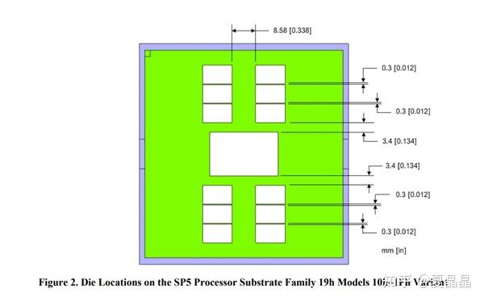

# 还是被打脸了

> **类型**: 文章
> **作者**: Dio-晶
> **赞同**: 29
> **评论**: 17
> **时间**: 1629269134
> **原文**: [https://zhuanlan.zhihu.com/p/401051578](https://zhuanlan.zhihu.com/p/401051578)

---

痛痛痛......

<https://zhuanlan.zhihu.com/p/355218689>

什么12C CCD、16C CCD，都是假的。我只能说我很理解，领导肯定是要12C和16C的，但最终工程团队在保证量产和成本下一定会给出8C per CCD的更理智的答案。

有时候我们喜欢过高地估计对手的革命性创造力……其实都是农民工，一个脑袋四条腿，最多加班也就加成那样了。

说明一下：AMD ZEN4通过扩封装尺寸安排了96core+12ch ddr作为最高端，但这个尺寸不是server cpu的主流，所以最终的主力版本，还是64core+8ch ddr，牙膏牙膏。

[96核心192线程！AMD Zen4霄龙支持12通道DDR5、峰值功耗700W](http://link.zhihu.com/?target=https%3A//m.mydrivers.com/newsview/776954.html%3Fref%3D)

---

*由知乎爬虫生成于 2026-02-01 15:39:00*
