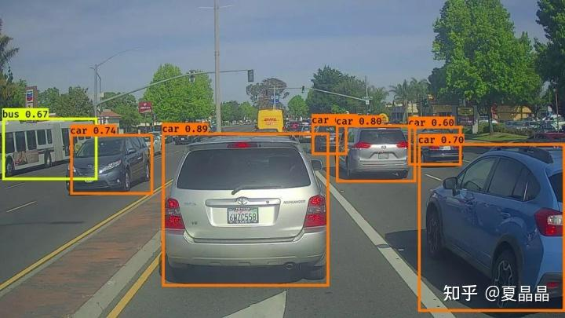
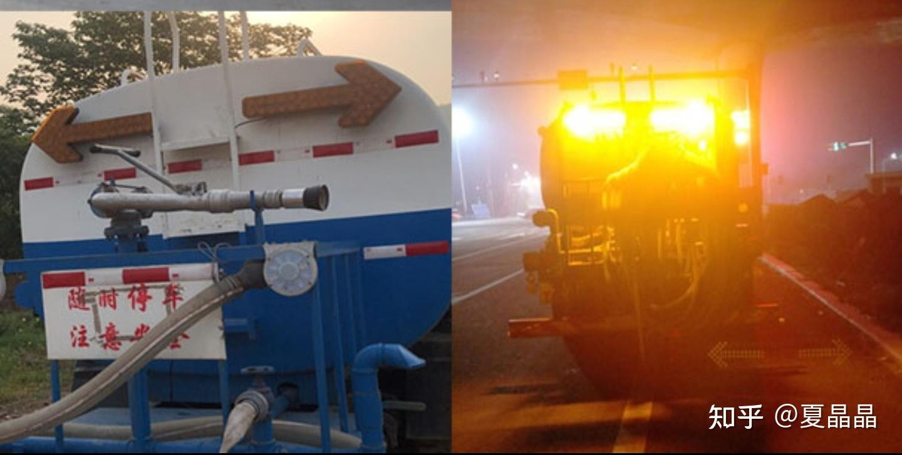
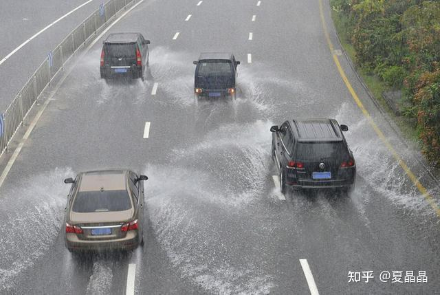

# 我就蹭蹭热点（3）

> **类型**: 文章
> **作者**: Dio-晶
> **赞同**: 50
> **评论**: 13
> **时间**: 1629132581
> **原文**: [https://zhuanlan.zhihu.com/p/400460941](https://zhuanlan.zhihu.com/p/400460941)

---

这几天最大的热点莫过于蔚来的事故了。

[https://mp.weixin.qq.com/s/WKnfOgQizOAfNjP8Whxf6w](http://link.zhihu.com/?target=https%3A//mp.weixin.qq.com/s/WKnfOgQizOAfNjP8Whxf6w)

逝者已去，不应消费，而其中引发的利益关系也不适合评价。

谈一谈自动驾驶本身，遇到静止物体出事已经不是第一次了。每次遇到这类问题就开始玩文字游戏，说什么辅助驾驶不是自动驾驶，这其实对自动驾驶整个行业都是一种伤害，毕竟正视问题解决问题才是长治久安之道。

当然，自动驾驶不是我的主业，我也是个人心有疑虑未明，希望得到解答，不代表什么立场，更多是希望有同学斧正一下我可能不正确的判断。毕竟，我想买自动驾驶也是为了钓鱼到大半夜能够更轻松地回家啊，几乎一样的场景……ԅ(¯ㅂ¯ԅ)

**一句话：事故中车速已经达到了120KM，假设高速正常视野距离是200m，预留50m刹车距离，那么从摄像头可以识别到驾驶员反应到脚踩死刹车的时长仅为4.5S。这种碰撞，用L3的机制是相当难规避的，大概率没有足够的预警时间让司机及时反应并接管，L2的机制能把责任归为司机，但实际状况对司机的要求可能已经大于了正常驾驶的要求了（需要司机发现自动驾驶未能识别物体再进行反应，然后急刹车）。**

谈一下算法可能的问题所在，我觉得不好解决。

蔚来是摄像头+毫米波雷达的方案，和特斯拉是类似的也就是通常所说的纯视觉方案，很多人认为这是问题的源头。但我觉得吧，纯视觉方案与激光雷达方案在这个问题上没有本质差别。

为什么摄像头和毫米波雷达无法识别静止的工程车，核心原因是CV的NN网络不认识工程车，也就是没有被训练过这类物体，导致首先无法对该物体画出框，也就是没有对工程车标注出下图的框框。

那此时为什么物体测距没有发挥作用呢？正常逻辑，如果检测到某个物体碰撞总能停下来吧。

首先，毫米波雷达为了增加分辨率，会滤除静态物体信号，文章中也提到了这个问题。这也是特斯拉和蔚来纯视觉方案都倒在静止物体上的原因。

然而，进一步，摄像头其实也可以测距，双目测距是非常普世的算法，甚至于单目测距，从mobileye开始也有算法可以做到。那即使无法认识物体，摄像头总能判断物体极速接近吧，为何没有做到？ 我猜这大概率和特斯拉车祸一样，相撞物体上有视觉干扰，特斯拉撞的是镜面反射的货柜车，反射了天空ԅ(¯ㅂ¯ԅ)，这测个屁距离。这次的工程车，很可能是有工程指示灯（一个剪头之类），这个指示灯在人看来是表达意思的，但机器视觉，很可能形成了测距的干扰，无法识别距离的接近。

好，再进一步，很多人第一时间就跳出来说，如果有激光雷达就没问题了。我觉得吧，理想情况是，但实际上也有问题。首先激光雷达是有线数的，用视角除以总线数就是分辨率了，线与线之间的夹角除以物体尺寸，可得其判定工程车的最小距离，嗯有空我得认真算算，以后买自动驾驶车的时候确定一下能够在多远距离识别多大物体。其次，激光雷达和机器视觉存在融合判定这么个机制，如果是后融合，那么两路信息最终在决策软件进行，但目前的自动驾驶算法大多数是前融合路径，激光雷达的距离信息实际上会与摄像头识别的物体先做一次对应，然后再与高清地图融合，判断为确定性的物体（这也是为何激光雷达配搭高清地图更妙的逻辑）。这也就是说，摄像头的正确识别依旧是关键，如果摄像头无法识别，激光雷达的距离信息只会成为一种矛盾信息难以决策。

当然有人又说，安全第一，即使摄像头没有识别，激光雷达的距离信息决策刹车就好了啊。实际上不行，因为有先例，下雨！ 我是知道了好几个这类案例，下雨时，侧面车辆超车如果恰好溅起一堵水墙，完蛋，一个急刹！ 塑料袋或者泡沫盒被风吹起，完蛋，一个急刹！

**所以这事，按我有限的理解，最终还是回到了机器视觉的识别能力了，需要训练CV网络识别到路面可能的一切事物。**

但这事也不好解，因为极端情况下，CV网络的认知能力是在于一个十六岁以上的成年人的成熟认知能力在做对比。不仅仅是车，雨、风、鸡鸭狗、甚至前车飘落的任何物件……

但也不是不能比，是需要足够多数据、足够大的网络、以及足够大的算力的自动驾驶芯片吧。

---

*由知乎爬虫生成于 2026-02-01 15:39:00*
